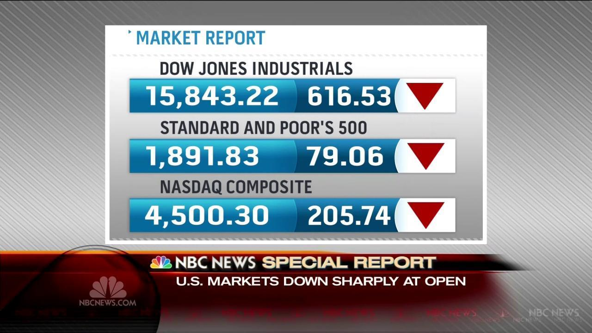

The financial markets are integral to the global economy, serving as conduits for the exchange of assets including stocks, bonds, currencies, and derivatives. These platforms empower economic growth by enabling capital acquisition, risk distribution, and facilitation of international trade. Within this intricate ecosystem, stock exchanges hold a pivotal role, providing venues for buying and selling public company shares. Notably, the New York Stock Exchange (NYSE) is a leading institution in establishing liquidity and determining transparent securities pricing.

As financial markets evolve, they are governed by a myriad of rules and strategies, one of which is Rule 48. This specific rule was introduced by the NYSE in response to volatile market conditions and aimed at maintaining order and avoiding panic by streamlining trading procedures during turbulent times.

The landscape of financial trading has also undergone a transformation with the advent of algorithmic trading, which employs sophisticated computer algorithms to automate trading decisions and execute large volumes of transactions at high speeds. Algorithmic trading is a double-edged sword: it markedly enhances the efficiency of trading operations and liquidity provision yet can also amplify market volatility in times of stress.

In this article, we will examine the critical components of financial markets, such as stock exchanges, and dissect the functional and regulatory significance of Rule 48, alongside the impacts of algorithmic trading. Understanding these elements and their interrelations offers insight into their influence on market dynamics and the broader economic environment.

## Table of Contents

## Understanding Financial Markets and Stock Exchanges

Financial markets are critical components of the global economy, serving as the arena where various financial assets are traded. These markets encompass a wide array of venues where stocks, bonds, currencies, and derivatives are exchanged. The fundamental role of financial markets in economic development lies in their ability to facilitate the raising of capital, the effective transfer of risk, and the enhancement of international trade.

Capital formation is one of the primary functions of financial markets. By enabling businesses to issue stocks and bonds, they allow companies to secure the necessary funds for expansion and innovation. Investors, in turn, gain access to a range of investment opportunities, which can provide returns in the form of dividends or interest. This symbiotic relationship nurtures economic growth, as funds are channeled towards productive uses.

Risk transfer is another critical function. Financial markets, through instruments such as options and futures, provide mechanisms for hedging against various types of risks, including currency fluctuations and commodity price changes. This risk management aspect is crucial for both individual investors and large corporations looking to stabilize cash flows and revenue streams.

Moreover, financial markets enhance international trade by providing the necessary currency exchange facilities. The foreign exchange market (Forex) is the largest and most liquid financial market, playing a vital part in supporting global commerce by enabling currency conversion and facilitating cross-border transactions.

Stock exchanges are specialized entities within financial markets focused primarily on the trading of shares in public companies. Among the most prominent is the New York Stock Exchange (NYSE), which operates as the centerpiece for the trading of equities. Stock exchanges are tasked with providing a structured environment for stock transactions, ensuring that trades are executed smoothly and efficiently.

One of the pivotal functions of stock exchanges is to provide [liquidity](/wiki/liquidity-risk-premium). Liquidity refers to the ease with which an asset can be bought or sold in the market with minimal impact on its price. Stock exchanges enhance liquidity by bringing together a large number of buyers and sellers, thus ensuring that transactions can be conducted quickly and with low transaction costs.

Additionally, stock exchanges play a crucial role in price discovery, which is the process by which the market determines the price of a traded asset. By collecting and disseminating real-time data on transactions, stock exchanges provide transparent pricing information that reflects supply and demand dynamics. This transparency helps investors make informed decisions and fosters trust in the market's ability to allocate resources efficiently.

In summary, financial markets and stock exchanges are indispensable to the functioning of the global economy. They serve as conduits for capital flow, risk management, and information dissemination, collectively contributing to economic stability and growth.

 to Rule 48

Rule 48 was an important mechanism employed by the New York Stock Exchange (NYSE) to address significant challenges during periods of extreme market [volatility](/wiki/volatility-trading-strategies). Implemented in December 2007, this regulatory measure was designed to streamline the process of market opening on days anticipated to experience chaotic trading conditions. By providing a framework within which trading could be expedited, Rule 48 aimed to preserve market stability and integrity.

The primary function of Rule 48 was to temporarily suspend the requirement for disseminating price indications before the opening of the trading session. This was particularly crucial during times when volatility threatened to induce disorderly market behavior. By eliminating the obligation to provide pre-opening price data, the NYSE aimed to reduce unnecessary delays and prevent panic selling, often exacerbated by speculative actions based on preliminary pricing information.

Rule 48 was specifically tailored to ensure smoother market openings by allowing designated market makers and specialists more flexibility in handling substantial variations in stock prices. During volatile periods, the presence of pre-opening price indications could lead to significant variability in market expectations and abrupt shifts in trading strategies. Therefore, by suspending these requirements, Rule 48 mitigated potential disruptions and contributed to maintaining orderly market operations at the opening bell. 

The implementation of Rule 48 was part of a broader strategy to address the complexities and uncertainties inherent in financial markets, reflecting the NYSE's commitment to adaptive regulatory measures aimed at safeguarding market processes during turbulent times.

## How Rule 48 Operated

Rule 48 of the New York Stock Exchange (NYSE) was specifically designed to manage market conditions during periods of heightened volatility. Its invocation was strategic, occurring before the markets opened, in order to mitigate potential disruptions caused by unusually volatile market conditions.

The implementation of Rule 48 effectively suspended the application of NYSE Rule 123D, which traditionally required the dissemination of price indications before the market open. This suspension allowed designated market makers (DMMs) more discretion in setting opening prices without the obligation of pre-market price indications when markets were expected to open under tumultuous conditions. This streamlining of processes was intended to expedite the commencement of trading sessions, thereby reducing the risk of cascading price reactions due to delays in opening.

Conditions qualifying for the invocation of Rule 48 were primarily tied to the volatility observed in prior trading sessions. Such scenarios typically included substantial movements in international markets, which could significantly influence the sentiment and expectations of domestic investors. Furthermore, considerable activity in futures markets ahead of the opening bell often served as a signal that traders anticipated significant fluctuations in stock prices. These futures markets, by trading index contracts that predict the value of assets at a future date, could indicate broader market expectations of volatility and potential directional trends.

By removing certain procedural requirements, Rule 48 allowed for a more brisk transition into trading. However, this approach relied heavily on the judgment of DMMs to manage the opening, underlining their pivotal role in maintaining market order during precarious situations. Despite these intentions, this mechanism was not without criticism, as it sometimes led to uninformed trading due to the lack of opening price transparency, prompting further refinement and eventual revocation of the rule in favor of more structured measures.

## Criticism and Revocation of Rule 48

Rule 48, although initially intended to manage market volatility effectively, received substantial criticism due to its impact on market dynamics, particularly during notable events such as the market fluctuations on August 24, 2015. On this day, the New York Stock Exchange (NYSE) invoked Rule 48 to stabilize a highly volatile market, where significant turbulence was exacerbated by international economic factors and domestic uncertainties. However, instead of promoting order, the suspension of pre-opening price indications contributed to heightened investor uncertainty.

Critics of Rule 48 pointed out that the lack of announced opening prices before the commencement of trading hindered informed decision-making among investors. The absence of clear price signals made it challenging for participants to develop sound strategies, leading to reactive and sometimes irrational trades. This opacity created an environment where [algorithmic trading](/wiki/algorithmic-trading) systems and high-frequency traders, already integral to modern markets, operated with a greater advantage over traditional investors who relied on opening price disclosures for guidance.

The criticisms were particularly pronounced in light of the fact that Rule 48's invocation on August 24, 2015, was linked with extraordinary volatility, generating significant losses and rapid price movements within the first few minutes of the market opening. This situation highlighted the potential hazards of operating without pre-market transparency, questioning whether the rule's implementation truly mitigated panic selling or inadvertently propagated further turmoil.

In response to these critiques and the evident need for enhanced transparency and efficiency, the NYSE decided to revoke Rule 48 in 2016. This revocation was part of a broader initiative to introduce new regulatory frameworks that emphasized greater transparency in price publication before market openings. These reforms aimed to provide clearer information to all market participants, ensuring a more leveled playing field and better-informed trading decisions, thus helping safeguard against similar future disruptions. 

The transition from Rule 48 underscored the necessity for evolving market regulations that adapt to technological advancements and shifting market dynamics, emphasizing transparency and informed investor participation as essential components of modern market health.

## Algorithmic Trading and Market Dynamics

Algorithmic trading employs computer algorithms to automate the execution of trades, leveraging speed and precision to capitalize on market opportunities that may only exist for fractions of a second. These algorithms analyze a multitude of market variables, including price movements, [volume](/wiki/volume-trading-strategy), and timing, to execute trades that a human trader might miss due to sheer volume and complexity. 

One of the most significant contributions of algorithmic trading is its role in liquidity provision. By enabling rapid and frequent trades, algorithms help to maintain a steady flow of transactions, allowing for the smoother functioning of financial markets. This liquidity is crucial for effective price discovery, where the prices of securities are determined by supply and demand dynamics in the market. For example, a basic algorithmic strategy could involve executing a series of buy and sell orders to exploit small price differentials between markets, thus contributing to aligning prices more closely with real-time information.

However, algorithmic trading is a double-edged sword. While it enhances market efficiency, particularly through increased liquidity and tighter bid-ask spreads, it can inadvertently amplify market volatility. This heightened volatility can be seen particularly during market stress when algorithms might react simultaneously to the same triggers, leading to large-scale buying or selling. This dynamic was observed when regulations like Rule 48 were invoked during significant market upheavals. The synchronized actions of these algorithms, driven by similar parameters, can create a cascade effect, intensifying market movements and potentially leading to flash crashes, where the market drops rapidly within a very short time.

Balancing algorithmic trading with regulatory oversight is essential to mitigate these risks. Effective regulation must ensure that while the benefits of algorithmic trading—such as efficiency and enhanced liquidity—are preserved, potential disruptions are minimized. Rules need to account for the speed and complexity of algorithmic operations, reflecting an understanding of their potential to both stabilize and destabilize markets.

Understanding this interplay between algorithms and regulatory measures is crucial. It requires analyzing scenarios where algorithmic strategies might converge, leading to systemic risks, and designing safeguards accordingly. These might include circuit breakers, which pause trading when markets move dramatically, and enhanced monitoring systems that can detect and respond to unusual trading patterns promptly. 

Ultimately, the objective is to harness the advantages of algorithmic trading while ensuring robust mechanisms are in place to protect market integrity and prevent adverse systemic impacts. This balance is pivotal for the sustainable operation of contemporary financial markets.

## Conclusion

Rule 48 exemplifies the ongoing adaptation and complexity inherent in financial market regulations, particularly those aimed at managing market volatility. Its implementation and subsequent revocation illustrate the financial industry's need to strike a balance between effective market operation and regulatory oversight. By hastening the opening of trading during volatile periods, Rule 48 sought to maintain orderly market conditions; however, it also faced criticism for potentially exacerbating market uncertainty and instigating uninformed trading.

The progression from Rule 48 to newer regulatory frameworks underscores a pattern where existing rules must evolve to address emerging technological and market dynamics. As market conditions and trader behaviors shift, regulations must similarly adapt to preserve market integrity and protect investors. This is particularly crucial in a landscape increasingly dominated by algorithmic trading, which can both enhance and destabilize market functions through rapid, automated transactions.

Understanding the historical context and implications of rules like Rule 48 aids in formulating robust regulatory measures for the future. In an era where algorithmic trading plays a significant role, recognizing the impact of past regulations helps policymakers design strategies that better manage market fluctuations and enhance transparency. Such historical insight is vital for crafting effective safeguards that ensure stable and fair financial markets globally.

## References & Further Reading

[1]: Markosian, J. "Rule 48: A New Rule for the NYSE." [Investopedia](https://www.investopedia.com/articles/investing/010616/rule-48-new-rule-nyse.asp).

[2]: Narang, R. K. (2013). ["Inside the Black Box: A Simple Guide to Quantitative and High-Frequency Trading."](https://onlinelibrary.wiley.com/doi/book/10.1002/9781118662717) Wiley Finance.

[3]: Bombardier, F. (2014). "Managing Volatility: The Role of Circuit Breakers in the Financial Markets." [SEC Historical Society.](http://sechistorical.org/)

[4]: Aldridge, I. (2013). ["High-Frequency Trading: A Practical Guide to Algorithmic Strategies and Trading Systems."](https://www.amazon.com/High-Frequency-Trading-Practical-Algorithmic-Strategies/dp/1118343506) Wiley Trading.

[5]: NASDAQ. "Understanding the Basics of Algorithmic Trading." [NASDAQ](https://blog.ueex.com/the-basics-of-algorithmic-trading/).