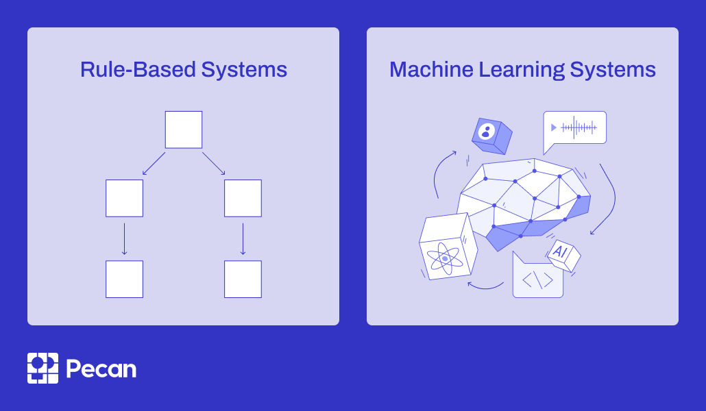

## Table of Contents

## What is a rule-based system in the context of machine learning?

A rule-based system in machine learning is a type of artificial intelligence where decisions are made based on a set of predefined rules. These rules are created by humans and are used to mimic decision-making processes. For example, a rule might say, "If it is raining, then take an umbrella." In machine learning, these systems are used when the decision-making process is clear and can be easily described by a set of rules.

Rule-based systems are different from other machine learning methods, like neural networks, where the system learns from data without being explicitly programmed with rules. In a rule-based system, the performance depends on how well the rules are designed. If the rules cover all possible situations correctly, the system will work well. However, if there are situations not covered by the rules, the system might fail. This makes rule-based systems good for tasks where the rules are well-understood and can be clearly defined.

## How do rule-based systems differ from other machine learning approaches?

Rule-based systems and other machine learning approaches differ mainly in how they make decisions. In a rule-based system, decisions are made using a set of rules that humans create. These rules are like instructions that tell the system what to do in different situations. For example, a rule might say, "If the temperature is below 0°C, then it is cold." The system follows these rules exactly as they are written. This makes rule-based systems good for tasks where the rules are clear and easy to define.

On the other hand, other machine learning approaches, like neural networks or decision trees, learn from data without being given specific rules. These systems look at examples and try to find patterns or relationships in the data. For instance, a neural network might learn to recognize pictures of cats by looking at many cat pictures and figuring out what features make a cat a cat. This type of learning can be more flexible and can handle situations that are too complex or not well-understood enough to be described by simple rules. However, it often requires a lot of data and can be harder to understand and explain how the system makes its decisions.

## What are some common applications of rule-based systems?

Rule-based systems are used in many places where decisions need to be clear and easy to understand. One common use is in expert systems, which help people make decisions in areas like medicine or finance. For example, a rule-based system might help a doctor decide what tests to order based on a patient's symptoms. The system would use rules like "If a patient has a fever and a rash, then order a blood test." This makes it easier for doctors to follow guidelines and make sure they don't miss important steps.

Another place where rule-based systems are used is in customer service, especially in chatbots. These systems use rules to understand what a customer is asking and give the right answer. For example, if a customer asks, "What is your return policy?" the system might use a rule that says, "If the customer asks about returns, then explain the return policy." This helps companies give quick and correct answers to common questions without needing a human to do it.

Rule-based systems are also used in controlling devices and machinery. For instance, in a smart home, a rule-based system might control the lights and temperature. A rule could be, "If it is dark outside and someone is home, then turn on the lights." This makes the home more comfortable and energy-efficient by following simple rules.

## Can you explain the basic components of a rule-based system?

The basic components of a rule-based system are the knowledge base and the inference engine. The knowledge base is like a collection of rules that tell the system what to do in different situations. For example, a rule might say, "If it is raining, then take an umbrella." These rules are created by people who understand the task the system is meant to do. The knowledge base can be thought of as a big list of "if-then" statements that the system uses to make decisions.

The inference engine is the part of the system that uses the rules from the knowledge base to make decisions. It looks at the information it has, like the weather being rainy, and then finds the right rule to use, like the one about taking an umbrella. The inference engine follows the rules step by step to come up with an answer or action. This makes sure that the system always does what the rules say it should do, based on the information it has.

## What is a Weighted Finite State Transducer (WFST) and how is it used in rule-based systems?

A Weighted Finite State Transducer (WFST) is a type of mathematical model used in computer science and linguistics. It is like a machine that can change one string of symbols into another string, and it uses weights to decide which changes are more important or likely. Think of it as a map where each path from one string to another has a cost or a score. The WFST looks at all the possible paths and picks the one with the best score. This makes it useful for tasks like speech recognition, where it can help turn spoken words into written text by choosing the most likely words based on the sounds it hears.

In rule-based systems, WFSTs can be used to apply rules in a smart way. For example, if you have a rule that says "change 'color' to 'colour' if the text is British English," a WFST can help decide when to apply this rule based on the context of the text. It can look at the whole sentence and use weights to figure out if it's more likely to be British or American English. This makes the rule-based system more flexible and able to handle complex situations where simple "if-then" rules might not be enough. By using WFSTs, the system can make better decisions and improve its performance in tasks like language translation or text processing.

## How does Symbolic Rule Learning contribute to rule-based systems?

Symbolic Rule Learning helps rule-based systems by making new rules from examples. Instead of people writing all the rules, the computer can learn some rules by itself. It looks at lots of examples and finds patterns. For example, if it sees many times that "if it is raining, people use umbrellas," it can make a rule that says, "If it is raining, then suggest using an umbrella." This makes rule-based systems smarter because they can learn from data and make rules that might be hard for people to think of.

Using Symbolic Rule Learning can make rule-based systems better at handling new situations. If the system sees something new, it can use the rules it learned to figure out what to do. This is good for tasks where the rules keep changing or are too complicated to write down all at once. By learning rules from examples, the system can keep getting better and be more useful in real life.

## What role does SAFRAN play in rule-based systems?

SAFRAN, which stands for Symbolic Attribute Function Rule ANalyzer, is a tool used to help make rule-based systems better. It does this by figuring out which rules are important and which ones are not. SAFRAN looks at the rules and the data the system uses, and it can tell if some rules are not helping or if they are making the system slower. By getting rid of these bad rules, SAFRAN helps make the system work better and faster.

In simple terms, SAFRAN helps clean up the rules in a rule-based system. Imagine you have a lot of rules, but some of them are not useful or are causing problems. SAFRAN goes through these rules and decides which ones to keep and which ones to throw away. This makes the system easier to understand and more reliable because it only uses the good rules. By doing this, SAFRAN makes sure that the rule-based system can do its job well without getting bogged down by unnecessary rules.

## What are the advantages of using rule-based systems over other machine learning methods?

Rule-based systems are easier to understand and explain than many other machine learning methods. When you use a rule-based system, you can see the rules it follows to make decisions. This makes it simpler to check if the system is working right and to fix it if something goes wrong. For example, if a rule says "If it is raining, then take an umbrella," you can easily understand why the system suggests an umbrella when it rains. This clarity is very helpful in areas like medicine or finance, where people need to trust and understand how decisions are made.

Another advantage of rule-based systems is that they can work well even with less data. Other machine learning methods, like neural networks, often need a lot of data to learn from. But rule-based systems can start working right away with just a few good rules. This makes them useful when you don't have a lot of data or when the data you have is not very good. For example, in a small hospital, a rule-based system can help doctors make decisions based on a few clear rules, even if the hospital does not have a lot of patient data to train a more complex system.

## What are the limitations or challenges faced when implementing rule-based systems?

One big challenge with rule-based systems is that they can be hard to set up and keep up to date. You need to make a lot of rules to cover all the different situations the system might face. If you miss some situations or if things change, like new laws or new ways of doing things, you have to go back and change the rules. This can take a lot of time and effort. Also, if the rules are not right, the system might make mistakes, and it can be hard to figure out why it is making those mistakes because there are so many rules to check.

Another challenge is that rule-based systems can be less flexible than other machine learning methods. They work best when the rules are clear and don't change much. But in real life, things can be more complicated and might not fit neatly into the rules you have set up. For example, if a rule says "If it is raining, then take an umbrella," what should the system do if it is just a light drizzle? Other machine learning methods, like neural networks, can handle these gray areas better because they learn from examples and can adjust to new situations. Rule-based systems might need a lot of new rules to handle these kinds of situations, which can make them very complicated and hard to manage.

## How can rule-based systems be integrated with other AI technologies?

Rule-based systems can work together with other AI technologies to make them better. For example, they can be used with machine learning models like neural networks. A rule-based system can help explain the decisions that a neural network makes. Neural networks can be hard to understand because they learn from data in a way that is not easy to see. But if you use a rule-based system to look at the decisions the neural network makes, you can create rules that explain why the neural network did what it did. This makes the whole system more transparent and easier for people to trust and use.

Another way rule-based systems can be integrated with other AI technologies is in hybrid systems. These systems use both rule-based methods and other machine learning methods to solve problems. For example, in a smart home, a rule-based system might control the lights and temperature based on simple rules like "If it is dark outside and someone is home, then turn on the lights." At the same time, a machine learning model might learn from how people use the home and suggest new rules or adjust the existing ones to make the home more comfortable. By working together, the rule-based system and the machine learning model can make the smart home more efficient and responsive to the needs of the people living there.

## What are some advanced techniques for optimizing rule-based systems?

One advanced technique for optimizing rule-based systems is using rule pruning. This means looking at all the rules and getting rid of the ones that are not helping or are causing problems. A tool like SAFRAN can help with this by figuring out which rules are important and which ones can be removed. By pruning the rules, the system can work faster and make better decisions because it only uses the good rules. This makes the system easier to understand and more reliable.

Another technique is using machine learning to learn new rules or adjust existing ones. For example, Symbolic Rule Learning can help the system make new rules from examples. If the system sees a pattern in the data, like "if it is raining, people use umbrellas," it can create a new rule that says, "If it is raining, then suggest using an umbrella." This makes the system smarter and able to handle new situations. By combining rule-based methods with machine learning, the system can keep improving and be more useful in real life.

## Can you discuss a case study where a rule-based system significantly outperformed other machine learning models?

In a case study from the medical field, a rule-based system was used to help doctors diagnose certain diseases based on patient symptoms. The system had a set of clear rules like "If a patient has a fever and a rash, then order a blood test." These rules were made by doctors who knew a lot about the diseases. The rule-based system was compared to a machine learning model, like a neural network, that learned from a lot of patient data. The rule-based system did better because it was easier for doctors to understand and trust. They could see the rules and check if they were right. The machine learning model, on the other hand, was hard to explain and sometimes made mistakes that were hard to fix.

In another case study, a rule-based system was used in a customer service chatbot for a big company. The system had rules like "If a customer asks about returns, then explain the return policy." These rules helped the chatbot give quick and correct answers to common questions. When compared to a machine learning model that tried to learn from customer interactions, the rule-based system was more reliable. It did not make as many mistakes because it followed the rules exactly. The machine learning model sometimes gave wrong answers because it was still learning from the data. The rule-based system was also easier to update when the company changed its policies, making it a better choice for the customer service task.