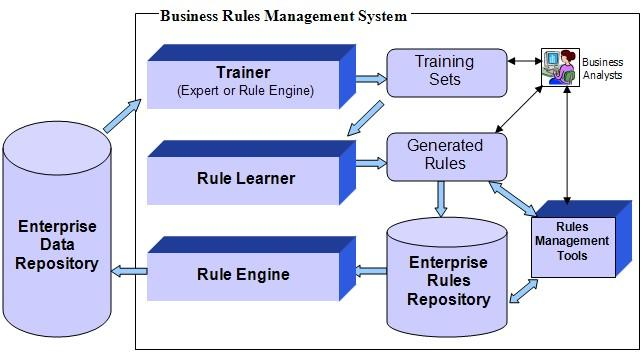

## Table of Contents

## What are Rule Learners in the context of machine learning?

Rule learners are a type of machine learning algorithm that work by creating a set of rules to make predictions or decisions. These rules are usually in the form of "if-then" statements, like "if it's raining, then take an umbrella." The goal of rule learners is to find the simplest set of rules that can accurately classify new data. They are often used in tasks like medical diagnosis, where clear and understandable rules can help doctors make decisions.

One popular rule learning algorithm is the RIPPER algorithm. It starts with an empty set of rules and then adds rules one by one, trying to improve the accuracy of the predictions. RIPPER keeps adding and refining rules until it can't improve the accuracy anymore. This method is good for creating rules that are easy to understand and use, even for people who are not experts in machine learning.

Rule learners are different from other machine learning methods like neural networks, which can be harder to understand because they work like a "black box." Rule learners are more transparent, meaning you can see and understand the rules they use to make decisions. This makes them very useful in areas where it's important to know why a certain decision was made, like in finance or healthcare.

## How do Rule Learners differ from other machine learning algorithms?

Rule learners differ from other [machine learning](/wiki/machine-learning) algorithms mainly in how they make decisions and how easy it is to understand those decisions. Rule learners create clear "if-then" rules that anyone can read and understand. For example, a rule might say "if the sky is cloudy, then it might rain." This makes rule learners very useful in areas like medicine or finance, where it's important to know why a decision was made. On the other hand, many other machine learning methods, like neural networks, work more like a "black box." They can make very accurate predictions, but it's hard to see exactly how they do it. This makes them less transparent and harder to explain to people who aren't experts in machine learning.

Another difference is in how rule learners and other algorithms are built and improved. Rule learners like the RIPPER algorithm start with no rules and add them one by one, always trying to make the predictions more accurate. They keep adding and changing rules until they can't improve anymore. This step-by-step approach can be slower but leads to rules that are simple and easy to understand. In contrast, algorithms like decision trees or neural networks might use more complex methods to find patterns in the data. Decision trees split the data into smaller and smaller groups, while neural networks adjust many small numbers (called weights) to get better at predicting. These methods can be faster and sometimes more accurate, but they often result in models that are harder to explain.

## What is the basic process of how Rule Learners work?

Rule learners work by creating a set of "if-then" rules to make predictions or decisions. They start with no rules and then add them one by one, always trying to make their predictions more accurate. For example, if the goal is to predict whether it will rain, a rule learner might start with a rule like "if the sky is cloudy, then it might rain." It then checks how well this rule works and adds more rules to improve its predictions. The rule learner keeps adding and changing rules until it can't make the predictions any better.

The process of adding and refining rules is done step-by-step. The rule learner looks at the data it has and tries to find patterns that can be turned into rules. It might start with a simple rule and then add more conditions to make it more specific, like "if the sky is cloudy and the humidity is high, then it will rain." The goal is to find the simplest set of rules that can accurately predict new data. This makes rule learners different from other machine learning methods, which might use more complex ways to find patterns in the data.

## Can you explain the concept of rule induction in Rule Learners?

Rule induction is the process that rule learners use to create their "if-then" rules. It starts with looking at the data and trying to find patterns that can be turned into simple rules. For example, if you are trying to predict whether it will rain, the rule learner might look at past data and see that when the sky is cloudy, it often rains. It then creates a rule like "if the sky is cloudy, then it might rain." The rule learner keeps adding and changing these rules to make its predictions better. It does this by checking how well the rules work on the data and then adding more conditions to make the rules more specific, like "if the sky is cloudy and the humidity is high, then it will rain."

The goal of rule induction is to find the simplest set of rules that can accurately predict new data. This means the rule learner tries to keep the rules as easy to understand as possible while still making good predictions. For example, instead of creating a very complicated rule with many conditions, the rule learner might create several simpler rules that together cover all the cases. This makes the rules easier for people to understand and use. Rule induction is different from other machine learning methods because it focuses on creating clear and simple rules, which is very useful in areas like medicine or finance where it's important to know why a decision was made.

## What are some common applications of Rule Learners?

Rule learners are often used in healthcare to help doctors make decisions. They create simple "if-then" rules that doctors can easily understand and use. For example, a rule might say "if a patient has a fever and a sore throat, then they might have strep throat." This helps doctors quickly diagnose patients and decide on the right treatment. Because the rules are clear and easy to understand, doctors can trust the decisions made by rule learners and explain them to their patients.

Another common use of rule learners is in finance. Banks and other financial institutions use rule learners to decide whether to give someone a loan or to detect fraud. For example, a rule might be "if a person has a good credit score and a steady job, then they are likely to repay a loan." This helps banks make safer decisions about who to lend money to. Rule learners are also good at finding unusual patterns that might be signs of fraud, like "if someone suddenly spends a lot more money than usual, then it might be fraud." This makes them very useful for keeping financial systems safe.

Rule learners are also used in customer service to help with things like recommending products or solving customer problems. For example, a rule might be "if a customer has bought a lot of [books](/wiki/algo-trading-books), then recommend more books in the same genre." This helps businesses give better service to their customers. Because the rules are simple and easy to understand, customer service teams can use them to quickly find the best way to help each customer.

## How does the performance of Rule Learners compare to decision trees?

Rule learners and decision trees both create rules to make predictions, but they do it in different ways. Rule learners build a set of "if-then" rules one by one, always trying to make their predictions better. They keep adding and changing rules until they can't improve anymore. Decision trees, on the other hand, split the data into smaller and smaller groups. They keep splitting until they can't make the predictions any better. Because of these different ways of working, rule learners often create simpler rules that are easy to understand, while decision trees can create more complex rules that might be harder to explain.

When it comes to performance, rule learners and decision trees can be similar in how well they predict things. But rule learners are often better when it's important to have simple and clear rules. For example, in healthcare or finance, where people need to understand why a decision was made, rule learners are very useful. Decision trees might be better at finding very specific patterns in the data, which can make them more accurate in some cases. But their rules can be harder to understand and explain to people who aren't experts in machine learning.

## What are the advantages of using Rule Learners in machine learning?

Rule learners have several advantages in machine learning. One big advantage is that they create simple "if-then" rules that are easy to understand. For example, a rule might say "if it's raining, then take an umbrella." This makes rule learners very useful in areas like medicine or finance, where it's important to know why a decision was made. Doctors and bankers can easily read and use these rules to make decisions and explain them to patients or customers. Another advantage is that rule learners can find important patterns in the data by creating rules step by step. They start with no rules and add them one by one, always trying to make their predictions better. This step-by-step approach can help them find simple and clear rules that work well.

Another advantage of rule learners is their transparency. Unlike some other machine learning methods, like neural networks, rule learners don't work like a "black box." You can see and understand the rules they use to make decisions. This makes them more trustworthy, especially in areas where it's important to explain decisions clearly. For example, in healthcare, doctors need to know why a certain treatment is recommended. Rule learners can provide clear reasons for their predictions, which helps doctors trust and use the system. Also, rule learners can be good at handling data that has a lot of different types of information. They can create rules that work well even when the data is complicated, making them versatile and useful in many different situations.

## What are the limitations or challenges faced when using Rule Learners?

Rule learners can face some challenges. One big challenge is that they might not be as accurate as other machine learning methods, like neural networks or decision trees. This is because rule learners try to keep their rules simple and easy to understand. Sometimes, simple rules can't capture all the patterns in the data as well as more complex methods can. For example, if the data has many different factors that affect the outcome, rule learners might struggle to create rules that work well for all cases. This can lead to less accurate predictions, which can be a problem in areas where accuracy is very important, like in medical diagnosis or financial fraud detection.

Another challenge is that rule learners can take a long time to create their rules. They build rules one by one, always trying to make their predictions better. This step-by-step approach can be slow, especially if the data is very large or complicated. It might take a lot of time and computer power to find the best set of rules. Also, rule learners can sometimes create too many rules, which can make the system hard to use. If there are too many rules, it can be hard for people to understand and use them, even if the rules are simple. This can make rule learners less practical in some situations where speed and simplicity are important.

## How can Rule Learners be optimized for better performance?

To optimize rule learners for better performance, one approach is to use better ways of choosing which rules to add. Rule learners build their rules one by one, always trying to make their predictions better. By using smarter ways to pick the next rule, like looking at how much it improves the predictions, rule learners can find good rules faster. Another way to optimize rule learners is to use more data to train them. The more data a rule learner has, the better it can find patterns and create rules that work well. This can make the rules more accurate and help the rule learner make better predictions.

Another way to improve rule learners is to use techniques like pruning. Pruning means getting rid of rules that don't help much with the predictions. This can make the set of rules simpler and easier to understand, without losing much accuracy. Rule learners can also be optimized by using methods like cross-validation to test how well the rules work on different parts of the data. This helps make sure the rules are good at predicting new data, not just the data they were trained on. By using these optimization techniques, rule learners can perform better and be more useful in real-world situations.

## What role does Genetic Programming for Feature Learning (GPFL) play in Rule Learners?

Genetic Programming for Feature Learning (GPFL) helps rule learners by creating new features that can make the rules better. GPFL uses ideas from nature, like how animals evolve, to find new ways to look at the data. It starts with simple features and then changes them over time, always trying to make the rules more accurate. By doing this, GPFL can find features that rule learners might not see on their own. This can make the rules more powerful and help rule learners make better predictions.

Using GPFL with rule learners can be a bit tricky, but it can also make a big difference. GPFL might take a long time to find the best features because it has to try many different ideas. But once it finds good features, the rule learners can use them to create rules that work better. This can be very helpful in areas like medicine or finance, where finding the right features can lead to more accurate and useful rules. By working together, GPFL and rule learners can create a system that is both powerful and easy to understand.

## Can you discuss any advanced techniques used in Rule Learners to handle complex datasets?

One advanced technique used in rule learners to handle complex datasets is called ensemble learning. Ensemble learning combines the predictions from many different rule learners to make a final prediction. This can help rule learners deal with complicated data by using the strengths of many different sets of rules. For example, one set of rules might be good at predicting certain cases, while another set is good at others. By combining them, the rule learners can make better predictions overall. This technique can make rule learners more accurate and able to handle data that has many different factors affecting the outcome.

Another technique is called boosting. Boosting works by training many rule learners one after the other, with each new rule learner focusing on the cases that the previous ones got wrong. This helps rule learners improve their predictions over time, even when the data is very complex. For example, if the first rule learner makes a lot of mistakes on certain cases, the next rule learner will focus more on those cases to get them right. By doing this step by step, boosting can help rule learners create rules that work well even on very hard datasets. This makes rule learners more powerful and able to handle the challenges of complex data.

## What are the current research trends and future directions for Rule Learners in machine learning?

Current research trends in rule learners focus on making them more accurate and able to handle complex data. One big trend is using ensemble methods, which combine the predictions from many different rule learners to make better predictions overall. This can help rule learners deal with data that has many different factors affecting the outcome. Another trend is using boosting, where rule learners are trained one after the other, with each new learner focusing on the cases the previous ones got wrong. This step-by-step approach can help rule learners improve their predictions over time, even when the data is very hard to understand. Researchers are also looking at ways to make rule learners faster and more efficient, so they can handle big datasets without taking too long to create their rules.

Future directions for rule learners include making them more transparent and easier to use. Researchers want to find ways to create rules that are not only accurate but also easy for people to understand and trust. This is very important in areas like medicine and finance, where people need to know why a decision was made. Another future direction is to use rule learners with other machine learning methods, like neural networks, to make a system that is both powerful and easy to explain. By combining different methods, researchers hope to create rule learners that can handle even the most complex data and make the best possible predictions. This could lead to new ways to use rule learners in many different fields, helping people make better decisions every day.