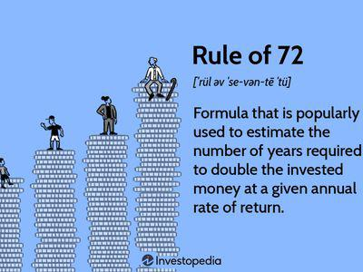

## Table of Contents

## What is the Rule of 70?

The Rule of 70 is a simple way to estimate how long it will take for something to double in size. It's often used to figure out how fast money will grow if it's invested, or how quickly a population might grow. You use it by dividing the number 70 by the rate of growth. For example, if you're earning 7% interest on your savings, you divide 70 by 7 to find out it will take about 10 years for your money to double.

This rule is handy because it doesn't need complicated math or special tools. It gives a quick ballpark figure that's usually close enough for everyday use. However, it's a rough estimate and works best with steady growth rates. If the growth rate changes a lot, the Rule of 70 might not be as accurate, but it's still a useful tool for quick calculations.

## What is the Rule of 72?

The Rule of 72 is a quick way to figure out how long it will take for money to double. You just divide the number 72 by the interest rate you're getting. For example, if your savings account gives you 6% interest each year, you divide 72 by 6 and find out it will take about 12 years for your money to double.

This rule is easy to use and doesn't need a calculator. It's great for making quick guesses without doing hard math. But remember, it's just an estimate and works best when the interest rate stays the same. If the rate changes a lot, the Rule of 72 might not be as accurate, but it's still helpful for a quick check.

## How do you calculate the Rule of 70?

The Rule of 70 is a simple way to figure out how long it will take for something to double. You use it by dividing the number 70 by the rate of growth. For example, if a population is growing at 5% each year, you divide 70 by 5 to find out it will take about 14 years for the population to double.

This rule is handy because it gives you a quick answer without needing a calculator. It's useful for things like money in a savings account or the number of people in a city. Just remember, it's a rough estimate and works best when the growth rate stays steady. If the rate changes a lot, the Rule of 70 might not be as accurate, but it's still a good tool for quick guesses.

## How do you calculate the Rule of 72?

The Rule of 72 is a simple way to figure out how long it will take for your money to double. You just divide the number 72 by the interest rate you're getting. For example, if you're [earning](/wiki/earning-announcement) 8% interest on your savings, you divide 72 by 8. This tells you it will take about 9 years for your money to double.

This rule is easy to use and doesn't need a calculator. It's great for making quick guesses without doing hard math. But remember, it's just an estimate and works best when the interest rate stays the same. If the rate changes a lot, the Rule of 72 might not be as accurate, but it's still helpful for a quick check.

## Why are the numbers 70 and 72 used in these rules?

The numbers 70 and 72 are used in these rules because they make the math easy and give a good enough guess for how long it takes for things to double. They are close to the natural logarithm of 2, which is about 0.693. When you divide 70 or 72 by the growth rate, you're doing a quick version of the math that uses this natural logarithm.

Both numbers work well, but 72 is a bit easier to divide because it has more factors. For example, it's easier to divide 72 by 6, 8, or 9 than it is to divide 70 by those numbers. But 70 can be a bit more accurate for some growth rates. So, people use both depending on what they find easier or more accurate for their needs.

## What is the difference between the Rule of 70 and the Rule of 72?

The Rule of 70 and the Rule of 72 are both quick ways to guess how long it will take for something to double. The Rule of 70 uses the number 70, and you divide it by the growth rate. For example, if something grows by 5% each year, you divide 70 by 5 to find out it will take about 14 years to double. The Rule of 72 uses the number 72 instead, so you divide 72 by the growth rate. If something grows by 5% each year, you divide 72 by 5 and find it will take about 14.4 years to double.

The main difference between the two rules is the number you start with, 70 or 72. The Rule of 72 is often easier to use because 72 has more numbers that divide into it nicely, like 6, 8, and 9. This makes the math simpler for many common interest rates. On the other hand, the Rule of 70 might be a bit more accurate for some growth rates because it's closer to the natural logarithm of 2, which is the math behind these rules. Both rules give you a good enough guess, so you can use whichever one you find easier or more accurate for your needs.

## In what scenarios is the Rule of 70 more accurate?

The Rule of 70 is more accurate when the growth rate is lower. For example, if something grows at 2% or 3% each year, using the Rule of 70 gives a closer guess to the real time it takes to double. This is because the number 70 is closer to the math that makes these rules work when the growth rate is small.

For higher growth rates, like 10% or more, the Rule of 72 might be easier to use and still pretty accurate. But if you need a very exact guess and the growth rate is low, the Rule of 70 will give you a better answer. Both rules are good for quick guesses, but the Rule of 70 works better with smaller growth rates.

## In what scenarios is the Rule of 72 more accurate?

The Rule of 72 is more accurate when the growth rate is higher. If something grows at 8%, 10%, or even more each year, using the Rule of 72 gives a closer guess to the real time it takes to double. This is because the number 72 works better with bigger growth rates, making the math easier and the guess more accurate.

For example, if you're investing money at a high interest rate, the Rule of 72 will help you figure out how long it will take for your money to double more accurately than the Rule of 70. It's also easier to use because 72 has more numbers that divide into it nicely, like 6, 8, and 9, which makes the math simpler for many common interest rates.

## How can the Rule of 70 and Rule of 72 be applied in financial planning?

In financial planning, the Rule of 70 and Rule of 72 help you figure out how long it will take for your money to double. If you're saving money in a bank account or investing in something that grows at a steady rate, these rules can give you a quick guess. For example, if you're getting 4% interest on your savings, using the Rule of 70 (70 divided by 4) tells you it will take about 17.5 years for your money to double. If you use the Rule of 72 (72 divided by 4), it says about 18 years. Both rules help you plan how long you need to save or invest to reach your money goals.

These rules are also useful for comparing different investment options. If you're looking at two different places to put your money, one with a 6% return and another with a 7% return, you can use the Rule of 72 to see how much faster your money will grow with the higher rate. Dividing 72 by 6 gives you 12 years, and dividing 72 by 7 gives you a bit over 10 years. This quick math helps you decide which investment might be better for doubling your money faster. Both rules are simple tools that make financial planning easier by giving you a good enough guess without needing a calculator.

## What are the limitations of using the Rule of 70 and Rule of 72?

The Rule of 70 and Rule of 72 are handy for quick guesses, but they have some limits. They work best when the growth rate stays the same all the time. If the rate changes a lot, like if your savings account interest goes up or down, these rules won't be as accurate. They also assume that the growth is smooth and steady, which isn't always true in real life. For example, if you're investing in the stock market, the value of your money can go up and down a lot, making these rules less useful.

Another thing to remember is that these rules are just rough estimates. They're not exact and might not be perfect for every situation. If you need a very exact number, you might need to use more detailed math or special tools. But for quick checks and everyday planning, the Rule of 70 and Rule of 72 can still be very helpful. Just keep in mind their limits and use them as a starting point, not the final answer.

## How do changes in interest rates affect the outcomes of the Rule of 70 and Rule of 72?

Changes in interest rates can make the Rule of 70 and Rule of 72 less accurate. Both rules work best when the interest rate stays the same all the time. If the interest rate goes up or down a lot, the time it takes for your money to double will change, and the rules won't give you the right answer. For example, if you use the Rule of 72 to figure out how long it will take for your money to double at a 5% interest rate, and then the rate changes to 6%, the time it takes to double will be different from what the rule told you.

These rules are just rough guesses and can be thrown off by big changes in interest rates. If the interest rate changes a lot, you might need to use more detailed math or special tools to get a more exact answer. But for quick checks and everyday planning, the Rule of 70 and Rule of 72 can still be helpful. Just remember, if the interest rate changes, the rules might not be as accurate, so it's good to keep an eye on those changes and adjust your plans if needed.

## Can the Rule of 70 and Rule of 72 be used for other types of growth rates, such as population growth?

Yes, the Rule of 70 and Rule of 72 can be used for other types of growth rates, like population growth. If a city's population is growing at 3% each year, you can use the Rule of 70 to guess how long it will take for the population to double. You divide 70 by 3 and find out it will take about 23 years. If you use the Rule of 72, you divide 72 by 3 and get about 24 years. Both rules help you quickly figure out how fast a population is growing without needing a calculator.

These rules work well when the growth rate stays steady. If the population growth rate changes a lot, like if it goes from 3% to 5% or back down, the rules won't be as accurate. But for a quick guess, they're still useful. Just remember, they're rough estimates and might not be perfect for every situation, but they give you a good starting point for understanding how long it might take for a population to double.

## What is the Rule of 70 and how can it be understood?

The Rule of 70 is a straightforward mathematical formula used to estimate the number of years required for a quantity to double, given a constant annual growth rate. This rule is particularly useful in financial contexts to estimate the doubling time for investments, economies, populations, and other variables that grow exponentially over time. Its mathematical basis is rooted in logarithms and exponential growth models.

The formula for the Rule of 70 is:

$$
\text{Doubling Time} = \frac{70}{\text{Annual Growth Rate (\%)}}
$$

To use the Rule of 70, divide the number 70 by the annual growth rate of the investment or economy. For instance, if an investment grows at an annual rate of 5%, the estimated time for the investment to double is $\frac{70}{5} = 14$ years.

**Example:**

Suppose you have a savings account that offers an annual [interest rate](/wiki/interest-rate-trading-strategies) of 3%. Using the Rule of 70:

$$
\text{Doubling Time} = \frac{70}{3} \approx 23.33 \text{ years}
$$

This example demonstrates that at a 3% annual growth rate, it will take approximately 23.33 years for the principal amount in the savings account to double. 

The Rule of 70 finds its application primarily in scenarios where growth rates are reasonably stable and low to moderate. It is notably effective when evaluating investment opportunities, projecting economic growth scenarios, and assessing demographic trends.

One of the main advantages of the Rule of 70 is its precision at lower growth rates. Traditional financial and economic models often employ exponential functions, which can become cumbersome to calculate manually. In contrast, the Rule of 70 provides a quick estimation that, while simplified, remains remarkably accurate for lower growth rates. This precision can assist investors and policymakers in making informed decisions without resorting to complex calculations.

In summary, the Rule of 70 serves as a valuable tool for estimating doubling times under stable growth conditions, offering precision and simplicity that enhance its utility in both personal finance and broader economic contexts.

## What is the Rule of 72 and how does it work?

The Rule of 72 is a straightforward financial estimation tool used to approximate the time required for an investment to double, given a fixed annual rate of compound interest. Mathematically, it expresses the doubling time as 72 divided by the annual interest rate. The formula is:

$$
\text{Doubling Time (years)} = \frac{72}{\text{Interest Rate (\%)}}
$$

For example, if an investment offers an annual interest rate of 8%, the estimated time for the investment to double is:

$$
\frac{72}{8} = 9 \text{ years}
$$

This rule is particularly applicable in scenarios with higher interest rates, as it adequately balances simplicity and accuracy. The Rule of 72 provides a quick mental math shortcut, making it especially useful for investors and financial analysts needing prompt estimations without detailed calculations. 

In practice, its simplicity in calculation is one of its most significant advantages. Unlike more complex mathematical models, the Rule of 72 can be applied mentally or with minimal computational effort, enabling rapid assessments of various growth scenarios. This feature is particularly beneficial in contexts such as investment seminars, financial consultations, or any situation where rapid evaluations are advantageous.

Moreover, the Rule of 72 is advantageous because of its general accuracy within typical interest rate ranges. While slightly less precise than the Rule of 70 at lower rates, its ease of calculation often outweighs marginal inaccuracies when dealing with higher rates. This makes it a preferred tool for quick financial estimations, offering a balance between accuracy and practicality.

In summary, the Rule of 72 serves as a highly efficient tool for estimating doubling times in investment contexts, particularly where higher interest rates are involved. Its ability to provide quick and reasonably accurate results makes it a staple in both personal finance and broader economic analyses.

## How can the Rule of 70 and Rule of 72 be incorporated into algorithmic trading?

Algorithmic trading, a cornerstone of modern financial markets, involves using computer algorithms to execute trades at speeds and frequencies unachievable by human traders. This method leverages mathematical models and computational power to optimize trading strategies, minimize risks, and maximize returns. Central to these models are tools for efficient estimation, and the Rule of 70 and the Rule of 72 can be effectively incorporated into [algorithmic trading](/wiki/algorithmic-trading) systems for assessing investment growth and decision-making.

### Incorporation into Algorithmic Models

The Rule of 70 and the Rule of 72 can be integrated into algorithmic trading by incorporating their formulas to predict the doubling time of investments. Specifically, these rules can be coded into trading algorithms to evaluate the potential future value of assets, aiding in decisions regarding holding periods and investment targets.

For example, the Rule of 72 is defined as:

$$
\text{Doubling Time (years)} = \frac{72}{\text{Annual Growth Rate (\%)}}
$$

This can be incorporated into a Python-based trading model as follows:

```python
def calculate_doubling_time(growth_rate):
    return 72 / growth_rate

# Example usage
growth_rate = 8  # 8% annual growth rate
doubling_time = calculate_doubling_time(growth_rate)
print(f"Doubling time: {doubling_time} years")
```

This simple function can be utilized in larger trading strategies to determine how long an investment should be held to achieve a desired financial goal, given the projected growth rate.

### Benefits for Automated Investment Decisions

In algorithmic trading, using the Rule of 70 and Rule of 72 provides several advantages for automated investment decisions and risk management:

1. **Quick Estimations**: Both rules offer quick and easy calculations for estimating doubling time, which is valuable for algorithms that need to process vast amounts of data rapidly.

2. **Strategic Adjustments**: Algorithms can dynamically adjust investment strategies based on changing market conditions and varying growth rates, making them flexible tools for managing portfolios.

3. **Risk Management**: By forecasting the time it takes for investments to double, traders can better manage risks associated with different assets and optimize their portfolio's performance over time.

### Case Studies and Examples

The integration of these rules can be observed in quantitative finance and trading platforms where high-frequency trading ([HFT](/wiki/high-frequency-trading-strategies)) algorithms utilize quick estimation methods to make real-time decisions. For instance, a trading firm may employ the Rule of 72 within its algorithm to swiftly gauge investment potential under current market growth conditions, promptly altering trading positions in response to trends and [volatility](/wiki/volatility-trading-strategies). In a dynamically changing environment, such quick calculative strategies become crucial, enabling better timing of entry and [exit](/wiki/exit-strategy) points in the market, thereby enhancing profit margins.

In conclusion, the Rule of 70 and Rule of 72 serve as invaluable tools in algorithmic trading by facilitating fast, informed decisions and optimizing risk management. Their integration into algorithmic models underscores their utility in navigating the complexities of financial markets, underpinning their enduring relevance in modern finance.

## References & Further Reading

[1]: ["A Random Walk Down Wall Street: The Time-Tested Strategy for Successful Investing"](https://www.amazon.com/Random-Walk-Down-Wall-Street/dp/0393358380) by Burton Malkiel

[2]: Bodie, Z., Kane, A., & Marcus, A. J. (2014). ["Investments"](https://www.mheducation.com/highered/product/Investments-Bodie.html). McGraw-Hill Education.

[3]: ["The Little Book of Common Sense Investing: The Only Way to Guarantee Your Fair Share of Stock Market Returns"](https://www.amazon.com/Little-Book-Common-Sense-Investing/dp/1119404509) by John C. Bogle

[4]: ["Principles of Economics"](https://open.umn.edu/opentextbooks/textbooks/32) by N. Gregory Mankiw

[5]: ["The Intelligent Investor: The Definitive Book on Value Investing"](https://www.amazon.com/Intelligent-Investor-Definitive-Investing-Essentials/dp/0060555661) by Benjamin Graham