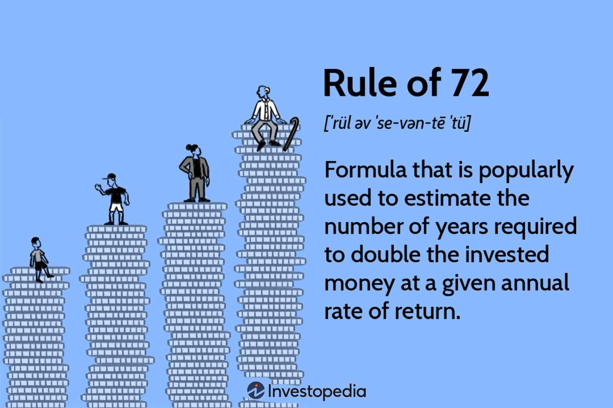

The Rule of 72 is a well-regarded financial formula that simplifies the process of calculating the time it will take for an investment to double. Widely recognized for its utility, this rule provides a quick and intuitive way to estimate the effect of compound interest, making it a valuable tool for anyone involved in financial planning or investment analysis. Beyond its applications in pure finance, the simplicity and elegance of the Rule of 72 make it applicable in various domains where exponential growth is significant, such as population studies and technology adoption rates.

This article intends to explore the Rule of 72 in detail, not only in terms of its application in traditional investment growth but also in its relevance to modern financial practices such as algorithmic trading. By understanding this principle, both budding investors and seasoned traders can gain meaningful insights into the dynamics of their financial activities and decisions.



Whether you are looking to optimize your investment portfolio or streamline your financial strategies, the Rule of 72 offers a straightforward method to project growth and set realistic financial goals. Understanding this rule can add significant clarity to your financial planning and investment strategy, as it bridges the gap between intricate financial theories and everyday applications.

## Table of Contents

## Understanding the Rule of 72

The Rule of 72 is a straightforward mathematical formula frequently employed to estimate the time required for an investment to double, assuming a fixed annual rate of return. This rule operates on the principle of dividing the number 72 by the annual interest rate, expressed as a percentage. The quotient provides an approximation of the number of years needed for the initial investment to double. 

For example, if an investment offers a consistent 8% annual return, the time it would take for the investment to double can be approximated by the formula:

$$
\text{Doubling Time} = \frac{72}{8} = 9 \text{ years}
$$

This method serves as an accessible tool for making quick mental calculations and offers an introductory understanding of compounding interest in investments. It demonstrates the exponential nature of investment growth where interest grows on top of prior interest earned. 

The historical origins of the Rule of 72 trace back to Luca Pacioli's well-known work from 1494, where it was introduced as a reliable financial estimation tool. Despite its simplicity, the Rule of 72 has gained widespread acceptance due to its practicality and ease of application.

Moreover, the accuracy of the Rule of 72 is at its highest when applied to interest rates between 6% and 10%. Within this range, the approximation closely aligns with the exact calculations required for exponential growth formulas. For interest rates significantly outside this range, the rule's precision may diminish, necessitating alternative methods or adjustments for more accurate predictions. Nonetheless, for quick assessments and educational purposes, the Rule of 72 remains a valuable resource in financial contexts, highlighting the power and effect of compound interest over time.

## Applications of the Rule of 72 in Investment Growth

Investors often use the Rule of 72 to plan their long-term investment strategies, as it enables a straightforward calculation of how their investments might grow over time. This rule is particularly advantageous when determining the effects of different return rates on investment growth, thereby assisting investors in comparing potential investment opportunities. By dividing 72 by the expected annual rate of return, investors can quickly estimate the number of years required for an investment to double in value. For example, with an 8% annual return, it would take approximately $\frac{72}{8} = 9$ years for the investment to double.

Practical applications of the Rule of 72 span various types of investments, including mutual funds, savings accounts, and stocks. Its simplicity makes it a versatile tool across these diverse investment avenues. With a consistent annual growth rate, investors can use this rule to set achievable financial goals, anticipate future values, and strategize their investment timeframes effectively.

Moreover, the Rule of 72 is beneficial beyond straightforward investment growth calculations. It can evaluate the impact of external factors such as inflation and investment-related fees on the overall growth of an investment. For example, if the inflation rate is 3%, the rule can help determine that the purchasing power of money will halve in approximately $\frac{72}{3} = 24$ years. Similarly, when considering fees or other expenses, investors can adjust the effective return rate accordingly and use the rule to understand how these costs might influence the time needed to double their investment.

In summary, the Rule of 72 is a flexible and user-friendly tool that aids investors in visualizing and planning the growth trajectory of their investments. Its ability to provide quick, mental approximations for doubling time makes it a valuable asset in financial planning, allowing both new and seasoned investors to optimize their investment strategies with a clearer understanding of compounding growth and its implications over time.

## Algorithmic Trading and the Rule of 72

Algorithmic trading, commonly known as algo trading, involves the use of automated systems to execute trades based on pre-programmed instructions. These instructions can encompass a variety of criteria, such as timing, price, and quantity. Within this context, the Rule of 72 emerges as a practical tool for analyzing and optimizing trading strategies.

The Rule of 72 provides a quick estimation of an investment's doubling time based on its rate of return. In [algorithmic trading](/wiki/algorithmic-trading), this rule can be applied to performance metrics to project potential growth over time. For instance, by knowing the average annual return rate of an algorithmic strategy, traders can determine how long it would take for their investment to double, helping evaluate the long-term viability of the strategy.

Moreover, the Rule of 72 can serve as a convenient check for assessing the effects of transaction costs on a strategy's profitability. Transaction costs can significantly impact net returns, altering the doubling time of an investment. By incorporating these costs into the return rate used in the Rule of 72, traders can better understand the true growth potential of their strategies.

Here is a simple Python script that demonstrates how the Rule of 72 can be applied to estimate the doubling time of an investment, factoring in transaction costs:

```python
def calculate_doubling_time(mean_return_rate, transaction_costs):
    """
    Calculate the doubling time of an investment using the Rule of 72, adapted for transaction costs.

    :param mean_return_rate: The average annual return rate (in percentage) of the trading strategy
    :param transaction_costs: The annual transaction costs (in percentage)
    :return: Estimated doubling time in years
    """
    net_return_rate = mean_return_rate - transaction_costs
    if net_return_rate <= 0:
        return "The strategy is not viable with current transaction costs."
    else:
        doubling_time = 72 / net_return_rate
        return doubling_time

# Example usage:
mean_return_rate = 8.0  # Example: 8% average annual return
transaction_costs = 1.5 # Example: 1.5% transaction costs
print(calculate_doubling_time(mean_return_rate, transaction_costs))
```

In the fast-paced environment of algorithmic trading, where decisions need to be made with agility, the Rule of 72 aids traders in making informed strategic choices. By facilitating quick assessments of potential growth and the realistic impact of costs, algo traders can refine their strategies for better efficiency and profitability. This underscores the value of the Rule of 72 as a fundamental tool in financial analysis and automated trading systems.

## Limitations and Variations of the Rule of 72

While convenient, the Rule of 72 is an approximation and may not provide precise results across all financial scenarios, particularly for interest rates that deviate significantly from the standard range of 6% to 10%. This rule relies on simplifying assumptions that may not capture the complexities of financial dynamics. As such, it is crucial to recognize the potential deviations in accuracy.

One primary limitation of the Rule of 72 is its performance outside the optimal [interest rate](/wiki/interest-rate-trading-strategies) range. For more accurate predictions with lower or higher interest rates, alternative rules like the Rule of 69 and Rule of 73 might be more suitable. The Rule of 69 can be particularly effective for continuous compounding, while the Rule of 73 provides a slightly better estimate for rates higher than typical ranges. 

Let us consider these variations briefly:

1. **Rule of 69**: This variation is generally used for continuous compounding interest calculations. The formula can be expressed as $\text{Doubling Time} = 69/\text{Interest Rate}$.

2. **Rule of 73**: This variant can be employed for higher interest rates, providing a closer estimate when the rates exceed the typical boundaries of 6% to 10%.

In financial environments characterized by high [volatility](/wiki/volatility-trading-strategies) or where rates are unpredictable, the oversimplification inherent in these rules can lead to errors. Complex financial models often incorporate varying compounding intervals, requiring more intricate calculations to accurately predict investment outcomes. For instance, when interest is compounded semi-annually or quarterly, the straightforward application of the Rule of 72 needs adjustment to maintain its applicability.

In Python, a more precise calculation approach might involve the use of logarithmic functions to accommodate non-annual compounding intervals:

```python
import math

def calculate_doubling_time(interest_rate, compounding_periods=1):
    return math.log(2) / (compounding_periods * math.log(1 + interest_rate / compounding_periods))

# Example usage for a 7% annual interest rate, compounded quarterly
annual_rate = 0.07
compounding_periods = 4
doubling_time = calculate_doubling_time(annual_rate, compounding_periods)

print(f"Precise doubling time: {doubling_time:.2f} years")
```

Despite these limitations, the Rule of 72 remains a valuable tool in financial estimation when used appropriately. Its straightforward nature provides quick insights that can guide preliminary assessments and strategic planning. Recognizing its limitations and alternative approaches ensures its effective integration into more comprehensive financial analyses. Understanding these nuances allows investors to better navigate the complexities of financial growth and optimize their investment decisions.

## Conclusion

The Rule of 72 continues to be a valuable educational tool and practical resource for investors and financial planners alike. Its primary advantage lies in its simplicity, enabling users to easily grasp the complex concepts of compounding and exponential growth. By providing a quick mental calculation, it allows individuals to estimate the doubling time of their investments without the need for a calculator or financial software.

However, as with any financial estimate, understanding the limitations and conditions of the Rule of 72 is crucial to ensure it is used effectively. The rule is most accurate when applied to interest rates between 6% and 10%, and deviations from this range can diminish its precision. In scenarios involving highly volatile markets or non-annual compounding intervals, more advanced calculations may be necessary.

Integrating insights from algorithmic trading and advanced financial analysis can enhance the effectiveness of the Rule of 72. In algorithmic trading, for example, the rule can help evaluate the viability of automated trading strategies by providing quick estimations of expected growth under different return scenarios. This helps traders assess the impact of various factors, such as transaction costs and market conditions, on their strategy's profitability.

With this knowledge, investors can make more informed decisions, optimizing their financial growth and investment success. By combining the Rule of 72 with a deeper understanding of financial markets and investor behavior, individuals can strengthen their strategic toolkit and improve their ability to navigate the complexities of today's investment landscape.

## References & Further Reading

[1]: Pacioli, L. (1494). ["Summa de Arithmetica, Geometria, Proportioni et Proportionalità"](https://archive.org/details/summa-de-arithmetica-geometria-proportioni-et-proportionalita). 

[2]: Bogle, J. C. (2007). ["The Little Book of Common Sense Investing: The Only Way to Guarantee Your Fair Share of Stock Market Returns"](https://en.wikipedia.org/wiki/The_Little_Book_of_Common_Sense_Investing). 

[3]: Lopez de Prado, M. (2018). ["Advances in Financial Machine Learning"](https://www.amazon.com/Advances-Financial-Machine-Learning-Marcos/dp/1119482089).

[4]: Jansen, S. (2020). ["Machine Learning for Algorithmic Trading"](https://github.com/stefan-jansen/machine-learning-for-trading).

[5]: Chan, E. P. (2009). ["Quantitative Trading: How to Build Your Own Algorithmic Trading Business"](https://github.com/ftvision/quant_trading_echan_book).

[6]: Hull, J. C. (2018). ["Options, Futures, and Other Derivatives"](https://www.semanticscholar.org/paper/Options%2C-Futures%2C-and-Other-Derivatives-Hull/89bdee500c8623864fc9eb7a471546aa713acc44). 

[7]: Bodie, Z., Kane, A., & Marcus, A. J. (2014). ["Investments"](https://www.mheducation.com/highered/product/Investments-Bodie.html). 

[8]: Aronson, D. R. (2007). ["Evidence-Based Technical Analysis: Applying the Scientific Method and Statistical Inference to Trading Signals"](https://www.amazon.com/Evidence-Based-Technical-Analysis-Scientific-Statistical/dp/0470008741).