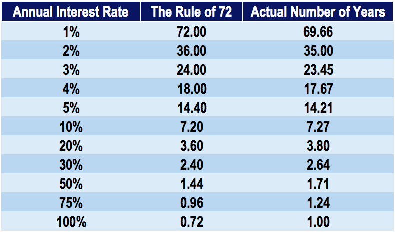

## Table of Contents

## What is the Rule of 72?

The Rule of 72 is a simple way to estimate how long it will take for your money to double in value. You just divide the number 72 by the interest rate you are getting on your investment. For example, if you are earning 6% interest, you divide 72 by 6, which gives you 12 years. This means your money will double in about 12 years.

This rule is handy because it's easy to use and doesn't need a calculator. It works best with interest rates between 6% and 10%. But remember, it's just an estimate. The actual time it takes for your money to double might be a bit different, depending on things like how often the interest is added to your investment.

## How do you calculate the Rule of 72?

To calculate the Rule of 72, you take the number 72 and divide it by the interest rate you're getting on your investment. For example, if your interest rate is 8%, you divide 72 by 8. The answer you get is the number of years it will take for your money to double. So, in this case, it would take about 9 years for your money to double.

The Rule of 72 is a quick and easy way to get a rough idea about your investment growth. It's great for interest rates between 6% and 10%. But remember, it's just an estimate. The real time it takes for your money to double can be a bit different because of things like how often the interest is added to your account.

## Why is the Rule of 72 useful for investors?

The Rule of 72 is a handy tool for investors because it helps them quickly figure out how long it will take for their money to double. All you need to do is divide 72 by the [interest rate](/wiki/interest-rate-trading-strategies) you are getting on your investment. This simple calculation gives you a good idea of your investment's growth without needing a calculator or complicated math. It's especially useful for comparing different investment options to see which one might help your money grow faster.

It's also great because it works well for common interest rates, usually between 6% and 10%. This makes it practical for everyday investors who are looking at typical savings accounts, bonds, or other investments. While the Rule of 72 gives you an estimate, it's a quick way to plan your financial future and set realistic goals for your money's growth.

## Can the Rule of 72 be applied to any type of investment?

The Rule of 72 can be used for many types of investments, like savings accounts, bonds, and stocks that pay dividends. It works well when the interest or growth rate stays the same over time. If you know the rate, you can easily figure out how long it will take for your money to double. Just divide 72 by the rate, and you get the number of years.

But, the Rule of 72 isn't perfect for every investment. It doesn't work as well with things like stocks that go up and down a lot, because their growth isn't steady. Also, it assumes the interest is added to your investment just once a year. If it's added more often, like monthly or daily, the actual time for your money to double might be a bit shorter. So, while the Rule of 72 is a handy tool, it's best to use it as a rough guide and not the final word on your investment growth.

## What are the limitations of the Rule of 72?

The Rule of 72 is a handy tool, but it has some limits. It works best when the interest rate stays the same over time. If the rate changes a lot, like with stocks that go up and down, the Rule of 72 might not be very accurate. It also assumes that interest is added to your investment just once a year. If it's added more often, like monthly or daily, your money might double a bit faster than the Rule of 72 says.

Another thing to keep in mind is that the Rule of 72 is just a rough estimate. It's great for quick calculations, but it's not perfect. For example, it works best with interest rates between 6% and 10%. If the rate is a lot higher or lower, the estimate might be off. So, while the Rule of 72 can help you get a quick idea of how your investment might grow, it's always good to use other tools and talk to a financial advisor to get a fuller picture of your investment's future.

## How accurate is the Rule of 72 compared to actual investment growth?

The Rule of 72 gives you a quick way to guess how long it will take for your money to double. It's pretty good when the interest rate stays the same and is between 6% and 10%. But remember, it's just a rough guess. The actual time your money takes to double can be different, especially if the interest rate changes a lot or if the interest is added to your account more often than once a year.

For example, if you have an investment with a steady 8% interest rate, the Rule of 72 says your money will double in about 9 years. That's close, but if the interest is added monthly instead of yearly, it might actually take less time. And if you're investing in something like stocks that go up and down, the Rule of 72 won't be very accurate because the growth isn't steady. So, while the Rule of 72 is handy for quick estimates, it's best to use it along with other tools to get a better idea of how your investment will grow.

## Are there variations of the Rule of 72, such as the Rule of 70 or Rule of 69?

Yes, there are variations of the Rule of 72, like the Rule of 70 and the Rule of 69. These rules are used to estimate how long it will take for your money to double, just like the Rule of 72. The Rule of 70 works well for lower interest rates, while the Rule of 69 is a bit more accurate for continuous compounding, which means interest is added to your investment all the time.

The Rule of 70 is used by dividing 70 by the interest rate. For example, if you have an interest rate of 5%, you divide 70 by 5 to get 14 years. This rule is handy for interest rates that are a bit lower than what the Rule of 72 is good for. The Rule of 69 is used by dividing 69.3 by the interest rate, and it's a bit more precise when interest is added to your investment continuously. So, if you have a 4% interest rate with continuous compounding, you divide 69.3 by 4 to get about 17.3 years. Each of these rules helps you get a quick estimate, but they work best in different situations.

## How does inflation affect the results of the Rule of 72?

Inflation can make the results of the Rule of 72 less accurate. When you use the Rule of 72, you're looking at how long it will take for your money to double based on the interest rate. But inflation means that the value of money goes down over time. If the interest rate on your investment is not higher than the inflation rate, your money won't actually double in value as the Rule of 72 suggests. For example, if you have a 3% interest rate but inflation is 4%, your money will lose value even though the Rule of 72 says it will double in 24 years.

To get a better idea of how your money will grow when you think about inflation, you can adjust the interest rate you use in the Rule of 72. You do this by subtracting the inflation rate from the interest rate before you do the calculation. So, if your investment has a 6% interest rate and inflation is 2%, you would use 4% in the Rule of 72. That means you divide 72 by 4 to get 18 years. This way, you get a more realistic estimate of how long it will take for your money to double in terms of what it can actually buy.

## Can the Rule of 72 be used to estimate the impact of debt?

Yes, the Rule of 72 can also be used to estimate how quickly debt can double if you know the interest rate on the debt. Just like with investments, you divide 72 by the interest rate to find out how many years it will take for the debt to double. For example, if you have a credit card with a 15% interest rate, you divide 72 by 15 to get about 4.8 years. This means your debt could double in less than 5 years if you don't pay it down.

This can be a helpful way to understand how quickly debt can grow if you're not careful. It's a simple way to see the impact of high interest rates on things like credit cards or loans. Knowing this can motivate you to pay off your debt faster, so it doesn't keep growing and becoming harder to manage.

## How does the Rule of 72 apply to different compounding frequencies?

The Rule of 72 works best when interest is added to your investment once a year. If the interest is added more often, like monthly or daily, your money might double a bit faster than the Rule of 72 says. This is because more frequent compounding means the interest earns interest more often, making your investment grow faster. For example, if you have an 8% interest rate compounded yearly, the Rule of 72 says your money will double in about 9 years. But if it's compounded monthly, it might double in less than 9 years.

For a more accurate estimate with different compounding frequencies, you can use variations of the Rule of 72. The Rule of 69.3, for instance, is better for continuous compounding, where interest is added all the time. With this rule, you divide 69.3 by the interest rate to find out how long it will take for your money to double. So, if you have a 5% interest rate compounded continuously, you divide 69.3 by 5 to get about 13.9 years. Using the right rule for your compounding frequency can give you a better idea of how your money will grow.

## What are some real-world examples where the Rule of 72 has been effectively used?

A real-world example where the Rule of 72 has been effectively used is in personal savings accounts. Imagine someone puts money into a savings account that gives them a 4% interest rate every year. They want to know how long it will take for their money to double. Using the Rule of 72, they divide 72 by 4 and find out it will take about 18 years. This simple calculation helps them plan their savings goals and see how their money will grow over time.

Another example is in investment planning. Let's say an investor is looking at different investment options, like bonds and stocks. They find a bond that offers a steady 6% interest rate. By using the Rule of 72, they divide 72 by 6 and see that their money will double in about 12 years. This helps them compare this bond to other investments and decide which one will help their money grow faster. The Rule of 72 gives them a quick and easy way to make smart investment choices.

## How can investors adjust the Rule of 72 for more precise financial planning?

Investors can adjust the Rule of 72 to make their financial planning more precise by taking into account the effects of different compounding frequencies and inflation. For example, if interest is added to an investment more often than once a year, like monthly or daily, the Rule of 72 might not be as accurate. To get a better estimate, investors can use the Rule of 69.3 for continuous compounding. This means they divide 69.3 by the interest rate instead of 72, which gives them a more precise idea of how long it will take for their money to double when interest is added all the time.

Another way to adjust the Rule of 72 is to consider inflation. Inflation makes the value of money go down over time, so if the interest rate on an investment is not higher than the inflation rate, the money won't actually double in value. To fix this, investors can subtract the inflation rate from the interest rate before using the Rule of 72. For instance, if an investment has a 6% interest rate and inflation is 2%, they would use 4% in the calculation. This adjusted rate gives a more realistic estimate of how long it will take for the money to double in terms of what it can actually buy. By making these adjustments, investors can get a clearer picture of their investment's growth and plan their finances more accurately.

## What is the Power of Compound Interest?

Compound interest is frequently hailed as the eighth wonder of the world due to its capacity for exponential growth. This financial mechanism operates by generating returns on both the principal amount and the interest that accumulates over time. The fundamental concept behind compound interest is the reinvestment of earnings, which, over successive periods, leads to a significant increase in the overall value of an investment. The formula for compound interest is expressed as:

$$
A = P \left(1 + \frac{r}{n}\right)^{nt}
$$

where:
- $A$ is the amount of money accumulated after n years, including interest,
- $P$ is the principal amount (initial investment),
- $r$ is the annual interest rate (decimal),
- $n$ is the number of times that interest is compounded per year,
- $t$ is the number of years the money is invested for.

An example of the power of compound interest can be illustrated by considering an initial investment of $10,000 at an annual interest rate of 5%, compounded annually. After 20 years, the investment would grow to approximately $26,532.98, assuming all interest is reinvested. This growth is significantly higher than a similar simple interest arrangement, where the return would only be $20,000.

For optimal benefits, investors are advised to start early, allowing for a longer period of compounding, and to reinvest dividends. This strategy leverages the exponential nature of compound interest, thus maximizing the end value of investments.

Understanding compound interest also aids in setting realistic financial goals and effective future planning. For example, by comprehending how different rates of return affect investment growth, investors can make informed decisions about savings and retirement planning.

The Rule of 72 complements the understanding of compound interest by providing a straightforward method to estimate the time required for an investment to double. By simply dividing 72 by the annual interest rate, investors can approximate this period, offering a quick insight into the power of compounding. For instance, at an interest rate of 8%, an investment would double in about nine years. Thus, these concepts together furnish a comprehensive framework that enhances financial decision-making and investment potential.

## How can these concepts be integrated for effective investing?

Combining the Rule of 72, compound interest, and [algorithmic trading](/wiki/algorithmic-trading) provides a comprehensive strategy for effective investing. The Rule of 72 offers investors a simple and quick mental mechanism to estimate the time required to double their investments, facilitating long-term planning. By dividing 72 by the expected annual interest rate, investors can anticipate how their investments will grow over time, aiding in the establishment of financial targets and risk assessments.

Compound interest plays a crucial role in this combination, significantly enhancing investment returns by allowing both the initial principal and accumulated interest to generate further earnings. For instance, if an investor receives a consistent annual return $r$, the future value $FV$ of an investment can be expressed as:

$$
FV = P \times (1 + \frac{r}{n})^{nt}
$$

where $P$ represents the principal amount, $n$ the number of compounding periods per year, and $t$ the number of years. Starting early and reinvesting dividends help amplify these effects over time.

Algorithmic trading further enhances this strategy by employing computer algorithms to execute trades based on predetermined criteria, allowing for precise and efficient market operations. These algorithms can be customized to identify opportunities where the growth principles of the Rule of 72 and compound interest can be most effectively leveraged, thus maximizing potential investment gains. Algorithmic systems can process large datasets and market trends in real-time, making swift decisions that optimize portfolio management.

Together, these methodologies address various facets of successful investment management, encompassing future projections, growth maximization, and efficient market execution. The dynamic nature of financial markets necessitates ongoing learning and adaptation of strategies to maintain relevance and effectiveness. By integrating the Rule of 72, compound interest, and algorithmic trading, investors can improve decision-making processes, achieving a harmonious balance between traditional and modern investing methods. This integrated approach can offer a significant advantage in navigating the complexities of contemporary financial landscapes.

## References & Further Reading

[1]: Bergstra, J., Bardenet, R., Bengio, Y., & Kégl, B. (2011). ["Algorithms for Hyper-Parameter Optimization."](https://proceedings.neurips.cc/paper/2011/file/86e8f7ab32cfd12577bc2619bc635690-Paper.pdf) Advances in Neural Information Processing Systems 24.

[2]: ["Advances in Financial Machine Learning"](https://www.amazon.com/Advances-Financial-Machine-Learning-Marcos/dp/1119482089) by Marcos Lopez de Prado

[3]: ["Evidence-Based Technical Analysis: Applying the Scientific Method and Statistical Inference to Trading Signals"](https://www.amazon.com/Evidence-Based-Technical-Analysis-Scientific-Statistical/dp/0470008741) by David Aronson

[4]: ["Machine Learning for Algorithmic Trading"](https://github.com/PacktPublishing/Machine-Learning-for-Algorithmic-Trading-Second-Edition) by Stefan Jansen

[5]: ["Quantitative Trading: How to Build Your Own Algorithmic Trading Business"](https://books.google.com/books/about/Quantitative_Trading.html?id=j70yEAAAQBAJ) by Ernest P. Chan