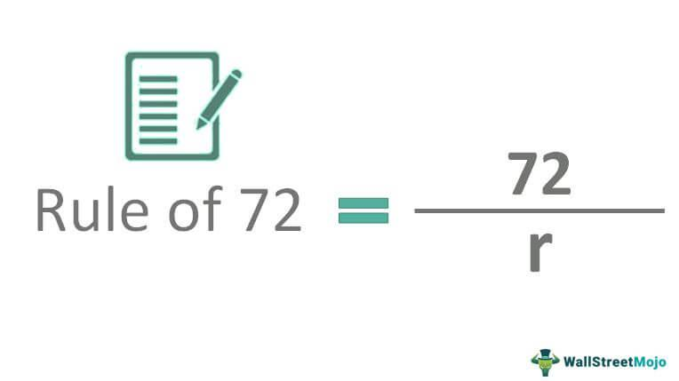

The world of investing is filled with various strategies and tools aimed at maximizing returns. With a myriad of methodologies available, three critical concepts stand out for their potential to enhance investment outcomes: the Rule of 72, compound interest, and algorithmic trading. Each of these concepts plays a distinct role in the investment process, offering unique benefits that, when combined, create a powerful toolkit for any investor.

The Rule of 72 is a straightforward mathematical tool that allows investors to quickly estimate the time required for an investment to double at a fixed annual rate of return. By dividing 72 by the expected annual interest rate, investors can gain a rapid understanding of their investment's potential growth over time. This simple calculation provides a mental shortcut, enabling individuals to make informed decisions without resorting to complex computations.

Compound interest, often lauded as one of the most powerful forces in investing, relies on the principle of earning returns not only on the principal amount but also on accumulated interest. The effect of compound interest is exponential growth, making it a cornerstone of long-term investment strategies. It emphasizes the importance of starting investments early and reinvesting profits to enhance financial growth over extended periods.

Algorithmic trading represents the intersection of technology and investment management. By employing sophisticated computer programs and algorithms, investments are executed with high speed and precision, minimizing human error and strategically exploiting market opportunities. This modern approach to trading allows both individual and institutional investors to optimize portfolio management through data-driven decision-making.

Understanding how the Rule of 72, compound interest, and algorithmic trading intersect provides investors with a comprehensive set of tools to navigate the complexities of financial markets. By leveraging quick assessments, capitalizing on exponential growth, and utilizing advanced technology, individuals can significantly enhance their investment strategies and outcomes.

## Table of Contents

## Understanding the Rule of 72

The Rule of 72 offers investors a straightforward method to estimate the time required to double an investment based on a fixed annual interest rate. This rule simplifies complex financial calculations into a basic division: 72 divided by the expected annual rate of return. For instance, with an annual return of 8%, it would take approximately $\frac{72}{8} = 9$ years to double an investment. This approach is particularly valuable for quick assessments and enhances financial literacy by allowing individuals to make swift mental calculations.

The utility of the Rule of 72 is most pronounced when applied to interest rates within the range of 6% to 10%. In this bracket, the approximation closely aligns with more precise financial models. For instance, at a 6% [interest rate](/wiki/interest-rate-trading-strategies), the rule suggests it would take about $\frac{72}{6} = 12$ years to double the investment, which is quite accurate when compared to detailed compound interest calculations.

Despite its simplicity, the Rule of 72 is a potent tool widely used among investors for its ability to facilitate rapid calculations without the need for complex mathematics or software. This empowers individuals and professionals alike to make informed decisions about their investments quickly. While it serves as an excellent educational resource for teaching financial concepts, it also has practical applications for those frequently assessing investment opportunities or financial goals.

## The Power of Compound Interest

Compound interest is frequently hailed as the eighth wonder of the world due to its capacity for exponential growth. This financial mechanism operates by generating returns on both the principal amount and the interest that accumulates over time. The fundamental concept behind compound interest is the reinvestment of earnings, which, over successive periods, leads to a significant increase in the overall value of an investment. The formula for compound interest is expressed as:

$$
A = P \left(1 + \frac{r}{n}\right)^{nt}
$$

where:
- $A$ is the amount of money accumulated after n years, including interest,
- $P$ is the principal amount (initial investment),
- $r$ is the annual interest rate (decimal),
- $n$ is the number of times that interest is compounded per year,
- $t$ is the number of years the money is invested for.

An example of the power of compound interest can be illustrated by considering an initial investment of $10,000 at an annual interest rate of 5%, compounded annually. After 20 years, the investment would grow to approximately $26,532.98, assuming all interest is reinvested. This growth is significantly higher than a similar simple interest arrangement, where the return would only be $20,000.

For optimal benefits, investors are advised to start early, allowing for a longer period of compounding, and to reinvest dividends. This strategy leverages the exponential nature of compound interest, thus maximizing the end value of investments.

Understanding compound interest also aids in setting realistic financial goals and effective future planning. For example, by comprehending how different rates of return affect investment growth, investors can make informed decisions about savings and retirement planning.

The Rule of 72 complements the understanding of compound interest by providing a straightforward method to estimate the time required for an investment to double. By simply dividing 72 by the annual interest rate, investors can approximate this period, offering a quick insight into the power of compounding. For instance, at an interest rate of 8%, an investment would double in about nine years. Thus, these concepts together furnish a comprehensive framework that enhances financial decision-making and investment potential.

## Algorithmic Trading in Modern Investing

Algorithmic trading, often abbreviated as algo trading, employs advanced computer programs to execute trades at remarkable speed and accuracy. Leveraging algorithms, these systems are capable of conducting transactions far quicker than any human trader could manage. This rapid execution is crucial in the fast-paced environment of modern financial markets, where prices can shift in fractions of a second.

One of the key advantages of [algorithmic trading](/wiki/algorithmic-trading) is its ability to minimize human errors. Manual trading, while effective, is susceptible to errors arising from emotional decisions, fatigue, and simple mistakes. Algorithms, in contrast, follow pre-set instructions rigorously, ensuring consistent execution based on market data.

Algorithms can process and analyze vast amounts of data in real time, providing traders with insights that are both deep and current. This capability allows for informed decision-making and the identification of market opportunities that might be missed through traditional analysis. For instance, algorithms can assess historical trading patterns, statistical models, and real-time quotes to predict stock price movements.

The popularity of algorithmic trading is evident in its widespread use across various financial markets, including stock exchanges, currency markets, and futures markets. Its adoption is driven by the potential for cost savings, enhanced efficiency, and improved asset management. For individual investors, this translates into optimized portfolio management. Algorithms can automatically rebalance portfolios by buying and selling assets as needed, maintaining a desired risk level or investment return.

Moreover, algorithmic trading can complement strategies based on other financial principles, such as the Rule of 72 and compound interest. By using the Rule of 72, investors can quickly estimate the doubling time of their investments at a given interest rate. Integrating these estimates with algorithmic trading allows for targeted strategies that align with long-term financial goals. Similarly, by understanding compound interest, traders can better assess the impact of reinvested earnings within an algorithmic framework, facilitating exponential portfolio growth.

In conclusion, algorithmic trading offers substantial benefits by combining speed, accuracy, and data-driven decision-making with traditional investment principles. The fusion of algorithms with insights like the Rule of 72 and compound interest paves the way for innovative strategies that maximize investment potential. As markets continue to evolve and technology advances, the role of algorithmic trading in investment strategies is set to expand, promising further efficiencies and opportunities for investors.

## Integrating These Concepts for Effective Investing

Combining the Rule of 72, compound interest, and algorithmic trading provides a comprehensive strategy for effective investing. The Rule of 72 offers investors a simple and quick mental mechanism to estimate the time required to double their investments, facilitating long-term planning. By dividing 72 by the expected annual interest rate, investors can anticipate how their investments will grow over time, aiding in the establishment of financial targets and risk assessments.

Compound interest plays a crucial role in this combination, significantly enhancing investment returns by allowing both the initial principal and accumulated interest to generate further earnings. For instance, if an investor receives a consistent annual return $r$, the future value $FV$ of an investment can be expressed as:

$$
FV = P \times (1 + \frac{r}{n})^{nt}
$$

where $P$ represents the principal amount, $n$ the number of compounding periods per year, and $t$ the number of years. Starting early and reinvesting dividends help amplify these effects over time.

Algorithmic trading further enhances this strategy by employing computer algorithms to execute trades based on predetermined criteria, allowing for precise and efficient market operations. These algorithms can be customized to identify opportunities where the growth principles of the Rule of 72 and compound interest can be most effectively leveraged, thus maximizing potential investment gains. Algorithmic systems can process large datasets and market trends in real-time, making swift decisions that optimize portfolio management.

Together, these methodologies address various facets of successful investment management, encompassing future projections, growth maximization, and efficient market execution. The dynamic nature of financial markets necessitates ongoing learning and adaptation of strategies to maintain relevance and effectiveness. By integrating the Rule of 72, compound interest, and algorithmic trading, investors can improve decision-making processes, achieving a harmonious balance between traditional and modern investing methods. This integrated approach can offer a significant advantage in navigating the complexities of contemporary financial landscapes.

## Conclusion

Understanding and utilizing the Rule of 72, compound interest, and algorithmic trading can significantly improve investment outcomes. These concepts empower investors by offering tools for efficient estimation, strategic growth, and optimized trading. The Rule of 72 provides a quick and straightforward method for estimating the doubling time of an investment, thereby facilitating better financial planning. Compound interest, famous for its exponential growth potential, gives investors the opportunity to substantially increase their wealth by [earning](/wiki/earning-announcement) returns on both the principal and accumulated interest. This concept highlights the importance of starting investments early and reinvesting returns to maximize benefits. 

Meanwhile, algorithmic trading leverages advanced technology to execute trades with high speed and precision, minimizing the chances of manual errors and allowing for real-time decisions based on extensive data analysis. This capability proves valuable in responding swiftly to market conditions and optimizing portfolio management.

While each of these components is powerful on its own, their true potential is unlocked when used together. For instance, algorithmic trading strategies can incorporate understanding from the Rule of 72 and compound interest to devise algorithms that cater to long-term growth objectives. Staying informed and adaptable in your approach is key to effective investing. This includes being open to integrating new technologies and approaches with traditional investment techniques, which can provide a competitive edge in the fast-paced world of finance. As financial markets continue to evolve, maintaining a balance between foundational investment principles and modern methodologies will be crucial for achieving optimal results.

## References & Further Reading

[1]: Bergstra, J., Bardenet, R., Bengio, Y., & Kégl, B. (2011). ["Algorithms for Hyper-Parameter Optimization."](https://proceedings.neurips.cc/paper/2011/file/86e8f7ab32cfd12577bc2619bc635690-Paper.pdf) Advances in Neural Information Processing Systems 24.

[2]: ["Advances in Financial Machine Learning"](https://www.amazon.com/Advances-Financial-Machine-Learning-Marcos/dp/1119482089) by Marcos Lopez de Prado

[3]: ["Evidence-Based Technical Analysis: Applying the Scientific Method and Statistical Inference to Trading Signals"](https://www.amazon.com/Evidence-Based-Technical-Analysis-Scientific-Statistical/dp/0470008741) by David Aronson

[4]: ["Machine Learning for Algorithmic Trading"](https://github.com/PacktPublishing/Machine-Learning-for-Algorithmic-Trading-Second-Edition) by Stefan Jansen

[5]: ["Quantitative Trading: How to Build Your Own Algorithmic Trading Business"](https://books.google.com/books/about/Quantitative_Trading.html?id=j70yEAAAQBAJ) by Ernest P. Chan