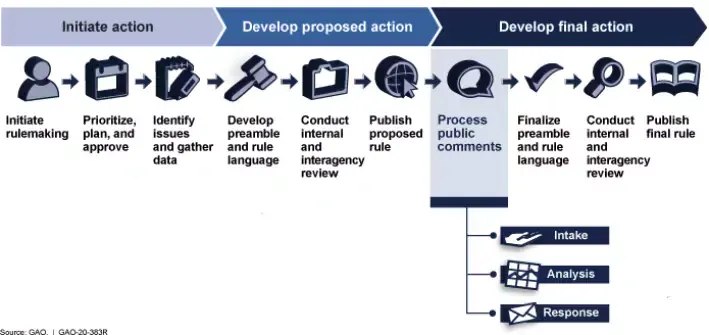

## Table of Contents

## What is a federal agency and what is its role in the government?

A federal agency is a part of the government in the United States that helps to run the country. It is created by the President or Congress to handle specific tasks that are too big or too specialized for other parts of the government to manage alone. There are many federal agencies, and each one focuses on different areas like health, education, or protecting the environment.

The role of a federal agency in the government is to carry out laws and policies that Congress passes. For example, if Congress makes a new law about protecting the environment, a federal agency like the Environmental Protection Agency (EPA) will make sure that the law is followed. Federal agencies also provide services directly to people, like helping them find jobs or get health care. They play a big part in making sure the government works smoothly and that people's needs are met.

## What is rulemaking and why is it important for federal agencies?

Rulemaking is the process that federal agencies use to create rules and regulations. These rules help explain how the laws passed by Congress should be followed. When Congress makes a law, it can be very general. So, federal agencies make more specific rules to make sure everyone understands what they need to do. For example, if Congress passes a law about food safety, the Food and Drug Administration (FDA) might create rules about how food should be stored and labeled.

Rulemaking is important for federal agencies because it helps them do their jobs better. By making clear rules, agencies can make sure that laws are followed in a fair and consistent way. This is important for keeping people safe and making sure businesses know what they need to do. Without rulemaking, it would be hard for agencies to [carry](/wiki/carry-trading) out the laws that Congress passes, and it could lead to confusion and problems.

## How does the rulemaking process begin within a federal agency?

The rulemaking process in a federal agency usually starts when someone in the agency spots a problem or an issue that needs to be addressed. This could be because of a new law passed by Congress, a court decision, or something happening in the world that the agency needs to respond to. The agency then decides to make a new rule or change an old one to solve the problem.

Once the agency decides to start the rulemaking process, they usually write a document called a "Notice of Proposed Rulemaking" (NPRM). This document explains what the new rule or change is about and why the agency thinks it's needed. The agency then publishes this notice in the Federal Register, which is a special publication where all proposed rules are announced. This is the first step in getting feedback from the public and other interested groups before the rule is finalized.

## What are the different stages of the federal rulemaking process?

The federal rulemaking process has several stages. It starts when an agency decides to make a new rule or change an old one. They write a document called a "Notice of Proposed Rulemaking" (NPRM) that explains the rule and why it's needed. The agency then publishes this notice in the Federal Register, which is where all proposed rules are announced. This is the first step to get feedback from the public and other groups.

After the notice is published, there's a period where people can comment on the proposed rule. This can last from 30 to 90 days, or even longer if the rule is very important. People can send in their thoughts by mail, email, or through the agency's website. The agency reads all the comments and thinks about them carefully. They might change the rule based on what people say. Once they've looked at all the feedback, the agency writes a final rule.

The final rule is published in the Federal Register again. It includes a summary of the comments the agency received and how they responded to them. After it's published, there's usually a waiting period before the rule goes into effect. This can be 30 days or more, depending on the rule. Once the waiting period is over, the rule becomes law, and everyone has to follow it.

## What is a proposed rule and how is it developed?

A proposed rule is a draft of a new rule or a change to an old rule that a federal agency wants to make. It's like a first version of the rule that the agency shares with the public to get feedback. The agency writes the proposed rule when they see a problem or need to follow a new law from Congress. They explain what the rule is about and why they think it's needed in a document called a "Notice of Proposed Rulemaking" (NPRM).

To develop a proposed rule, the agency starts by figuring out what the problem is and how a new rule could help. They might do research, talk to experts, or look at data to understand the issue better. Once they have a good idea of what the rule should do, they write the NPRM. This document goes into the Federal Register, which is a special place where all proposed rules are announced. This is the first step in getting feedback from the public and other groups before the rule is finalized.

## How does public participation work in the rulemaking process?

Public participation in the rulemaking process is really important. It starts after a federal agency writes a proposed rule and puts it in the Federal Register. This is like a big announcement that says, "Hey, we're thinking about making this new rule. What do you think?" Then, there's a period of time, usually 30 to 90 days, where anyone can send in their thoughts and comments about the rule. People can write letters, send emails, or use the agency's website to share their opinions.

The agency reads all the comments very carefully. They think about what people say and might change the rule based on the feedback. This helps make sure the rule is fair and works well for everyone. After looking at all the comments, the agency writes the final rule and puts it back in the Federal Register. They also write a summary of the comments they got and explain how they responded to them. This way, everyone can see how the public's input helped shape the final rule.

## What is the role of the notice of proposed rulemaking (NPRM)?

The notice of proposed rulemaking (NPRM) is a very important step in the rulemaking process. It's like a first draft of a new rule or a change to an old rule that a federal agency wants to make. The NPRM explains what the rule is about and why the agency thinks it's needed. When the agency writes the NPRM, they put it in the Federal Register, which is a special place where all proposed rules are announced. This is the first step in getting feedback from the public and other groups before the rule is finalized.

The NPRM is important because it gives everyone a chance to share their thoughts on the proposed rule. After the NPRM is published, there's a period of time, usually 30 to 90 days, where people can send in their comments. This helps the agency make sure the rule is fair and works well for everyone. The agency reads all the comments carefully and might change the rule based on what people say. This way, the final rule is better because it takes into account what the public thinks.

## How are comments on proposed rules evaluated and considered?

When people send in their comments on a proposed rule, the federal agency reads them all very carefully. They want to see what everyone thinks about the rule and if there are any problems with it. The agency looks at each comment to see if it gives good reasons for changing the rule or keeping it the same. They might get comments from regular people, businesses, other government agencies, or groups that know a lot about the topic. The agency thinks about all these different views to make sure the rule is fair and works well for everyone.

After the agency looks at all the comments, they might decide to change the rule. They could make it a little different or a lot different, depending on what people said. The agency writes down why they made these changes in a document called the final rule. They also explain how they responded to the comments they got. This way, everyone can see how the public's input helped make the rule better. Once the final rule is ready, it goes back into the Federal Register, and after a waiting period, it becomes law.

## What steps are involved in finalizing a rule after public comment?

After the public comment period ends, the federal agency looks at all the comments they received. They read each one carefully to see what people think about the proposed rule. The agency thinks about if the comments give good reasons to change the rule or keep it the same. They might get comments from all sorts of people, like regular folks, businesses, other government agencies, or experts in the field. The agency uses all these different views to decide if they should make changes to the rule.

Once the agency has gone through all the comments, they might decide to change the rule. They could make small changes or big ones, depending on what people said. The agency writes up the final rule, which includes a summary of the comments they got and how they responded to them. This way, everyone can see how the public's input helped shape the rule. The final rule is then published in the Federal Register. After a waiting period, which can be 30 days or more, the rule becomes law and everyone has to follow it.

## How does an interim final rule differ from a final rule?

An interim final rule is a special kind of rule that a federal agency can use when they need to act quickly. Unlike a regular final rule, an interim final rule goes into effect right away, even before the public has a chance to comment on it. The agency does this when they think waiting for comments could cause problems or harm people. But, even though it's called "final," the agency still wants to hear what people think about it. So, after the interim final rule is in place, there's a period where people can send in their comments.

After the comment period for an interim final rule ends, the agency looks at all the feedback they got. They might decide to change the rule based on what people said. If they do make changes, they publish a new final rule that takes the comments into account. This new final rule is just like a regular final rule and goes into effect after a waiting period. So, an interim final rule is different because it starts working right away, but it still gives people a chance to comment and help shape the final version of the rule.

## What legal challenges can arise during or after the rulemaking process?

Legal challenges can happen during or after the rulemaking process. People or groups might not like a new rule and think it's not fair or that the agency didn't follow the right steps to make it. They can go to court and ask a judge to stop the rule from being used or to change it. This is called a lawsuit. The people who start the lawsuit have to show that the rule breaks the law or that the agency did something wrong when they made the rule.

When a court looks at a rulemaking challenge, they check if the agency followed all the rules for making the rule. This includes things like giving people enough time to comment and thinking about those comments carefully. If the court finds that the agency didn't do these things right, they might send the rule back to the agency to fix it or even stop the rule from being used at all. This can slow down the rulemaking process a lot and sometimes even stop a new rule from happening.

## How do federal agencies ensure compliance with and enforcement of final rules?

Federal agencies make sure people follow the final rules by watching and checking if everyone is doing what they're supposed to do. They might do inspections, like going to factories or stores to see if they're following the rules. They can also ask for reports or information from businesses and other groups to make sure they're doing things right. If someone isn't following the rules, the agency can give them a warning, make them pay a fine, or even take them to court. This helps keep everyone safe and makes sure the rules are fair for everyone.

Sometimes, federal agencies work with other parts of the government, like state or local agencies, to help enforce the rules. For example, the Environmental Protection Agency might work with state environmental departments to make sure companies are not polluting. They can share information and help each other make sure the rules are followed. By working together, federal agencies can make sure the rules are enforced all over the country and that everyone is playing by the same rules.

## References & Further Reading

[1]: ["The Administrative Procedure Act: An Overview"](https://www.prrac.org/pdf/APA.summary.ProfMetzger.pdf) by the Congressional Research Service

[2]: Aldridge, I. (2013). ["High-Frequency Trading: A Practical Guide to Algorithmic Strategies and Trading Systems."](https://www.wiley.com/en-us/High+Frequency+Trading%3A+A+Practical+Guide+to+Algorithmic+Strategies+and+Trading+Systems%2C+2nd+Edition-p-9781118343500) John Wiley & Sons.

[3]: Perez, Y., & Scholten, B. (2020). ["Regulating Financial Innovation: The Blockchain Case."](https://www.sciencedirect.com/science/article/pii/S2773067024000049) Journal of Financial Regulation.

[4]: Lewis, M. (2015). ["Flash Boys: A Wall Street Revolt."](https://en.wikipedia.org/wiki/Flash_Boys) W. W. Norton & Company.

[5]: U.S. Securities and Exchange Commission. ["Regulation of Exchanges and Alternative Trading Systems."](https://www.sec.gov/rules-regulations/1998/12/regulation-exchanges-alternative-trading-systems)

[6]: Office of Information and Regulatory Affairs. ["OIRA Reviews and the Rulemaking Process."](https://www.whitehouse.gov/omb/information-regulatory-affairs/)

[7]: U.S. Federal Deposit Insurance Corporation (FDIC). ["FDIC Law, Regulations, Related Acts."](https://www.fdic.gov/laws-and-regulations/fdic-law-regulations-related-acts)