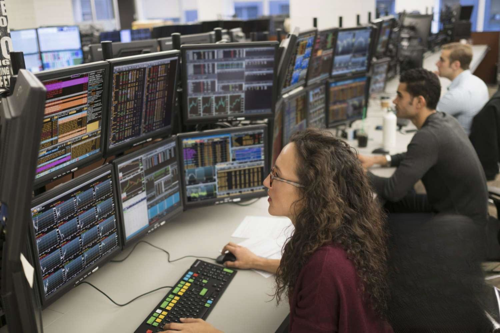

## Table of Contents

## What are the basic principles that professional traders follow?

Professional traders follow some basic principles to be successful. One key principle is having a clear trading plan. This means they set specific goals, decide what they will trade, and figure out how much risk they are willing to take. They stick to their plan and don't let emotions like fear or greed make them do something different. Another important principle is managing risk. Professional traders know that they can't win every trade, so they use tools like stop-loss orders to limit how much they can lose on a single trade. They also make sure not to risk too much of their money on one trade.

Another principle that professional traders follow is continuous learning. They always try to get better by studying the markets, learning from their past trades, and staying updated with new trading strategies and tools. They also keep a trading journal to record what they did right and what they did wrong, which helps them improve over time. Lastly, discipline is crucial. Professional traders stick to their rules and strategies even when the market gets tough. They understand that discipline helps them stay on track and achieve long-term success in trading.

## How do professional traders manage their risk?

Professional traders manage their risk by using stop-loss orders. A stop-loss order is like a safety net that automatically sells a trade if it starts losing too much money. This helps traders limit their losses on any single trade. They also decide how much of their total money they are willing to risk on one trade. Usually, they don't risk more than a small percentage, like 1% or 2%, of their total money on one trade. This way, even if they lose on a few trades, they still have plenty of money left to keep trading.

Another way professional traders manage risk is by diversifying their trades. Instead of putting all their money into one type of trade or one market, they spread it out across different types of trades and markets. This means if one trade goes bad, it won't hurt their whole trading account. They also use something called position sizing, which means they adjust how much money they put into each trade based on how risky it is. By doing all these things, professional traders can keep their risk under control and protect their money while still trying to make profits.

## What role does discipline play in professional trading?

Discipline is very important for professional traders. It helps them stick to their trading plan and rules, even when things get tough. Without discipline, traders might make quick decisions based on feelings like fear or greed. These decisions can lead to big losses. But with discipline, traders follow their plan and only make trades that fit their strategy. This helps them stay on track and reach their long-term goals.

Discipline also helps traders manage their risk better. They use tools like stop-loss orders and only risk a small part of their money on each trade. If traders aren't disciplined, they might ignore these rules and take bigger risks. This can lead to big losses. But disciplined traders stick to their risk management plan, which helps them protect their money and keep trading even if they have some losses. In the end, discipline is key to being a successful trader over time.

## How do professional traders develop and test their trading strategies?

Professional traders develop their trading strategies by first setting clear goals and deciding what they want to achieve. They then choose which markets they will trade in, like stocks, [forex](/wiki/forex-system), or commodities. They also decide on the time frame for their trades, whether it's short-term or long-term. After setting these basics, they start to create rules for entering and exiting trades. These rules might be based on technical analysis, like using charts and indicators, or [fundamental analysis](/wiki/fundamental-analysis), like studying company news and economic reports. They also think about how much risk they are willing to take and set up rules for managing that risk.

Once they have a strategy, professional traders test it to see if it works. They often use a method called [backtesting](/wiki/backtesting), where they apply their strategy to historical market data to see how it would have performed in the past. This helps them understand if their strategy can make money and how risky it is. They also use a demo account to test their strategy in real-time market conditions without risking real money. During this testing phase, they keep track of their results and make changes to their strategy if needed. By carefully developing and testing their strategies, professional traders can increase their chances of success when they start trading with real money.

## What types of analysis do professional traders use to make decisions?

Professional traders use two main types of analysis to make their decisions: technical analysis and fundamental analysis. Technical analysis involves looking at charts and using different tools and indicators to predict what the market will do next. Traders who use technical analysis pay attention to patterns in price movements and trading volumes. They might use tools like moving averages, relative strength index (RSI), and support and resistance levels to help them decide when to buy or sell. By studying these patterns and indicators, they try to find the best times to enter and [exit](/wiki/exit-strategy) trades.

Fundamental analysis, on the other hand, involves looking at the basic factors that can affect the price of a traded asset. For example, if a trader is looking at stocks, they might study a company's financial statements, earnings reports, and news about the company or the industry. They might also look at economic indicators like interest rates, inflation, and employment data to understand how these factors could impact the market. By understanding these fundamental factors, traders can make more informed decisions about whether an asset is a good buy or if it's time to sell. Both types of analysis help traders make better decisions, and many professional traders use a combination of both to guide their trading strategies.

## How do professional traders handle emotional and psychological challenges?

Professional traders face a lot of emotional and psychological challenges. One big challenge is dealing with fear and greed. Fear can make traders too scared to take trades that could be profitable, or it can make them close trades too early. Greed can push traders to take too much risk or hold onto losing trades hoping they will turn around. To handle these emotions, professional traders stick to their trading plan. They set clear rules for when to buy and sell, and they follow those rules no matter how they feel. This helps them make decisions based on their strategy instead of their emotions.

Another challenge is dealing with losses. Losing money can be hard, and it can make traders feel frustrated or discouraged. Professional traders know that losses are a normal part of trading. They don't let one loss make them give up or change their strategy. Instead, they learn from their losses and keep moving forward. They also use techniques like meditation or taking breaks to stay calm and focused. By managing their emotions and staying disciplined, professional traders can keep their minds clear and make better trading decisions.

## What tools and technologies are essential for professional traders?

Professional traders use many tools and technologies to help them make better trades. One important tool is a trading platform. This is like a special computer program that lets traders buy and sell things like stocks or forex. Trading platforms show real-time prices and let traders quickly make trades. They also have charts and tools for technical analysis, so traders can see patterns and make smart decisions. Another key tool is a risk management system. This helps traders set stop-loss orders and keep track of how much risk they are taking. It's important because it helps traders protect their money and not lose too much on one trade.

Another essential technology for professional traders is a data feed. This gives traders up-to-date information about the markets, like prices and news. Having fast and accurate data helps traders make quick decisions. Many traders also use software for backtesting their strategies. This lets them test their trading ideas on past market data to see if they would have worked. It's a good way to see if a strategy is good before using real money. Lastly, many traders use special software to keep a trading journal. This helps them write down what they did right and wrong, so they can learn and get better over time.

## How do professional traders adapt to different market conditions?

Professional traders adapt to different market conditions by always being ready to change their strategies. They know that markets can be calm one day and wild the next. So, they keep an eye on the market and use different tools to understand what's going on. If the market is moving a lot, they might use strategies that work well in fast markets. If the market is quiet, they might use strategies that work better when things are slow. They also look at economic news and events that can change how the market acts, and they adjust their trades to fit these changes.

Another way professional traders adapt is by not sticking to just one type of trade. They might trade stocks, forex, or commodities, and they switch between these depending on which market is doing well. They also use different time frames for their trades. Sometimes they might make quick trades that last a few minutes, and other times they might hold onto trades for weeks or months. By being flexible and ready to change their approach, professional traders can keep making money no matter what the market is doing.

## What are the common mistakes professional traders avoid?

Professional traders avoid some common mistakes that can hurt their trading. One big mistake they stay away from is letting emotions like fear or greed control their decisions. Instead of making quick choices based on how they feel, they stick to their trading plan. They know that following their plan, even when the market is tough, helps them make better trades and avoid big losses. Another mistake they avoid is not managing their risk properly. They always use tools like stop-loss orders and only risk a small part of their money on each trade. This way, they can keep trading even if they have some losses.

Another mistake professional traders avoid is not having a clear trading strategy. They know that without a good plan, they might make random trades that don't work out. So, they spend time developing and testing their strategies before using real money. They also avoid overtrading, which means making too many trades just because they want to be in the market all the time. Overtrading can lead to big losses and stress, so professional traders are patient and only make trades that fit their strategy. By avoiding these common mistakes, professional traders can be more successful in the long run.

## How do professional traders continue to learn and improve their skills?

Professional traders never stop learning. They know that the markets are always changing, so they keep up by reading [books](/wiki/algo-trading-books), taking courses, and going to workshops about trading. They also talk to other traders and join trading groups to share ideas and learn from each other. By staying curious and always wanting to learn more, they can find new ways to trade and improve their strategies.

Another way professional traders keep getting better is by looking back at their past trades. They keep a trading journal where they write down what they did right and what they did wrong. This helps them see patterns in their trading and figure out how to do better next time. They also use software to test their strategies on old market data, which helps them see if their ideas would have worked in the past. By learning from their mistakes and trying new things, professional traders can keep improving their skills and stay successful in the long run.

## What is the importance of a trading plan for professional traders?

A trading plan is super important for professional traders. It's like a roadmap that helps them know where they're going and how to get there. The plan includes things like what they want to achieve, what they will trade, and how much risk they're willing to take. By having a clear plan, traders can make smart decisions instead of guessing or following their feelings. This helps them stay on track and avoid big mistakes that can lose them a lot of money.

Sticking to a trading plan also helps traders manage their emotions. When the market gets wild, it's easy to feel scared or greedy, but a trading plan keeps them calm and focused. They know what to do because they've already thought it through. This discipline helps them keep trading even when things are tough. In the end, a good trading plan is key to being a successful trader over time.

## How do professional traders manage their capital and reinvest profits?

Professional traders are very careful about how they manage their money. They start by deciding how much of their total money they can risk on each trade. Usually, they only risk a small part, like 1% or 2%, so if a trade goes bad, they don't lose too much. They also keep some money aside as a safety net, so they can keep trading even if they have a few losses. By being smart about how they use their money, professional traders can stay in the game for a long time.

When it comes to reinvesting their profits, professional traders have a plan. They might take some of their profits and put them back into their trading account to make more trades. But they also know it's important to take some profits out and save them or use them for other things. This way, they can grow their trading account without risking all their money. By balancing how they reinvest and save their profits, professional traders can keep their money growing and stay safe in the long run.

## References & Further Reading

[1]: Bergstra, J., Bardenet, R., Bengio, Y., & Kégl, B. (2011). ["Algorithms for Hyper-Parameter Optimization."](https://dl.acm.org/doi/10.5555/2986459.2986743) Advances in Neural Information Processing Systems 24.

[2]: ["Advances in Financial Machine Learning"](https://www.amazon.com/Advances-Financial-Machine-Learning-Marcos/dp/1119482089) by Marcos Lopez de Prado

[3]: ["Evidence-Based Technical Analysis: Applying the Scientific Method and Statistical Inference to Trading Signals"](https://www.amazon.com/Evidence-Based-Technical-Analysis-Scientific-Statistical/dp/0470008741) by David Aronson

[4]: ["Machine Learning for Algorithmic Trading"](https://github.com/PacktPublishing/Machine-Learning-for-Algorithmic-Trading-Second-Edition) by Stefan Jansen

[5]: ["Quantitative Trading: How to Build Your Own Algorithmic Trading Business"](https://books.google.com/books/about/Quantitative_Trading.html?id=j70yEAAAQBAJ) by Ernest P. Chan