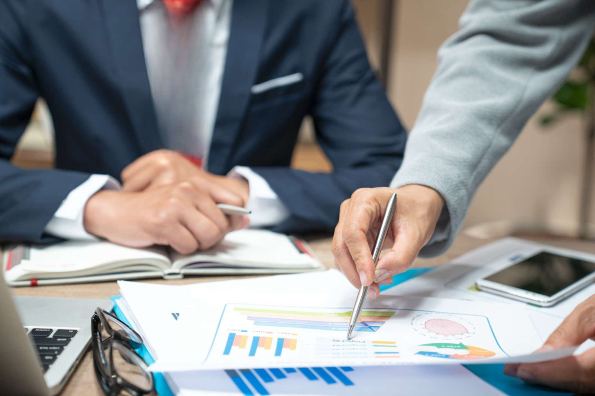

## Table of Contents

## What is trading and why is it important?

Trading is when people buy and sell things like stocks, currencies, or goods to make money. It's like a big marketplace where people trade things they think will go up in value for things they think will go down in value. For example, if you think a company's stock will increase in price, you might buy it and then sell it later for a profit.

Trading is important because it helps the economy grow. When people trade, they help set prices for goods and services, which tells businesses what to make and how much to make. This can lead to more jobs and better products for everyone. Trading also lets people from different countries exchange things they need, which can make life better for people all over the world.

## What are the basic principles of trading for beginners?

Trading can seem hard at first, but it's easier if you know the basic rules. One important rule is to always do your homework. Before you buy or sell anything, learn about it. Look at the price history, read news about it, and understand why its value might go up or down. This helps you make smarter choices and not just guess.

Another key rule is to manage your money wisely. Don't spend all your money on one trade. Instead, spread it out over different things. This way, if one trade doesn't go well, you won't lose everything. Also, decide how much you're okay with losing before you start trading. This helps you stay calm and not make quick, bad decisions if things don't go your way.

Lastly, always have a plan. Decide when you'll buy and sell before you start. Stick to your plan even if the market changes a lot. This helps you stay focused and not get too excited or scared. Trading is about being patient and sticking to what you've learned, not about making quick money.

## How can one develop a trading plan?

To develop a trading plan, start by setting clear goals. Decide what you want to achieve with your trading, like making a certain amount of money or learning more about the market. Next, choose what you will trade, like stocks, currencies, or commodities. Research these options thoroughly to understand their risks and potential rewards. Then, decide how much money you can afford to risk. This is called your risk capital, and you should only trade with money you can lose without hurting your finances.

Once you have your goals and what to trade figured out, create specific rules for entering and exiting trades. Decide at what price you will buy and at what price you will sell. This can be based on technical analysis, like looking at charts, or fundamental analysis, like studying a company's financial health. Also, set a stop-loss order to automatically sell if the price drops too much, which helps limit your losses. Make sure to write down your plan and stick to it, even when the market gets exciting or scary. This discipline is key to successful trading.

Lastly, regularly review and adjust your trading plan. The market changes, so your plan should too. Keep a trading journal to track your trades, what worked, and what didn't. This helps you learn from your mistakes and improve over time. Remember, trading is not about making quick money but about being patient and sticking to a well-thought-out plan.

## What are the key risk management strategies in trading?

One important risk management strategy in trading is setting stop-loss orders. A stop-loss order is like a safety net that automatically sells your trade if the price drops to a certain level. This helps you limit how much money you can lose on a single trade. It's a good idea to decide where to set your stop-loss before you start trading, based on how much you're willing to risk. This way, you can protect your money and sleep better at night knowing you won't lose more than you can handle.

Another key strategy is diversification. This means spreading your money across different types of trades, like stocks, currencies, or commodities. If one trade doesn't go well, you won't lose all your money because you have other trades that might do better. It's like not putting all your eggs in one basket. By diversifying, you can reduce the risk of losing everything and increase your chances of making money over time.

Lastly, it's crucial to manage your position size. This means deciding how much money to put into each trade. A good rule is to not risk more than a small percentage of your total trading money on any single trade, like 1-2%. This helps you stay in the game even if you have a few losing trades. By keeping your position sizes small, you give yourself room to learn and improve without risking too much money at once.

## How does one analyze market trends effectively?

To analyze market trends effectively, you need to look at both technical and fundamental analysis. Technical analysis involves studying charts and patterns to predict where the market might go next. You can use tools like moving averages, which smooth out price data to show trends over time, or indicators like the Relative Strength Index (RSI) to see if a market is overbought or oversold. By spotting patterns like head and shoulders or double tops and bottoms, you can make educated guesses about future price movements. It's important to practice and get comfortable with these tools because they help you understand what the market is doing right now and where it might be headed.

Fundamental analysis, on the other hand, looks at the underlying factors that affect the market, like a company's financial health or economic reports. For stocks, you might look at earnings reports, revenue growth, and other financial statements to decide if a company is a good investment. For currencies, you might consider interest rates, employment data, and other economic indicators. By understanding these fundamentals, you can make better decisions about what to buy or sell. Combining both technical and fundamental analysis gives you a fuller picture of the market, helping you make more informed trading choices.

## What are the common psychological challenges faced by traders and how to overcome them?

One of the biggest psychological challenges traders face is fear. Fear can make traders afraid to lose money, so they might not take trades they should or they might sell too early. This fear can come from past losses or just the worry of what might happen. To overcome fear, traders need to have a good trading plan and stick to it. They should also use stop-loss orders to limit their losses. By focusing on the process and not just the outcome, traders can manage their fear better and make more rational decisions.

Another common challenge is greed. Greed can make traders hold onto a winning trade for too long, hoping to make even more money, which can lead to big losses if the market turns against them. It can also make them take too many risks. To fight greed, traders should set clear goals for each trade and stick to them. They should also practice discipline and not let the excitement of making money cloud their judgment. By setting realistic expectations and following their trading plan, traders can keep greed in check and make better trading decisions.

Overconfidence is another psychological hurdle. When traders have a few successful trades, they might start to think they can't lose, leading them to take bigger risks or ignore their trading plan. This overconfidence can result in big losses. To overcome overconfidence, traders should always review their trades, learn from their mistakes, and remember that the market can be unpredictable. Keeping a trading journal and regularly assessing their performance can help traders stay grounded and make more balanced decisions.

## What advanced technical analysis tools should an intermediate trader use?

Intermediate traders can benefit from using advanced technical analysis tools like Fibonacci retracement levels. These help traders find potential support and resistance levels in the market. You draw lines between the high and low points of a price chart, and the tool shows you where the price might stop or turn around. This can be really helpful for deciding when to buy or sell. Another useful tool is the Moving Average Convergence Divergence (MACD), which helps traders see the momentum of a market. It uses two moving averages to show when a trend might be starting or ending. When the MACD line crosses above the signal line, it can be a good time to buy, and when it crosses below, it might be time to sell.

Another advanced tool is Bollinger Bands, which help traders see how much a price is moving around its average. The bands get wider when the market is more volatile and narrower when it's calmer. Traders can use this to spot when a price might be ready to break out or when it's likely to stay in a range. Additionally, the Relative Strength Index (RSI) can be useful for intermediate traders. It measures how fast and how much a price is changing to see if a market is overbought or oversold. If the RSI is above 70, the market might be overbought, and if it's below 30, it might be oversold. These tools, when used together, can give traders a clearer picture of the market and help them make better trading decisions.

## How can one diversify their trading portfolio effectively?

Diversifying your trading portfolio means spreading your money across different types of investments. This can help lower your risk because if one investment does badly, others might do well and balance things out. You can diversify by trading in different markets, like stocks, currencies, and commodities. For example, instead of putting all your money into tech stocks, you could also invest in energy companies, gold, and even foreign currencies. This way, if the stock market goes down, your other investments might still be doing okay.

Another way to diversify is by choosing investments that don't move in the same direction. For instance, stocks and bonds often react differently to economic changes. When the economy is doing well, stocks might go up, but when it's not, bonds might be a safer bet. You can also look at different sectors within the same market. Instead of just buying tech stocks, you could also invest in healthcare, consumer goods, and utilities. By spreading your money around like this, you can protect yourself from big losses and have a better chance of making money over time.

## What are the impacts of global economic events on trading?

Global economic events can have a big impact on trading. When something big happens, like a country changing its interest rates or a major company reporting earnings, it can make the prices of stocks, currencies, and other things go up or down. For example, if the U.S. raises its interest rates, the value of the U.S. dollar might go up because more people want to invest in it. This can make trading in currencies and stocks that are linked to the U.S. dollar change a lot. Traders need to keep an eye on these events and understand how they might affect the markets they are trading in.

Another way global economic events affect trading is through big news like trade wars or economic crises. If two countries start a trade war, it can make the prices of goods and services go up or down, which can change how traders think about their investments. For instance, if there's a trade war between the U.S. and China, it might make people worry about companies that do a lot of business with China, so the stock prices of those companies could drop. Traders need to stay informed and be ready to change their trading plans when these big events happen, to protect their money and find new opportunities.

## How can algorithmic trading enhance trading strategies for experts?

Algorithmic trading can make trading better for experts by letting them use computer programs to trade faster and more accurately. These programs can look at a lot of data really quickly and make trades based on rules that the trader sets up. This means experts can take advantage of small changes in the market that they might miss if they were trading by hand. It also helps them stick to their trading plan without letting emotions get in the way, which can lead to more consistent results.

Another way algorithmic trading helps is by letting experts test their trading ideas before they use real money. They can run simulations to see how their strategies would have worked in the past. This can help them find and fix any problems with their plan. By using algorithms, experts can also trade in many different markets at the same time, which can help them spread out their risk and maybe make more money. Overall, algorithmic trading can make trading smarter and more efficient for those who know how to use it well.

## What are the latest regulatory considerations that traders need to be aware of?

Traders need to keep up with new rules that governments and financial watchdogs are putting in place. One big change is about how much traders can use borrowed money to trade, called leverage. Some places are making the rules stricter to stop people from taking too much risk and losing a lot of money. Traders also need to know about new rules on reporting their trades. Governments want to see more details about what traders are doing to make sure everything is fair and to stop illegal activities like money laundering.

Another important thing is data privacy. With more trading happening online, rules about how trading platforms can use and share people's information are getting stricter. Traders need to be careful about where they trade and make sure their personal information is safe. Also, there are new rules about how trading algorithms work. Regulators want to make sure these computer programs are not causing big problems in the market, so they might need to be checked and approved before they can be used. Keeping up with these rules can help traders stay out of trouble and trade more safely.

## How can one continuously improve and adapt their trading strategies to remain successful?

To keep improving and adapting your trading strategies, you need to always be learning. The market changes all the time, so what worked before might not work now. One way to keep learning is by reading books, watching videos, and taking courses about trading. Another way is by talking to other traders and sharing ideas. It's also really important to keep a trading journal where you write down what you did, why you did it, and what happened. By looking back at your journal, you can see what worked and what didn't, and then change your strategies to do better next time.

Another key part of staying successful is being flexible. You need to be ready to change your plan when things in the market change. This means keeping an eye on the news and economic reports that can affect the markets you trade in. It also means trying out new trading tools and techniques to see if they can help you make better decisions. Sometimes, you might need to take a break from trading to clear your head and come back with fresh ideas. By always learning, being flexible, and keeping a close eye on the market, you can keep improving your trading strategies and stay successful over time.

## References & Further Reading

[1]: Bergstra, J., Bardenet, R., Bengio, Y., & Kégl, B. (2011). ["Algorithms for Hyper-Parameter Optimization."](https://papers.nips.cc/paper/4443-algorithms-for-hyper-parameter-optimization) Advances in Neural Information Processing Systems 24.

[2]: ["Advances in Financial Machine Learning"](https://www.amazon.com/Advances-Financial-Machine-Learning-Marcos/dp/1119482089) by Marcos Lopez de Prado

[3]: ["Evidence-Based Technical Analysis: Applying the Scientific Method and Statistical Inference to Trading Signals"](https://www.amazon.com/Evidence-Based-Technical-Analysis-Scientific-Statistical/dp/0470008741) by David Aronson

[4]: ["Machine Learning for Algorithmic Trading"](https://github.com/stefan-jansen/machine-learning-for-trading) by Stefan Jansen

[5]: ["Quantitative Trading: How to Build Your Own Algorithmic Trading Business"](https://www.amazon.com/Quantitative-Trading-Build-Algorithmic-Business/dp/1119800064) by Ernest P. Chan