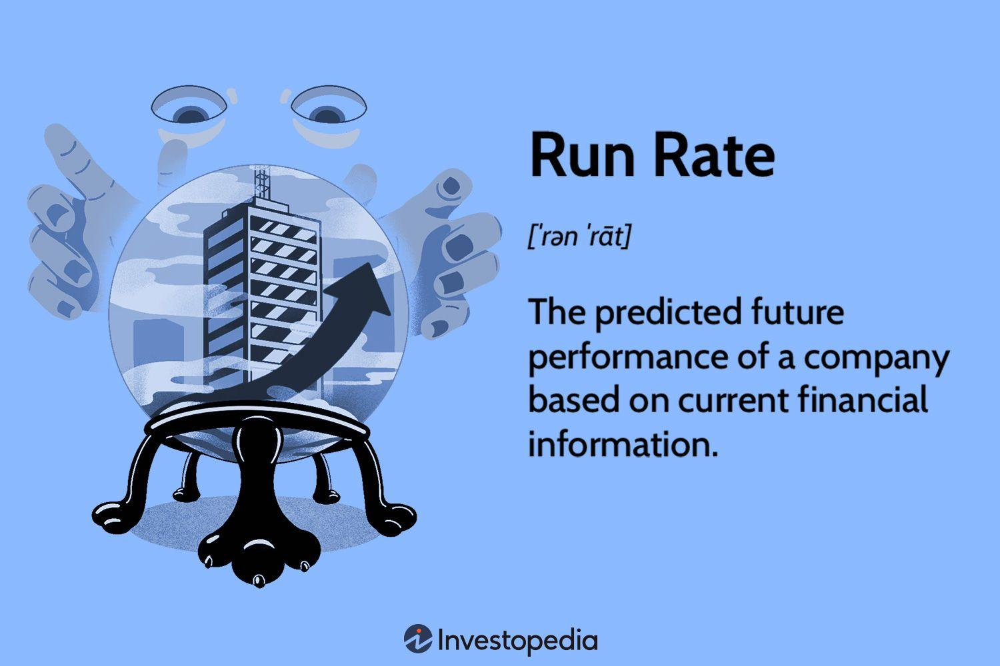

## Table of Contents

## What is the definition of run rate in business?

Run rate in business is a way to estimate a company's future financial performance based on its current performance. It is often used when a company has been operating for less than a year or when it wants to predict its yearly earnings from a shorter period, like a quarter. For example, if a company made $1 million in the first three months of the year, its run rate would suggest it could make $4 million for the whole year.

However, run rate is just an estimate and can be affected by many things. Seasonal changes, new products, or changes in the market can all impact a company's earnings. Because of this, run rate should be used carefully and not as the only way to predict future performance. It's a helpful tool, but it's important to consider other factors too.

## How is run rate calculated?

Run rate is calculated by taking a company's performance over a shorter period and using it to estimate what the performance would be over a longer period, usually a year. For example, if a company made $500,000 in the first three months of the year, you would multiply that amount by four to get the run rate for the whole year. So, the run rate would be $2 million.

This method is simple but it assumes that the company will keep making the same amount of money every month. But things can change, like the seasons or the economy, so the run rate might not be accurate. It's a good starting point for guessing future earnings, but it's important to think about other things that might affect the company's performance too.

## Why is run rate important for businesses?

Run rate is important for businesses because it helps them guess how much money they might make in the future. If a business knows its run rate, it can plan better. For example, it can decide how much to spend on new projects or how much money it needs to borrow. This can help the business grow and make smart choices about where to put its money.

But, run rate is just a guess. It's based on what the business has done in the past, but things can change. The business might make more or less money in the future because of things like the weather, new competitors, or changes in what customers want. So, while run rate is a helpful tool, businesses should also look at other information to make the best plans.

## Can you provide an example of how run rate is used in financial forecasting?

Imagine a small bakery that opened six months ago. In the first six months, it made $60,000. To figure out the run rate, the bakery owner would double that amount because six months is half a year. So, the run rate for the bakery would be $120,000. This means the owner can guess that the bakery might make $120,000 in a full year if things stay the same.

But, the bakery owner knows that things might not stay the same. For example, more people might come to the bakery in December because of the holidays, or fewer people might come in the summer when they go on vacation. So, the owner will use the run rate as a starting point but will also think about these other things to make a better guess about how much money the bakery will make in the future.

## What are the common pitfalls when using run rate for projections?

One common problem with using run rate for projections is that it assumes things will stay the same. But, in real life, things change all the time. For example, a business might make more money in some months because of holidays or less money because of bad weather. If a company only uses run rate, it might guess wrong about how much money it will make in the future.

Another issue is that run rate doesn't think about new things that might happen. For instance, if a business starts selling a new product, the run rate won't show how that might change how much money the business makes. Also, if there are big changes in the economy or if new competitors come into the market, the run rate won't help the business guess what will happen. So, it's important for businesses to look at other information and not just rely on run rate to make their plans.

## How does run rate differ from annualized revenue?

Run rate and annualized revenue are both ways to guess how much money a business might make in a year, but they are a bit different. Run rate is when you take how much money a business made in a short time, like a few months, and guess what it might make for the whole year. For example, if a business made $100,000 in three months, the run rate would say it could make $400,000 in a year.

Annualized revenue, on the other hand, is more about looking at a full year's worth of data. It's when you take the money made in a full year and use that to guess what might happen in the next year. If a business made $500,000 last year, the annualized revenue would say it might make $500,000 again this year, unless something changes. Both methods help businesses plan, but run rate is quicker to use because it doesn't need a full year of data.

## What are the limitations of using run rate as a performance metric?

One big problem with using run rate to measure how well a business is doing is that it thinks everything will stay the same. But things change all the time. For example, a business might make more money in December because of the holidays, or less money in the summer when people go on vacation. If a company only looks at run rate, it might guess wrong about how much money it will make in the future.

Another issue is that run rate doesn't take into account new things that might happen. If a business starts selling a new product or if there are big changes in the economy, the run rate won't show how those things might change how much money the business makes. It's also not good at showing if a business is growing or shrinking over time because it only looks at a short period and guesses from there. So, while run rate can be a helpful tool, it's important for businesses to look at other information too to get a better picture of their performance.

## How can seasonal fluctuations affect the accuracy of run rate calculations?

Seasonal fluctuations can mess up run rate calculations because they make money come in unevenly throughout the year. For example, a business might make a lot more money in December because of the holidays, but less in the summer when people are on vacation. If you use the money made in December to guess what the business will make all year, you'll think it will make a lot more money than it really will. This is because December's high earnings are not normal for the whole year.

To fix this problem, businesses need to be careful when using run rate. They should look at more than just a few months to make their guesses. If they can, they should use a full year's worth of data to see how the seasons change their earnings. That way, they can make a better guess about how much money they will make in the future, without the run rate being thrown off by seasonal ups and downs.

## What strategies can businesses employ to mitigate risks associated with run rate?

Businesses can use more than just run rate to guess how much money they will make. They can look at the whole year's numbers to see how seasons change their earnings. This helps them make a better guess because they can see the ups and downs throughout the year. They can also keep an eye on what's happening in the market and with their competitors. If they see big changes, they can change their plans to match.

Another way to lower the risks is to use other ways to guess future earnings. For example, they can talk to customers to see what they might buy in the future or look at past years to see how things have changed over time. By using different ways to make guesses, businesses can be more sure about their plans. This helps them make smarter choices and be ready for things that might change in the future.

## How does run rate impact investment decisions and valuations?

Run rate can affect how investors decide to put money into a business and how much they think it's worth. When investors look at a business, they want to know how much money it might make in the future. Run rate gives them a quick way to guess this by taking the money made in a short time and saying what it might be for a whole year. If the run rate looks good, investors might think the business is doing well and decide to invest more money in it. They might also think the business is worth more money because it looks like it will make a lot in the future.

But, run rate is just a guess and can be wrong. If investors only use run rate to make their choices, they might not see the whole picture. Things like seasonal changes or new products can make the run rate not accurate. So, smart investors will look at other things too, like how the business has done in the past and what might happen in the market. This helps them make better choices about where to put their money and how much a business is really worth.

## In what scenarios might run rate be misleading or inappropriate to use?

Run rate can be misleading if a business's earnings change a lot throughout the year. For example, if a business makes most of its money during the holiday season in December, using the run rate from just those months to guess the whole year's earnings would be wrong. It would make it look like the business makes a lot more money all year than it really does. This can happen in businesses like toy stores or holiday decoration shops, where sales go up and down a lot with the seasons.

Also, run rate might not be good to use when a business is new or changing a lot. If a company just started and only has a few months of data, using run rate to guess the whole year's earnings could be off because the business might grow or change in ways that the early months don't show. The same goes for businesses that are adding new products or entering new markets. The run rate won't take these changes into account, so it might not give a good picture of what will happen in the future.

## How can advanced analytics improve the reliability of run rate projections?

Advanced analytics can make run rate projections more reliable by looking at more than just the numbers from a few months. It can use data from the whole year to see how seasons change a business's earnings. This helps to make a better guess about the future because it takes into account the ups and downs that happen throughout the year. Advanced analytics can also look at other things like what customers are doing, what competitors are doing, and what's happening in the economy. By putting all this information together, businesses can make smarter guesses about how much money they will make.

Another way advanced analytics helps is by using special math and computer models to predict what might happen. These models can look at past data to find patterns and use those patterns to guess what will happen next. This is better than just using run rate because it can see if a business is growing or shrinking over time. It can also change the guess if something new happens, like a new product coming out or a big change in the market. By using these advanced tools, businesses can make more accurate plans and be ready for what might happen in the future.

## What is the understanding of Run Rate in Financial Forecasting?

Run rate is an essential concept in financial forecasting, serving as a tool for projecting future performance by extending current metrics over a specified period. In essence, it allows businesses to estimate their future revenues, expenses, and profits based on their current financial data. This method is particularly beneficial for companies that are newly established or for new departments within established businesses, as it provides a baseline forecast in scenarios where historical data is minimal or non-existent. By relying on the existing financial data, companies can create a predicted run rate to gauge future outcomes, thereby aiding in strategic planning and operational scaling.

For instance, a company that has generated $500,000 in revenue during its first quarter can use this figure to estimate their annual performance through a simple extrapolation. This estimation would involve multiplying the quarterly revenue by four, suggesting a potential annual revenue of $2,000,000. However, the run rate should be approached with caution, as it assumes that the company's current growth and operational conditions will remain constant throughout the extrapolated period. 

Run rate also finds relevance in equity finance, particularly concerning stock option grants. Companies often use run rate to quantify the average annual dilution of their stock resulting from the issuance of stock options, which can be expressed mathematically as:

$$
\text{Run Rate of Dilution} = \frac{\text{Number of stock options granted in a period}}{\text{Total number of outstanding shares}}
$$

This calculation helps investors and company management understand the impact of stock options on shareholders' equity over time.

Utilizing run rate as a predictive tool provides a straightforward and quick way to generate forward-looking financial insights, especially when more complex forecasting models are either impractical or unnecessary. However, these projections are inherently limited by their reliance on the constancy of current conditions and should therefore be reviewed regularly and adjusted as new data becomes available.

## What is the significance of run rate for business measurement?

For businesses, utilizing run rates is an essential method for estimating future revenue and profit potentials, using the most recent quarter's data as a foundation. This approach allows companies to make informed predictions about their financial trajectory, promoting better strategic planning and operational scaling. The essence of run rate lies in its ability to expose the sustainability of a business's current growth path, offering insights into whether the [momentum](/wiki/momentum) observed in a particular quarter can be maintained over time.

To illustrate, consider a company with quarterly revenue of $500,000. By annualizing this figure, the company can estimate an annual revenue run rate of $2,000,000, calculated as:

$$
\text{Annual Revenue Run Rate} = \text{Quarterly Revenue} \times 4 = \$500,000 \times 4 = \$2,000,000
$$

This extrapolation is invaluable for stakeholders to visualize the company's ongoing financial performance and make strategic decisions accordingly.

Additionally, run rate calculations can highlight potential funding gaps. For example, if expenses are projected to increase due to expansion plans or market changes, the run rate can signal the need for additional financing to meet these future demands. By examining the relationship between projected revenues and anticipated costs, businesses can proactively address these gaps, ensuring they have the necessary resources to sustain growth and operational needs.

Run rates also play a significant role in assessing scalability. Companies poised for expansion need to ensure that their growth is supported by corresponding increases in revenue. The run rate aids in this analysis by providing a clear picture of whether current operational models and revenue streams can support scale-up efforts without jeopardizing financial stability.

In conclusion, the use of run rates in business measurement promotes a forward-thinking approach, offering clarity on financial capabilities and challenges. By leveraging recent performance data, businesses can make data-driven decisions that align with their growth aspirations, effectively managing resources and anticipating future financial requirements.

## References & Further Reading

[1]: ["Financial Forecasting and Decision Making"](https://onlinelibrary.wiley.com/doi/book/10.1002/9781119514282) by Anil K. Khandelwal

[2]: ["Algorithmic Trading: Winning Strategies and Their Rationale"](https://www.wiley.com/en-us/Algorithmic+Trading%3A+Winning+Strategies+and+Their+Rationale-p-9781118460146) by Ernie Chan

[3]: ["Advances in Financial Machine Learning"](https://www.amazon.com/Advances-Financial-Machine-Learning-Marcos/dp/1119482089) by Marcos Lopez de Prado

[4]: ["Financial Analysis and Modeling Using Excel and VBA"](https://www.amazon.com/Financial-Analysis-Modeling-Using-Excel/dp/047027560X) by Chandan Sengupta

[5]: Chincarini, Ludwig B., and Daehwan Kim. ["Quantitative Equity Portfolio Management: Modern Techniques and Applications."](https://ludwigbc.com/books/qepm-2/) McGraw-Hill Education, 2006.