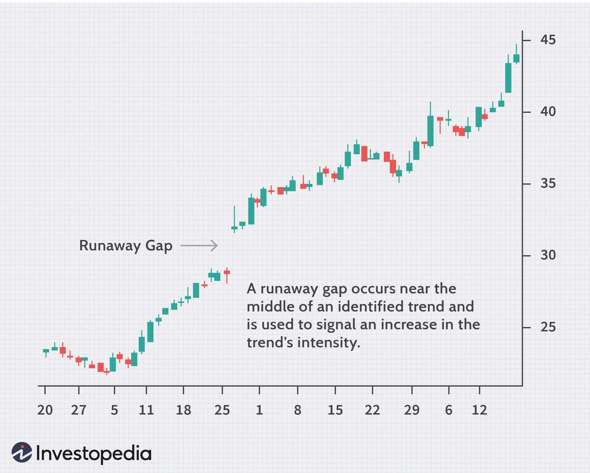

Stock market trading is a crucial component of the global economy, enabling the exchange of securities and providing a platform for wealth accumulation for both individuals and institutions. A significant aspect of successful trading lies in understanding and utilizing trading patterns, which serve as predictive tools for stock movements. Trading patterns are configurations formed by the price movements of stocks and can offer insights into future price directions based on historical trends. These patterns, identified through technical analysis, include formations such as head and shoulders, flags, and pennants.

A specific trading phenomenon, known as "gaps," occurs when there is a discontinuity in a stock’s price activity between consecutive trading periods. Gaps can signal various market conditions and are classified into four types: common gap, breakaway gap, continuation gap (or runaway gap), and exhaustion gap. Among these, the runaway gap holds particular significance, as it indicates strong market sentiment and momentum, often occurring in trends where market participants engage actively, causing substantial movement in stock prices.



The evolution of stock market trading has been significantly influenced by the integration of algorithmic trading, where computer programs are used to execute trades at speeds and frequencies beyond human capability. Algorithms can process colossal amounts of data to identify trading patterns and anomalies such as runaway gaps, thereby enhancing decision-making processes. This technological progression has not only increased trading efficiency but has also amplified the importance of pattern recognition in market analysis.

Moreover, the synergy between identifying trading patterns and algorithmic trading applications lies in their combined ability to predict and capitalize on stock movements with accuracy and speed. By leveraging algorithms to detect patterns like runaway gaps, traders can design and implement strategies that maximize profitability while managing risk effectively. Consequently, the intersection of traditional trading methods and technological advancements provides a robust framework for navigating the complexities of modern financial markets.

## Table of Contents

## Understanding Trading Patterns

Trading patterns are recurring formations on stock charts that indicate potential future price movements. These patterns are fundamental to technical analysis, which is a methodology used by traders to evaluate financial markets based on historical price and volume data. Technical analysts believe that market psychology and investor behaviors repeat over time, manifesting as patterns that can be used to predict future price actions.

### Types of Trading Patterns

There are several types of trading patterns, each with its own implications:

1. **Head and Shoulders**: This pattern signifies a reversal of the current trend. It consists of three peaks: a higher peak (head) in between two lower peaks (shoulders). A head and shoulders pattern signals a bearish reversal, while an inverse head and shoulders pattern indicates a bullish reversal.

2. **Flags**: These patterns appear as short-term consolidation periods that occur after a strong price movement. They are characterized by parallel trend lines that can be either horizontal or sloped against the prevailing trend. Flags often signify a continuation of the previous direction after the completion of the pattern.

3. **Pennants**: Similar to flags, pennants are short-term continuation patterns. They are formed by two converging trend lines and typically occur mid-trend. The completion of a pennant is often followed by a breakout in the direction of the previous trend.

### Gaps in Trading

Gaps are another essential component of technical analysis. They occur when there is a significant difference between the closing price on one day and the opening price on the next. Gaps can be classified into several types:

1. **Common Gap**: These occur frequently and are usually filled quickly. They often appear in trading ranges without significant price movements.

2. **Breakaway Gap**: These occur at the end of a price pattern and signal the beginning of a new trend. They are usually associated with high volume and indicate a strong market interest in a new direction.

3. **Continuation (Runaway) Gap**: Also known as a "runaway" gap, this type of gap occurs within an existing trend and signifies a surge in trading activity consistent with the current market direction. Unlike breakaway gaps, they appear after the trend has been established and reflect a continuation of the momentum.

4. **Exhaustion Gap**: These gaps occur at the end of a trend and signal a potential reversal. Typically accompanied by lower trading volume, they indicate a drying up of interest in continuing the current trend.

### Focus on the Runaway Gap

Runaway gaps are characterized by a significant price movement in the direction of the existing trend. They occur when the market sentiment is strong and are often supported by increased trading volumes. This type of gap reflects heightened investor confidence in the trend's continuation and can be seen as a confirmation of the trend's strength.

Unlike common gaps, runaway gaps are less likely to be filled quickly because they are a result of significant underlying factors driving the market in the current trend direction. Unlike exhaustion gaps, runaway gaps do not typically signal a trend reversal but rather an intensification of the existing trend. Recognizing and understanding runaway gaps can be critical for traders aiming to capitalize on strong market movements.

## Runaway Gap: Characteristics and Formation

A runaway gap is an important indicator in technical analysis, signifying robust market trends. It occurs when there is a significant increase or decrease in stock prices, creating a 'gap' on the chart where no trading takes place between the close of one period and the open of the next. This gap suggests strong investor sentiment, often driven by surprise news, a shift in market perception, or an influx of institutional trades, and indicates a continuation of the prevailing trend. Runaway gaps are typically found in the middle of a trend rather than at the start or end, providing insight into the strength and continuation of the current market direction.

The psychology behind runaway gaps is largely influenced by mass market emotions, primarily fear and greed. For instance, in a bullish market, as prices continue to rise, investor optimism grows, often inciting a fear of missing out (FOMO), which further accelerates buying activity. Conversely, in a bearish scenario, fear can expedite selling. This collective emotional drive amplifies price movements leading to the formation of a runaway gap.

Runaway gaps are identified on stock charts by examining price action between consecutive trading days. They manifest as clear spaces or 'gaps' in the price chart and are often associated with strong [volume](/wiki/volume-trading-strategy) spikes. Analysts look for these gaps to confirm continuing trends, using traditional tools like candlestick patterns and trend lines to corroborate their findings. The gap itself will appear as an interval on the price axis where no trading occurs, with the following day’s opening price significantly above or below the previous day’s closing price.

The frequency and occurrence of runaway gaps can vary across different markets and stocks. They are more common in volatile markets and during periods of high market activity or significant news releases. Stock indices like the S&P 500 may exhibit these gaps less frequently, whereas individual stocks, especially those with lower [liquidity](/wiki/liquidity-risk-premium) or those subject to sudden news events, may experience them more often. Identifying these gaps requires diligent chart analysis and an understanding of the underlying market dynamics driving investor behavior.

## Algorithmic Trading and Runaway Gaps

Algorithmic trading, often referred to as algo-trading, involves using computer algorithms to execute a large number of trades at speeds and frequencies that a human trader cannot. It employs pre-defined instructions and sophisticated mathematical models to make trading decisions, significantly affecting the stock market by increasing liquidity and making trading more systematic. The evolution and growing use of [algorithmic trading](/wiki/algorithmic-trading) stem from its ability to analyze vast datasets and execute trades in milliseconds, reducing transaction costs and minimizing human errors.

Runaway gaps in trading are indicators of significant market trends and can present lucrative opportunities for traders. Algorithms are particularly well-suited to identify and exploit these gaps due to their precision and speed. The identification of runaway gaps involves analyzing price charts to detect sudden shifts where a stock opens at a significantly higher or lower price than its previous close, without any trading occurring in between. These gaps suggest strong market sentiment, either bullish or bearish, that can be further exploited by algorithmic trading strategies.

Algorithms designed to detect runaway gaps typically utilize technical indicators and historical price data. For instance, an algorithm might be programmed to identify a gap by analyzing opening prices that exceed a predetermined threshold relative to the closing price of the previous day. Such algorithms can be written in Python, using libraries like Pandas and NumPy to process historical data, and Matplotlib for visualization. An example Python code snippet to identify potential gaps might look like this:

```python
import pandas as pd

# Assuming 'data' is a DataFrame containing historical stock data with columns: ['Date', 'Open', 'Close']
def detect_runaway_gap(data, threshold=0.05):
    gaps = []
    for i in range(1, len(data)):
        prev_close = data['Close'].iloc[i-1]
        curr_open = data['Open'].iloc[i]
        gap = (curr_open - prev_close) / prev_close
        if abs(gap) > threshold:
            gaps.append((data['Date'].iloc[i], gap))
    return gaps

# Example usage:
# data = pd.read_csv('historical_stock_data.csv')
# runaway_gaps = detect_runaway_gap(data)
```

Trading strategies involving runaway gaps can be highly profitable, particularly when combined with volume analysis and other technical indicators to confirm the strength of the market sentiment. Algorithms can automatically execute trades as soon as a gap is detected, opting for long positions when there is an upward gap indicating bullish sentiment, or short positions for a downward gap indicating bearish sentiment.

Research indicates that trading strategies leveraging runaway gaps can yield higher returns compared to traditional methods, due to the amplified price movement often associated with these gaps. However, success is contingent on various factors including market conditions, the chosen threshold for gap detection, and risk management measures. Studies have shown that precise tuning of algorithm parameters and constant monitoring of market trends are essential for optimizing profitability in trades involving runaway gaps.

In summary, algorithmic trading provides a powerful toolset for detecting and profiting from runaway gaps in stock trading. By integrating technical indicators and automated decision-making processes, traders can enhance their ability to capitalize on these opportunities while managing risk effectively.

## Trading Strategies for Runaway Gaps

In stock trading, runaway gaps present a unique opportunity for traders to capitalize on strong market trends. To effectively leverage these gaps, a strategic approach is necessary that involves formulating trading strategies, managing associated risks, analyzing volume, and learning from previous successful trades.

### Strategy Formulation: Capitalizing on Runaway Gaps with Long/Short Positions

Runaway gaps indicate strong market [momentum](/wiki/momentum) and can be exploited through long or short positions based on the direction of the trend. If a stock experiences an upward runaway gap, it suggests strong buying interest, making it a candidate for a long position. Conversely, a downward runaway gap may indicate selling pressure, favoring short positions. A trader might consider buying (going long) immediately following an upward gap or selling short after a downward gap. The key is to act swiftly in response to the gap, as these opportunities can be fleeting.

### Risk Management Techniques

Risk management plays a critical role in trading runaway gaps. A primary method is the use of stop-loss orders to limit potential losses if the trade goes against expectations. For instance, when entering a long position post-gap, a stop-loss order can be placed just below the gap to protect against downward movement, minimizing losses if the price unexpectedly reverses. Similarly, for short positions, a stop-loss can be set just above the gap to safeguard against an unanticipated rise in price.

### Importance of Volume Analysis

Volume analysis is crucial when confirming the validity of a runaway gap. A true runaway gap is generally accompanied by significant trading volume, indicating strong market conviction. High volume during a gap reinforces the likelihood that the trend will continue, while low volume might suggest that the gap is more likely to fill, reflecting weaker market support. Traders should analyze volume patterns alongside price movements to make informed decisions and enhance the reliability of their trades.

### Real-World Examples of Successful Runaway Gap Trades and Outcomes

Successful runaway gap trades often involve quick and informed decision-making. For instance, during a period of significant earnings announcements, a stock might gap up, reflecting strong performance results. Traders who recognized the significance of the volume accompanying the gap and swiftly purchased shares could benefit from subsequent bullish momentum. On the other hand, in a bear market, stocks that experience a runaway gap down due to adverse news can present opportunities for short sellers to profit as the stock price continues to decline.

Overall, trading strategies centered around runaway gaps require a blend of strategic positioning, stringent risk management, thorough volume analysis, and learning from past examples to maximize outcomes. These elements collectively enhance a trader's ability to navigate the [volatility](/wiki/volatility-trading-strategies) and seize the profitable opportunities that runaway gaps offer.

## Limitations and Risks

Predicting and profiting from runaway gaps presents a range of challenges and risks that traders must consider. Runaway gaps, characterized by significant shifts in stock prices accompanied by increased trading volumes, are unpredictable by nature, making them difficult to forecast accurately. The volatile and emotional reactions that often fuel these gaps add a layer of complexity, as market sentiment can shift rapidly based on news or unforeseen events.

In the context of trading gaps, algorithmic decision-making introduces specific risk factors. Algorithms rely heavily on historical data and predefined rules to identify and act on market patterns. However, in the case of runaway gaps, past patterns might not always predict future behavior due to the unique drivers behind each event. Moreover, the speed at which algorithmic trading executes can exacerbate market movements, potentially leading to increased volatility and risk exposure if not managed properly.

A notable risk associated with trading gaps is the potential for false signals. This risk is particularly pertinent when differentiating between runaway gaps and other types of gaps, such as common or exhaustion gaps. False signals can lead to misguided trades, resulting in losses. Mitigation strategies include implementing robust validation protocols, such as confirming signals with volume analysis and aligning with broader market trends. Traders might employ threshold-based algorithms that incorporate multiple indicators beyond just price gaps to ensure a more reliable interpretation of market conditions.

When comparing runaway gaps with other gap types, it is essential to consider their reliability. Runaway gaps are often more consistent indicators of strong trends, primarily when backed by substantial volume changes. In contrast, common gaps may not suggest significant market movements, often filling quickly. Exhaustion gaps, on the other hand, can signify the end of a price move, frequently leading to reversals. The reliability of each gap type varies, and traders must tailor their strategies accordingly to accommodate these differences.

In conclusion, while runaway gaps offer potential profit opportunities, they come with inherent limitations and risks related to prediction accuracy, algorithmic trading pitfalls, and the possibility of false signals. A careful and informed approach, emphasizing robust risk management and validation techniques, can help traders enhance their ability to navigate the challenges associated with runaway gaps effectively.

## Conclusion

Runaway gaps hold substantial significance in stock trading as they serve as potent indicators of strong market trends. Their sudden appearance in price charts can provide traders with vital clues about potential continuation of price momentum, whether it be upward or downward. This makes them valuable tools in technical analysis, aiding in the prediction of future price movements.

The integration of technological advancements with trading patterns has revolutionized the way runaway gaps are utilized. Algorithmic trading, for instance, leverages sophisticated algorithms to quickly identify and act upon these gaps. This synergy not only increases the efficiency of trading strategies but also enhances the precision with which these patterns are detected and exploited. The ability of algorithms to process vast amounts of data at high speeds allows traders to capitalize on fleeting opportunities that might not be perceptible through manual analysis alone.

Looking ahead, the future of trading strategies involving gaps appears bright, with continuous advancements in technology further enhancing trading capabilities. The rise of [machine learning](/wiki/machine-learning) and [artificial intelligence](/wiki/ai-artificial-intelligence) offers promising avenues for developing more refined algorithms that can adapt to ever-changing market conditions and improve the predictability and exploitation of runaway gaps.

It is essential for traders to consider a balanced approach, integrating both traditional methods of technical analysis and modern algorithmic techniques. By combining human intuition with the computational prowess of algorithms, traders can enhance their ability to identify and profit from runaway gaps while effectively managing associated risks. This holistic approach ensures a comprehensive understanding of market dynamics and better adaptation to future challenges in stock trading.

## References & Further Reading

[1]: ["Technical Analysis of the Financial Markets: A Comprehensive Guide to Trading Methods and Applications"](https://www.amazon.com/Technical-Analysis-Financial-Markets-Comprehensive/dp/0735200661) by John J. Murphy

[2]: ["Market Wizards: Interviews with Top Traders"](https://www.amazon.com/Market-Wizards-Updated-Interviews-Traders/dp/1118273052) by Jack D. Schwager

[3]: Malkiel, B. G. (2019). ["A Random Walk Down Wall Street: The Time-Tested Strategy for Successful Investing"](https://www.amazon.com/Random-Walk-Down-Wall-Street/dp/1324002182) Princeton University Press.

[4]: Yan, E., & Zhang, L. (2008). ["Technical Analysis: An Asset Allocation Perspective on the Use of Moving Averages"](https://www.sciencedirect.com/science/article/pii/S0304405X09000361) Journal of Economic Behavior & Organization, Elsevier.

[5]: Vedyagin, A. (2020). ["Algorithmic Trading and DMA: The Unofficial Guide to Costly Exchange Computer Hardware and Software"](https://www.researchgate.net/publication/378548435_Algorithmic_Trading_and_AI_A_Review_of_Strategies_and_Market_Impact)