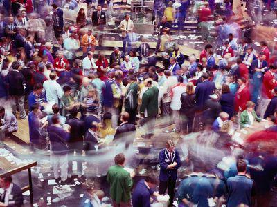

The landscape of trading has undergone a profound transformation, largely driven by technological advancements that have introduced innovative methodologies such as algorithmic trading. This evolution has reshaped how stock exchanges function globally, with algorithmic trading, or "algo trading," becoming a centerpiece of modern financial markets. Algo trading refers to the use of complex algorithms to execute trading orders, often employing mathematical models and leveraging historical data to predict market trends and decisions with a level of speed and precision unattainable by human traders alone.

Despite this digital revolution, traditional trading practices still hold significant sway in prominent exchanges like the New York Stock Exchange (NYSE). These platforms continue to integrate classic floor trading techniques, a nod to the enduring importance of human interaction in financial transactions. On the trading floor, the presence of runners and floor traders is vital. Runners are responsible for transmitting trade orders between brokers and traders, ensuring swift and precise execution. Their roles are crucial for maintaining the physical aspect of trading, which continues to provide a tangible connection to market activities and offers liquidity and competitive pricing.



This article examines how floor runners have been woven into the tapestry of trading exchanges and maps the progression towards algorithmic trading. By integrating these elements, exchanges strive to maintain a balanced ecosystem where time-honored practices coexist with cutting-edge technology, fostering an environment that supports diverse trading strategies and enhances market stability. Understanding this interplay is essential in navigating the continually evolving world of trading.

## Table of Contents

## The Role of Floor Runners in Trading Exchanges

Floor runners have historically played an indispensable role in traditional stock exchanges by facilitating seamless communication between traders and brokers on the floor. In the hubbub of the trading floor environment, where swift exchanges and quick decision-making are paramount, runners ensure that trade orders are conveyed accurately and expediently. This function is vital for the overall efficiency of the exchange, as it mitigates the risk of errors that could arise in the fast-paced environment of open outcry trading.

Despite the significant shift towards digital trading platforms, the role of floor runners remains crucial, particularly in exchanges that still support a physical trading component, such as the New York Stock Exchange (NYSE). In such settings, runners contribute to maintaining the dynamism and human interaction that can sometimes be absent in entirely electronic exchanges. Their presence ensures that trades are not only executed correctly but also allows for a level of oversight and immediate response that electronic systems may not fully replicate.

The duties of floor runners extend beyond mere order delivery; they play a significant role in ensuring the accuracy and timeliness of the execution of these orders. This requires an acute awareness of the trading environment and the ability to navigate the chaotic floor efficiently. The position of a floor runner is often seen as an entry-level role that provides individuals with valuable exposure to the intricacies of the trading process. This foundational experience paves the way for advancement into more significant trading positions, as runners gain insights into market dynamics, trading strategies, and the operational mechanisms of exchanges.

While the march towards digitalization in trading continues, the enduring presence of floor runners underscores a recognition of the unique value they bring to the trading process. Their role embodies a bridge between traditional and modern trading practices, ensuring that the benefits of human interaction and error mitigation continue to complement the speed and efficiency brought about by digitalization.

## Understanding Exchange Floor Trading

Exchange floor trading is characterized by the open outcry system, a traditional method where traders express buy and sell intentions through hand signals and vocal declarations. This system plays a critical role in facilitating trade execution by promoting transparency and immediacy in communication. Floor traders, also known as pit traders, are responsible for negotiating and closing deals on behalf of their clients, often surrounded by the chaotic energy of the trading pit.

Despite the widespread shift towards digital trading platforms, several major stock exchanges retain elements of floor trading. This retention is primarily due to the unique advantages floor trading offers, notably in providing [liquidity](/wiki/liquidity-risk-premium) and market accuracy. The physical presence of traders creates a dynamic environment that can adapt quickly to market shifts, often faster than digital algorithms are able to. This is particularly important during times of market [volatility](/wiki/volatility-trading-strategies), where the human element can effectively interpret and respond to nuanced market signals.

Moreover, floor traders contribute to maintaining competitive pricing. Their real-time interactions and negotiations help in price discovery, ensuring that prices reflect the actual market sentiment. This is accomplished through the instantaneous feedback loops created by the collective activities of the traders within the pit. By participating directly in price setting, floor traders help in narrowing bid-ask spreads, which contributes to overall market efficiency.

The physical dimension of floor trading offers capabilities beyond what is achieved through digital interfaces alone. Traders on the floor can gauge the mood and [momentum](/wiki/momentum) of trading activity not just through data, but through direct observation and interaction with their peers. This tactile feel of the market enhances decision-making processes that are often limited in purely electronic environments. As a result, the continued use of floor trading in certain markets speaks to the enduring value of human judgment and experience in trading environments dominated by technology.

In conclusion, while technology and [algorithmic trading](/wiki/algorithmic-trading) continue to transform the landscape of financial markets, floor trading retains a significant role in supporting market integrity by providing liquidity, enhancing price discovery, and offering a resilient human touch to trading activities.

## The Emergence of Algorithmic Trading

Algorithmic trading, often referred to as algo trading, has become a pivotal aspect of financial markets, utilizing complex algorithms to execute orders with minimal human intervention. This method leverages mathematical models and historical data to analyze potential trades and predict market trends, enabling these algorithms to initiate buying or selling decisions swiftly and efficiently. 

One of the core advantages of algorithmic trading is its ability to process vast amounts of information and execute trades at speeds that far exceed human capabilities. Algorithms can evaluate multiple market factors in milliseconds, significantly enhancing the efficiency of trading operations and reducing the likelihood of human error. For instance, an algo trading system can simultaneously track news feeds, price changes, and market sentiment, adapting its strategy in real time based on predefined criteria. This edge becomes increasingly valuable in high-frequency trading ([HFT](/wiki/high-frequency-trading-strategies)), where quick execution is the key to profitability.

The strategic use of algorithms involves a variety of techniques, such as statistical [arbitrage](/wiki/arbitrage), mean reversion, and [trend following](/wiki/trend-following). These strategies are implemented by analyzing quantitative data and executing trades when certain market conditions are met. Consider a simplified example of a mean reversion strategy in Python:

```python
import numpy as np
import pandas as pd

# Load historical price data
prices = pd.read_csv('historical_prices.csv')
prices['Returns'] = prices['Close'].pct_change()

# Calculate rolling mean and standard deviation
rolling_mean = prices['Returns'].rolling(window=20).mean()
rolling_std = prices['Returns'].rolling(window=20).std()

# Define the buy and sell signals
buy_signal = (prices['Returns'] < (rolling_mean - rolling_std))
sell_signal = (prices['Returns'] > (rolling_mean + rolling_std))

# Example output of signals
prices['Buy'] = np.where(buy_signal, 1, 0)
prices['Sell'] = np.where(sell_signal, 1, 0)
```

The evolution of algo trading, however, is not without controversy. The increased use of complex algorithms has sparked debates over their impact on market liquidity. On one hand, algorithmic trading can enhance liquidity by providing additional buying and selling opportunities. On the other hand, it may exacerbate volatility during sudden market movements, as seen during notorious "flash crashes," where automated trading algorithms rapidly withdrew liquidity from the market.

Furthermore, the rise of algorithmic trading has led to discussions regarding its influence on traditional trading roles. The speed and precision of these algorithms challenge the relevance of human traders who have historically relied on intuition and experience. As a consequence, there is an ongoing shift in the skills required for trading. Professionals in the finance industry are now expected to possess a deeper understanding of technology and data analysis alongside their conventional expertise.

Overall, as algorithmic trading continues to evolve, it is essential to consider both the benefits and the challenges it introduces to financial markets. It represents a significant technological advancement capable of enhancing market operations while simultaneously demanding new regulatory approaches to ensure stability and fairness.

## Transition from Traditional to Digital: Integrating Floor Trading with Algo Trading

The transition from traditional floor trading to a more digital platform has created a hybrid trading environment that leverages the strengths of both methods. This integration is essential as it melds human intuition and market insights with the speed and precision of digital trading systems.

Floor traders, who historically relied on open outcry and physical interactions, now have access to digital tools that enhance their trading capabilities. These tools not only expedite the execution of trades but also provide comprehensive data analytics that inform better decision-making. For instance, software platforms can track historical price movements, enabling traders to spot trends and make predictions about future market behaviors.

The hybrid approach addresses the needs of various market participants by embracing mixed methodologies. By utilizing both floor and algo trading, exchanges can cater to different trading styles and preferences. This adaptability is crucial for sustaining market liquidity and ensuring competitive pricing. On the digital side, algorithmic trading offers automated, high-frequency strategies that optimize for efficiency and speed. These algorithms can parse vast datasets and execute trades at speeds far beyond human capacity, potentially leading to reduced transaction costs and increased price accuracy.

However, the role of human traders remains significant. While algorithms handle repetitive and data-intensive tasks, traders provide qualitative analysis and adaptability that machines lack. For example, in rapidly changing market conditions or unprecedented events, human traders can quickly interpret and act on non-quantifiable information such as geopolitical developments or economic forecasts.

Exchanges are increasingly designing platforms that blend these elements, providing interfaces where traders can input personal insights alongside automated trading strategies. This integrated environment fosters a symbiotic relationship between human intuition and machine intelligence, ensuring that the trading process benefits from both strategic oversight and operational efficiency.

By acknowledging the strengths and limitations of both traditional floor trading and algorithmic systems, the trading landscape can evolve to meet the challenges and opportunities of modern markets. The continued development of such hybrid systems will likely play a pivotal role in defining the future of trading.

## Challenges and Advantages of Algo Trading Amidst Traditional Practices

Algorithmic trading, often referred to as algo trading, offers numerous advantages, notably speed and efficiency in executing trades. Algorithms are capable of analyzing vast datasets and executing transactions in fractions of a second, which is far beyond human capabilities. This speed can enhance market liquidity and reduce transaction costs. For instance, [statistical arbitrage](/wiki/statistical-arbitrage) strategies leverage historical pricing relationships to identify trading opportunities. By employing mathematical models to predict these opportunities, traders optimize their portfolios with precision and timeliness.

However, algo trading also introduces challenges. One significant concern is the phenomenon of flash crashes. These are sudden, severe market downturns triggered by rapid successive trading decisions made by algorithms. Flash crashes often occur due to the interdependent nature of algorithmic strategies; when one algorithm initiates a series of trades based on a trigger, others might follow suit, exacerbating market volatility. An infamous example occurred on May 6, 2010, when the Dow Jones Industrial Average plummeted nearly 1,000 points within minutes before recovering swiftly.

Balancing algorithmic trading with traditional practices requires a contribution from both technological and human elements. Human oversight remains crucial, particularly in monitoring and adjusting algorithms to prevent errors or unintended market impacts. Algorithms excel at executing predefined strategies under normal market conditions but may struggle in anomalous situations requiring human intuition and judgement. As such, traders must actively manage algorithmic systems, ensuring they align with broader strategic market insights and adaptive responses to unexpected events.

Regulatory measures play a fundamental role in maintaining market stability amidst the growth of algorithmic trading. Regulations often mandate strict risk management practices, such as limits on order quantities and execution speeds, to prevent market manipulation and excessive volatility. Additionally, circuit breakers are employed by exchanges as a protective mechanism, temporarily halting trading when extraordinary price movements occur, allowing time for market participants to reassess.

The future of trading therefore hinges on the integration of algorithms with human oversight. As traders become increasingly adept with digital tools, the ability to interpret data outputs and make informed decisions remains paramount. Trading platforms will likely continue evolving to marry the rapid execution capabilities of algorithms with the strategic acumen of human traders, fostering a stable and dynamic market environment.

In summary, while algo trading offers unparalleled efficiency, its successful integration into the financial ecosystem requires balancing speed with human judgement and robust regulatory oversight. This ensures that markets operate smoothly, safeguarding against the risks posed by hyper-fast trading activities.

## Future of Trading: A Harmonized Approach

The future of trading is characterized by the integration of human expertise with machine-driven precision, which is expected to create more resilient and dynamic financial markets. Human traders bring deep market insights, intuition, and strategic thinking, while machines provide unparalleled speed and accuracy in executing trades. This combination allows for a more robust trading environment that can adapt to diverse market conditions and challenges.

Continuous education plays a crucial role in bridging the gap between traditional traders and those adept with digital interfaces. Programs focusing on algorithmic literacy, data analysis skills, and understanding [machine learning](/wiki/machine-learning) techniques are essential to prepare traders for a market where technology and human decision-making co-exist. Educational initiatives should be structured to accommodate the evolving demands of trading, ensuring that professionals are equipped with the necessary skills to harness both traditional trading wisdom and advanced technological tools.

Policy measures are equally important in facilitating this harmonized approach. Regulatory bodies must adapt to technological advancements by implementing frameworks that promote transparency, reduce systemic risk, and protect market participants. Such policies could include monitoring the use of automated trading systems to prevent excessive volatility or manipulation while ensuring that human oversight remains a key component of market operations.

Technological advancements are the backbone of this future landscape, with developments in [artificial intelligence](/wiki/ai-artificial-intelligence), blockchain technology, and high-frequency trading shaping new methodologies. These innovations enable more efficient market operations, reduced transaction costs, and enhanced liquidity. However, the rapid pace of technological change necessitates adaptive regulatory frameworks that can respond to emerging risks while encouraging innovation.

In conclusion, achieving a harmonized approach in trading requires a synergy of human and machine capabilities, continuous education for market participants, and regulatory frameworks that evolve in line with technological advancements. This balanced integration will not only enable markets to function more effectively but also open up new opportunities for growth and innovation in the trading sector.

## Conclusion

The world of trading is characterized by its dynamic and ever-evolving nature, where both traditional methods like floor trading and modern approaches such as algorithmic trading coexist and complement each other. Floor runners, playing an essential role in the communication process on the trading floor, exemplify the enduring significance of human interaction in facilitating trades. On the other hand, algorithmic trading has introduced unparalleled speed and efficiency, leveraging mathematical models and historical data to execute trades at a pace unachievable by human traders.

Understanding the nuances between these two paradigms equips traders with the necessary tools to navigate and succeed within this complex and multifaceted environment. Floor trading, with its emphasis on human interaction, provides insightful market perspectives that are invaluable for strategic decision-making. Meanwhile, algorithmic trading's precision and ability to handle large volumes of data efficiently offer tremendous advantages in terms of execution speed and error minimization.

As markets continue to evolve, there is a growing need to embrace both traditional and modern aspects of trading. This dual approach ensures not only the preservation of diverse trading strategies but also fosters opportunities for growth and innovation. The integration of human expertise with technological advancements promises a more resilient and adaptable trading ecosystem, capable of withstanding market fluctuations and technological disruptions. By leveraging the strengths of both methods, the trading landscape can continue to thrive, offering vast potential for future developments and opportunities. Through ongoing education and adaptive regulatory frameworks, traders can be better equipped to harness the full potential of this harmonized approach, ensuring sustained success in the ever-evolving world of trading.

## References & Further Reading

[1]: Bergstra, J., Bardenet, R., Bengio, Y., & Kégl, B. (2011). ["Algorithms for Hyper-Parameter Optimization."](https://papers.nips.cc/paper/4443-algorithms-for-hyper-parameter-optimization) Advances in Neural Information Processing Systems 24.

[2]: ["Advances in Financial Machine Learning"](https://www.amazon.com/Advances-Financial-Machine-Learning-Marcos/dp/1119482089) by Marcos Lopez de Prado

[3]: ["Evidence-Based Technical Analysis: Applying the Scientific Method and Statistical Inference to Trading Signals"](https://www.amazon.com/Evidence-Based-Technical-Analysis-Scientific-Statistical/dp/0470008741) by David Aronson

[4]: ["Machine Learning for Algorithmic Trading"](https://github.com/PacktPublishing/Machine-Learning-for-Algorithmic-Trading-Second-Edition) by Stefan Jansen

[5]: ["Quantitative Trading: How to Build Your Own Algorithmic Trading Business"](https://books.google.com/books/about/Quantitative_Trading.html?id=j70yEAAAQBAJ) by Ernest P. Chan