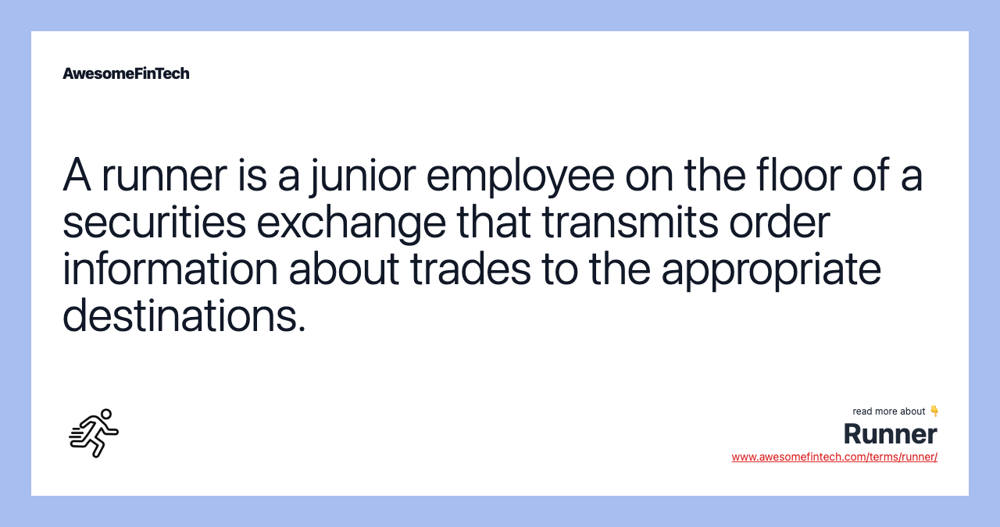

## Table of Contents

## What is a runner in the context of exchange floor trading?

A runner in the context of exchange floor trading is a person who works on the trading floor of a stock exchange. Their main job is to carry messages and orders between traders and other people on the floor. This helps keep the trading process moving smoothly and quickly. Runners are important because they help make sure that orders are delivered accurately and on time.

In the past, before electronic trading became common, runners were very important on the trading floor. They would run around the busy floor, delivering paper orders and messages by hand. Even though electronic trading is now used a lot, some exchanges still use runners to help with certain tasks. This shows how important their role has been in the history of trading.

## How does a runner facilitate trading on the exchange floor?

A runner helps trading on the exchange floor by quickly moving orders and messages between traders. When a trader wants to buy or sell a stock, they write down the order and give it to a runner. The runner then runs to the right place on the floor and gives the order to the person who can make the trade happen. This helps make sure that the order gets to where it needs to go fast and correctly.

Even though computers are used a lot now for trading, runners are still important. They can help when there are problems with the computers or when someone needs to talk to another trader face-to-face. Runners make the trading floor work smoothly by keeping everyone connected and helping to solve any issues that come up during trading.

## What are the typical responsibilities of a runner on a trading floor?

A runner on a trading floor has the main job of delivering orders and messages between traders. When a trader wants to buy or sell a stock, they write down what they want to do and give it to the runner. The runner then quickly takes this order to the right person on the floor who can make the trade happen. This helps make sure that the order gets to where it needs to go fast and without mistakes.

Runners also help keep the trading floor running smoothly. If there is a problem with the computers or if traders need to talk to each other face-to-face, runners can help. They make sure that everyone stays connected and can solve any issues that come up during trading. Even though computers do a lot of the work now, runners are still important for making sure everything goes well on the trading floor.

## What qualifications or skills are necessary to become a runner on an exchange floor?

To become a runner on an exchange floor, you don't need a special degree, but you do need to be quick and good at paying attention. You should be able to run around a busy place without getting tired and be able to remember where you need to go and who you need to talk to. Being good at following instructions and not making mistakes is also very important because you are helping with important trades.

It's also helpful if you know a bit about how trading works. This can make it easier for you to understand what the traders are asking you to do. Being able to work well with others and stay calm when things get busy is important too. Runners need to be trusted by the traders, so being honest and reliable is a big part of the job.

## How has the role of a runner evolved with the advent of electronic trading?

Before electronic trading, runners were very important on the exchange floor. They ran around carrying paper orders and messages between traders. This was the main way to make sure trades happened quickly and correctly. Runners were busy all the time, making sure everyone got the information they needed to buy and sell stocks.

With electronic trading, computers do a lot of the work that runners used to do. Orders can now be sent with a click of a button, so there are fewer paper orders to [carry](/wiki/carry-trading) around. But runners are still useful. They help when there are computer problems or when traders need to talk to each other face-to-face. Even though their job has changed, runners still play an important role in keeping the trading floor running smoothly.

## What is the daily routine of a runner during active trading hours?

A runner's day on the trading floor starts early. They get to the exchange before trading begins to make sure everything is ready. Once trading starts, the runner's job gets busy. They move quickly around the floor, taking orders from traders and delivering them to the right people. The runner has to be fast and pay close attention to make sure they don't make any mistakes. They also need to know the layout of the floor well so they can get to where they need to go without wasting time.

During the busiest times of the day, the runner is always on the move. They might help with more than just delivering orders. If there's a problem with the computers, the runner might need to carry messages to fix it. They also help traders talk to each other if they need to discuss something important. By the end of the trading day, the runner has run a lot and helped make sure many trades happened smoothly. After trading stops, they might help clean up and get ready for the next day.

## How do runners interact with other roles on the trading floor, such as brokers and traders?

Runners work closely with brokers and traders on the trading floor. When a broker or trader wants to buy or sell a stock, they write down the order and give it to the runner. The runner then runs to the right place on the floor and gives the order to another trader or broker who can make the trade happen. This helps make sure the order gets to where it needs to go fast and correctly. Runners also help by taking messages between brokers and traders if they need to talk about something important.

Runners are very important for keeping the trading floor running smoothly. If there is a problem with the computers, runners can carry messages to help fix it. They also help when brokers or traders need to talk to each other face-to-face. This way, everyone stays connected and can solve any issues that come up during trading. Even though computers do a lot of the work now, runners still play a key role in helping brokers and traders on the trading floor.

## What are the challenges faced by runners in maintaining efficiency and accuracy?

Runners on the trading floor face a lot of challenges to keep things efficient and accurate. One big challenge is the fast pace of the trading floor. They need to run around a busy place, carrying orders and messages without making mistakes. If they mix up an order or go to the wrong person, it can cause big problems for the traders and the trades they are trying to make. Runners also need to know the layout of the floor well so they can get to where they need to go quickly.

Another challenge is dealing with the noise and chaos on the trading floor. With so many people talking and shouting, it can be hard for runners to hear instructions clearly or remember where they need to go. They have to stay focused and calm, even when things get very busy. Runners also need to be good at working with others, because they are always talking to brokers and traders. If they don't communicate well, it can slow down the trading process and lead to mistakes.

## Can you describe a typical scenario where a runner's role is critical to the trading process?

Imagine it's a busy day on the trading floor. A trader wants to buy a lot of shares of a company quickly because the price is going up fast. The trader writes down the order and gives it to a runner. The runner knows they need to move fast. They run across the floor to another trader who can make the trade happen. If the runner is slow or makes a mistake, the trader might miss the chance to buy the shares at the good price. The runner's speed and accuracy are really important to make sure the trade goes through on time.

In another situation, the computers on the trading floor stop working. Traders can't send orders electronically anymore. This is when runners become even more important. They start running around, carrying paper orders and messages between traders. Without the runners, trading would stop completely. They help keep things moving until the computers are fixed. This shows how runners are a key part of the trading process, especially when things don't go as planned.

## What impact does the performance of a runner have on the overall trading operation?

The performance of a runner is really important for the trading operation. If a runner is fast and accurate, they help make sure orders get to where they need to go quickly. This means traders can buy and sell stocks at the right time, which can make a big difference in how much money they make or lose. If a runner is slow or makes mistakes, it can cause big problems. Orders might not get to the right people on time, and traders might miss out on good deals or lose money.

Runners also help keep the trading floor running smoothly, especially when things go wrong. If the computers stop working, runners can carry paper orders and messages to keep trading going. They also help when traders need to talk to each other face-to-face. Without runners, the trading floor would be a lot slower and more chaotic. So, the way runners do their job can really affect how well the whole trading operation works.

## How are runners trained and what ongoing education do they receive to keep up with market changes?

Runners usually start with a basic training program when they first get the job. They learn about the trading floor, how to carry orders and messages, and where to go on the floor. They also learn about the different kinds of orders and what traders need from them. This training helps them understand their job and how to do it well. They might also get to practice running around the floor and delivering orders to get used to the busy environment.

Once they start working, runners keep learning to stay good at their job. They might go to meetings or workshops to learn about new trading rules or changes in the market. Sometimes, they talk with more experienced runners or traders to learn tips and tricks. This ongoing education helps them stay up-to-date and do their job even better. It's important for runners to keep learning because the trading world can change a lot, and they need to be ready for anything.

## What future trends might affect the role of runners in exchange floor trading?

In the future, more and more trading might happen on computers. This could mean fewer runners are needed on the trading floor. As electronic trading gets better, orders can be sent with just a click, so there might not be as many paper orders for runners to carry. But even with all the technology, runners could still be important. They might help when computers break down or when traders need to talk to each other face-to-face. So, while their job might change, runners could still have a place on the trading floor.

Another trend that could affect runners is the way trading rules and markets change. As new rules come out or the market changes, runners might need to learn new things to keep up. They might go to more meetings or workshops to stay updated. This ongoing learning will help them do their job well, even if the trading world keeps changing. Runners who can adapt to these changes will be more valuable and might keep their jobs longer.

## References & Further Reading

[1]: Bergstra, J., Bardenet, R., Bengio, Y., & Kégl, B. (2011). ["Algorithms for Hyper-Parameter Optimization."](https://papers.nips.cc/paper/4443-algorithms-for-hyper-parameter-optimization) Advances in Neural Information Processing Systems 24.

[2]: ["Advances in Financial Machine Learning"](https://www.amazon.com/Advances-Financial-Machine-Learning-Marcos/dp/1119482089) by Marcos Lopez de Prado

[3]: ["Evidence-Based Technical Analysis: Applying the Scientific Method and Statistical Inference to Trading Signals"](https://www.amazon.com/Evidence-Based-Technical-Analysis-Scientific-Statistical/dp/0470008741) by David Aronson

[4]: ["Machine Learning for Algorithmic Trading"](https://github.com/PacktPublishing/Machine-Learning-for-Algorithmic-Trading-Second-Edition) by Stefan Jansen

[5]: ["Quantitative Trading: How to Build Your Own Algorithmic Trading Business"](https://books.google.com/books/about/Quantitative_Trading.html?id=j70yEAAAQBAJ) by Ernest P. Chan