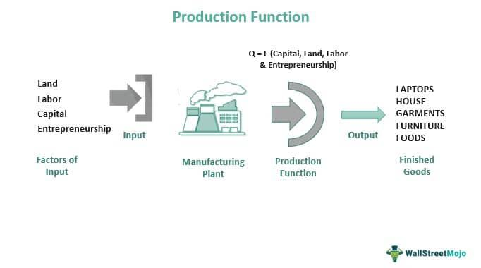

Land use, real estate, property rights, and algorithmic trading are pivotal components shaping the modern economic and financial landscapes. Land use refers to the management and modification of natural environments into built environments, such as fields, pastures, and settlements. It is central to urban planning and real estate development, influencing how cities expand and how resources are allocated.

Real estate, encompassing land and any permanent structures attached to it, is a significant asset class within investment portfolios. It influences economic stability, wealth generation, and employment. The real estate market is sensitive to changes in land use regulations, economic conditions, and demographic trends, impacting property values and investment returns.

Property rights, established through legal frameworks, define the ownership and use of resources. These rights include tangible assets like real estate and intangible assets such as intellectual property. Secure property rights are essential for economic growth as they provide legal certainty for investments, facilitating trade and economic transactions.

Algorithmic trading, a method of executing orders using automated pre-programmed instructions, has revolutionized financial markets. It optimizes trading strategies, analyzes large datasets at high speed, and responds swiftly to market changes. The adoption of algorithmic trading in real estate markets is still emerging and presents unique challenges and opportunities for stakeholders. 

By exploring the intersections of land use, real estate, property rights, and algorithmic trading, we can better understand their implications on investment strategies. This involves examining regulatory frameworks, technological advancements, and market dynamics. Understanding these interactions is crucial for investors and policymakers navigating these interconnected sectors and adapting to evolving market conditions and technological innovations.

## Table of Contents

## Understanding Land Use and Real Estate

Land use refers to the management and modification of natural environments into built environments such as settlements and semi-natural habitats such as arable fields, pastures, and managed woods. It plays a crucial role in urban planning and real estate development by determining the allocation and transformation of land for various functional areas including residential, commercial, industrial, agricultural, and recreational purposes. Effective land use planning aims to balance the needs of society with the capacity of the land, promoting sustainable development and minimizing conflicts among competing land uses.

### Types of Land Use and Their Impact on Real Estate Values

Land uses can generally be categorized into several types: residential, commercial, industrial, agricultural, recreational, and mixed-use, among others. Each type has distinct characteristics and functions that influence real estate values in various ways. 

1. **Residential Land Use** – This includes single-family homes, apartments, condominiums, and other dwelling types. The value of real estate in residential areas is often linked to factors such as location, proximity to amenities like schools and parks, and the availability of public services.

2. **Commercial Land Use** – Property used for business activities, including retail spaces, offices, and hotels, falls under this category. These areas often possess higher real estate values due to their potential for income generation and strategic locations in business districts.

3. **Industrial Land Use** – This includes factories, warehouses, and other manufacturing facilities. Industrial land use is typically located away from residential zones due to noise and pollution concerns, and its real estate value depends on factors like accessibility to transportation networks and infrastructure.

4. **Agricultural Land Use** – Lands used for farming and related activities often have lower real estate values compared to urban areas but are critical for food production and can be subjected to conversion pressures for urban development.

5. **Recreational Land Use** – Parks, golf courses, and other leisure areas fall under this category. Such uses can enhance the value of neighboring residential and commercial properties by providing aesthetic and leisure benefits.

6. **Mixed-Use Development** – This combines residential, commercial, and sometimes industrial uses, fostering vibrant communities and often leading to higher property values due to the synergy of functions and reduced need for commuting.

### The Relationship Between Land Use Regulations and Real Estate Market Dynamics

Land use regulations encompass zoning laws, building codes, subdivision regulations, and environmental protection statutes that govern how land can be developed and used. These regulations are designed to ensure orderly development, protect public welfare, and prevent incompatible land uses. 

Zoning, for instance, is a key regulatory tool that municipalities use to designate land for specific uses, guiding urban growth and development. This can significantly influence real estate market dynamics by affecting supply and demand, thereby impacting property values. For example, restrictive zoning can limit the supply of developable land, potentially increasing property values due to scarcity.

Moreover, building codes and regulations ensure construction safety and quality, which can influence real estate values by mandating minimum standards for new developments and renovations. Environmental regulations aim to protect natural resources, which can impose additional costs on developers but also enhance property desirability by preserving scenic vistas and reducing pollution.

The dynamic interaction between land use regulations and the real estate market underscores how regulatory frameworks can either facilitate or constrain development opportunities, thus influencing economic growth, community sustainability, and property investment strategies. These regulations are crucial for balancing private development interests with the public good, ensuring that land use aligns with broader urban, social, and environmental goals.

## Property Rights in Real Estate

Property rights are a cornerstone in the structure of real estate markets, providing a legal framework that defines the ownership and utilization of property. These rights are primarily built on legal foundations that encompass various laws and regulations which vary across jurisdictions but generally include common law principles, statutory regulations, and customary practices.

The spectrum of property rights is typically categorized into two main types: tangible and intangible assets. Tangible assets in real estate refer to physical properties such as land and structures, where ownership rights allow individuals or entities to occupy, use, and transfer the property as they see fit, within legal boundaries. These rights are fundamental for facilitating transactions and investments, as they offer a clear understanding of ownership and the respective responsibilities and benefits.

Intangible assets, on the other hand, can include rights such as easements, leases, and mineral rights. These do not confer ownership of physical property but rather grant specific uses or benefits associated with it. For example, a lease provides the right to use a property for a specified period, while an easement might grant the right to cross another person's land.

The significance of property rights extends beyond simple ownership; they are instrumental in securing investments and fostering economic growth. Secure property rights underpin real estate markets by providing certainty to investors and owners, which encourages investment and facilitates long-term planning. When property rights are well-defined and enforced, they reduce the risk associated with real estate transactions, thereby increasing market stability and efficiency.

Moreover, clear property rights are essential for economic development, as they enable property to be used as collateral for loans, thus enhancing access to capital. This can spur development and innovation, as individuals and businesses leverage their property holdings to invest in new ventures and improvements. Thus, robust property rights play a critical role in promoting economic growth by ensuring that assets can be utilized to their fullest potential within the market economy.

## Interplay of Property Rights and Ownership Laws

Ownership laws are the legal frameworks that determine how property rights are established, transferred, and enforced. These laws vary significantly across jurisdictions, influencing the ways in which real estate is owned, used, and invested in. Understanding these variations is crucial for stakeholders in real estate, as they can have profound implications for transactions and investment strategies.

Ownership laws can influence real estate transactions by dictating the processes and requirements for buying and selling property. In some regions, for instance, the due diligence process may require extensive verification of title history to ensure clear ownership. This can affect the cost and time necessary to complete transactions, thereby impacting market activity and [liquidity](/wiki/liquidity-risk-premium). Additionally, different jurisdictions may have diverse approaches to tenancy and land use rights, which can influence the attractiveness of real estate investments. For example, regions with strong tenant protection laws may offer less flexibility for property owners, influencing rental market dynamics and potential returns on investment.

Case studies on ownership law reforms offer insights into how changes in legal frameworks can affect economic outcomes. One noteworthy example is the deregulation of property registration processes in some emerging markets. These reforms often aim to reduce bureaucratic hurdles and increase transparency in property dealings, leading to greater investor confidence and increased foreign direct investment in real estate. Conversely, reforms that impose stricter environmental and zoning regulations might initially seem constraining, but can enhance property values by ensuring sustainable and desirable community development.

A historical example is the reform of property and ownership laws in China during the late 20th and early 21st centuries. These reforms allowed private ownership of land use rights while the state retained actual land ownership, which spurred massive urban development and economic growth by attracting both domestic and international investors. However, such reforms also required comprehensive adjustments in local legal systems to handle conflicts arising from new types of property rights and ensure consistent application of laws.

In conclusion, understanding and navigating the complexities of ownership laws are essential for successful real estate investment and development. Variations in these laws across jurisdictions require investors to be acutely aware of local legal nuances and to anticipate how reforms can shift market dynamics. The interplay between property rights and ownership laws is a fundamental aspect of the real estate landscape, driving the need for continual legal adaptation to accommodate changing economic and societal needs.

## Algorithmic Trading in Financial and Real Estate Markets

Algorithmic trading refers to the utilization of computer algorithms to automate decision-making in trading financial instruments. Its origins can be traced back to the early 1970s with the advent of electronic trading systems and the introduction of the New York Stock Exchange’s (NYSE) Designated Order Turnaround (DOT) system. This technology reduced the need for manual order execution, introducing speed and efficiency to market transactions. Over time, advancements in computer technology and telecommunications have dramatically enhanced the capabilities and proliferation of [algorithmic trading](/wiki/algorithmic-trading), particularly with the increase in computational power and access to data.

The financial markets have been significantly transformed by algorithmic trading. Its impact is evident in the increased liquidity, reduced bid-ask spreads, and enhanced market efficiency. Algorithms can process large volumes of data at speeds unattainable by human traders, allowing for more informed and timely trading decisions. For example, high-frequency trading ([HFT](/wiki/high-frequency-trading-strategies)), a subset of algorithmic trading, exploits minor price discrepancies occurring within microseconds, thus contributing to a more competitive pricing mechanism. Additionally, algorithms facilitate complex trading strategies like statistical [arbitrage](/wiki/arbitrage) and [market making](/wiki/market-making), continually reshaping financial markets.

In the context of real estate, algorithmic trading is emerging as a transformative force albeit at a slower pace compared to traditional financial markets. Real estate markets are typically seen as less liquid and more opaque, qualities that pose distinct challenges for algorithmic systems. However, as access to comprehensive real estate data improves, particularly through multiple listing services (MLS) and other data aggregators, the potential for algorithmic applications grows. Algorithmic models applied to real estate can perform tasks such as property valuation, investment analysis, and market trend projection by analyzing historical data and identifying patterns and anomalies.

Despite the advantages, challenges persist in implementing algorithmic trading within real estate markets. The primary issue is data fragmentation; real estate data can be inconsistent, non-standardized, and difficult to source comprehensively. Additionally, real estate transactions involve complex negotiations and legal considerations that are less conducive to automation compared to stocks and other financial instruments. Nevertheless, as more standardized and real-time data becomes accessible, algorithms may overcome these hurdles, offering opportunities for more streamlined and efficient real estate trading processes.

Opportunities abound as technological advancements continue to accelerate, suggesting that algorithmic trading could progressively integrate into real estate markets. Real estate investment platforms are starting to adopt algorithms for automated property analysis and investment management. Furthermore, as [machine learning](/wiki/machine-learning) models become more sophisticated, their use in improving predictive analytics and investment strategies in real estate is likely to grow. However, stakeholders must be wary of the risks involved, such as algorithmic biases, systemic market impacts, and the potential for increased [volatility](/wiki/volatility-trading-strategies).

Ultimately, the ongoing evolution of algorithmic trading in both financial and real estate markets promises to further intertwine technology with investment practices, necessitating continual adaptation by market participants.

## Interactions Between Algo Trading and Property Rights

Algorithmic trading, a method of executing orders using automated and pre-programmed trading instructions, has seen significant advancements in recent years. It plays a crucial role in shaping modern financial markets by leveraging speed, data analysis, and complex strategies. The intersection of algorithmic trading with property rights and ownership laws introduces a complex landscape, particularly given the rapid evolution of technology and financial markets.

One of the key aspects of algorithmic trading is the use of proprietary trading strategies. These strategies often involve sophisticated algorithms that can execute trades at speeds and volumes unattainable by human traders. The development of these strategies is a significant investment for trading firms, thus creating a strong impetus to protect them as intellectual property. Intellectual property considerations in algorithmic trading revolve around the ownership of the underlying algorithms themselves, as well as the data sets used and generated by these algorithms. Protection mechanisms such as patents, trade secrets, and copyrights are often employed to safeguard these proprietary technologies.

For instance, firms may use copyright to protect the source code of their trading algorithms, while trade secrets can be applied to safeguard the unique methodologies and processes incorporated within these strategies. In some cases, patents may be sought for novel and non-obvious technological advancements within algorithmic platforms or components. However, the fast-paced nature of technological innovation in this area often outpaces legal protections, posing challenges for firms seeking to maintain their competitive edge.

The potential for digital property rights frameworks to evolve alongside financial market automation is vast. As financial markets continue transitioning towards greater digitization, the traditional concept of property rights is poised to expand. Blockchain technology, known for its decentralized and immutable characteristics, offers a promising avenue for redefining digital property rights. Smart contracts, self-executing contracts with the terms directly written into code, can automate and enforce the execution of agreements related to algorithmic trading. These contracts have the potential to facilitate the secure and transparent management of digital assets, thereby enhancing trust and reducing counterparty risk.

Additionally, the integration of [artificial intelligence](/wiki/ai-artificial-intelligence) (AI) in this domain is likely to spur further transformation. AI-driven algorithms can adapt and optimize trading strategies by learning from vast amounts of data. As AI systems potentially develop new trading methods, the lines between human and machine-generated intellectual property may blur, necessitating updated legal frameworks to recognize and govern these novel assets.

In summary, the confluence of algorithmic trading and property rights demands attention to intellectual property concerns and heralds a shift towards more sophisticated digital property rights frameworks. Such evolution will be instrumental in managing the complexities introduced by technological advancements and ensuring the robust protection and utilization of proprietary trading assets.

## Future Trends and Technological Synergies

Emerging trends in digital property management are transforming how real estate assets are monitored, assessed, and transacted. With the advent of advanced technologies, new paradigms are unfolding in property rights and trading models, predominantly influenced by blockchain and Artificial Intelligence (AI).

Blockchain technology, with its decentralized and immutable ledger system, is revolutionizing property rights management by increasing transparency and reducing fraud in real estate transactions. Smart contracts, self-executing contracts with the agreement directly written into code, facilitate automatic enforcement of property rights and agreements upon meeting predefined conditions, reducing the need for intermediaries. This automation not only enhances efficiency but also builds trust among parties involved in property transactions.

AI is augmenting these capabilities by providing sophisticated analytics and predictive tools that aid in making informed investment decisions. Machine learning algorithms analyze vast amounts of data to uncover patterns and trends that were previously undetectable, assisting investors in assessing property values and risks with unprecedented precision. This is particularly valuable in algorithmic trading, where AI-driven models execute strategies rapidly and efficiently.

Global trends in technology are prompting significant regulatory and legal adaptations. Countries are recognizing the need for robust frameworks to accommodate these advancements. For instance, the European Union's General Data Protection Regulation (GDPR) impacts how digital property data is handled, ensuring privacy and security. Similarly, various jurisdictions are exploring blockchain regulations to legislate smart contracts and digital assets, which play a crucial role in property rights management.

The integration of AI and blockchain is yielding innovative solutions such as tokenization of real estate assets. Tokenization involves converting real estate interests into digital tokens on a blockchain, allowing fractional ownership and liquidity in real estate investments. This is transforming the investment landscape by making real estate accessible to a broader audience.

In conclusion, the synergy between digital innovations and real estate is fostering an ecosystem that is transparent, efficient, and inclusive. Stakeholders must stay informed and adaptive to these changes, anticipating further transformations as technological and regulatory landscapes evolve.

## Conclusion

The intricate relationships between land use, real estate, property rights, and algorithmic trading highlight the complexity and interconnected nature of modern economic systems. Land use planning and regulation directly influence real estate values and market dynamics. As urbanization trends continue, the strategic deployment of land for residential, commercial, and industrial purposes becomes increasingly significant. This has a profound impact on real estate investments, where market players must navigate land use regulations to optimize asset values.

Property rights serve as the cornerstone for securing real estate investments, offering legal assurances that underpin economic growth. These rights, encompassing both tangible and intangible assets, ensure that ownership claims are protected, thereby fostering a stable investment environment. As legal foundations differ across jurisdictions, nuances in ownership laws can significantly affect real estate transactions. Understanding these variations is crucial for investors aiming to capitalize on market opportunities while mitigating risks associated with jurisdictional changes in property legislation.

The advent of algorithmic trading represents a transformative force in financial markets, including real estate. Algorithms enable the rapid execution of trading strategies, optimizing decision-making and liquidity management. This technological shift introduces opportunities for market efficiencies but also poses challenges related to market volatility and regulatory compliance. As algorithmic trading integrates with real estate markets, it may influence pricing mechanisms and transaction velocities.

The confluence of algorithmic trading and property rights opens further avenues for exploration. Proprietary trading strategies must consider intellectual property laws, and potential exists for digital property rights frameworks to evolve alongside market automation. As such, investors and stakeholders in these sectors must remain vigilant, as technological advancements continue to reshape existing paradigms.

Looking forward, emerging trends such as digital property management, blockchain, and artificial intelligence stand to redefine property rights and trading models. The integration of these technologies presents a dual-faceted opportunity: enhancing market transparency and efficiency while necessitating adaptive regulatory frameworks. Therefore, a call to action for investors includes ongoing education on technological trends and a proactive approach to engaging with evolving regulations. By doing so, they can better position themselves to navigate and capitalize on the dynamic landscape of interconnected economic sectors.

## References & Further Reading

1. **Academic Papers:**
   - Alchian, A. A., & Demsetz, H. (1973). The Property Right Paradigm. *The Journal of Economic History*, 33(1), 16-27. This paper provides a foundational understanding of the economic theory behind property rights.
   - Geltner, D., & Miller, N. G. (2007). *Commercial Real Estate Analysis and Investments*. Cengage Learning. This work offers a comprehensive examination of real estate investment and market analysis.
   - Hendershott, P. H., & Ling, D. C. (1984). Real estate returns, the capital asset pricing model, and the efficiency of the real estate market. *Journal of the American Real Estate and Urban Economics Association*, 12(2), 129-154. The paper explores real estate returns in relation to the capital asset pricing model.

2. **Books:**
   - Shiller, R. J. (2005). *The New Financial Order: Risk in the 21st Century*. Princeton University Press. A detailed look at how advances in financial tools can manage economic risks, including those in real estate markets.
   - Hull, J. C. (2009). *Options, Futures, and Other Derivatives*. This book provides insight into financial derivatives, including tools used in algorithmic trading.
   - Varian, H. R. (2014). *Intermediate Microeconomics: A Modern Approach*. W.W. Norton & Company. This text assists in understanding economic principles that underpin real estate market behaviors and investment strategies.

3. **Articles:**
   - Coase, R. H. (1960). The Problem of Social Cost. *Journal of Law and Economics*, 3, 1-44. This article addresses the economic implications of property rights and the costs associated with resolving social conflicts.
   - Chordia, T., Roll, R., & Subrahmanyam, A. (2000). Commonality in Liquidity. *Journal of Financial Economics*, 56(1), 3-28. Discusses liquidity factors critical to understanding market behavior, applicable to both stock and real estate markets.
   - Terrin, E. (2018). Algorithmic Trading: The Basics. *The Journal of Financial Markets*, 21(3), 35-48. An article that breaks down the components and characteristics of algorithmic trading.

4. **Additional Resources:**
   - *Urban Land Institute Reports*. Various reports from this institute offer insights into trends and forecasts for urban development and real estate investment strategies.
   - *The Financial Times* - Regular articles on advancements in algorithmic trading and its implications on the financial markets.
   - *The National Bureau of Economic Research (NBER) Working Papers* - Offers empirical analysis on real estate market dynamics and regulatory impacts on property rights.

For further exploration, these resources serve as a solid base for understanding the complexities and interplay between property rights, real estate markets, and the evolution of algorithmic trading.

