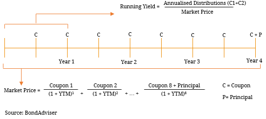

## Table of Contents

## What is running yield?

Running yield is a way to measure the income you get from an investment, like a bond, over a certain time. It shows the return you are getting right now, based on the bond's current price and the interest it pays. For example, if you buy a bond for $1,000 that pays $50 a year in interest, the running yield is 5% ($50 divided by $1,000).

This measure is useful because it helps you see how much money you are making from your investment at the moment. It's different from the yield to maturity, which looks at the total return if you hold the bond until it matures. Running yield is good for comparing different investments to see which one gives you more income right now.

## How is running yield calculated?

Running yield is calculated by taking the annual income from an investment, like the interest from a bond, and dividing it by the current market price of that investment. For example, if a bond pays $50 in interest each year and its current market price is $1,000, you would divide $50 by $1,000 to get a running yield of 5%.

This calculation helps investors see how much money they are making from their investment right now. It's a simple way to compare different investments based on the income they provide at the moment. Keep in mind that running yield doesn't account for changes in the investment's price over time or what you might get if you hold it until it matures.

## Why is running yield important for investors?

Running yield is important for investors because it shows how much money they are making from their investment right now. It's a simple way to see the income an investment like a bond is giving them at the moment. This can help investors decide if they are happy with the money they are getting or if they should look for something that pays more.

It's also useful for comparing different investments. If an investor is looking at two bonds, they can use the running yield to see which one gives them more income right now. This helps them make better choices about where to put their money. But, it's good to remember that running yield only tells part of the story. It doesn't show what might happen in the future or what they might get if they keep the investment until it ends.

## Can you explain the difference between running yield and yield to maturity?

Running yield and yield to maturity are two ways to look at how much money you can make from a bond, but they show different things. Running yield is all about the money you get right now. It's figured out by taking the yearly interest the bond pays and dividing it by what the bond costs right now. If you have a bond that gives you $50 a year and you bought it for $1,000, your running yield is 5%. This helps you see how much income you're getting at the moment, and it's good for comparing different bonds to see which one gives you more money now.

Yield to maturity, on the other hand, looks at the total money you might get if you keep the bond until it ends. It takes into account not just the yearly interest but also any changes in the bond's price over time and the money you get back when the bond matures. If you buy a bond for less than its face value, the yield to maturity could be higher than the running yield because you might make money when the bond pays you back its full value at the end. This measure gives you a bigger picture of what you might earn over the whole time you own the bond, but it's harder to figure out and depends on guesses about the future.

## How does running yield relate to the coupon rate of a bond?

Running yield and the coupon rate of a bond are related but they're not the same thing. The coupon rate is the yearly interest rate that the bond pays, based on its face value. For example, if a bond has a face value of $1,000 and a coupon rate of 5%, it will pay $50 in interest each year. This rate stays the same as long as you own the bond.

Running yield, on the other hand, is figured out by dividing the yearly interest by what the bond costs right now. If that same bond with a $50 yearly interest is now selling for $900, the running yield would be about 5.56% ($50 divided by $900). So, while the coupon rate tells you the interest based on the bond's face value, the running yield tells you how much money you're making right now based on what you paid for the bond. This means the running yield can change as the bond's price changes, even though the coupon rate stays the same.

## What factors can affect the running yield of a bond?

The running yield of a bond can change because of different things. One big thing is the price of the bond. If the price goes up, the running yield goes down because you're getting the same amount of interest but you paid more for the bond. If the price goes down, the running yield goes up because you're getting the same interest but you paid less for the bond.

Another thing that can affect the running yield is changes in interest rates. When interest rates go up, new bonds come out with higher coupon rates, so older bonds with lower coupon rates might not seem as good. This can make the price of the older bonds go down, which can make their running yield go up. On the other hand, if interest rates go down, new bonds have lower coupon rates, and older bonds with higher coupon rates might look better, making their prices go up and their running yield go down.

Also, the bond's credit rating can play a part. If a bond's credit rating gets worse, people might think it's riskier to own, so they might want a higher return to take that risk. This can make the bond's price go down, which can make the running yield go up. If the credit rating gets better, the opposite can happen, with the price going up and the running yield going down.

## How can running yield help in assessing the income potential of a bond?

Running yield is a useful way to see how much money a bond is giving you right now. It's like a quick check to see if the bond is a good deal for the income it's bringing in. You figure out the running yield by dividing the yearly interest the bond pays by what you paid for it. If a bond gives you $50 a year and you bought it for $1,000, the running yield is 5%. This helps you see if the bond is worth it based on the money you're getting at the moment.

Running yield is great for comparing different bonds to see which one gives you more money now. If you're looking at two bonds, one with a running yield of 4% and another with 6%, you can see that the second one is giving you more income right away. But remember, running yield doesn't tell you everything. It doesn't show you what might happen in the future or what you'll get if you keep the bond until it ends. So, while it's a helpful tool, it's just one part of understanding a bond's income potential.

## What are the limitations of using running yield as an investment metric?

Running yield is a helpful way to see how much money you're getting from a bond right now, but it doesn't tell you everything about the investment. One big problem is that it only looks at the income you're getting at the moment and doesn't think about what might happen in the future. For example, it doesn't consider changes in the bond's price or what you'll get when the bond matures. If you buy a bond at a lower price than its face value, the running yield might look good, but you could miss out on the extra money you'd get when the bond pays back its full value at the end.

Another limitation is that running yield doesn't take into account the risk of the bond. If a bond's credit rating goes down, it might become riskier to own, but the running yield might still look good because the bond's price dropped. This could make you think the bond is a better deal than it really is. Also, running yield doesn't show you how the bond fits into your whole investment plan. You might find a bond with a high running yield, but if it doesn't match your goals or how long you want to keep your money invested, it might not be the best choice for you.

## How does market interest rate change impact the running yield?

When market interest rates go up, it can make the running yield of a bond go up too. This happens because new bonds come out with higher interest rates, so the older bonds with lower interest rates don't look as good. People might not want to buy the older bonds as much, so their price goes down. When the price of a bond goes down, but the interest it pays stays the same, the running yield goes up. For example, if a bond pays $50 a year and its price drops from $1,000 to $900 because of higher market rates, the running yield goes from 5% to about 5.56%.

On the other hand, if market interest rates go down, it can make the running yield of a bond go down. New bonds come out with lower interest rates, so the older bonds with higher interest rates look better. More people want to buy these older bonds, which can make their price go up. When the price of a bond goes up, but the interest it pays stays the same, the running yield goes down. For example, if that same bond paying $50 a year sees its price go up from $1,000 to $1,100 because of lower market rates, the running yield drops from 5% to about 4.55%.

## In what scenarios might running yield be misleading for investors?

Running yield can be misleading for investors if they only look at it without thinking about the bond's price changes. For example, if a bond's price drops a lot because people think it's riskier now, the running yield might look really good. But if you buy the bond just because of the high running yield, you might lose money if the bond's price keeps going down or if the company can't pay back the bond at all. So, a high running yield could make a bond seem like a good deal when it's actually a risky choice.

Also, running yield doesn't tell you about what will happen when the bond matures. If you buy a bond for less than its face value, the running yield might be high, but you could miss out on the extra money you'd get when the bond pays back its full value at the end. This means the running yield might make you think you're getting a better return than you really are if you plan to hold the bond until it matures. So, it's important to look at the whole picture, not just the running yield, when deciding if a bond is a good investment.

## How can running yield be used in portfolio management?

Running yield can be a useful tool for managing a portfolio because it helps investors see how much money they are making from their bonds right now. When you're deciding which bonds to keep or buy, looking at the running yield can help you compare them and see which ones give you more income at the moment. If you want to make sure your portfolio is giving you a good amount of income, you might choose bonds with higher running yields. This can be especially important if you're living off the income from your investments and need to know how much money you can count on each year.

But, it's important to remember that running yield is just one part of the story. It doesn't tell you about what might happen in the future or what you'll get if you keep the bond until it ends. So, while it's good for looking at the income you're getting right now, you also need to think about other things like the bond's price changes and how it fits into your overall investment plan. Using running yield along with other measures can help you make better choices about your portfolio and make sure you're not missing out on other important details.

## What advanced techniques can be applied to enhance the accuracy of running yield calculations?

To make running yield calculations more accurate, you can use a few advanced techniques. One way is to look at the bond's accrued interest. This is the interest that has built up since the last time the bond paid out but hasn't been paid yet. By adding this to the yearly interest, you get a more complete picture of the income the bond is giving you right now. Another technique is to use a more exact way of figuring out the bond's price, like looking at the average price over a short time instead of just the price at one moment. This can help smooth out any quick changes in the bond's price and give you a better idea of the running yield.

Another advanced technique is to think about the bond's call features. Some bonds can be paid back early by the company that issued them, which can change how much money you get from the bond. If you include the chance of the bond being called in your calculations, you can get a more accurate running yield. Also, you can use computer programs or financial models that take into account more details, like the bond's credit risk and changes in market interest rates. These models can help you see how different things might affect the running yield and give you a better idea of what to expect from your bond investments.

## What is Understanding Running Yield?

Running yield is a critical metric representing the annual income generated from an investment relative to its current market value. Expressed as a percentage, running yield provides investors with an ongoing assessment of the income-producing capability of their holdings, particularly in instruments like bonds and other fixed-income securities. It offers a dynamic perspective as compared to static measures based on a security's original price.

The calculation of running yield is straightforward. It is determined by dividing the annual income from the investment, typically in the form of interest or dividends, by the current market price of the security:

$$
\text{Running Yield} = \left( \frac{\text{Annual Income}}{\text{Current Market Price}} \right) \times 100\%
$$

This formula provides investors with an immediate view of the income return on their investment based on the prevailing market conditions. Notably, running yield is distinct from the nominal yield, which is based on the face value rather than the market value. Nominal yield is calculated by taking the total annual coupon payments and dividing them by the face value of the bond:

$$
\text{Nominal Yield} = \left( \frac{\text{Annual Coupon Payments}}{\text{Face Value}} \right) \times 100\%
$$

The key difference between running yield and nominal yield lies in the denominator: while running yield considers the current market price, nominal yield considers the fixed face value. This distinction is crucial because market prices fluctuate with changes in interest rates, economic conditions, and issuer creditworthiness. Consequently, running yield can provide a more accurate reflection of the expected return on investment, especially in volatile markets.

By using market prices instead of face values, running yield offers a practical measure that reflects current income generation potential under existing market conditions. This makes it a valuable tool for investors assessing the profitability and attractiveness of fixed-income securities. It is particularly useful in evaluating bonds, where income continuity is a primary consideration.

To summarize, running yield is a pivotal indicator for investors focusing on income-generating assets, offering an up-to-date perspective on investment value that adjusts with market dynamics. Understanding and comparing running yield with nominal yield equips investors to make more informed decisions in structuring their investment portfolios.

## What are the key concepts of investment returns?

Investment returns serve as a fundamental measure in evaluating the performance and viability of investments over time. These returns are primarily influenced by three main income components: dividends, interest, and capital gains. Each component plays a unique role in determining the overall yield an investor can expect from an investment vehicle.

Dividends refer to the profit distribution made by a company to its shareholders, typically derived from net earnings. They are a significant income source for equity investors, especially those focusing on dividend-paying stocks. Interest, on the other hand, is the income earned from fixed-income securities like bonds, where investors receive a predetermined interest payment at regular intervals. Lastly, capital gains represent the profit realized when an asset is sold for a price higher than its original purchase price. These gains can significantly enhance investment returns, especially in bullish market conditions.

Integrating these income components allows investors to assess the running yield, an indicator of the income-generating potential of an investment. The running yield, calculated as the annual income divided by the current market value, provides insights into the immediate income return. In contrast, total returns account not only for income but also for price changes over a period, offering a more comprehensive picture of an investment's performance. Total return can be mathematically expressed as:

$$
\text{Total Return} = \frac{\text{Dividends} + \text{Interest} + \Delta \text{Price}}{\text{Initial Investment Value}}
$$

The interplay between running yield and total returns is crucial for evaluating investments. While running yield focuses on current income, total returns encompass broader performance, including appreciation or depreciation in asset value. An investment may exhibit a high running yield, indicating robust current income, but if asset prices decline, the total return might be adversely affected.

Practically, both metrics should be employed together to craft a well-rounded evaluation. Running yield can guide investors looking for regular income, whereas total returns provide a broader scope, ideal for strategic long-term investment decisions. By analyzing these metrics in tandem, investors are equipped to optimize their portfolios, balancing the need for immediate income with strategic growth objectives.

## What are Financial Analysis Techniques?

Financial analysis is integral to evaluating investment opportunities, employing techniques like ratio analysis and trend analysis to provide deeper insights into financial performance and prospects. These methods enable investors to interpret running yield and return data more effectively, thereby making informed decisions.

Ratio analysis involves assessing various financial metrics to understand a company's operational efficiency, [liquidity](/wiki/liquidity-risk-premium), profitability, and solvency. Common financial ratios include the current ratio, debt-to-equity ratio, return on equity (ROE), and the price-to-earnings (P/E) ratio. For instance, the ROE is calculated as:

$$
\text{ROE} = \frac{\text{Net Income}}{\text{Shareholder's Equity}}
$$

ROE measures how effectively a company utilizes its equity to generate profits, offering insights about management efficiency, which can correlate with consistent running yields.

Trend analysis, on the other hand, scrutinizes historical data to predict future movements. This technique allows investors to identify patterns, such as growth or decline, in financial metrics over time. For example, an upward trend in a company's earnings increases investor confidence, suggesting potential positive impacts on running yields and overall investment returns.

By using these analytical techniques, investors can assess the sustainability of running yields. For instance, they might use ratio analysis to determine a firm's ability to sustain its dividend payments, which directly affects yield. Furthermore, trend analysis can be applied to examine changes in market prices and yields, helping investors adjust their portfolio strategies in response to market [volatility](/wiki/volatility-trading-strategies).

Financial analysis thus plays a pivotal role in optimizing portfolios. By accurately interpreting running yield and return data, investors can enhance their investment strategies, aiming for an optimal balance between risk and return. This analysis also allows for effective portfolio diversification, minimizing risk while maximizing potential returns. As a result, financial analysis provides the critical data needed to make strategic investment decisions tailored to individual goals and market conditions.

## References & Further Reading

1. **Books**:
   - *"Investment Valuation: Tools and Techniques for Determining the Value of Any Asset"* by Aswath Damodaran. This book provides comprehensive techniques for investment valuation, crucial for understanding financial returns and yield metrics.
   - *"Algorithmic Trading: Winning Strategies and Their Rationale"* by Ernest P. Chan. This book covers algorithmic trading strategies and includes insights into leveraging financial metrics like running yield.
   - *"The Intelligent Investor"* by Benjamin Graham. A classic text that introduces investment analysis principles, emphasizing the importance of considering yields and returns in financial decision-making.

2. **Articles**:
   - Harris, L. (2003). *"Trading and Exchanges: Market Microstructure for Practitioners"*. The article provides an overview of market mechanics and the role of algorithmic trading in enhancing trade execution based on financial metrics.
   - Antill, S., & Grenadier, S. R. (2019). *"Optimal Exercise of Real Options"* in the Journal of Financial Economics. This article explores financial options, shedding light on investment returns and how they can be optimized using running yield data.

3. **Academic Journals**:
   - Journal of Financial Economics: Offers peer-reviewed articles on financial analysis techniques, including those that apply running yield metrics to evaluate investment performance.
   - Financial Analysts Journal: Publishes research on the intersection of financial analysis and algorithmic trading, with practical applications for various trading strategies.

4. **Online Courses and Seminars**:
   - Coursera's "Financial Markets" by Yale University: An online course covering the basics and complexities of financial markets, including investment returns and yields.
   - edX's "Algorithmic Trading and Stocks Essentials" by Harvard University: This course covers essential concepts in algorithmic trading and financial analytics.

5. **Reports and White Papers**:
   - "The Role of Yield in Investment Returns: An Analysis" by Thomson Reuters: This white paper investigates into the significance of various yield types, providing crucial insights for investors.
   - "Algorithmic Trading Models: Approaches and Strategies" by Deloitte: A report exploring different models and strategies in algorithmic trading, emphasizing the use of financial metrics like running yield.

6. **Further Reading Suggestions**:
   - Explore quantitative finance forums and websites such as QuantConnect and QuantInsti, where practitioners share strategies and insights related to algorithmic trading and financial analysis.
   - Regularly review publications from financial institutions like BlackRock and Vanguard, which often include insights into yield calculations and their application in portfolio management. 

These resources offer a rich foundation for anyone looking to expand their understanding of investment concepts, particularly running yield, financial analysis, and the implementation of algorithmic trading.

