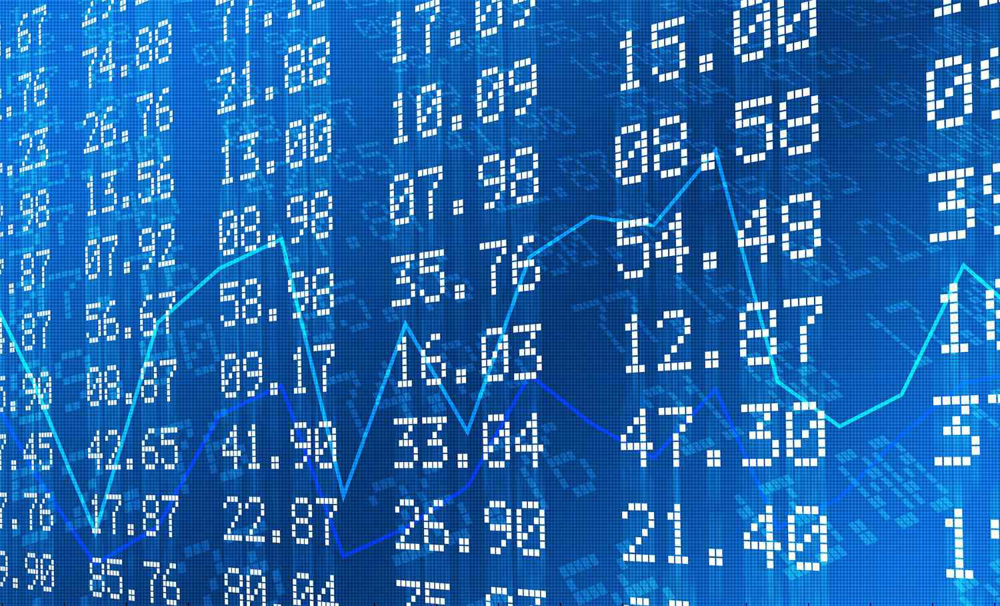

In the dynamic world of financial markets, investment analysis requires a thorough comprehension of key metrics and the ability to effectively integrate these metrics with modern trading strategies. Among these crucial metrics, running yield and investment returns stand out as significant indicators for evaluating the profitability and sustainability of investments. Running yield, which is the annual income generated by an investment divided by its current market value, provides a snapshot of expected income relative to present market conditions. This measure is particularly relevant for continuous income-generating investments like bonds and is expressed as a percentage, providing investors with a clear perspective on the potential earnings from their investments.

Moreover, investment returns, which encompass the total gain or loss received from an investment over a specific period, serve as a cornerstone for assessing the performance of an investment. These returns are influenced by various components, including dividends, interest, and capital gains. Understanding the interplay between running yield and total returns is vital for investors aiming to evaluate investment performance comprehensively. Both metrics enable investors to compare different investment opportunities and make informed decisions that align with their financial goals.



Algorithmic trading has emerged as a transformative force in integrating these financial metrics into investment strategies. By utilizing complex algorithms to execute trades based on predetermined criteria, this approach enhances both the speed and precision of trading operations. The synergy between financial analysis and algorithmic trading is evident, as it allows for the optimization of trading strategies through data-driven insights.

This article explores the interactions between running yield, financial analysis, and their application in algorithmic trading. Through this exploration, readers will gain a deeper understanding of how these components come together to form robust investment strategies. By the end of this article, insights gained will empower investors to optimize investment strategies and achieve improved returns by leveraging the integration of financial metrics and algorithmic trading.

## Table of Contents

## Understanding Running Yield

Running yield is a critical metric representing the annual income generated from an investment relative to its current market value. Expressed as a percentage, running yield provides investors with an ongoing assessment of the income-producing capability of their holdings, particularly in instruments like bonds and other fixed-income securities. It offers a dynamic perspective as compared to static measures based on a security's original price.

The calculation of running yield is straightforward. It is determined by dividing the annual income from the investment, typically in the form of interest or dividends, by the current market price of the security:

$$
\text{Running Yield} = \left( \frac{\text{Annual Income}}{\text{Current Market Price}} \right) \times 100\%
$$

This formula provides investors with an immediate view of the income return on their investment based on the prevailing market conditions. Notably, running yield is distinct from the nominal yield, which is based on the face value rather than the market value. Nominal yield is calculated by taking the total annual coupon payments and dividing them by the face value of the bond:

$$
\text{Nominal Yield} = \left( \frac{\text{Annual Coupon Payments}}{\text{Face Value}} \right) \times 100\%
$$

The key difference between running yield and nominal yield lies in the denominator: while running yield considers the current market price, nominal yield considers the fixed face value. This distinction is crucial because market prices fluctuate with changes in interest rates, economic conditions, and issuer creditworthiness. Consequently, running yield can provide a more accurate reflection of the expected return on investment, especially in volatile markets.

By using market prices instead of face values, running yield offers a practical measure that reflects current income generation potential under existing market conditions. This makes it a valuable tool for investors assessing the profitability and attractiveness of fixed-income securities. It is particularly useful in evaluating bonds, where income continuity is a primary consideration.

To summarize, running yield is a pivotal indicator for investors focusing on income-generating assets, offering an up-to-date perspective on investment value that adjusts with market dynamics. Understanding and comparing running yield with nominal yield equips investors to make more informed decisions in structuring their investment portfolios.

## Investment Returns: Key Concepts

Investment returns serve as a fundamental measure in evaluating the performance and viability of investments over time. These returns are primarily influenced by three main income components: dividends, interest, and capital gains. Each component plays a unique role in determining the overall yield an investor can expect from an investment vehicle.

Dividends refer to the profit distribution made by a company to its shareholders, typically derived from net earnings. They are a significant income source for equity investors, especially those focusing on dividend-paying stocks. Interest, on the other hand, is the income earned from fixed-income securities like bonds, where investors receive a predetermined interest payment at regular intervals. Lastly, capital gains represent the profit realized when an asset is sold for a price higher than its original purchase price. These gains can significantly enhance investment returns, especially in bullish market conditions.

Integrating these income components allows investors to assess the running yield, an indicator of the income-generating potential of an investment. The running yield, calculated as the annual income divided by the current market value, provides insights into the immediate income return. In contrast, total returns account not only for income but also for price changes over a period, offering a more comprehensive picture of an investment's performance. Total return can be mathematically expressed as:

$$
\text{Total Return} = \frac{\text{Dividends} + \text{Interest} + \Delta \text{Price}}{\text{Initial Investment Value}}
$$

The interplay between running yield and total returns is crucial for evaluating investments. While running yield focuses on current income, total returns encompass broader performance, including appreciation or depreciation in asset value. An investment may exhibit a high running yield, indicating robust current income, but if asset prices decline, the total return might be adversely affected.

Practically, both metrics should be employed together to craft a well-rounded evaluation. Running yield can guide investors looking for regular income, whereas total returns provide a broader scope, ideal for strategic long-term investment decisions. By analyzing these metrics in tandem, investors are equipped to optimize their portfolios, balancing the need for immediate income with strategic growth objectives.

## Financial Analysis Techniques

Financial analysis is integral to evaluating investment opportunities, employing techniques like ratio analysis and trend analysis to provide deeper insights into financial performance and prospects. These methods enable investors to interpret running yield and return data more effectively, thereby making informed decisions.

Ratio analysis involves assessing various financial metrics to understand a company's operational efficiency, [liquidity](/wiki/liquidity-risk-premium), profitability, and solvency. Common financial ratios include the current ratio, debt-to-equity ratio, return on equity (ROE), and the price-to-earnings (P/E) ratio. For instance, the ROE is calculated as:

$$
\text{ROE} = \frac{\text{Net Income}}{\text{Shareholder's Equity}}
$$

ROE measures how effectively a company utilizes its equity to generate profits, offering insights about management efficiency, which can correlate with consistent running yields.

Trend analysis, on the other hand, scrutinizes historical data to predict future movements. This technique allows investors to identify patterns, such as growth or decline, in financial metrics over time. For example, an upward trend in a company's earnings increases investor confidence, suggesting potential positive impacts on running yields and overall investment returns.

By using these analytical techniques, investors can assess the sustainability of running yields. For instance, they might use ratio analysis to determine a firm's ability to sustain its dividend payments, which directly affects yield. Furthermore, trend analysis can be applied to examine changes in market prices and yields, helping investors adjust their portfolio strategies in response to market [volatility](/wiki/volatility-trading-strategies).

Financial analysis thus plays a pivotal role in optimizing portfolios. By accurately interpreting running yield and return data, investors can enhance their investment strategies, aiming for an optimal balance between risk and return. This analysis also allows for effective portfolio diversification, minimizing risk while maximizing potential returns. As a result, financial analysis provides the critical data needed to make strategic investment decisions tailored to individual goals and market conditions.

## Algorithmic Trading: Leveraging Financial Metrics

Algorithmic trading involves the use of computer algorithms to automate trading decisions based on pre-determined criteria. It integrates financial metrics such as running yield and investment returns to optimize trading strategies. Running yield, the annual income of an investment divided by its current market value, provides real-time insights into potential income streams from investments like bonds. Similarly, investment returns, which encompass income components like dividends, interest, and capital gains, offer a comprehensive view of an investment's performance over time.

The benefits of [algorithmic trading](/wiki/algorithmic-trading) include enhanced speed and precision, key advantages in financial markets where rapid decision-making is crucial. By executing trades algorithmically, investors can respond to market changes in a fraction of a second, far quicker than manual trading. Additionally, algorithms can process vast amounts of financial data and run complex analyses, enabling traders to identify trends and patterns that might not be apparent otherwise.

A practical example of algorithmic trading involves strategies that optimize trades based on running yield and investment return metrics. For instance, a bond trading algorithm might continuously analyze market data to calculate the running yield of various bonds, adjusting the portfolio to enhance yield optimization. This might involve selling bonds with lower running yields and purchasing those that offer higher returns based on current market prices.

In equity markets, algorithms can monitor financial ratios and trends, assessing data such as dividend yields and recent performance metrics to make informed trading decisions. For example, an algorithm could be programmed to prioritize stocks with rising dividend yields or to buy shares in companies with consistently increasing total returns, optimizing an equity portfolio's overall yield.

Algorithmic trading can be implemented using programming languages such as Python. Below is an example of a simple Python script to calculate the running yield of a bond, which could be a component of a larger trading algorithm:

```python
def running_yield(annual_income, market_value):
    return (annual_income / market_value) * 100

# Example usage
annual_income = 5000  # example annual income from a bond
market_value = 100000  # current market value of the bond
yield_percentage = running_yield(annual_income, market_value)
print(f"Running Yield: {yield_percentage:.2f}%")
```

This basic calculation can be integrated into a larger system designed to execute trades based on yield data. Beyond computing yields, algorithmic systems utilize various financial metrics in comprehensive models, continuously refining trading strategies to enhance returns while managing risk.

Real-world applications of algorithmic trading using financial metrics can be observed in quantitative hedge funds and high-frequency trading platforms. These entities often deploy complex algorithms that analyze diverse datasets—including economic indicators, market sentiment, and historical price trends—to inform their trading strategies, driving success in dynamic and competitive financial environments.

## Case Studies and Examples

### Case Study 1: Utilizing Running Yield in a Volatile Bond Market for Optimized Returns

In the bond market, running yield serves as a crucial metric for investors managing [interest rate](/wiki/interest-rate-trading-strategies) risk. Running yield, calculated as the annual income from a bond divided by its current market price, is essential for evaluating investment income in fluctuating market conditions. As markets become volatile, traditional metrics based on nominal value may fail to reflect the real-time valuation of bond income. The running yield addresses this by focusing on present market conditions, providing a more accurate measure of yield.

For instance, consider an investor holding a bond with a nominal interest rate of 5% and a face value of $1,000. If the market price of the bond drops to $900 due to market volatility, the running yield would be 5.56% ($50 interest / $900 market price), offering a better representation of income relative to its current valuation. By utilizing running yield, investors can identify undervalued bonds in periods of market stress and optimize their portfolio for better returns.

### Case Study 2: Algorithmic Trading to Manage Equity Portfolios Focusing on Yield and Capital Gains

Algorithmic trading enhances investment strategies by employing computer algorithms to execute trades based on predefined criteria. This method allows investors to capitalize on market opportunities by adjusting their portfolios in real time with precision and speed. When applied to equity portfolios, algorithms can optimize returns by balancing yield considerations, such as dividend income, with capital gain opportunities.

For example, an algorithm might be designed to scan the market for stocks offering a high dividend yield while simultaneously monitoring their potential for capital appreciation. By employing [machine learning](/wiki/machine-learning) techniques, the algorithm can analyze historical and real-time market data to predict stock performance, adjusting the portfolio dynamically to maximize total returns. Python, a popular language for developing financial models, can be used to program such an algorithm:

```python
import numpy as np
import pandas as pd
from sklearn.ensemble import RandomForestRegressor

# Example data
equity_data = pd.DataFrame({'Dividend Yield': [0.03, 0.05, 0.02], 
                            'Price Change': [0.04, 0.01, 0.06], 
                            'Stock': ['A', 'B', 'C']})

# Defining the target (total return)
equity_data['Total Return'] = equity_data['Dividend Yield'] + equity_data['Price Change']

# Model training
X = equity_data[['Dividend Yield', 'Price Change']]
y = equity_data['Total Return']
model = RandomForestRegressor()
model.fit(X, y)

# Predicting total return for potential investments
potential_equities = pd.DataFrame({'Dividend Yield': [0.04, 0.06], 'Price Change': [0.03, 0.02]})
predictions = model.predict(potential_equities)
print(predictions)
```

This script uses a random forest regressor to predict total returns based on dividend yield and price change, assisting in decision-making for portfolio adjustments. The use of algorithmic trading in this context enables the efficient management of equity portfolios, with a focus on achieving optimal yields alongside capital gains.

These case studies demonstrate the practical application of financial analysis in conjunction with advanced trading techniques. By leveraging quantitative metrics such as running yield and incorporating algorithmic trading strategies, investors are better equipped to navigate market complexities and enhance investment outcomes.

## Conclusion

Investment yield, financial analysis, and algorithmic trading are pivotal components shaping modern investment strategies. Each of these concepts contributes uniquely and significantly to the landscape of financial management and trading. Investment yield, where running yield plays a central role, provides investors with a metric to evaluate continuous income against an asset's current market price, serving as a benchmark for gauging the profitability of investments. This is especially pertinent in assessing instruments like bonds, where ongoing income and market valuation are critical.

Financial analysis, encompassing techniques such as ratio analysis and trend analysis, offers the tools necessary to interpret and dissect financial data, enabling investors to derive meaningful insights. These insights empower investors to optimize their portfolios, assess risk, and ensure that their investment strategies are aligned with their financial goals.

Algorithmic trading leverages advancements in technology to execute trades based on specific, pre-determined criteria. This approach enhances the speed, precision, and efficiency of trades, reducing the manual intervention that often leads to delays and errors. By integrating comprehensive financial analyses into algorithmic frameworks, investors can utilize running yield and returns data to create sophisticated strategies that respond dynamically to market conditions.

As technology continues to evolve, these financial concepts are expected to further integrate with algorithmic trading, ushering in transformative changes in how investments are approached and managed. Machine learning and [artificial intelligence](/wiki/ai-artificial-intelligence) are likely to play a significant role in refining these algorithms, analyzing data patterns with unprecedented accuracy, and predicting market movements with greater precision. Consequently, the fusion of investment yield insight, thorough financial analysis, and advanced algorithmic trading strategies is anticipated to offer investors better returns and improved decision-making capabilities, ultimately redefining the contours of modern investment approaches.

## References & Further Reading

1. **Books**:
   - *"Investment Valuation: Tools and Techniques for Determining the Value of Any Asset"* by Aswath Damodaran. This book provides comprehensive techniques for investment valuation, crucial for understanding financial returns and yield metrics.
   - *"Algorithmic Trading: Winning Strategies and Their Rationale"* by Ernest P. Chan. This book covers algorithmic trading strategies and includes insights into leveraging financial metrics like running yield.
   - *"The Intelligent Investor"* by Benjamin Graham. A classic text that introduces investment analysis principles, emphasizing the importance of considering yields and returns in financial decision-making.

2. **Articles**:
   - Harris, L. (2003). *"Trading and Exchanges: Market Microstructure for Practitioners"*. The article provides an overview of market mechanics and the role of algorithmic trading in enhancing trade execution based on financial metrics.
   - Antill, S., & Grenadier, S. R. (2019). *"Optimal Exercise of Real Options"* in the Journal of Financial Economics. This article explores financial options, shedding light on investment returns and how they can be optimized using running yield data.

3. **Academic Journals**:
   - Journal of Financial Economics: Offers peer-reviewed articles on financial analysis techniques, including those that apply running yield metrics to evaluate investment performance.
   - Financial Analysts Journal: Publishes research on the intersection of financial analysis and algorithmic trading, with practical applications for various trading strategies.

4. **Online Courses and Seminars**:
   - Coursera's "Financial Markets" by Yale University: An online course covering the basics and complexities of financial markets, including investment returns and yields.
   - edX's "Algorithmic Trading and Stocks Essentials" by Harvard University: This course covers essential concepts in algorithmic trading and financial analytics.

5. **Reports and White Papers**:
   - "The Role of Yield in Investment Returns: An Analysis" by Thomson Reuters: This white paper investigates into the significance of various yield types, providing crucial insights for investors.
   - "Algorithmic Trading Models: Approaches and Strategies" by Deloitte: A report exploring different models and strategies in algorithmic trading, emphasizing the use of financial metrics like running yield.

6. **Further Reading Suggestions**:
   - Explore quantitative finance forums and websites such as QuantConnect and QuantInsti, where practitioners share strategies and insights related to algorithmic trading and financial analysis.
   - Regularly review publications from financial institutions like BlackRock and Vanguard, which often include insights into yield calculations and their application in portfolio management. 

These resources offer a rich foundation for anyone looking to expand their understanding of investment concepts, particularly running yield, financial analysis, and the implementation of algorithmic trading.

