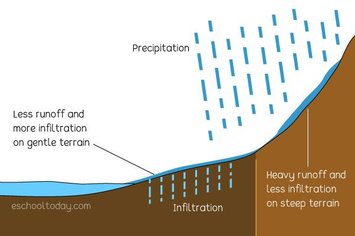

## Table of Contents

## What is runoff?

Runoff is the water that flows over the surface of the ground when it rains or when snow melts. Instead of soaking into the soil, this water moves across the land and can carry with it soil, chemicals, and other materials. This happens because the ground is already saturated, or the soil is too hard or impermeable to absorb the water quickly enough.

Runoff can cause problems like erosion, where it washes away soil and can change the shape of the land. It can also pollute rivers, lakes, and oceans by carrying harmful substances into them. Managing runoff is important to protect our environment and prevent damage to buildings and roads. People use methods like building drainage systems and planting vegetation to control where the water goes and reduce its harmful effects.

## How does runoff occur?

Runoff happens when rain or melting snow falls on the ground and doesn't soak into the soil. This can occur because the soil is already full of water, or because the ground is hard and doesn't let water in easily. When this happens, the water starts to flow over the surface of the land instead of going into the ground.

As the water flows, it can pick up things like dirt, chemicals, and trash. This water then moves downhill, following the shape of the land until it reaches a larger body of water like a river, lake, or ocean. The amount of runoff depends on how much it rains, how steep the land is, and what the ground is made of.

## What are the main causes of runoff?

Runoff happens when the ground can't soak up all the water that falls on it. This can happen when it rains a lot or when snow melts quickly. If the ground is already wet from earlier rain, it can't take in any more water. Also, if the soil is hard or covered with things like buildings and roads, water can't get into the ground easily. These are the main reasons why water starts to run over the surface instead of going into the soil.

The shape of the land also affects runoff. If the land is steep, water moves quickly downhill and doesn't have time to soak in. Flat land can hold more water, but if it's too wet, runoff still happens. Another cause is when people change the land, like building cities or farms. These changes can make it harder for water to go into the ground, leading to more runoff.

## What is the difference between surface runoff and subsurface runoff?

Surface runoff is the water that you can see flowing over the ground when it rains or when snow melts. This happens when the soil is too wet or too hard to soak up all the water. The water stays on top of the ground and moves downhill, [picking](/wiki/asset-class-picking) up dirt and other things along the way. It can cause problems like erosion and pollution in rivers and lakes.

Subsurface runoff, on the other hand, is the water that flows through the soil and underground. This happens when the soil can soak up some of the water, but it can't hold it all. The extra water moves through the ground until it reaches a place where it can come back up to the surface, like a stream or a spring. Subsurface runoff is harder to see because it's underground, but it still affects how much water ends up in rivers and lakes.

## How does runoff affect the environment?

Runoff can harm the environment in many ways. When water flows over the ground, it can [carry](/wiki/carry-trading) away soil, which causes erosion. This can change the shape of the land and make it hard for plants to grow. Runoff can also pick up harmful things like chemicals from farms or trash from cities. When this water reaches rivers, lakes, or oceans, it can pollute the water and hurt the animals and plants that live there.

Managing runoff is important to protect our environment. People build things like drainage systems and rain gardens to control where the water goes. These help to slow down the water and let more of it soak into the ground instead of running off. Planting trees and other plants can also help, because their roots hold the soil in place and soak up water. By doing these things, we can reduce the bad effects of runoff and keep our environment healthy.

## What are the common methods used to measure runoff?

To measure runoff, people often use something called a runoff gauge or a weir. A runoff gauge is a device that measures how much water flows past a certain point. It can be put in a stream or a drainage ditch to see how much water is moving. A weir is a small dam that makes the water flow through a narrow space, which makes it easier to measure. Both of these tools help scientists understand how much runoff is happening in a certain area.

Another way to measure runoff is by using a rain gauge and looking at the soil. A rain gauge tells you how much rain fell in a certain place. If you know how much rain fell and how much water stayed in the soil, you can figure out how much ran off. Scientists can take samples of the soil to see how wet it is. By comparing the rain and the soil moisture, they can estimate the runoff. This method helps to understand the bigger picture of how water moves in an area.

There are also computer models that scientists use to measure runoff. These models use a lot of information, like weather data, the shape of the land, and how much rain fell, to predict how much runoff will happen. These models can be very helpful because they can look at large areas and predict what might happen in the future. They help people plan for things like floods and make decisions about how to manage water in their communities.

## How can runoff be managed or controlled?

Runoff can be managed or controlled by using different methods to help the water soak into the ground instead of running off. One way is to build rain gardens, which are special gardens that catch rainwater and let it soak slowly into the soil. These gardens can be planted with flowers, bushes, or trees that help hold the soil in place and take in water. Another way is to use permeable pavement, which is a type of pavement that lets water through instead of making it run off. This can be used for driveways, parking lots, and roads to help reduce runoff.

Another method is to create green roofs, which are roofs covered with plants. These roofs can soak up rainwater and help reduce the amount of runoff from buildings. Also, building drainage systems like ditches and swales can help direct runoff to places where it can be safely managed. These systems can slow down the water and help it soak into the ground. Planting more trees and other plants can also help because their roots hold the soil in place and soak up water, reducing the amount of runoff.

In addition to these methods, people can also use things like rain barrels to catch and store rainwater for later use. This can help reduce the amount of water that runs off their property. Changing how we use the land, like not building too many buildings or roads, can also help because it leaves more natural areas where water can soak in. By using these different methods, we can control runoff and help protect the environment.

## What historical events have significantly influenced our understanding of runoff?

One big event that helped us learn more about runoff was the Great Mississippi Flood of 1927. This flood was one of the worst in U.S. history. It happened because a lot of rain fell and the rivers couldn't hold all the water. The water ran off the land and into the rivers, making them overflow. This flood showed people how important it is to manage runoff and build better systems to control water. It led to new laws and ways to manage rivers and prevent big floods.

Another important event was the Dust Bowl in the 1930s. This happened in the Great Plains of the United States. Farmers had plowed up a lot of the land, which made the soil loose. When it rained, the water couldn't soak into the ground and ran off instead. This runoff, along with strong winds, blew away the topsoil and created huge dust storms. The Dust Bowl showed how changing the land can make runoff worse and cause big problems. It led to new farming methods and ways to protect the soil and manage water better.

## What are the key theories or models used to predict runoff?

One important theory for predicting runoff is the Rational Method. This method is simple and often used for small areas like city streets or parking lots. It says that the amount of runoff depends on how much rain falls, how big the area is, and how much of the rain turns into runoff. The Rational Method uses a formula to figure this out. It's helpful because it's easy to use, but it might not be as accurate for bigger areas or when the rain is very heavy.

Another key model is the Soil Conservation Service (SCS) Curve Number Method, now known as the Natural Resources Conservation Service (NRCS) method. This method looks at the type of soil, the land's slope, and how the land is used to predict how much runoff will happen. It uses a special number called a "curve number" to show how much water the ground can soak up. The SCS method is good for bigger areas and can handle different kinds of rain. It's more complex than the Rational Method but can give more accurate predictions for places with different types of land and soil.

Both the Rational Method and the SCS Curve Number Method help us understand and predict runoff. They use different information and can be used in different situations. By using these models, engineers and planners can better manage water and reduce the harm that runoff can cause.

## How does climate change impact runoff patterns?

Climate change is making runoff patterns different. When the weather gets warmer, snow melts faster and earlier in the year. This means more water runs off the land all at once, which can cause floods. Also, when it rains a lot in a short time, the ground can't soak up all the water, so more of it runs off. This is happening more often because of climate change, which can lead to more erosion and pollution in rivers and lakes.

Another way climate change affects runoff is by changing how much rain falls in different places. Some places are getting more rain, while others are getting less. When it rains a lot, runoff can be a big problem because the ground gets too wet to soak up all the water. In places where it's getting drier, the ground can get hard and not soak up water well, so even small rains can cause runoff. These changes make it harder to predict and manage runoff, and can cause more problems for people and the environment.

## What are the advanced technologies used in runoff analysis?

Advanced technologies help us study runoff better. One technology is remote sensing, which uses satellites and airplanes to take pictures of the Earth. These pictures can show us how much water is on the ground and how it's moving. This helps scientists understand runoff without having to go to the place themselves. Another technology is Geographic Information Systems (GIS), which is like a computer map that can show different information about the land, like where the water goes and how much rain falls. GIS helps us see patterns and make better plans to manage runoff.

Another advanced technology is using computer models to predict runoff. These models use a lot of information, like weather data, the shape of the land, and how much rain fell, to guess what will happen with runoff. They can look at big areas and even predict what might happen in the future. This helps people plan for things like floods and make decisions about how to manage water in their communities. By using these technologies, we can understand runoff better and find ways to control it and protect our environment.

## What future research directions are being considered in the field of runoff studies?

Future research in runoff studies is looking at how climate change will keep changing runoff patterns. Scientists want to know more about how much more rain or snow will lead to more runoff and what that means for floods and water pollution. They are using computer models to predict these changes and find ways to manage runoff better. This research will help us prepare for the future and make sure our cities and farms can handle more water.

Another direction for future research is using new technology to study runoff. Scientists are working on better ways to use remote sensing from satellites and drones to see runoff happening in real time. They also want to improve Geographic Information Systems (GIS) to make more detailed maps of where runoff goes and how it affects the land. These technologies will help us understand runoff better and find new ways to control it and protect our environment.

## What is Algorithmic Trading: A Primer?

Algorithmic trading involves utilizing computer algorithms to execute market transactions with minimal human intervention. By automating these processes, [algorithmic trading](/wiki/algorithmic-trading) reduces human error and significantly enhances the efficiency of trading operations. One of the core objectives of algorithmic trading is to exploit market opportunities that may exist only briefly, requiring rapid and accurate execution.

At the heart of algorithmic trading is the capacity to analyze vast datasets. The algorithms employed are designed to sift through historical and real-time market data, identify patterns, and predict future movements. This enables traders to capitalize on small price discrepancies or forecast significant market shifts. 

Consider an example of a simple moving average (SMA) crossover algorithm. This strategy involves calculating two simple moving averages—a short-term average and a long-term average:

$$
\text{SMA}_\text{short} = \frac{1}{n} \sum_{i=0}^{n-1} p_{t-i}
$$

$$
\text{SMA}_\text{long} = \frac{1}{m} \sum_{i=0}^{m-1} p_{t-i}
$$

where $p_t$ is the price at time $t$, and $n$ and $m$ are the number of periods for the short-term and long-term moving averages, respectively. A buy signal is generated when the SMA_short crosses above the SMA_long, and a sell signal is generated when it crosses below.

Python code to implement a simple moving average crossover might look like this:

```python
import numpy as np
import pandas as pd

def sma_crossover(data, short_window, long_window):
    """
    Implement a simple moving average crossover strategy.

    :param data: pandas DataFrame with a column 'Close' for closing prices
    :param short_window: int - the period for the short-term moving average
    :param long_window: int - the period for the long-term moving average
    :return: signals DataFrame with buy/sell signals
    """
    signals = pd.DataFrame(index=data.index)
    signals['price'] = data['Close']
    signals['SMA_short'] = data['Close'].rolling(window=short_window, min_periods=1).mean()
    signals['SMA_long'] = data['Close'].rolling(window=long_window, min_periods=1).mean()

    # Create signals
    signals['signal'] = 0
    signals['signal'][short_window:] = np.where(signals['SMA_short'][short_window:] > signals['SMA_long'][short_window:], 1, 0)

    # Generate trading orders
    signals['positions'] = signals['signal'].diff()

    return signals

# Example usage
data = pd.DataFrame({'Close': [120, 121, 122, 120, 119, 118, 120, 122, 124, 125]})
signals = sma_crossover(data, short_window=3, long_window=5)
print(signals)
```

Algorithmic trading is not only confined to financial markets. Similar algorithmic approaches are employed in environmental monitoring and management. In these settings, algorithms analyze data from sensors and predictive models, optimizing decisions like resource allocation or the timing of interventions to address environmental challenges.

By leveraging the power of computational algorithms, both financial and environmental domains can automate calculations, enhance decision accuracy, and improve response speed to changes in complex systems.

## References & Further Reading

[1]: Bergstra, J., Bardenet, R., Bengio, Y., & Kégl, B. (2011). ["Algorithms for Hyper-Parameter Optimization."](https://dl.acm.org/doi/10.5555/2986459.2986743) Advances in Neural Information Processing Systems 24.

[2]: ["Advances in Financial Machine Learning"](https://www.amazon.com/Advances-Financial-Machine-Learning-Marcos/dp/1119482089) by Marcos Lopez de Prado

[3]: ["Machine Learning for Algorithmic Trading"](https://github.com/stefan-jansen/machine-learning-for-trading) by Stefan Jansen

[4]: Simmons, C. T. (2007). Integrating Stochastic Modeling and Water Management. In "Environmental Modeling & Assessment" Journal, 49(1), 345-359.

[5]: National Research Council. (2001). ["Modeling and Simulation of Infectious Diseases."](https://pubmed.ncbi.nlm.nih.gov/25057537/) National Academy Press.

[6]: Schumann, A., and Culver, T. B. (2003). "Hydro-economic modeling: A critical review." Water Resources Research, 39(8), 1232-1244.

[7]: ["Quantitative Trading: How to Build Your Own Algorithmic Trading Business"](https://github.com/LucindaYa/quant-resources/blob/master/Quantitative%20Trading%20How%20to%20Build%20Your%20Own%20Algorithmic%20Trading%20Business.pdf) by Ernest P. Chan