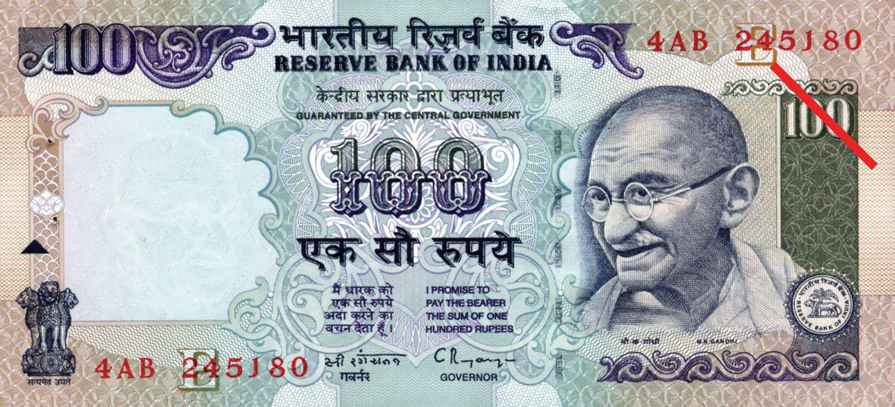

## Table of Contents

## What is the Indian Rupee?

The Indian Rupee is the official currency of India. It is used every day by people in India to buy things like food, clothes, and other stuff they need. The symbol for the Indian Rupee is ₹. You might see prices written as ₹50 or ₹100, which means 50 or 100 Rupees.

The Rupee is managed by the Reserve Bank of India, which is like a big bank that controls all the money in the country. They decide how much a Rupee is worth compared to other countries' money, like the US Dollar or the Euro. This can change every day, so sometimes ₹100 might get you more or less foreign money depending on the exchange rate.

## How is the Indian Rupee symbolized?

The Indian Rupee is symbolized by the sign ₹. This symbol is used in India to show the price of things, like how much a candy or a toy costs. If you see ₹50 on a price tag, it means the item costs fifty Rupees.

The ₹ symbol was designed to combine the letter 'R' with the Devanagari 'Ra', which is a letter in the Hindi alphabet. It was officially adopted in 2010, and since then, it has been used on money, in shops, and even on computers and phones. It makes it easy for everyone to recognize Indian money quickly.

## What is the history of the Indian Rupee?

The Indian Rupee has a long history that goes back hundreds of years. It started during the rule of the Gupta Empire, around the 4th century. Back then, it was called the rupiya, which means 'wrought silver' in Sanskrit. The Mughal Empire, which came later, used the rupiya too. They made it the main money for their big empire. When the British came to India, they kept using the rupee but changed it a bit to fit their needs. They made different kinds of rupees for different parts of India.

After India became independent in 1947, the Indian government took over the rupee. They made the Reserve Bank of India to look after the money. The rupee was linked to the British pound at first, but later it was linked to the US dollar. Over the years, the rupee has changed a lot. In 1957, India made its first decimal coins, which made it easier to use. The rupee has also had different designs on its notes and coins, showing important people and places from India's history and culture.

In 1991, India made big changes to its economy, and the rupee started to float freely against other currencies. This means its value could go up or down based on what was happening in the world. In 2010, India got its own special symbol for the rupee, ₹, which made it easier to recognize and use. Today, the Indian Rupee is used all over India and is an important part of the country's economy.

## What are the denominations of Indian Rupee notes and coins?

Indian Rupee notes come in different sizes. You can find notes of 10, 20, 50, 100, 200, 500, and 2000 Rupees. Each note has a different color and design so people can easily tell them apart. The smaller notes like 10 and 20 Rupees are used a lot for everyday buying. The bigger notes like 500 and 2000 Rupees are used less often, but they are handy for bigger purchases or when you need to [carry](/wiki/carry-trading) less money.

Indian Rupee coins also come in different values. You can find coins of 1, 2, 5, and 10 Rupees. The 1 Rupee coin is the smallest and is used a lot for small purchases. The 2 and 5 Rupee coins are a bit bigger and are handy for things that cost a little more. The 10 Rupee coin is the biggest and is used less often than the smaller coins. All these coins help make it easy to pay for things without always needing to use notes.

## How is the exchange rate of the Indian Rupee determined?

The exchange rate of the Indian Rupee is decided by how much people want to buy or sell it compared to other countries' money. This is called the foreign exchange market. If more people want to buy the Rupee, its value goes up. If more people want to sell it, its value goes down. The Reserve Bank of India (RBI) also plays a big role in this. They can step in to buy or sell Rupees to keep its value steady, especially if it's changing too fast.

The RBI looks at many things to decide what to do with the Rupee's exchange rate. They think about how the economy is doing, how much money is coming in or going out of the country, and what's happening in the world's markets. Sometimes, if the Rupee is getting too weak or too strong, the RBI will do something to balance it out. This helps keep the economy stable and makes sure that businesses and people can plan their money better.

## What factors influence the value of the Indian Rupee?

The value of the Indian Rupee is affected by many things. One big thing is how the whole world's economy is doing. If other countries are doing well, they might buy more things from India, which makes the Rupee stronger. But if they're not doing well, they might buy less, and the Rupee can get weaker. Another thing is how much money is coming into India from other countries. If lots of people are sending money to India or investing in Indian businesses, the Rupee gets stronger. But if money is leaving India, the Rupee can get weaker.

The Reserve Bank of India (RBI) also plays a big role in the Rupee's value. They can buy or sell Rupees to keep its value steady. If the Rupee is getting too weak, the RBI might sell some of its foreign money to buy Rupees, which makes the Rupee stronger. If the Rupee is getting too strong, they might do the opposite. The RBI also looks at things like inflation, which is when prices go up, and interest rates, which is how much it costs to borrow money. All these things together help decide how strong or weak the Indian Rupee is.

## How does the Reserve Bank of India manage the Rupee?

The Reserve Bank of India (RBI) works hard to keep the Indian Rupee steady and strong. They do this by watching how much people want to buy or sell the Rupee compared to other countries' money. If the Rupee is getting too weak, the RBI might use some of its foreign money to buy Rupees, which makes the Rupee stronger. If the Rupee is getting too strong, they might sell Rupees to keep it from going up too fast. They also look at things like how much money is coming into or leaving India, which can change how strong the Rupee is.

The RBI also pays attention to things happening inside India, like inflation, which is when prices go up, and interest rates, which is how much it costs to borrow money. If inflation is too high, the RBI might make borrowing money more expensive to slow down spending and help keep prices steady. They also keep an eye on how the whole world's economy is doing because that can affect the Rupee too. By doing all these things, the RBI helps make sure the Rupee stays useful and stable for everyone in India.

## What are the major economic impacts on the Indian Rupee?

The Indian Rupee's value can change because of many things happening in India's economy. One big thing is how much India trades with other countries. If India exports a lot of things like cars or software, it can make the Rupee stronger because other countries need to buy Rupees to pay for these things. But if India imports more than it exports, like buying a lot of oil or electronics from other countries, it can make the Rupee weaker because India needs to use more Rupees to buy foreign money.

Another thing that affects the Rupee is how much money is coming into or leaving India. If lots of people from other countries are investing in Indian businesses or sending money to their families in India, it can make the Rupee stronger. But if people are taking money out of India, maybe because they think the economy is not doing well, it can make the Rupee weaker. The Reserve Bank of India also tries to keep the Rupee steady by buying or selling it when needed.

The world's economy also plays a big role in the Rupee's value. If big countries like the United States or China are doing well, it can help the Rupee because more people might want to buy things from India. But if those countries are not doing well, it can hurt the Rupee because they might buy less from India. Also, if the prices of things like oil go up a lot, it can make the Rupee weaker because India has to spend more money to buy oil from other countries.

## How has digitalization affected the use of the Indian Rupee?

Digitalization has changed how people in India use the Rupee a lot. Now, instead of always using cash, many people use their phones or computers to pay for things. They can send money to friends or pay for shopping without needing to carry cash. Apps like Paytm, Google Pay, and PhonePe have made it easy to do this. The government also started something called the Unified Payments Interface (UPI), which helps make these payments even easier and safer. Because of this, more and more people are using digital ways to use the Rupee, which is good for the economy because it makes things faster and easier.

But digitalization also brings some challenges. Not everyone in India has a smartphone or knows how to use these apps, so some people still need to use cash. Also, there can be problems with the internet or with keeping digital payments safe from hackers. The government and banks are working to make sure everyone can use digital payments and that they are safe. Overall, digitalization has made the Rupee more flexible and easier to use, but there is still work to be done to make sure it works well for everyone.

## What are the security features on Indian Rupee notes?

Indian Rupee notes have many special things on them to stop people from making fake money. One thing is a see-through part called a window, which you can see when you hold the note up to the light. There's also a security thread that runs through the note, and it has the word 'RBI' and the note's value written on it. If you look at the note under a special light, you can see more hidden things like numbers and pictures. The notes also have special ink that changes color when you move it around, and there are tiny letters and numbers that are hard to copy.

Another important feature is the watermark, which you can see when you hold the note up to the light. It shows a picture of Mahatma Gandhi and the number of the note's value. There's also a special kind of printing called intaglio, which makes the note feel rough in some places. This helps people who can't see well to tell if the note is real. All these things together make it very hard for anyone to make fake Indian Rupee notes, and they help keep the money safe for everyone to use.

## How does the Indian Rupee compare to other major world currencies?

The Indian Rupee is different from other big world currencies like the US Dollar, the Euro, and the Chinese Yuan. The US Dollar is used a lot all over the world and many countries use it to buy and sell things. The Euro is used by many countries in Europe and is also very strong. The Chinese Yuan is getting more important as China's economy grows bigger. The Indian Rupee is not used as much outside of India, but it is still important for people living in India and for businesses that trade with India.

The value of the Indian Rupee can change a lot compared to these other currencies. Sometimes, the Rupee can be worth less than the US Dollar or the Euro, which means you need more Rupees to buy one Dollar or Euro. This can make things from other countries more expensive for people in India. But the Indian government and the Reserve Bank of India try to keep the Rupee steady so it doesn't change too much. They do this by buying or selling Rupees when needed. Even though the Rupee might not be as strong as some other currencies, it is still an important part of the world's money system.

## What are the future predictions for the Indian Rupee's value and stability?

The future of the Indian Rupee depends on many things like how well India's economy is doing, what's happening in the world's economy, and what the government and the Reserve Bank of India do. If India keeps growing and more people want to buy things from India, the Rupee might get stronger. But if there are problems like high prices or not enough jobs, the Rupee might get weaker. The government and the RBI will keep trying to make sure the Rupee stays steady so it's useful for everyone in India.

In the coming years, digital money might also change how the Rupee works. More people using phones and computers to pay for things could make the Rupee easier to use and track. But this also means the government and banks need to make sure these digital payments are safe and that everyone can use them. Overall, the Indian Rupee's future will be shaped by both the economy and new technology, and it's important for the Rupee to stay stable and useful for everyone in India.

## References & Further Reading

[1]: Bergstra, J., Bardenet, R., Bengio, Y., & Kégl, B. (2011). ["Algorithms for Hyper-Parameter Optimization."](https://papers.nips.cc/paper/4443-algorithms-for-hyper-parameter-optimization) Advances in Neural Information Processing Systems 24.

[2]: ["Advances in Financial Machine Learning"](https://www.amazon.com/Advances-Financial-Machine-Learning-Marcos/dp/1119482089) by Marcos Lopez de Prado

[3]: ["Evidence-Based Technical Analysis: Applying the Scientific Method and Statistical Inference to Trading Signals"](https://www.amazon.com/Evidence-Based-Technical-Analysis-Scientific-Statistical/dp/0470008741) by David Aronson

[4]: ["Machine Learning for Algorithmic Trading"](https://github.com/stefan-jansen/machine-learning-for-trading) by Stefan Jansen

[5]: ["Quantitative Trading: How to Build Your Own Algorithmic Trading Business"](https://www.amazon.com/Quantitative-Trading-Build-Algorithmic-Business/dp/1119800064) by Ernest P. Chan