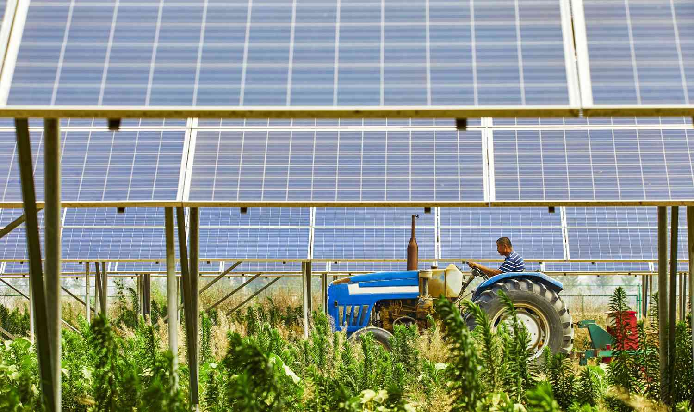

In recent years, the focus on renewable energy has increased significantly. This shift is driven not only by environmental concerns but also by the myriad of economic opportunities that renewable energy presents. Transitioning from fossil fuels to renewable energy sources like solar, wind, and biomass is critical in reducing carbon emissions and mitigating climate change impacts, which have become more urgent than ever due to the increasing prevalence of extreme weather patterns.

Within this context, the USDA's Rural Energy for America Program (REAP) plays a pivotal role, particularly in rural areas where economic opportunities may be more limited. Established as part of the Agriculture Improvement Act of 2018, REAP aims to empower rural communities by offering financial support in the form of grants and loans. This funding enables agricultural producers and small businesses to invest in renewable energy systems and energy-efficient upgrades, unlocking potential economic gains while contributing to a more sustainable future.



By financially supporting renewable energy projects, REAP helps small enterprises reduce their energy costs and enhance their energy efficiency, ultimately increasing their competitiveness. Furthermore, these projects can generate additional income streams, promoting energy independence and fostering economic resilience in rural areas.

This article will explore the increasing importance of renewable energy, how the USDA's REAP facilitates this transition, and the expanding role of algorithmic trading in optimizing energy markets. As the global demand for clean energy solutions continues to rise, understanding the impact of these initiatives and technologies is crucial in shaping a sustainable energy landscape.

## Table of Contents

## Importance of Renewable Energy

Renewable energy is fundamental to mitigating carbon emissions and addressing climate change. Unlike fossil fuels, renewable resources such as solar, wind, and biomass are replenished naturally and emit little to no greenhouse gases. This reduces the atmospheric concentration of carbon dioxide (CO₂) and other harmful emissions, vital for limiting global warming and its adverse environmental impacts (IPCC, 2021).

Transitioning to renewable energy decreases reliance on finite fossil fuel reserves. This transition enhances energy security by diversifying energy sources and reducing vulnerability to volatile fossil fuel markets. Solar and wind energy systems, for instance, harness energy from the sun and wind, providing an inexhaustible supply of energy, contributing to energy independence (IEA, 2020).

Rural communities stand to gain significantly from renewable energy adoption. By implementing renewable energy systems, rural areas can improve energy efficiency and reduce costs associated with energy consumption. For example, solar panels installed on farms can power irrigation systems or farming equipment, cutting down on electricity expenses and enhancing operational efficiency.

Furthermore, these communities can generate a stable income through energy production. Renewable energy projects, such as wind farms or biomass plants, can be a source of local revenue. Income generated from selling excess energy back to the grid can enhance economic resilience of rural areas and provide job opportunities in the renewable energy sector (USDA, 2019).

In summary, the shift to renewable energy is a critical step toward a sustainable future, promoting environmental health, energy security, and economic stability, particularly in rural settings with abundant space and resources. By transforming current energy infrastructures to accommodate renewable sources, societies can ensure long-term energy availability, reduced environmental impact, and improved quality of life.

## Overview of the USDA REAP

The USDA Rural Energy for America Program (REAP), implemented under the Agriculture Improvement Act of 2018, is a strategic initiative designed to bolster renewable energy infrastructure across rural areas in the United States. REAP targets rural small businesses and agricultural producers, offering financial mechanisms to foster energy innovation and efficiency improvements. 

Through REAP, participants can access grants and guaranteed loans to facilitate the development and installation of renewable energy systems. These funding avenues are crucial for supporting projects focused on solar, wind, biomass, geothermal, and other emerging renewable technologies. Additionally, existing systems can be upgraded to enhance energy efficiency, reducing operational costs and minimizing environmental impacts.

Grants provided by REAP can significantly subsidize project costs. In tandem with loans, these grants enable stakeholders to tackle the economic barriers associated with initial investment requirements. Consequently, rural businesses and agricultural producers are better positioned to transition towards sustainable energy practices and reduce their reliance on conventional energy sources. 

Overall, REAP is a pivotal program for stimulating the adoption of renewable energy solutions, contributing not only to the decentralized generation of clean energy in rural sectors but also to the economic vitality and energy resilience of these communities.

## How REAP Works

The USDA's Rural Energy for America Program (REAP) facilitates renewable energy projects by providing financial assistance in the form of grants and loans. These financial aids cater to up to 25% of eligible project costs for grants and up to 75% for loans, setting a ceiling of $1 million for grants. This financial structure is pivotal for agricultural producers and rural small businesses seeking to invest in renewable energy initiatives or improvements in energy efficiency.

To qualify for REAP support, applicants must fulfill specific eligibility criteria. One of the fundamental requirements is the provision of documented proof of income generated from agricultural operations for producers. This ensures that the funding is directed towards genuine agricultural enterprises and rural businesses.

The application process for REAP is comprehensive, necessitating a meticulous financial assessment and eligibility analysis of each proposed project. This includes evaluating the project's feasibility, potential impact on energy consumption, and overall cost-effectiveness. It often involves the submission of detailed plans, financial projections, and supporting documents that substantiate the viability and sustainability of the proposed venture.

Understanding these aspects of REAP can significantly aid potential applicants in preparing robust applications that meet the program’s requirements, thereby enhancing their chances of securing funding for their renewable energy projects.

## Algorithmic Trading in Renewable Energy Markets

Algorithmic trading, commonly referred to as algo trading, involves the deployment of computer algorithms to automate and optimize trading in financial markets. In the context of renewable energy markets, [algorithmic trading](/wiki/algorithmic-trading) contributes significantly to enhancing market efficiency. By utilizing algorithms, traders can more accurately predict and respond to fluctuations in energy production and consumption, resulting in optimized energy distribution and utilization.

The primary advantage of algorithmic trading in renewable energy markets is its ability to process vast amounts of data at high speed and make informed trading decisions. This capability is particularly important given the intermittent nature of renewable energy sources like solar and wind, which are subject to variability due to changes in weather conditions. Algo trading systems employ predictive models and real-time data analytics to forecast energy supply and demand, allowing for more accurate trading strategies and timely adjustments in market positions.

A key element of algorithmic trading is its support for price stability. By analyzing historical price data and current market trends, algorithms can identify potential price volatilities and execute trades that mitigate risks. This helps maintain balance between supply and demand, preventing extreme price fluctuations and ensuring a more stable market environment.

Furthermore, algorithmic trading facilitates better resource allocation by enabling market participants to efficiently distribute and consume energy resources based on real-time market signals. For example, an energy supplier can utilize algorithms to determine the optimal time and price at which to enter or [exit](/wiki/exit-strategy) the market, based on predictive analytics and market conditions. This leads to more efficient use of resources and cost savings.

Here's a simple example of an algorithm that might be used in a renewable energy market to predict optimal trading times:

```python
import numpy as np
from sklearn.model_selection import train_test_split
from sklearn.ensemble import RandomForestRegressor

# Simulated historical data for energy production and price
X = np.random.rand(1000, 4)  # Features: e.g., weather data, historical production
y = np.random.rand(1000)     # Target: e.g., energy prices

# Split the data into training and testing sets
X_train, X_test, y_train, y_test = train_test_split(X, y, test_size=0.3, random_state=42)

# Train a random forest regressor
model = RandomForestRegressor(n_estimators=100, random_state=42)
model.fit(X_train, y_train)

# Predict energy prices for the testing set
predicted_prices = model.predict(X_test)

# Analyze predicted prices to make trading decisions
for index, price in enumerate(predicted_prices):
    if price > np.mean(y_test):
        print(f"Sell energy at predicted higher price: {price}")
    else:
        print(f"Buy energy at predicted lower price: {price}")
```

This example demonstrates how [machine learning](/wiki/machine-learning) models can be applied to develop predictive algorithms for decision-making in trading. While simplified, such models form the basis of more complex algorithms used in real-world energy markets.

In sum, the integration of algorithmic trading within renewable energy sectors not only fosters market efficiency but also ensures robust resources allocation and price stability, essential for the sustainable growth of renewable energy usage.

## Case Studies of Successful REAP Projects

Several rural businesses have leveraged the USDA's Rural Energy for America Program (REAP) to transform their energy infrastructures. These successful projects not only highlight significant strides in energy efficiency but also demonstrate substantial financial returns, encouraging other agricultural and rural entities to adopt similar strategies.

One noteworthy case is the solar energy installation at a dairy farm located in Minnesota. The farm utilized REAP grants and loans to install a 50-kilowatt solar photovoltaic system. This upgrade led to a 40% reduction in the farm's energy consumption from conventional sources, resulting in considerable cost savings. Over a span of five years, the farm saw a return on investment exceeding its initial costs, setting a financial benchmark for similar agricultural ventures.

Another success story emerges from a grain processing facility in Iowa, which used REAP support to integrate a wind energy system. The facility installed a 100-kilowatt wind turbine, covering approximately 60% of its energy needs. This initiative not only slashed energy bills but also provided a stable income through the sale of surplus electricity to the local grid. The project had a payback period of less than seven years, proving financially feasible and environmentally beneficial.

Moreover, a small business specializing in maple syrup production in Vermont capitalized on REAP financing to enhance its energy efficiency. By installing a wood biomass boiler system, the business reduced its reliance on fossil fuels and cut heating costs by 50%. Financial analysis from the project demonstrated an increase in profit margins, along with a decreased carbon footprint, underscoring the dual advantages of adopting renewable energy solutions.

These examples illustrate the tangible benefits that REAP-funded projects can provide. Enhanced energy efficiency, decreased operational costs, and improved sustainability are common themes across successful implementations. These projects serve as exemplary models, encouraging other rural businesses to pursue renewable energy solutions as both an economic opportunity and a measure to combat climate change. Through detailed planning and execution, the utilization of REAP resources can yield long-term gains, contributing to the sustainable development of rural communities.

## Challenges and Opportunities

Renewable energy projects, particularly in rural areas, face several challenges that can hinder their development. One of the primary obstacles is the high initial investment cost associated with installing renewable energy systems such as solar panels, wind turbines, and biomass facilities. These projects often require significant capital outlay before any financial returns can be observed, which can be a barrier for small businesses and agricultural producers with limited upfront resources.

Regulatory hurdles also present significant challenges. The renewable energy sector is subject to a complex web of regulations at federal, state, and local levels. Navigating these regulations requires a deep understanding of the legal landscape, which can be daunting for small-scale rural operators. This complexity can result in delays and additional costs, thereby discouraging potential adopters.

Additionally, the technical expertise required to implement and manage renewable energy systems is another barrier. Many rural areas may lack access to personnel with the specialized skills needed for installation, operation, and maintenance of these systems. This skill gap can hinder the successful deployment and sustained performance of renewable energy projects.

Despite these challenges, the demand for clean energy continues to rise, driven by global environmental concerns and the desire for energy independence. This creates significant opportunities for growth and innovation in rural America. The increasing affordability of renewable technology and government incentives can mitigate initial costs. Moreover, ongoing developments in technology and engineering are leading to more efficient and less expensive renewable energy solutions, making them more accessible.

To capitalize on these opportunities, stakeholders can leverage programs like the USDA's Rural Energy for America Program (REAP), which provides financial assistance to overcome investment barriers. By fostering innovation and collaboration, rural communities can transform challenges into opportunities, promoting economic development while contributing to environmental sustainability.

## The Future of Renewable Energy in Rural Areas

With continued support from programs like the USDA's Rural Energy for America Program (REAP), the future of renewable energy in rural areas appears promising. The adoption of renewable energy technologies is not only sustainable but also economically beneficial, as these regions can capitalize on their abundant natural resources, such as solar and wind. This forward-looking approach aligns with global efforts to mitigate climate change and enhance energy independence.

Improvements in technology are crucial for the progress in renewable energy. Advances in solar panels, storage systems, and wind turbines have led to decreased costs and increased efficiency, making these technologies more accessible for rural communities. For instance, the cost of solar photovoltaic (PV) power systems has plummeted by nearly 82% since 2010, according to the International Renewable Energy Agency (IRENA). [1] These advancements enable rural areas to harness energy more efficiently, thereby generating a stable income stream and reducing reliance on fossil fuels.

Algorithmic trading also plays a significant role in shaping the future of renewable energy in these regions. With precise algorithms, energy production and consumption forecasts become more accurate, providing rural energy producers with tools to optimize their operations. The use of data-driven algorithms allows for better resource allocation, reducing wastage and stabilizing market prices. Algorithmic trading automates the process of buying and selling energy, leading to efficient market operations and increased profitability for energy producers.

Python code snippet for a basic algorithmic trading model in energy markets might look like this:

```python
import numpy as np
import pandas as pd

def algorithmic_trading_strategy(energy_prices):
    window = 5
    signals = np.zeros(len(energy_prices))
    for i in range(window, len(energy_prices)):
        if energy_prices[i] > np.mean(energy_prices[i-window:i]):
            signals[i] = 1  # Buy signal
        elif energy_prices[i] < np.mean(energy_prices[i-window:i]):
            signals[i] = -1  # Sell signal
    return signals

# Example usage:
energy_prices = np.array([100, 102, 101, 103, 98, 105, 106])
signals = algorithmic_trading_strategy(energy_prices)
print(signals)
```

This simplistic model generates buy or sell signals based on the moving average of energy prices, assisting rural energy producers in making informed decisions.

The convergence of advanced technologies and strategic financial support positions rural communities to become significant contributors to the broader renewable energy market. As these communities continue to innovate and adopt new technologies, the potential for creating a cleaner and economically robust energy landscape becomes increasingly feasible. Ensuring ongoing collaboration between government bodies, technology developers, and rural stakeholders will be key to realizing this future.

---
[1] IRENA (International Renewable Energy Agency) - "Renewable Power Generation Costs in 2020"

## Conclusion

The integration of renewable energy solutions in rural economies, underpinned by the USDA's Rural Energy for America Program (REAP), is vital for fostering sustainable economic development. By providing financial assistance to agricultural producers and small businesses, REAP facilitates investment in renewable energy systems and energy-efficient upgrades. This not only aids in reducing carbon emissions but also helps rural communities achieve energy independence and stability.

As the energy markets continue to evolve, incorporating tech-driven methodologies such as algorithmic trading is essential for optimizing the utilization of renewable resources. Algorithmic trading enhances the efficiency of energy markets by improving production and consumption forecasts, ensuring better price stability and resource allocation. These advancements lead to a cohesive integration of renewable energy into the broader economic framework.

Collaboration among stakeholders—ranging from policymakers to private enterprises—is crucial for overcoming challenges such as high initial investment costs and technical barriers. By working together, these entities can drive innovations and implement solutions that support renewable energy adoption, creating a cleaner and more sustainable future for rural communities. Continued investment in cutting-edge technologies and strategic initiatives will serve as the backbone for a resilient and green rural economy.

## References & Further Reading

[1]: IPCC. (2021). ["Climate Change 2021: The Physical Science Basis."](https://www.ipcc.ch/report/ar6/wg1/) Contribution of Working Group I to the Sixth Assessment Report of the Intergovernmental Panel on Climate Change.

[2]: International Energy Agency (IEA). (2020). ["World Energy Outlook 2020."](https://www.iea.org/reports/world-energy-outlook-2020)

[3]: United States Department of Agriculture (USDA). (2019). ["Rural Energy for America Program (REAP)."](https://www.rd.usda.gov/programs-services/energy-programs/rural-energy-america-program-renewable-energy-systems-energy-efficiency-improvement-guaranteed-loans)

[4]: International Renewable Energy Agency (IRENA). (2021). ["Renewable Power Generation Costs in 2020."](https://www.irena.org/publications/2022/Jul/Renewable-Power-Generation-Costs-in-2021)

[5]: Lopez de Prado, M. (2018). ["Advances in Financial Machine Learning."](https://www.amazon.com/Advances-Financial-Machine-Learning-Marcos/dp/1119482089) John Wiley & Sons.

[6]: Aronson, D. R. (2007). ["Evidence-Based Technical Analysis: Applying the Scientific Method and Statistical Inference to Trading Signals."](https://onlinelibrary.wiley.com/doi/book/10.1002/9781118268315) John Wiley & Sons.

[7]: Jansen, S. (2020). ["Machine Learning for Algorithmic Trading Second Edition: Predictive Models to Extract Signals from Market and Alternative Data for Systematic Trading Strategies with Python."](https://thuvienso.hoasen.edu.vn/bitstream/handle/123456789/12260/Contents.pdf?sequence=1) Packt Publishing.