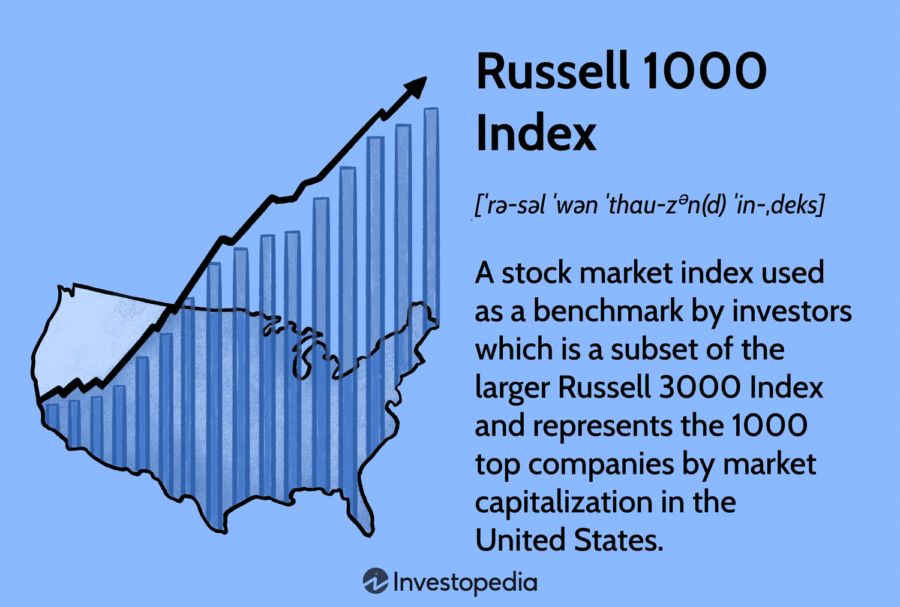

In the fast-paced world of stock trading, investors constantly seek strategies to gain an edge. A promising strategy that has gained traction is algorithmic trading. This approach leverages technology to automate the buying and selling decisions in the stock market, thus allowing transactions to be executed at speeds and frequencies beyond human capability. As technological advancements continue to evolve, algorithmic trading offers sophisticated methods to process complex data and execute trades based on defined criteria.

One key market for such investing opportunities is the Russell 1000 Index. This index serves as a benchmark for large-cap U.S. equities, comprising 1000 of the largest companies in the United States by market capitalization. The Russell 1000 Index is a major subset of the broader Russell 3000 Index and is highly regarded among investors for providing a comprehensive barometer of the large-cap market segment. It includes a diverse range of sectors, offering a multifaceted view of market performance and economic conditions.



This article investigates the convergence of Russell 1000 investments and algorithmic trading, aiming to illuminate the ways in which algorithmic strategies can be utilized to optimize returns from this index. By automating trading processes, investors can potentially improve trade execution, minimize costs, and capitalize on market inefficiencies more effectively than traditional manual strategies. The discussion will explore the mechanics of algorithmic trading, its benefits, and the specific advantages and challenges it presents when applied to investments in the Russell 1000 Index.

## Table of Contents

## Understanding the Russell 1000 Index

The Russell 1000 Index is a stock market index that represents the 1,000 largest publicly traded companies in the United States, ranked by market capitalization. It is a critical component of the broader Russell 3000 Index, which encompasses both large and small-cap stocks, providing a comprehensive overview of the U.S. stock market landscape. The Russell 1000 provides investors with a snapshot of the large-cap segment of the market, making it an essential tool for assessing overall market health and economic trends.

The index covers a broad spectrum of sectors, including technology, healthcare, finance, consumer goods, and industrials, among others. This diversity allows investors to employ diversified investment strategies, mitigating risk by spreading investments across various industries. The wide-ranging sector representation within the Russell 1000 contributes to its utility as a benchmark for assessing large-cap market performance.

Investors often use the Russell 1000 as a barometer for economic conditions due to its inclusion of the largest and most influential U.S. companies. By tracking its performance, analysts can infer insights about market trends, investor sentiment, and potential shifts in economic policy. This ability to gauge economic conditions underscores the index's significance in crafting targeted investment approaches.

Understanding the composition of the Russell 1000 is vital for developing effective investment strategies. By analyzing which sectors are over or under-represented, investors can adjust their portfolios to align with their risk tolerance and investment goals. Furthermore, familiarity with the index components enables investors to anticipate the impacts of economic developments on large-cap stocks, aiding in informed decision-making for both passive and active investment strategies.

## The Rise of Algorithmic Trading in the Stock Market

Algorithmic trading, often referred to as algo trading, has revolutionized the stock market by dramatically changing how investors buy and sell financial instruments. This form of trading leverages algorithms—precisely defined sequences of instructions—to execute transactions at speeds and frequencies that are impossible for human traders. By processing prevailing market data in conjunction with predetermined conditions, algorithmic systems can automatically place trades without human intervention, thereby optimizing efficiency and accuracy.

One of the primary advantages of [algorithmic trading](/wiki/algorithmic-trading) is its ability to minimize human error. Traditional trading involves subjective decision-making, which is susceptible to emotional influences. In contrast, algorithmic trading systematically follows set instructions to execute trades, relying on complex data sets for decision-making. This level of automation allows for the quick processing of vast amounts of market data, identifying opportunities that would be challenging to discern manually.

Algorithmic trading incorporates various strategies to optimize market gains. Trend following is a popular method, where algorithms analyze historical price movements to predict future price directions. Another strategy is [arbitrage](/wiki/arbitrage), which involves exploiting price differences of the same asset across different markets. Mean reversion is also employed, where algorithms assume that an asset's price will return to its historical mean, buying or selling when the price deviates significantly from this average.

The efficiency provided by algorithmic trading is particularly beneficial in competitive markets, where rapid decision-making can be crucial. Algorithms can execute trades at high frequencies, capturing market movements within microseconds. For instance, high-frequency trading ([HFT](/wiki/high-frequency-trading-strategies)) involves thousands of orders being executed in fractions of a second, enabling traders to maximize profits from even the smallest price changes.

In conclusion, algorithmic trading has fundamentally transformed stock market engagement by enabling precise, data-driven decision-making and enhancing overall trading efficiency. This evolution continues to attract investors globally, seeking to capitalize on advanced trading methodologies within increasingly competitive financial environments.

## Benefits of Algorithmic Trading in Russell 1000 Investments

Algorithmic trading, when applied to investments in the Russell 1000 Index, offers a range of benefits that enhance both execution efficiency and cost-effectiveness. This trading approach leverages advanced technology to perform trades at speeds and frequencies that are beyond the capacity of manual trading, thereby optimizing potential returns.

One of the primary advantages is the ability to swiftly capitalize on price anomalies and market inefficiencies. Algorithms can be programmed to detect minor pricing discrepancies and execute trades before these gaps are corrected by the market. This rapid response mechanism not only captures possible arbitrage profits but also maintains an advantageous position in frequently fluctuating markets.

Another benefit is the practice of [backtesting](/wiki/backtesting), which involves running algorithmic strategies through historical data to assess their performance. This process allows investors to refine their trading models based on previous market conditions, ensuring that the strategies are robust and adaptable to diverse scenarios. Such historical analysis can lead to precise optimization, adjusting parameters to improve future performance.

High-frequency trading (HFT), a subset of algorithmic trading, is particularly adept at maximizing gains from small market movements. HFT systems utilize algorithms capable of executing numerous trades per second, making it possible to take advantage of transient market opportunities that occur within milliseconds. This capability is critical for large-cap investments like those within the Russell 1000, where rapid execution can significantly affect profitability.

Additionally, algorithmic trading suppresses emotional biases that often hinder trading performance. By automating decision-making processes based on quantitative data and pre-defined criteria, it enforces a disciplined investment strategy. This objectivity is valuable in avoiding the common pitfalls of emotional trading, such as overreaction to market news or impulse-driven decisions.

Overall, the integration of algorithmic trading within the context of Russell 1000 investments presents a strategic advantage. It not only improves trade execution and mitigates costs but also provides a rigorous framework for exploiting market opportunities, ultimately contributing to more disciplined and achievable investment outcomes.

## Challenges and Risks of Algorithmic Trading

Algorithmic trading, while beneficial in many respects, faces significant challenges and risks that can impact its efficacy. A primary concern is system failures and technical risks. These can arise from hardware malfunctions, software bugs, or connectivity issues, leading to unintended market actions or missed trades. For instance, a bug in the algorithm's code can execute trades incorrectly, potentially causing significant financial losses.

Market [volatility](/wiki/volatility-trading-strategies) represents another challenge for algorithmic trading. It can cause unexpected algorithm performance as markets can react rapidly to unforeseen events. Algorithms that are calibrated for stable market conditions may not adapt quickly to high volatility, potentially resulting in substantial losses. This necessitates designing algorithms with adaptability to different market conditions in mind.

Regulatory considerations also play a significant role. As technology in trading evolves, so too do regulatory standards and requirements. Compliance with these regulations is paramount, and failure to do so can result in penalties, sanctions, or trading restrictions. This requires that algorithmic systems be regularly updated to reflect the latest regulatory changes, ensuring adherence to legal standards.

A significant pitfall associated with algorithmic trading is the over-reliance on machine models. These models, typically based on historical data and trends, might fail to predict rare macroeconomic factors or market events. Such unforeseen variables can lead to substantial deviations from expected performance. For example, a sudden geopolitical event might drastically alter market dynamics, which purely data-driven models might not anticipate.

Ensuring robust algorithm design and continuous monitoring remains crucial in mitigating these risks. Algorithms need to be meticulously tested across diverse scenarios to ensure stability and resilience. Continuous monitoring allows for real-time adjustments, helping to maintain performance amidst changing market conditions. This involves setting up alerts and automated systems that can recalibrate or halt trading activity if anomalies are detected.

Implementing an effective risk management strategy involves not only thorough initial testing but also regular evaluations and updates. As algorithms inherently operate in dynamic environments, ongoing optimizations based on performance reviews and emerging market insights are essential. By proactively addressing these risks, investors can better safeguard their investments while taking advantage of the efficiencies offered by algorithmic trading.

## Strategies for Successful Algo Trading in the Russell 1000

Successful algorithmic trading in the Russell 1000 Index requires a strategic approach grounded in a deep understanding of the market dynamics within this benchmark of large-cap U.S. equities. Central to this success is the development of algorithms that are rigorously tested on historical Russell 1000 data. This involves utilizing historical prices and volumes to simulate how a trading strategy would have performed in the past, thereby honing its predictive power. A common technique is backtesting, where algorithms are applied to historical data to evaluate their potential profitability before deployment in live trading. 

A diverse array of algorithmic strategies can also help balance risk and provide flexibility under different market conditions. For instance, trend-following algorithms might be employed during strong market trends, while mean reversion strategies might be favored in flat or oscillating markets. This diversification enables traders to capture opportunities across varied market environments, reducing the chance of a single strategy underperforming.

Continuous optimization and updates to these algorithms are essential, as financial markets are perpetually evolving. Machine learning techniques such as [reinforcement learning](/wiki/reinforcement-learning) can be employed to adapt strategies automatically. In Python, this could involve using libraries like TensorFlow or PyTorch, which offer extensive tools for building adaptive models:

```python
import tensorflow as tf

model = tf.keras.Sequential([
    tf.keras.layers.Dense(128, activation='relu', input_shape=(input_shape,)),
    tf.keras.layers.Dense(64, activation='relu'),
    tf.keras.layers.Dense(1, activation='linear')
])

model.compile(optimizer='adam', loss='mean_squared_error')
```

Moreover, collaboration with financial experts and technology specialists facilitates a more robust and comprehensive approach. Financial experts can offer insights into macroeconomic factors and market sentiment, while tech specialists provide the necessary expertise to handle large datasets and implement cutting-edge computational techniques. This interdisciplinary cooperation ensures that trading strategies are both technically sound and economically viable.

In conclusion, the successful application of algorithmic trading strategies in the Russell 1000 Index is a nuanced task that benefits from historical analysis, strategy diversification, ongoing optimization, and expert collaboration. Each of these components plays a crucial role in navigating the complexities and dynamics of large-cap U.S. equities trading.

## Future Trends: Algorithmic Innovations and Russell 1000

Technological advancements are increasingly shaping the potential of algorithmic trading, particularly in investments related to the Russell 1000 Index. A significant trend in this field is the integration of [artificial intelligence](/wiki/ai-artificial-intelligence) (AI) and [machine learning](/wiki/machine-learning), which are pivotal in creating sophisticated trading algorithms. These technologies enhance the ability to analyze vast datasets efficiently, uncover subtle market patterns, and predict future market trends with greater accuracy.

Machine learning algorithms can autonomously adapt to changing market conditions, allowing them to refine trading strategies over time. For example, reinforcement learning, a type of machine learning, can be employed to optimize trading strategies by learning from interactions with the stock market environment. This adaptability can lead to more effective decision-making and resource allocation when investing in the Russell 1000.

The expansion of data analytics further contributes to the refinement of trading strategies. Advanced analytical tools provide investors with deeper insights into market behavior, enabling them to identify investment opportunities and risks with higher precision. Large sets of historical and real-time data are analyzed to detect trends, correlations, and anomalies, which serve as critical inputs for developing robust algorithmic strategies.

Moreover, cloud computing is revolutionizing the efficiency of algorithmic trading platforms. The scalable nature of cloud services allows for the efficient processing and storage of massive datasets, promoting flexible and cost-effective trading solutions. It empowers traders to quickly deploy and test algorithms across various computing environments, facilitating rapid innovation.

Quantum computing, although still in its nascent stages, presents a promising horizon for algorithmic trading. It has the potential to solve complex optimization problems much faster than classical computers. For the Russell 1000, this means that future quantum-capable algorithms could execute trades at unprecedented speeds, explore a broader set of market variables, and achieve improved risk management.

Staying informed about these technological innovations is crucial for investors seeking to leverage future trading opportunities. Engaging with new developments and adopting cutting-edge technologies can provide a competitive advantage and drive success in algorithmic trading within the Russell 1000. Therefore, continuous learning and adaptation are essential to navigating the evolving landscape of financial markets effectively.

## Conclusion

Investing in the Russell 1000 through algorithmic trading presents exciting possibilities for enhancing both trading efficiency and profitability. Algorithmic strategies automate complex decision-making processes, enabling traders to exploit market opportunities swiftly and with precision. As the technological landscape continues to evolve, these automated approaches will likely become even more sophisticated, offering investors the potential to optimize returns more effectively.

Strategically implementing algorithmic systems requires a commitment to continuous learning and adaptation. The successful deployment of these technologies hinges on understanding evolving market conditions and refining strategies accordingly. Technology advancements such as artificial intelligence (AI) and machine learning are integral to developing algorithms capable of analyzing vast datasets, predicting market trends, and executing trades without emotional bias. As these technologies advance, they will bring about new trading strategies that can capitalize on emerging patterns in the Russell 1000.

However, investors must carefully weigh the potential risks associated with algorithmic trading against the prospect of high rewards. The dynamic nature of financial markets means that even well-designed algorithms can face unexpected challenges. Ensuring robust system design and maintaining stringent oversight are crucial in mitigating risks such as technical failures, unexpected market shifts, and evolving regulatory landscapes.

The attractiveness of algorithmic trading lies in its ability to offer a disciplined, data-driven approach to investment, yet it also demands a sophisticated understanding of both technology and finance. By balancing innovation with caution, investors can tap into the transformative potential of algorithmic trading within the Russell 1000, seeking to achieve favorable outcomes in a competitive market.

## References & Further Reading

[1]: Bergstra, J., Bardenet, R., Bengio, Y., & Kégl, B. (2011). ["Algorithms for Hyper-Parameter Optimization."](https://proceedings.neurips.cc/paper/2011/file/86e8f7ab32cfd12577bc2619bc635690-Paper.pdf) Advances in Neural Information Processing Systems 24.

[2]: ["Advances in Financial Machine Learning"](https://www.amazon.com/Advances-Financial-Machine-Learning-Marcos/dp/1119482089) by Marcos Lopez de Prado.

[3]: ["Evidence-Based Technical Analysis: Applying the Scientific Method and Statistical Inference to Trading Signals"](https://www.amazon.com/Evidence-Based-Technical-Analysis-Scientific-Statistical/dp/0470008741) by David Aronson.

[4]: ["Machine Learning for Algorithmic Trading"](https://github.com/PacktPublishing/Machine-Learning-for-Algorithmic-Trading-Second-Edition) by Stefan Jansen.

[5]: ["Quantitative Trading: How to Build Your Own Algorithmic Trading Business"](https://www.amazon.com/Quantitative-Trading-Build-Algorithmic-Business/dp/0470284889) by Ernest P. Chan.