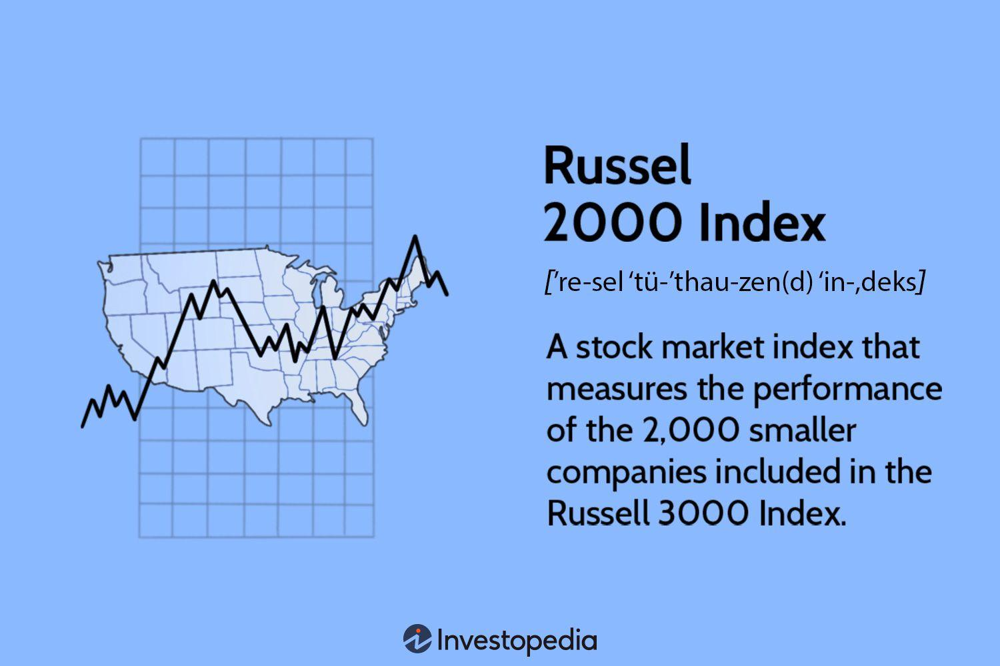

## Table of Contents

## What is the Russell 2000 index?

The Russell 2000 index is a stock market index that measures the performance of about 2,000 small companies in the United States. These companies are considered small because they have a lower market value compared to bigger companies. The index is managed by FTSE Russell, a company that specializes in creating and managing stock market indexes.

Investors often use the Russell 2000 to see how small companies are doing overall. It's like a report card for small businesses in the stock market. If the Russell 2000 goes up, it usually means that small companies are doing well. If it goes down, it might mean that small companies are struggling. This index is important because it gives investors a way to understand and invest in the small company part of the market.

## How is the Russell 2000 index different from the S&P 500?

The Russell 2000 index and the S&P 500 are both stock market indexes, but they focus on different types of companies. The Russell 2000 looks at about 2,000 small companies in the U.S. These companies are smaller in size, which means they have a lower market value. On the other hand, the S&P 500 tracks the performance of 500 of the largest companies in the U.S. These companies are big and well-known, like Apple, Microsoft, and Amazon.

Because the Russell 2000 focuses on small companies, it can give investors a different view of the market. Small companies might grow faster than big companies, but they can also be riskier. The S&P 500, with its focus on big companies, is often seen as a more stable and reliable measure of the overall U.S. economy. So, if you want to know how small businesses are doing, you might look at the Russell 2000. If you're interested in the big players, the S&P 500 is the index to watch.

## What types of companies are included in the Russell 2000?

The Russell 2000 includes small companies in the United States. These companies are smaller because they have a lower market value than bigger companies. They come from different industries like technology, health care, and manufacturing. The companies in the Russell 2000 are chosen based on their size, and they represent a big part of the small company part of the market.

These small companies can be new businesses that are just starting to grow, or they can be older companies that have stayed small. Because they are smaller, they might have more room to grow quickly, but they can also be riskier to invest in. The Russell 2000 helps investors see how these small companies are doing overall, which can be different from how big companies are doing.

## How often is the Russell 2000 index rebalanced?

The Russell 2000 index is rebalanced once a year, usually in June. This means that every year, the companies in the index are checked to see if they still fit the rules for being in the index. If a company has grown too big, it might be moved to a different index. If a new small company has come along, it might be added to the Russell 2000.

Rebalancing is important because it makes sure the index keeps showing a good picture of small companies in the U.S. If the index wasn't rebalanced, it might end up with companies that are too big or miss out on new small companies. By doing this every year, the Russell 2000 stays a useful tool for investors who want to know how small companies are doing.

## What is the methodology used to select companies for the Russell 2000?

The Russell 2000 index uses a clear and simple way to pick which companies are included. It starts by looking at all the companies in the U.S. that are listed on the stock market. Then, it sorts these companies by their market value, which is how much the company is worth. The companies with the lowest market values are chosen for the Russell 2000. This means the index only includes small companies, usually those ranked from 1001 to 3000 in size out of all U.S. companies.

Once the companies are picked, they need to meet some other rules to stay in the index. For example, they must be based in the U.S. and have most of their business in the U.S. The companies are checked every year in June to make sure they still fit these rules. If a company grows too big, it might be moved to a different index like the Russell 1000. If a new small company comes along, it might be added to the Russell 2000. This way, the index always shows a good picture of small companies in the U.S.

## How can investors gain exposure to the Russell 2000?

Investors can gain exposure to the Russell 2000 by buying exchange-traded funds (ETFs) or mutual funds that track the index. These funds are made up of the same small companies that are in the Russell 2000. By investing in these funds, investors can own a piece of many small companies all at once, without having to pick each one themselves. Some popular ETFs that track the Russell 2000 include the iShares Russell 2000 [ETF](/wiki/etf-trading-strategies) and the Vanguard Russell 2000 ETF.

Another way to get exposure to the Russell 2000 is by investing directly in the companies that make up the index. This means buying stocks of the individual small companies listed in the Russell 2000. However, this can be more work and riskier because [picking](/wiki/asset-class-picking) the right small companies to invest in can be hard. Most investors find it easier and safer to use ETFs or mutual funds to get a broad exposure to the small company part of the market.

## What are the historical performance trends of the Russell 2000?

The Russell 2000 has shown a lot of ups and downs over the years, just like any stock market index. Since it started in 1984, it has had times when it did really well and times when it struggled. For example, during the late 1990s, the Russell 2000 did great because a lot of small tech companies were growing fast. But then, in the early 2000s, it dropped a lot when the tech bubble burst. Over the long run, the Russell 2000 has given investors good returns, but it can be more bumpy than indexes with bigger companies.

In the last few years, the Russell 2000 has had some big swings. During the financial crisis in 2008, it lost a lot of value, just like the rest of the market. But then, it bounced back strongly in the years after. More recently, the Russell 2000 did well in the years leading up to 2020, but then it fell a lot during the early days of the COVID-19 pandemic. After that, it recovered and even reached new highs. These ups and downs show that while the Russell 2000 can offer good chances for growth, it can also be riskier than investing in bigger companies.

## How does the Russell 2000 index impact the broader financial market?

The Russell 2000 index impacts the broader financial market by giving investors a way to see how small companies are doing. Since small companies make up a big part of the economy, what happens to them can affect the whole market. When the Russell 2000 goes up, it can make people feel good about the economy because it shows that small businesses are growing. On the other hand, if the Russell 2000 goes down, it might make people worried that the economy is slowing down.

The Russell 2000 also affects the market because a lot of money follows it. Many investors use ETFs and mutual funds that track the Russell 2000. When these investors buy or sell these funds, it can move the prices of the small company stocks in the index. This can create more trading and sometimes more ups and downs in the market. Overall, the Russell 2000 is an important part of understanding and investing in the U.S. economy.

## What are the key factors that influence the Russell 2000's performance?

The Russell 2000's performance is influenced by many things. One big [factor](/wiki/factor-investing) is the overall health of the economy. When the economy is doing well, small companies often do better because people are spending more money and businesses are growing. But when the economy is struggling, small companies can have a harder time because they might not have as much money saved up to get through tough times. Another important factor is interest rates. When interest rates are low, it's easier for small companies to borrow money to grow their business, which can help the Russell 2000 go up. But when interest rates go up, borrowing money becomes more expensive, and that can slow down small companies and make the Russell 2000 go down.

Another thing that affects the Russell 2000 is how investors feel about taking risks. Small companies are often seen as riskier than big companies, so when investors are feeling brave and want to take more risks, they might put more money into the Russell 2000. But when investors are scared and want to play it safe, they might take their money out of small companies and put it into bigger, safer companies. This can make the Russell 2000 go down. Also, what's happening in different industries can matter a lot. If a lot of the small companies in the Russell 2000 are in industries that are doing well, like technology or health care, the index might go up. But if those industries are struggling, the Russell 2000 might go down.

## How do economic cycles affect the Russell 2000?

Economic cycles have a big impact on the Russell 2000 because it's made up of small companies. When the economy is growing and in a good phase of the cycle, small companies often do well. They can grow faster than big companies because they are more flexible and can take advantage of new opportunities. During these good times, people are spending more money, and small businesses can get loans more easily to expand. This can make the Russell 2000 go up because the small companies in the index are doing better.

But when the economy is in a bad phase of the cycle, like a recession, the Russell 2000 can struggle. Small companies usually don't have as much money saved up as big companies, so they can have a harder time getting through tough times. During a recession, people might spend less money, and it can be harder for small businesses to get loans. This can make the Russell 2000 go down because the small companies in the index are not doing as well. So, the ups and downs of the economy can really affect how the Russell 2000 performs.

## What are some strategies for trading the Russell 2000?

One strategy for trading the Russell 2000 is to use ETFs or mutual funds that track the index. This way, you can buy and sell the whole index without having to pick individual small companies. When you think the economy is going to do well, you might buy these funds because small companies often grow faster during good times. But if you think the economy is going to slow down, you might sell or avoid these funds because small companies can struggle more during bad times.

Another strategy is to look at the economic cycle and use it to decide when to trade the Russell 2000. If you think the economy is starting to grow, you might buy into the Russell 2000 because small companies can do well in the early stages of a recovery. But if you think the economy is going to get worse, you might sell your shares because small companies can be hit hard during a downturn. Watching things like interest rates, how people feel about taking risks, and what's happening in different industries can also help you decide when to buy or sell.

You can also use technical analysis to trade the Russell 2000. This means looking at charts and patterns to try to guess where the index might go next. For example, if you see the Russell 2000 going up and breaking through a certain level, you might buy because it could keep going up. But if you see it going down and breaking through a support level, you might sell because it could keep going down. Using technical analysis can help you make quick trades based on what the market is doing right now.

## What are the potential risks and rewards of investing in the Russell 2000?

Investing in the Russell 2000 can offer big rewards, but it also comes with some risks. One of the main rewards is that small companies can grow a lot faster than big companies. If you invest in the Russell 2000 and the economy is doing well, you might see your investment go up a lot. Small companies can be more flexible and take advantage of new opportunities, which can lead to big gains. Also, by investing in the Russell 2000, you're spreading your money across many small companies, which can be safer than picking just a few.

But there are also risks to think about. Small companies can be riskier than big companies because they might not have as much money saved up. If the economy gets bad, small companies can struggle more than big ones. This means the Russell 2000 can go down a lot during tough times. Also, small companies might not have as much information available about them, so it can be harder to know if they're a good investment. So, while the Russell 2000 can offer big rewards, it's important to understand that it can also be more risky than investing in bigger companies.

## What is the importance of the Russell 2000 in algorithmic trading?

Algorithmic traders leverage the Russell 2000 Index primarily due to its focus on small-cap stocks, which often demonstrate more pronounced price movements compared to large-cap stocks. These characteristics create opportunities for trading strategies that can exploit price inefficiencies inherent in small-cap markets.

Due to its [volatility](/wiki/volatility-trading-strategies), the Russell 2000 offers potential for higher returns but also presents elevated risks. The index's volatility can be attributed to several factors, including the [liquidity](/wiki/liquidity-risk-premium) constraints faced by smaller companies and their susceptibility to economic shifts. This volatility often attracts algorithmic traders who deploy sophisticated models capable of capitalizing on rapid price fluctuations.

Algorithms designed for trading the Russell 2000 Index are equipped to execute trades swiftly and with precision, responding to real-time market data. These automated systems scan for patterns and trends within the index, employing statistical and mathematical models to predict future price movements. For instance, algorithms may analyze historical price data and current market conditions to construct predictive models, facilitating quick decision-making that human traders might find challenging in fast-paced markets.

A mathematical representation commonly used in [algorithmic trading](/wiki/algorithmic-trading) is the moving average, which helps in identifying trend directions. Algorithms might implement a simple moving average (SMA) or exponential moving average (EMA) to forecast potential entry and [exit](/wiki/exit-strategy) points. For example, an algorithm might use the crossover of short-term and long-term moving averages as a signal to buy or sell:

$$
\text{SMA}_{(n)} = \frac{P_1 + P_2 + \ldots + P_n}{n}
$$

Where $P$ represents the price of the asset, and $n$ is the number of periods considered.

Additionally, [machine learning](/wiki/machine-learning) models are increasingly applied in algorithmic strategies, enhancing predictive accuracy. These models can adapt to evolving market conditions by learning from the data, thus refining trading strategies over time to more effectively capture opportunities within the Russell 2000 Index.

In conclusion, the Russell 2000 Index is integral to algorithmic trading primarily due to its volatile nature and the lucrative opportunities it presents for small-cap stocks. The ability of algorithms to process vast datasets and execute trades with speed and efficiency bestows a significant advantage to traders who harness this index, albeit with attention to the inherent risks involved.

## References & Further Reading

[1]: ["Russell 2000 Index."](https://www.google.com/finance/quote/RUT:INDEXRUSSELL) FTSE Russell.

[2]: Chan, Ernest P. ["Algorithmic Trading: Winning Strategies and Their Rationale."](https://github.com/hudson-and-thames/arbitragelab/blob/master/docs/source/cointegration_approach/cointegration_tests.rst) Wiley Trading.

[3]: Lopez de Prado, Marcos. ["Advances in Financial Machine Learning."](https://www.amazon.com/Advances-Financial-Machine-Learning-Marcos/dp/1119482089) Wiley Finance.

[4]: Jansen, Stefan. ["Machine Learning for Algorithmic Trading: Predictive models to extract signals from market and alternative data for systematic trading strategies with Python."](https://www.amazon.com/Machine-Learning-Algorithmic-Trading-alternative/dp/1839217715) Packt Publishing.

[5]: Moskowitz, Tobias J., & Grinblatt, Mark. (1999). ["Do Industries Explain Momentum?"](http://www-stat.wharton.upenn.edu/~steele/Courses/956/Resource/Momentum/MoskowitzGrinblatt99.pdf) The Journal of Finance.