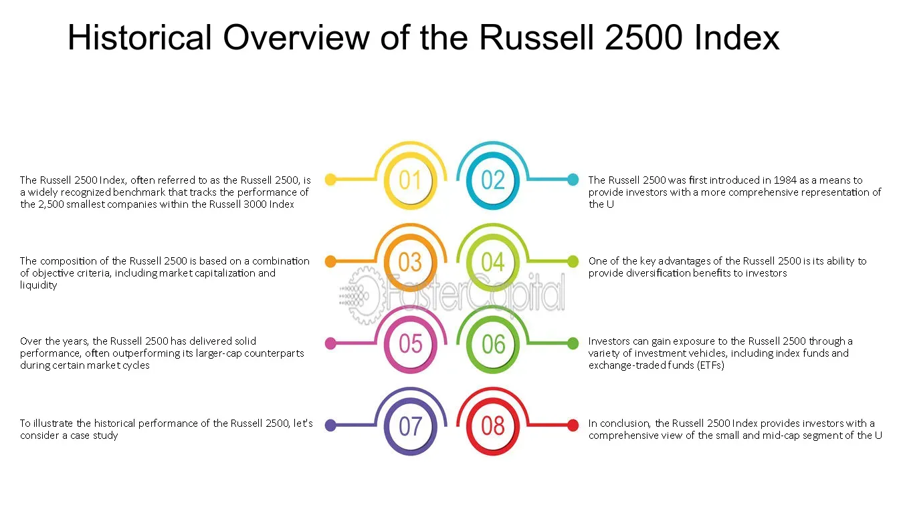

## Table of Contents

## What is the Russell 2500 Index?

The Russell 2500 Index is a stock market index that measures the performance of the small to mid-cap segment of the U.S. equity market. It includes the smallest 2,500 companies in the Russell 3000 Index, which represents about 20% of the total market capitalization of the Russell 3000. This index is useful for investors who want to focus on smaller companies that have the potential for growth but are not as large as the companies in the S&P 500.

The Russell 2500 Index is often used as a benchmark for investment funds that focus on small and mid-cap stocks. It provides a broad representation of the performance of these companies, which can be more volatile but also offer higher growth potential compared to larger companies. By tracking the Russell 2500, investors can get a sense of how this segment of the market is doing and make informed decisions about their investment strategies.

## Who manages the Russell 2500 Index?

The Russell 2500 Index is managed by FTSE Russell, a company that makes indexes for investors. FTSE Russell is part of the London Stock Exchange Group. They look after many indexes, and the Russell 2500 is one of them. They decide which companies are in the index and make sure it shows a good picture of small and mid-sized companies in the U.S.

FTSE Russell updates the Russell 2500 Index every year in June. They check which companies should be in the index based on their size and other rules. This helps keep the index accurate and useful for investors who want to know how small and mid-sized companies are doing.

## How many companies are included in the Russell 2500 Index?

The Russell 2500 Index includes 2,500 companies. These companies are the smallest ones from the Russell 3000 Index, which has the 3,000 biggest companies in the U.S.

The companies in the Russell 2500 are small to mid-sized. This index helps investors see how these smaller companies are doing in the stock market.

## What types of companies are typically found in the Russell 2500 Index?

The Russell 2500 Index includes small to mid-sized companies from many different industries. These companies are smaller than the big ones you might know from the S&P 500, but they can still be important. You'll find companies from sectors like technology, health care, finance, and more. They might be growing fast and have new ideas, but they can also be riskier because they're smaller.

These companies in the Russell 2500 are often trying to grow and become bigger. They might be working on new products or expanding into new markets. Because they're smaller, their stock prices can go up and down a lot more than bigger companies. This can be good if you want to invest in companies that might grow a lot, but it can also be risky if the companies don't do well.

## How is the performance of the Russell 2500 Index measured?

The performance of the Russell 2500 Index is measured by looking at how the stock prices of the 2,500 companies in the index change over time. If the stock prices go up, the index goes up. If the stock prices go down, the index goes down. The index is calculated using a method called market capitalization weighting. This means that companies with bigger total values have a bigger effect on the index's performance than smaller companies.

To get a clear picture of how the Russell 2500 is doing, people often look at its returns over different time periods, like one year, three years, or five years. They might also compare the Russell 2500 to other indexes, like the S&P 500, to see if small and mid-sized companies are doing better or worse than big companies. This helps investors understand if their investments in small and mid-sized companies are growing or not.

## What are the criteria for a company to be included in the Russell 2500 Index?

To be included in the Russell 2500 Index, a company must be part of the Russell 3000 Index. The Russell 3000 includes the 3,000 biggest companies in the U.S. based on their total value, which is called market capitalization. The Russell 2500 takes the smallest 2,500 companies from the Russell 3000. So, a company needs to be big enough to be in the Russell 3000 but small enough to be in the bottom 2,500 of those companies.

FTSE Russell, the company that manages the index, looks at the market capitalization of companies every year in May to decide which ones will be in the Russell 2500 for the next year. They use a specific date, called the "rank day," to check the size of the companies. If a company's size changes a lot during the year, it might move in or out of the index when it's updated in June. This way, the Russell 2500 always shows a good picture of small and mid-sized companies in the U.S.

## How does the Russell 2500 Index differ from the Russell 2000 and Russell 3000 Indexes?

The Russell 2500 Index and the Russell 2000 Index both focus on smaller companies, but they are different in size. The Russell 2500 includes the smallest 2,500 companies from the Russell 3000 Index. This means it covers small and mid-sized companies. On the other hand, the Russell 2000 only includes the smallest 2,000 companies from the Russell 3000. So, the Russell 2500 is a bit bigger and includes some mid-sized companies that are not in the Russell 2000.

The Russell 3000 Index is much bigger than both the Russell 2500 and the Russell 2000. It includes the 3,000 largest companies in the U.S., which means it covers almost the whole U.S. stock market. The Russell 2500 and Russell 2000 are parts of the Russell 3000. The Russell 2500 takes the smallest 2,500 companies from the Russell 3000, while the Russell 2000 takes the smallest 2,000. This makes the Russell 3000 a good way to see how the whole market is doing, while the Russell 2500 and Russell 2000 help investors focus on smaller companies.

## What are the advantages of investing in the Russell 2500 Index?

Investing in the Russell 2500 Index can be a good choice for people who want to grow their money. This index includes small and mid-sized companies, which often have more room to grow than big companies. When these smaller companies do well, their stock prices can go up a lot. This means you might make more money if you invest in the Russell 2500 than if you invest in an index with just big companies.

Another advantage is that the Russell 2500 Index spreads your money across many different companies and industries. This can make your investment safer because if one company or industry does badly, the others might still do well. By investing in the Russell 2500, you can have a piece of the growth of small and mid-sized companies in the U.S., which can be exciting and potentially rewarding.

## How can an investor gain exposure to the Russell 2500 Index?

An investor can gain exposure to the Russell 2500 Index by buying shares in exchange-traded funds (ETFs) or mutual funds that track the index. These funds are designed to mimic the performance of the Russell 2500, so when the index goes up or down, the value of the fund usually does the same. You can find these funds by looking at lists of ETFs or mutual funds that follow the Russell 2500 Index. Once you find one, you can buy shares through a broker, just like you would buy any other stock.

Another way to get exposure to the Russell 2500 is by investing in a separately managed account (SMA) that focuses on the index. An SMA is a portfolio managed by a professional who picks stocks to match the performance of the Russell 2500. This option might be more expensive than buying an ETF or mutual fund, but it can offer more personalized management. No matter which method you choose, investing in the Russell 2500 can help you tap into the growth potential of small and mid-sized companies in the U.S.

## What are the risks associated with investing in the Russell 2500 Index?

Investing in the Russell 2500 Index can be risky because it includes small and mid-sized companies. These companies can be more affected by changes in the economy. If the economy slows down, these smaller companies might not do well, and their stock prices could go down a lot. Also, small and mid-sized companies can be riskier because they might not have as much money or as many resources as bigger companies. This means they could have a harder time dealing with problems or growing their business.

Another risk is that the stocks in the Russell 2500 can be more volatile. This means their prices can go up and down a lot more than the stocks of bigger companies. If you need to sell your investment quickly, you might not get as much money as you hoped because the price could be lower than when you bought it. It's important to think about how long you can keep your money invested and how much risk you're okay with before you decide to invest in the Russell 2500 Index.

## How often is the Russell 2500 Index rebalanced, and what is the process?

The Russell 2500 Index is rebalanced once a year, usually in June. This means that every year, the people at FTSE Russell look at which companies should be in the index and which ones should be taken out. They do this to make sure the index still shows a good picture of small and mid-sized companies in the U.S. The rebalancing happens after they check the size of all the companies in the Russell 3000 Index on a specific day in May, called the "rank day."

During the rebalancing, FTSE Russell looks at the market capitalization of each company in the Russell 3000. Market capitalization is just a fancy way to say how much a company is worth. They pick the smallest 2,500 companies to be in the Russell 2500. If a company has grown too big, it might be moved out of the Russell 2500 and into a different part of the Russell 3000. This way, the Russell 2500 always stays true to its goal of showing how small and mid-sized companies are doing.

## What historical performance data is available for the Russell 2500 Index, and how can it be used for investment analysis?

Historical performance data for the Russell 2500 Index is available from FTSE Russell, the company that manages the index. You can find this data on their website or through financial data providers like Bloomberg or Morningstar. The data usually includes information like the total return of the index over different time periods, such as one year, three years, five years, and longer. It also shows how the index has done compared to other indexes like the S&P 500 or the Russell 2000. This information can help you see how small and mid-sized companies have performed over time.

You can use this historical performance data to help with your investment decisions. By looking at how the Russell 2500 has done in the past, you can get an idea of what might happen in the future. This doesn't mean you can predict exactly what will happen, but it can give you a sense of how risky or rewarding investing in small and mid-sized companies might be. For example, if the Russell 2500 has had higher returns than the S&P 500 in the past, you might think it's a good place to invest if you're looking for growth. But remember, past performance doesn't guarantee future results, so always think about your own goals and how much risk you're willing to take.

## References & Further Reading

[1]: Frank Russell Company. (2020). ["Russell 2500 Index Factsheet."](https://research.ftserussell.com/Analytics/FactSheets/Home/DownloadSingleIssue?openfile=open&issueName=US5012USD&isManual=True)

[2]: Malkiel, B. (2019). ["A Random Walk Down Wall Street: The Time-Tested Strategy for Successful Investing."](https://www.amazon.com/Random-Walk-Down-Wall-Street/dp/0393358380) W. W. Norton & Company.

[3]: Anderson, S. C., & Gallagher, D. R. (2003). ["The Impact of New Capital Controls on Small Cap Equities: Russell 2500 Index."](https://onlinelibrary.wiley.com/doi/abs/10.1111/1475-679X.00095) Journal of Financial Research.

[4]: "Algorithmic and High-Frequency Trading" by Álvaro Cartea, Sebastian Jaimungal, and José Penalva.

[5]: Chincarini, L. B., & Kim, D. (2006). ["Quantitative Equity Portfolio Management: An Active Approach to Portfolio Construction and Management."](https://archive.org/details/quantitativeequi0000chin_c9d6) McGraw-Hill.