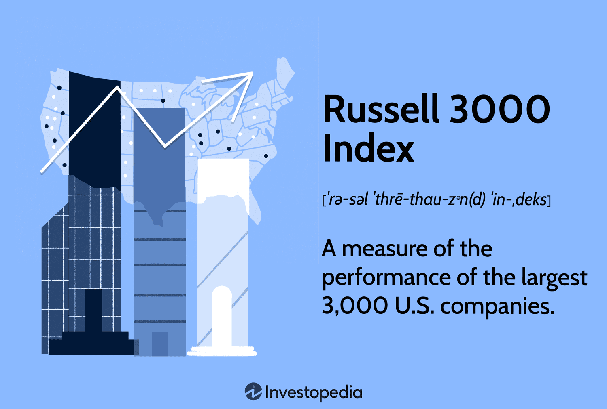

## Table of Contents

## What is the Russell 3000 Index?

The Russell 3000 Index is a stock market index that represents the performance of the 3,000 largest publicly traded companies in the United States. It is managed by FTSE Russell, a company that specializes in creating and managing indexes. The index covers about 98% of the total value of all the stocks that can be bought and sold in the U.S. market, making it a good way to see how the overall U.S. stock market is doing.

The companies in the Russell 3000 Index are chosen based on their market capitalization, which is the total value of all their shares. This means bigger companies have a bigger impact on the index's performance. The index is updated once a year in June, but it can also change throughout the year if there are big changes in the companies, like mergers or bankruptcies. By tracking the Russell 3000 Index, investors can get a broad view of how the U.S. stock market is performing and make decisions about their investments.

## How is the Russell 3000 Index composed?

The Russell 3000 Index is made up of the 3,000 largest companies in the United States that you can buy shares in. These companies are picked based on how much they are worth in total, which is called their market capitalization. The bigger a company's market capitalization, the more it affects the index. This means that the performance of big companies has a bigger impact on the index than smaller ones.

The index is updated every year in June. During this time, FTSE Russell checks which companies are the biggest and adjusts the list accordingly. But the index can also change during the year if something big happens, like a company merging with another or going bankrupt. This way, the Russell 3000 Index stays a good reflection of the overall U.S. stock market.

## What are the criteria for inclusion in the Russell 3000 Index?

The main thing that decides if a company can be in the Russell 3000 Index is its market capitalization. This means how much all the company's shares are worth put together. The 3,000 companies with the biggest market capitalizations in the United States get to be in the index. So, the bigger the company, the more it affects the index's performance.

The index is checked and updated every year in June. During this time, FTSE Russell looks at all the companies to see which ones are the biggest now. If a company has grown a lot and is now one of the top 3,000, it gets added to the index. If a company has shrunk and is no longer in the top 3,000, it gets taken out. But the index can also change during the year if something big happens, like a company merging with another or going bankrupt. This makes sure the Russell 3000 Index always shows a good picture of the U.S. stock market.

## How often is the Russell 3000 Index rebalanced?

The Russell 3000 Index gets rebalanced once a year, in June. This means they look at all the companies to see which ones are the biggest now. If a company has grown and is now one of the top 3,000, it gets added to the index. If a company has shrunk and is not in the top 3,000 anymore, it gets taken out.

But the index can also change during the year if something big happens. For example, if a company merges with another or goes bankrupt, the index might be updated right away. This makes sure the Russell 3000 Index always shows a good picture of the U.S. stock market.

## What is the significance of the Russell 3000 Index for investors?

The Russell 3000 Index is really important for investors because it shows how the whole U.S. stock market is doing. It includes the 3,000 biggest companies in the country, so it gives a good picture of the overall market. When investors look at the Russell 3000 Index, they can see if the market is going up or down, which helps them decide if it's a good time to buy or sell stocks. It's like a big report card for the U.S. stock market that investors can use to make smart choices about their money.

Another reason the Russell 3000 Index is important is that it helps investors spread out their investments. By looking at the index, investors can see how different kinds of companies are doing, from big tech firms to smaller businesses. This can help them pick a mix of stocks that balance risk and reward. Plus, many investment funds and ETFs try to copy the performance of the Russell 3000 Index, so it's a useful tool for people who want to invest in a way that follows the overall market.

## How does the Russell 3000 Index compare to other major indices like the S&P 500?

The Russell 3000 Index and the S&P 500 are both important stock market indexes, but they cover different parts of the market. The Russell 3000 Index includes the 3,000 biggest companies in the U.S., which is about 98% of the total market. This makes it a broad measure of how the whole U.S. stock market is doing. On the other hand, the S&P 500 only includes the 500 largest companies, which is a smaller but still significant part of the market. Because the S&P 500 focuses on bigger companies, its performance can be different from the Russell 3000, especially if smaller companies are doing better or worse than the big ones.

Both indexes are updated regularly, but they do it in different ways. The Russell 3000 Index gets rebalanced every year in June, and it can also change during the year if big things happen to companies, like mergers or bankruptcies. The S&P 500 is also updated regularly, but its changes are decided by a committee that looks at things like a company's market size, how much it's traded, and how well it's doing financially. So, while the Russell 3000 Index gives a wider view of the market, the S&P 500 can give a more focused look at the biggest companies.

## What are the performance metrics of the Russell 3000 Index over the last decade?

Over the last 10 years, the Russell 3000 Index has shown strong growth. From 2013 to 2023, the index's total return, which includes both price changes and dividends, went up by about 200%. This means if you had invested $100 in the Russell 3000 Index at the start of 2013, it would have grown to about $300 by the end of 2023. The index had some ups and downs during this time, but overall, it did really well, especially in the years after the big drop in 2020 due to the global health crisis.

Looking at yearly performance, the Russell 3000 Index had its best year in 2021, with a total return of around 26%. The worst year was 2022, when the index went down by about 19%. Even with these big swings, the long-term trend was positive. The index's yearly average return over the decade was about 12%, which is a good rate for investors looking for growth over time. This shows that the U.S. stock market, as measured by the Russell 3000 Index, has been a solid place to invest over the last 10 years.

## How can investors gain exposure to the Russell 3000 Index?

Investors can gain exposure to the Russell 3000 Index by buying shares in an exchange-traded fund ([ETF](/wiki/etf-trading-strategies)) that tries to match the index's performance. One popular ETF for this is the iShares Russell 3000 ETF, which you can buy and sell just like a regular stock. This ETF holds a little bit of stock in all the companies in the Russell 3000 Index, so when you buy the ETF, you're basically investing in all those companies at once. It's a simple way to spread your money across a big part of the U.S. stock market without having to pick individual stocks.

Another way to get exposure to the Russell 3000 Index is through mutual funds that track the index. Some mutual funds are designed to mimic the performance of the Russell 3000 Index, so when you put money into these funds, your investment will go up and down with the index. These funds are often managed by professionals who handle all the buying and selling of stocks for you. This can be a good choice if you want a hands-off approach to investing in the whole U.S. market.

## What are the advantages of investing in the Russell 3000 Index?

Investing in the Russell 3000 Index can be a smart move because it lets you spread your money across a lot of different companies. The index includes the 3,000 biggest companies in the U.S., which is a huge part of the market. This means you're not putting all your eggs in one basket. If one company or industry does badly, it won't hurt your whole investment as much because you have shares in so many other companies too. It's like buying a little piece of the whole U.S. economy, which can be safer than [picking](/wiki/asset-class-picking) just a few stocks.

Another advantage is that the Russell 3000 Index gives you a good picture of how the U.S. stock market is doing overall. It's a broad measure that includes big and small companies from all kinds of industries. This can help you see trends and make better decisions about when to buy or sell. Plus, because it's updated regularly, you can be sure it stays a good reflection of the market. Investing in the Russell 3000 Index through an ETF or mutual fund is also easy and doesn't require a lot of work, making it a good choice for people who want to invest without having to pick individual stocks.

## What are the potential risks associated with the Russell 3000 Index?

Investing in the Russell 3000 Index comes with some risks that you should know about. One big risk is that the whole stock market can go down. Even though the index includes 3,000 companies, if the market as a whole does badly, your investment will go down too. This can happen because of big events like a global health crisis, a recession, or changes in interest rates. So, even though the index helps you spread your money around, it doesn't protect you from big drops in the market.

Another risk is that the Russell 3000 Index can be affected by how well big companies do. The index is based on market capitalization, which means the biggest companies have the biggest impact on its performance. If these big companies do badly, it can pull the whole index down, even if smaller companies are doing okay. Also, because the index is updated every year, there can be some changes that affect how it performs. So, even though it's a broad measure of the market, it's still influenced a lot by the biggest players.

## How does the Russell 3000 Index influence financial markets?

The Russell 3000 Index is a big deal in the financial world because it shows how the whole U.S. stock market is doing. When the index goes up or down, it can affect how people feel about investing. If the index is doing well, more people might want to buy stocks, thinking the market is strong. But if the index goes down, it might make investors nervous, and they might sell their stocks or wait to see what happens next. This can lead to more buying or selling in the market, which can make prices go up or down even more.

The index also helps guide how money is invested. Big investors like pension funds and mutual funds often use the Russell 3000 Index to decide where to put their money. They might try to copy the index's performance by buying the same stocks in the same amounts. This can move a lot of money around in the market, affecting which stocks go up or down in price. Because the index is updated every year, changes in which companies are included can also cause shifts in the market as investors adjust their portfolios to match the new lineup.

## What advanced strategies can be used to optimize returns from the Russell 3000 Index?

One advanced strategy to optimize returns from the Russell 3000 Index is called sector rotation. This means you try to guess which parts of the economy, like technology or healthcare, will do better than others at different times. By moving your money into ETFs or mutual funds that focus on those sectors, you can try to get better returns than just sticking with the whole index. For example, if you think technology companies will do well in the next few months, you might put more money into a tech-focused ETF. This can be a bit riskier because you're trying to predict the future, but it can also lead to higher returns if you get it right.

Another strategy is called smart beta investing. This involves using different ways to pick stocks in the index, instead of just going by how big the companies are. For example, you might choose stocks based on how much they pay in dividends, how fast they're growing, or how cheap they are compared to their earnings. By using these different ways to pick stocks, you can try to beat the overall performance of the Russell 3000 Index. This can be a good way to get better returns, but it also takes more work and understanding of how the stock market works.

## References & Further Reading

[1]: ["Advances in Financial Machine Learning"](https://www.amazon.com/Advances-Financial-Machine-Learning-Marcos/dp/1119482089) by Marcos Lopez de Prado

[2]: ["Evidence-Based Technical Analysis: Applying the Scientific Method and Statistical Inference to Trading Signals"](https://www.semanticscholar.org/paper/Evidence-Based-Technical-Analysis%3A-Applying-the-and-Aronson/3b33df8737f1772e9e14d66a08c9696f140a2ee1) by David Aronson

[3]: ["Machine Learning for Algorithmic Trading"](https://github.com/PacktPublishing/Machine-Learning-for-Algorithmic-Trading-Second-Edition) by Stefan Jansen

[4]: ["Quantitative Trading: How to Build Your Own Algorithmic Trading Business"](https://www.amazon.com/Quantitative-Trading-Build-Algorithmic-Business/dp/1119800064) by Ernest P. Chan

[5]: ["Russell 3000 Index®."](https://www.investopedia.com/terms/r/russell_3000.asp) FTSE Russell. 

[6]: ["The Little Book of Common Sense Investing"](https://www.amazon.com/Little-Book-Common-Sense-Investing/dp/1119404509) by John C. Bogle

[7]: ["Algorithmic and High-Frequency Trading"](https://www.cambridge.org/us/universitypress/subjects/mathematics/mathematical-finance/algorithmic-and-high-frequency-trading) by Álvaro Cartea, Sebastian Jaimungal, and José Penalva