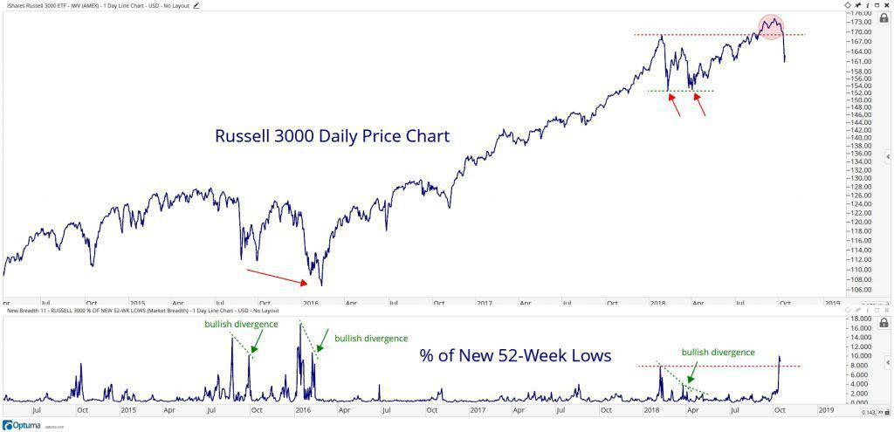

In the ever-evolving financial landscape, the Russell 3000 Index stands out for its comprehensive coverage of the U.S. stock market. Comprised of the 3,000 largest publicly traded companies in the United States, this index encapsulates approximately 96% of the investable U.S. equity market. The breadth and depth of the Russell 3000 make it an essential tool for gauging the overall performance of the U.S. stock market, offering investors a broad perspective beyond the focus on large-cap stocks. 

The Russell 3000's design allows for diverse exposure across multiple sectors, serving as a balanced representation of the market's dynamics. It is often used as a benchmark by investors seeking a holistic view of market performance. Moreover, the index's comprehensive structure provides a platform for various investment strategies, including algorithmic trading. This approach harnesses the vast dataset provided by the index to automate and optimize trading decisions, potentially enhancing efficiency and returns.



Understanding the nuances of the Russell 3000 is crucial for making informed investment choices. Its regular reconstitution ensures that the index accurately reflects the changing market environment, thus maintaining its relevance. 

This article aims to provide a detailed investment analysis of the Russell 3000, emphasizing its role in the stock market and its utility in algorithmic trading strategies. For both novice and experienced investors, the insights offered by the Russell 3000 are indispensable for crafting effective investment strategies. Join us as we explore the components and insights that this index offers, enhancing your ability to navigate the complexities of the financial markets.

## Table of Contents

## Understanding the Russell 3000 Index

The Russell 3000 Index is a comprehensive measure of the U.S. stock market, comprising the 3,000 largest publicly traded companies in the United States. It represents approximately 96% of the investable U.S. equity, making it a vital gauge for tracking overall market performance. By encompassing firms across a spectrum of industries and sectors, the Russell 3000 offers investors an extensive view into the dynamics of the U.S. stock market, illustrating trends and shifts within the broader economy.

The structure of the Russell 3000 includes both the Russell 1000 Index, which focuses on the largest companies classified as large-cap, and the Russell 2000 Index, representative of smaller, small-cap companies. This nested design allows investors to gain a broad spectrum of insights into different market capitalizations while encapsulating the diverse array of business activities within the market. 

Reconstitution occurs annually, typically in June, ensuring that the index reflects the evolving corporate landscape. This process involves adjusting the index to include new entrants and remove companies that no longer meet the requisite criteria, maintaining its accuracy as a market benchmark. This realignment ensures that it continues to represent the large spectrum of American businesses accurately, adhering to changes in market valuations, mergers, acquisitions, and emerging companies.

By providing exposure to a wide range of sectors, the index mitigates the risk of over-concentration in any single industry, offering a balanced perspective on U.S. stock performance. Such comprehensive representation allows investors to capitalize on the growth potential across various segments of the economy, from technology and healthcare to industrials and consumer services. The Russell 3000's composition and periodic recalibration make it an indispensable tool for understanding and participating in the complexities of the U.S. equity market.

## Algorithmic Trading in the Russell 3000

Algorithmic trading refers to the use of computer algorithms to automate and enhance stock trading processes, effectively revolutionizing the trading landscape. The Russell 3000 Index, consisting of the 3,000 largest publicly traded companies in the United States, presents unique opportunities for such trading strategies due to its wide-ranging and diverse nature. Given this diversity, [algorithmic trading](/wiki/algorithmic-trading) can effectively exploit high-frequency trading ([HFT](/wiki/high-frequency-trading-strategies)) opportunities, maximizing the potential gains from this comprehensive index.

The primary benefits of employing algorithms in trading within the Russell 3000 include speed, accuracy, and efficient analysis of large datasets. Algorithms can execute trades in a fraction of a second, far surpassing human capabilities. This speed is crucial in capturing favorable price points and responding to market fluctuations swiftly. Moreover, algorithms are designed to [carry](/wiki/carry-trading) out trading strategies consistently without human emotional biases, ensuring accuracy in trade execution.

The efficiency of algorithms in analyzing extensive datasets is another notable advantage, particularly with an index as diverse as the Russell 3000. The ability to process and interpret vast amounts of data enables more informed decision-making. Algorithmic strategies can incorporate various data inputs such as historical price data, trading volumes, and even news sentiment, providing a comprehensive market view.

Implementing algorithmic strategies in the framework of the Russell 3000 involves several considerations. Traders must establish clear parameters and trading signals for their algorithms to follow. For instance, algorithms can be programmed using technical indicators like moving averages or relative strength index (RSI) to identify potential buying or selling opportunities. Here's a simple Python example illustrating the use of moving averages:

```python
import pandas as pd

# Assuming `data` is a DataFrame with stock price information
data['short_mavg'] = data['price'].rolling(window=40, min_periods=1).mean()
data['long_mavg'] = data['price'].rolling(window=100, min_periods=1).mean()

data['signal'] = 0
data.loc[data['short_mavg'] > data['long_mavg'], 'signal'] = 1
data.loc[data['short_mavg'] <= data['long_mavg'], 'signal'] = -1

# Signal 1 indicates a buy, -1 indicates a sell
```

Although algorithmic trading offers significant advantages, there are challenges and considerations that traders should be mindful of. Market [liquidity](/wiki/liquidity-risk-premium) is essential for HFT strategies, as insufficient liquidity can hinder the execution of trades and result in unfavorable pricing. Additionally, while algorithmic trading minimizes emotional bias, it requires robust risk management strategies to prevent significant losses, especially in volatile market conditions.

Moreover, the ever-changing market dynamics necessitate continuous monitoring and refinement of algorithms to adapt to new trends or shifts in market behavior. Monitoring trading algorithms in real-time helps identify potential issues promptly and ensure alignment with trading objectives.

In conclusion, algorithmic trading within the Russell 3000 holds substantial potential for enhancing trading efficiency and performance. However, a strategic approach, careful consideration of risks, and ongoing refinement of algorithms are essential to fully leverage the opportunities this index provides.

## Top Holdings and Sector Breakdown

The Russell 3000 Index, encompassing a vast array of U.S. companies, offers investors a comprehensive view of the stock market's diverse landscape. Notably, the index includes some of the most significant enterprises like Apple, Microsoft, Nvidia, and Amazon, each of which plays a crucial role in the overall dynamics of the index. These companies highlight the index's strong inclination towards the technology sector, which remains a dominant force within the Russell 3000.

The technology sector's substantial representation reflects global trends towards digitalization and innovation. Companies such as Apple and Microsoft drive sector performance due to their substantial market caps and influence on both consumer and enterprise markets. Meanwhile, Nvidia's role in pioneering graphics processing and Amazon's continued dominance in e-commerce and cloud computing further underscore the technology sector's prominence.

Beyond technology, the Russell 3000 index doesn't neglect other essential sectors. It provides extensive exposure to financials, healthcare, and consumer discretionary sectors. Financials include major banking and insurance companies that help gauge economic stability and growth. The healthcare sector is crucial for its impact on public health and its potential for innovation, with pharmaceuticals and biotechnology companies making up significant parts. Additionally, consumer discretionary companies illustrate consumer spending trends, reflecting parts of the economy sensitive to economic cycles.

An in-depth examination reveals the sectoral allocations within the Russell 3000. Typically, technology might comprise around 25-30% of the index, financials around 15%, and healthcare and consumer discretionary sectors each about 10-15%. This distribution informs investors about the economic areas where the most capitalization and market activity are concentrated, allowing them to make informed decisions regarding diversification strategies.

Understanding these sectoral breakdowns is essential for investors. By recognizing how various sectors contribute to the index's overall performance, investors can better balance their portfolios to optimize returns and mitigate risks. Essentially, by investing in the Russell 3000, individuals and institutions gain a multi-faceted exposure that mirrors the broader U.S. economy's vibrance and complexity. This diverse exposure helps in managing risks associated with investing in individual stocks or narrower indices.

## Investing in the Russell 3000

Investors aiming to gain exposure to the Russell 3000 Index have several practical options, primarily through index funds and exchange-traded funds (ETFs) that track the index's performance. These investment vehicles offer indirect ownership of the stocks within the Russell 3000, allowing investors to benefit from a broad representation of the U.S. equity market.

### Investment Options

#### Index Funds and ETFs

Index funds are mutual funds designed to mimic the performance of a specific index, such as the Russell 3000. They provide a straightforward way for investors to obtain diversified exposure, with management typically involving a passive investment strategy that keeps costs relatively low. ETFs, on the other hand, function similarly but trade on stock exchanges, allowing for flexibility akin to trading individual stocks. Notable ETFs that track the Russell 3000 include the iShares Russell 3000 [ETF](/wiki/etf-trading-strategies) (IWV) and the Vanguard Russell 3000 ETF (VTHR).

### Strategic Integration

For investors employing algorithmic trading strategies, ETFs and index funds tracking the Russell 3000 can be incorporated into automated trading systems. Algorithms can optimize the timing of buying and selling shares to enhance returns, capitalize on [arbitrage](/wiki/arbitrage) opportunities, or maintain a balanced portfolio according to specific risk parameters. 

Here's a basic example of how Python might be used to calculate a simple moving average for a trading strategy involving an ETF:

```python
import pandas as pd

# Assuming 'data' is a DataFrame containing historical price data for an ETF
def calculate_moving_average(data, window_size):
    return data['Close'].rolling(window=window_size).mean()

etf_data = pd.read_csv("etf_prices.csv")
moving_average = calculate_moving_average(etf_data, 20)

print(moving_average)
```

### Considerations: Fees, Liquidity, and Tracking Errors

When selecting investment vehicles, investors must consider several factors to ensure alignment with their financial strategies:

- **Management Fees**: Lower fees are generally preferred, as these costs can erode returns over time. ETFs often offer cheaper alternatives to index mutual funds due to lower operational costs.

- **Liquidity**: Highly liquid ETFs provide ease of purchase and sale, reducing the risk of significant price shifts when transacting large volumes.

- **Tracking Errors**: These occur when an ETF or index fund's performance diverges from the Russell 3000 Index itself. Smaller tracking errors are desirable, indicating more precise performance alignment with the underlying index.

Investors should evaluate these factors against their investment goals and risk tolerance levels. By carefully selecting the appropriate index fund or ETF, investors can effectively utilize Russell 3000-based investment products as part of a diverse and strategic portfolio.

## Russell 3000 vs. Other Indexes

The Russell 3000 Index provides a comprehensive snapshot of the U.S. equity market, distinguishing itself from other major stock indices such as the S&P 500, Dow Jones Industrial Average (DJIA), and Nasdaq Composite through its inclusivity of a broad spectrum of companies. 

Primarily, the S&P 500 and DJIA concentrate on large-cap corporations. The S&P 500 comprises 500 of the leading public companies and serves as a barometer for large-cap U.S. equity performance. Meanwhile, the DJIA, consisting of 30 prominent industrial stocks, reflects a narrower scope with a focus on blue-chip companies. By including mid and small-cap stocks alongside large-cap ones, the Russell 3000 offers a more expansive market perspective, representing roughly 96% of the investable U.S. equity universe.

In contrast, the Nasdaq Composite is renowned for its concentration in the technology sector, with tech companies making up a significant portion of its listings. This tech-heavy focus can lead to different risk-return profiles, as the index may exhibit higher [volatility](/wiki/volatility-trading-strategies) due to the inherent nature of tech stocks. On the other hand, the Russell 3000's diversified composition across various sectors provides a balanced view of the market, potentially mitigating sector-specific risks and reducing correlation with more narrowly focused indices like the Nasdaq Composite.

The broader inclusion of companies within the Russell 3000 also impacts investment performance metrics and risk assessments. While the S&P 500 and DJIA offer stability in performance through large, established companies, the Russell 3000 captures growth opportunities present in smaller firms. This wider range of capitalization allows investors to partake in early-stage growth potential while maintaining exposure to established entities.

Furthermore, each index has unique risk considerations. The S&P 500 and DJIA carry inherent risk due to their concentrated focus on large-cap stocks, which may not capitalize fully on smaller market movements. Conversely, the Russell 3000's exposure to smaller companies introduces additional elements of volatility. The Nasdaq Composite's focus on technology implies that it may bear higher specific risk related to those stocks' performance dynamics.

In summary, the Russell 3000's inclusive nature offers a distinct advantage for those seeking a diversified investment avenue, encompassing America's corporate landscape more comprehensively than its counterparts. Its balanced sector representation, coupled with a mix of capitalization sizes, makes it a compelling component for investors pursuing diverse exposure while weighing distinct performance and risk characteristics propositions offered by other indices.

## Limitations and Considerations

The Russell 3000 Index, with its wide coverage of the U.S. stock market, brings certain limitations that investors should recognize. One of the primary concerns is the index's bias towards large-cap stocks. While it represents a broad spectrum of companies, due to the market capitalization weighting, larger companies can disproportionately influence the index's performance. This skew can present a misleading perception of overall market performance, highlighting a need for investors to evaluate the index's individual components thoroughly.

Another limitation is the exclusion of non-domestic stocks. Since the Russell 3000 focuses solely on U.S. companies, it does not provide exposure to international markets, which could be significant for investors looking to diversify globally. This domestic-focused approach restricts companies that might offer growth opportunities in emerging markets or developed economies outside the United States.

Additionally, the Russell 3000 is reconstituted annually, a process that realigns its composition to the current market landscape. However, these updates might not be frequent enough to capture rapid market movements or sudden shifts in company valuations. For instance, volatile sectors that see swift changes could fall out of alignment with the index's representation, resulting in potential mismatches between the index and real-world market dynamics.

Investors should also be aware that these index-based investments inherently include tracking error and management fees if pursued through mutual funds or exchange-traded funds (ETFs). Tracking error, which measures how closely a fund replicates the index, can arise due to differing rebalancing schedules and trading costs, among other factors. Hence, while the Russell 3000 offers considerable exposure to the U.S. equity market, investors should [factor](/wiki/factor-investing) in these limitations and considerations when forming their investment expectations or strategies with index-based instruments.

## Conclusion

The Russell 3000 Index offers a significant opportunity for investors seeking comprehensive exposure to the U.S. equity market. With its inclusion of the 3,000 largest publicly traded companies, it covers a wide spectrum of industries and company sizes, making it an essential tool for those aiming to capture the overall market performance.

Algorithmic trading strategies can significantly enhance the investment potential of the Russell 3000 Index. The use of computer algorithms to automate trading allows for high-speed transactions and the ability to analyze large volumes of data efficiently. This can lead to improved execution speeds and potentially better pricing. Algorithms can be designed to exploit specific market conditions or sector trends within the index, providing a competitive edge in high-frequency trading environments.

However, to fully leverage the potential of the Russell 3000 Index, investors must have a thorough understanding of its structure, top holdings, and inherent limitations. For instance, the index's weighting towards large-cap stocks might influence its performance differently compared to other indices. Additionally, its focus on domestic stocks may limit global diversification. Being aware of these factors helps in making informed decisions and setting realistic expectations for index-based investments.

When integrated into a diversified investment strategy, the Russell 3000 can serve as a valuable component for both individual and institutional investors. Its broad market coverage and diversification benefits make it an attractive option for those looking to balance risk and return. By combining it with other investment vehicles and strategies, investors can create a well-rounded portfolio that aligns with their financial goals.

## References & Further Reading

[1]: ["Advances in Financial Machine Learning"](https://www.amazon.com/Advances-Financial-Machine-Learning-Marcos/dp/1119482089) by Marcos Lopez de Prado

[2]: ["Evidence-Based Technical Analysis: Applying the Scientific Method and Statistical Inference to Trading Signals"](https://www.semanticscholar.org/paper/Evidence-Based-Technical-Analysis%3A-Applying-the-and-Aronson/3b33df8737f1772e9e14d66a08c9696f140a2ee1) by David Aronson

[3]: ["Machine Learning for Algorithmic Trading"](https://github.com/PacktPublishing/Machine-Learning-for-Algorithmic-Trading-Second-Edition) by Stefan Jansen

[4]: ["Quantitative Trading: How to Build Your Own Algorithmic Trading Business"](https://www.amazon.com/Quantitative-Trading-Build-Algorithmic-Business/dp/1119800064) by Ernest P. Chan

[5]: ["Russell 3000 Index®."](https://www.investopedia.com/terms/r/russell_3000.asp) FTSE Russell. 

[6]: ["The Little Book of Common Sense Investing"](https://www.amazon.com/Little-Book-Common-Sense-Investing/dp/1119404509) by John C. Bogle

[7]: ["Algorithmic and High-Frequency Trading"](https://www.cambridge.org/us/universitypress/subjects/mathematics/mathematical-finance/algorithmic-and-high-frequency-trading) by Álvaro Cartea, Sebastian Jaimungal, and José Penalva