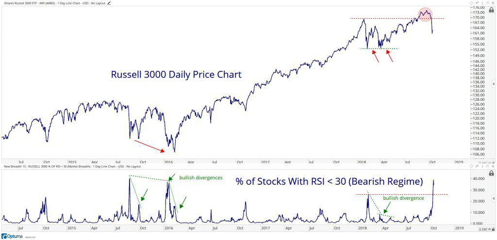

The Russell 3000 Index is an influential financial benchmark that provides comprehensive insights into the U.S. stock market by encompassing the 3,000 largest publicly traded companies. This broad coverage ensures that the index reflects approximately 98% of the investable U.S. equity market, making it a critical tool for investors and analysts seeking to understand market trends and dynamics. The Russell 3000 is uniquely divided into growth and value components, each tailored to specific investment strategies. The Russell 3000 Value Index, in particular, comprises companies identified as value stocks. These stocks typically have characteristics such as lower price-to-book (P/B) ratios and may offer higher dividend yields, attracting investors who focus on undervalued opportunities and stable returns.

In recent years, the advent of algorithmic trading has profoundly transformed financial markets, enhancing the ability to conduct strategic trading operations with improved efficiency and return potential. This form of trading relies on algorithm-driven transactions, where complex mathematical models and computing power enable rapid decision-making and execution. The vast and diverse scope of the Russell 3000 makes it an attractive underlying asset for such strategies, as algorithms can swiftly analyze and respond to market movements across a broad range of sectors and companies.



This article examines the interplay between value investing through the Russell 3000 Value Index and the increasing role of algorithmic trading in contemporary investment strategies. It provides a resource for investors aiming to leverage these concepts to optimize their portfolios and capitalize on evolving market conditions. Understanding the structural nuances of the Russell 3000 and the potential offered by algorithmic strategies is essential for those seeking to enhance their returns while mitigating risks.

## Table of Contents

## Understanding the Russell 3000 Value Index

The Russell 3000 Value Index is a subset of the broader Russell 3000 Index, specifically designed to represent companies that are considered value stocks. The differentiation of value stocks is primarily based on financial metrics such as lower price-to-book (P/B) ratios. This metric is calculated as:

$$
\text{Price-to-Book Ratio} = \frac{\text{Market Price per Share}}{\text{Book Value per Share}}
$$

Value stocks are recognized for having relatively lower P/B ratios compared to [growth stocks](/wiki/growth-stocks), which often exhibit higher P/B ratios due to anticipated future growth. Additionally, value stocks tend to offer higher dividend yields, making them appealing to investors who prioritize income generation.  

The Russell 3000 Value Index is weighted by market capitalization, meaning that companies with larger market values have a more significant impact on the index's performance. Market capitalization is determined by the formula:

$$
\text{Market Capitalization} = \text{Share Price} \times \text{Number of Outstanding Shares}
$$

The index undergoes an annual reconstitution process. This rebalancing ensures that the index remains aligned with the current market landscape and includes only those companies that satisfy the value criteria outlined by FTSE Russell. This process is essential for maintaining the index's relevance and accuracy in reflecting market trends among value stocks.

For investors, the Russell 3000 Value Index is a vital analytical and strategic tool. Its composition offers a snapshot of value-oriented investment opportunities across various sectors within the U.S. equity market. With its comprehensive coverage and methodical weighting, the index aids investors in tracking specific trends and making informed decisions about their investments, particularly in recognizing undervalued stocks with potential for appreciable returns.

## Algorithmic Trading and the Russell 3000

Algorithmic trading employs sophisticated computer algorithms to execute trading orders, expediting analysis and execution in financial markets. This approach offers notable benefits, including enhanced speed, precision, and the capacity to handle large datasets, thereby optimizing trading decisions. The Russell 3000 Index, which encompasses the 3,000 largest publicly traded U.S. companies, provides a rich platform for [algorithmic trading](/wiki/algorithmic-trading) owing to its extensive diversity across sectors and market capitalizations.

The Index's comprehensive structure allows traders to design algorithms that can exploit market inefficiencies by executing trades based on predefined signals. These signals often include technical indicators such as moving averages, relative strength index (RSI), or Bollinger Bands. By quantifying these indicators programmatically, traders can identify optimal buy or sell opportunities. For instance, a moving average strategy might be implemented in Python as follows:

```python
import numpy as np
import pandas as pd

def moving_average_strategy(data, window=20):
    data['Moving_Average'] = data['Close'].rolling(window=window).mean()
    buy_signal = (data['Close'] > data['Moving_Average']) & (data['Close'].shift(1) <= data['Moving_Average'])
    sell_signal = (data['Close'] < data['Moving_Average']) & (data['Close'].shift(1) >= data['Moving_Average'])
    return data[buy_signal], data[sell_signal]

# Example usage
# df is a DataFrame with Date and 'Close' price columns
buy_signals, sell_signals = moving_average_strategy(df)
```

When employing algorithmic strategies within indices as diverse as the Russell 3000, traders must consider critical factors such as market [liquidity](/wiki/liquidity-risk-premium) and risk management. Liquidity affects the ability to enter and [exit](/wiki/exit-strategy) positions without significant price slippage. As algorithmic trading can involve rapid order placement, the liquidity of the underlying assets in the Russell 3000 is pivotal in achieving favorable execution prices.

A robust risk management framework is also essential to safeguard against potential market [volatility](/wiki/volatility-trading-strategies) and losses. This involves setting stop-loss orders, position sizing, and diversifying across multiple stocks to mitigate risks associated with individual asset fluctuations. Continuous monitoring and the ability to adjust algorithms in response to market dynamics further enhance the resilience of trading strategies.

To sum up, algorithmic trading can unlock significant advantages when applied to the Russell 3000 Index by leveraging its breadth and depth. By skillfully integrating technical indicators within automated systems and ensuring comprehensive risk management, traders can enhance their ability to capture market opportunities efficiently.

## Investment Considerations in the Russell 3000

Investors can access the Russell 3000 Index through index funds and exchange-traded funds (ETFs). These investment vehicles passively track the performance of the Russell 3000, providing diversified exposure across various U.S. market segments. By investing in such funds, investors can gain exposure to a wide array of companies, from large-cap to small-cap, through a single investment product.

### Key Considerations for Investors

When investing in the Russell 3000 through index funds or ETFs, there are several crucial factors to consider:

1. **Management Fees**: These costs, expressed as an expense ratio, represent the portion of assets under management (AUM) taken annually to cover operation expenses. Although index funds and ETFs generally have lower fees compared to active funds due to their passive management style, it’s essential for investors to understand how these fees affect net returns. For example, an expense ratio of 0.2% means that for every $1,000 invested, $2 is deducted yearly to cover expenses.

2. **Liquidity**: This refers to the ease of buying or selling fund shares without significantly affecting their price. ETFs often offer higher liquidity compared to index mutual funds, as they can be traded throughout the day on stock exchanges. This intraday trading capability provides flexibility, especially in volatile market conditions.

3. **Tracking Errors**: This measures the consistency of a fund's performance compared to its benchmark index. Tracking errors can arise due to multiple factors, including transaction costs, fund expenses, and cash holdings. A lower tracking error indicates that the fund more closely follows the index's performance, which is generally desirable for passive investments.

### Mutual Funds vs. ETFs

The decision between using index mutual funds and ETFs hinges on several personal investment factors:

- **Investment Goals**: Long-term investors focused on growth may prefer index funds for their automatic reinvestment of dividends. In contrast, ETFs allow for tactical adjustments in portfolios, advantageous for those pursuing short-term or strategic positions.

- **Trading Flexibility**: ETFs offer advantages for active traders due to their ability to be bought and sold throughout the trading day at market prices, unlike index mutual funds, which trade at the end of the trading day at the net asset value (NAV).

- **Cost Preferences**: ETF trades incur brokerage fees, potentially impacting short-term strategies. Some investors prefer mutual funds for their purchase simplicity and lack of trading commissions.

### Algorithmic Strategies and ETFs

For those employing algorithmic trading strategies, ETFs present a versatile option. They allow for dynamic adjustments in portfolios as algorithms can automatically execute trades based on market data and predefined rules. For example, using Python, an algorithm can be designed to adjust [ETF](/wiki/etf-trading-strategies) holdings by detecting weighted moving average crossovers, identifying potential entry or exit points:

```python
import pandas as pd
import numpy as np

# Example for a simple moving average crossover strategy
def calculate_moving_averages(prices, short_window, long_window):
    short_mavg = prices.rolling(window=short_window, min_periods=1).mean()
    long_mavg = prices.rolling(window=long_window, min_periods=1).mean()
    return short_mavg, long_mavg

# Generate signals
def generate_signals(prices):
    signals = pd.DataFrame(index=prices.index)
    signals['price'] = prices
    signals['short_mavg'], signals['long_mavg'] = calculate_moving_averages(prices, 40, 100)
    signals['signal'] = 0.0
    signals['signal'][40:] = np.where(signals['short_mavg'][40:] > signals['long_mavg'][40:], 1.0, 0.0)
    return signals

# Sample price data as a pandas DataFrame
# 'data' is a placeholder for actual price history which would be used.
```

By leveraging such algorithmic strategies in ETF trades, investors can potentially enhance returns, exploiting short-term market inefficiencies while maintaining broader exposure to the Russell 3000's diverse market segments.

## Comparing the Russell 3000 with Other Indices

The Russell 3000 Index serves as a broad-based barometer of the U.S. stock market, capturing approximately 98% of the investable market. Unlike the S&P 500 and Dow Jones Industrial Average (DJIA), which primarily target large-cap stocks, the Russell 3000 covers a wider range, including mid-cap and small-cap companies. This expansive coverage allows investors to achieve greater diversification across company sizes, mitigating the concentration risk associated with large-cap dominance.

In contrast, the Nasdaq Composite Index is predominantly technology and growth-oriented, driven by its significant emphasis on tech-related companies. While this focus can lead to higher growth opportunities during tech sector booms, it also poses heightened sector-specific risks. The balanced sector representation of the Russell 3000, however, tempers such risks by providing exposure across various industries, thereby stabilizing returns over different economic cycles.

The diverse exposure offered by the Russell 3000 enables investors to tap into distinct risk-return profiles compared to narrower indices. Large-cap indices, like the S&P 500, may present lower volatility but potentially limit growth opportunities found in mid-sized and smaller firms. Conversely, small-cap indices might provide substantial growth potential but come with higher volatility. The Russell 3000 positions itself in a middle ground, offering a blend of stability and growth potential, making it appealing for strategic, long-term diversification.

Grasping the unique attributes of each index is essential for investors aiming to compile a comprehensive investment strategy. Combining indices with varying scopes allows for enhanced portfolio diversification, catering to individual risk tolerances and investment goals. For instance, an investor might complement an S&P 500-focused portfolio with the Russell 3000 to capture broader market dynamics, thereby achieving balanced exposure while optimizing both growth potential and risk mitigation.

## Challenges and Limitations

The Russell 3000 Index, while comprehensive, is not without its challenges and limitations. Its market-capitalization weighting methodology can result in a skewed representation towards larger companies. This bias means that the index might disproportionately reflect the performance of large-cap stocks, potentially overshadowing the representation of mid and small-cap companies within the index. Thus, the perceived performance of the index could be substantially influenced by a few substantial companies, reducing the visibility of smaller firms' dynamics.

Additionally, the Russell 3000's exclusive focus on U.S.-based companies results in an inherently domestic perspective, which may overlook growth opportunities in international markets. Investors relying solely on this index are likely missing diversification benefits, such as reduced volatility and enhanced returns, that global market exposure might offer.

The index is reconstituted annually to reflect market changes and ensure it comprises the largest U.S. companies at any given time. However, this annual reconstitution may not be frequent enough to capture rapid fluctuations and shifts within the market. Consequently, investors need to stay well-informed about underlying market movements and trends to address the temporal gap between reconstitutions.

Investors must also pay attention to tracking errors and fees when considering index-based investments such as ETFs or mutual funds that replicate the Russell 3000. Tracking error, the divergence between the index's performance and the actual investment vehicle, can impact the returns, alongside management and operational fees, potentially diminishing overall investment returns. Understanding these factors is crucial for investors looking to optimize their portfolio strategies using the Russell 3000 Index.

## Conclusion

The Russell 3000 Value Index serves as a significant element of the U.S. equity market by providing investors with access to value stocks spanning various sectors. These stocks typically exhibit lower price-to-book ratios and higher dividend yields, appealing to a range of investment profiles seeking stable, long-term growth. As a comprehensive benchmark, it reflects the performance of the value segment of the American stock market, making it a critical tool for evaluating market trends and identifying investment opportunities.

Algorithmic trading offers a strategic advantage in managing investments within the Russell 3000 Value Index. By leveraging the power of computer algorithms, investors can achieve enhanced speed and accuracy in trading decisions. These algorithms are adept at analyzing large datasets to identify trading opportunities that might be overlooked in conventional trading processes. The utilization of such technology allows for more precise execution of trades based on specific indicators, potentially optimizing returns while managing risks effectively.

For investors, a thorough understanding of the Russell 3000 Value Index is crucial. Familiarity with the index’s structure, top holdings, and inherent limitations can guide informed decision-making. Index funds and exchange-traded funds (ETFs) tracking the Russell 3000 Value Index present unique investment vehicles catering to varying strategies. These instruments offer diversified exposure, allowing investors to align their portfolios with their risk tolerance and return expectations.

Incorporating the Russell 3000 Value Index into a well-rounded investment strategy allows for balanced exposure to various market segments, potentially enhancing overall portfolio performance. As investors seek stability and growth, the index's capacity to span multiple sectors and company sizes makes it an attractive option for diversifying investment portfolios. By pairing traditional value investing with advanced algorithmic trading techniques, investors are equipped to navigate the complexities of the market while pursuing optimal returns.

## References & Further Reading

1. **Marcos Lopez de Prado, Advances in Financial Machine Learning**: This book is instrumental for those interested in leveraging machine learning in trading strategies. It covers advanced topics such as the use of machine learning for predicting financial markets, different methods for obtaining predictive signals, and the integration of these techniques into a coherent trading strategy. Lopez de Prado provides both a theoretical foundation and practical applications, making it a vital resource for algorithmic traders.

2. **David Aronson, Evidence-Based Technical Analysis: Applying the Scientific Method and Statistical Inference to Trading Signals**: Aronson's work is essential for traders aiming to apply rigorous scientific methods to technical analysis. The book emphasizes the importance of statistical validity and hypothesis testing in evaluating trading signals. It challenges conventional technical analysis methodologies and encourages a more evidence-driven approach.

3. **Stefan Jansen, Machine Learning for Algorithmic Trading**: Jansen’s book offers a comprehensive guide for using machine learning to improve trading strategies. It provides practical insights into data acquisition, model development, and deployment of trading strategies in live markets. The book includes numerous code examples, predominantly in Python, illustrating how to apply machine learning techniques to build effective algorithmic trading systems.

4. **Ernest P. Chan, Quantitative Trading: How to Build Your Own Algorithmic Trading Business**: This book focuses on the practical aspects of developing and managing an algorithmic trading business. Chan provides guidance on strategy development, risk management, and technological infrastructure. The book is valuable for traders looking to transition from manual to algorithmic trading or for those interested in starting a quantitative trading firm.

5. **FTSE Russell, Russell 3000 Index**: The FTSE Russell website is a primary resource for information about the Russell 3000 Index. It provides details on the index's methodology, component stocks, and historical performance data. This resource is particularly useful for investors seeking comprehensive data on the index's composition and insights into its role within the U.S. equity market.