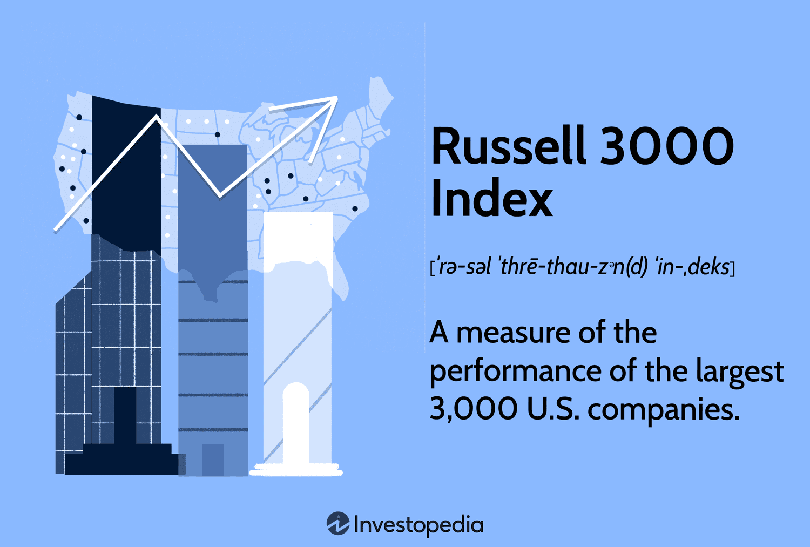

## Table of Contents

## What is the Russell 3000 Value Index?

The Russell 3000 Value Index is a stock market index that measures the performance of the value segment of the largest 3,000 companies in the U.S. stock market. It's part of the Russell 3000 Index, which represents about 98% of all U.S. stocks. The companies in the Russell 3000 Value Index are chosen based on their value characteristics, like lower price-to-book ratios and lower expected growth rates. This means the index includes companies that are considered undervalued or cheaper compared to other stocks.

Investors use the Russell 3000 Value Index to track how value stocks are doing compared to the overall market or other types of stocks, like growth stocks. Value stocks are often seen as safer investments because they are less expensive and might offer more stable returns over time. By focusing on value stocks, the index provides a way for investors to potentially benefit from buying stocks at a lower price and holding them until their value increases.

## How is the Russell 3000 Value Index different from the Russell 3000 Index?

The Russell 3000 Index and the Russell 3000 Value Index are both made up of the biggest 3,000 companies in the U.S., but they look at different parts of these companies. The Russell 3000 Index includes all kinds of these big companies, no matter if they are growing fast or if they are cheaper than others. It gives a broad picture of how the whole U.S. stock market is doing.

On the other hand, the Russell 3000 Value Index only includes companies that are considered "value" stocks. These are companies that are cheaper compared to others, often because they have lower price-to-book ratios and are expected to grow slower. So, while the Russell 3000 Index shows the overall market, the Russell 3000 Value Index focuses on a specific type of stock that might be a good deal for investors looking for undervalued companies.

## What are the criteria for a stock to be included in the Russell 3000 Value Index?

The Russell 3000 Value Index includes stocks that are part of the Russell 3000 Index but are chosen for their value characteristics. The main way to decide if a stock is a value stock is by looking at its price-to-book ratio. This ratio compares the market value of a company to its book value, which is what the company would be worth if it sold all its assets and paid off all its debts. Stocks with lower price-to-book ratios are seen as cheaper and are more likely to be included in the Value Index.

Another important factor is the stock's expected growth rate. Companies that are expected to grow slower are often considered value stocks because they are less expensive than companies with high growth expectations. The Russell 3000 Value Index also looks at other financial measures, like the price-to-earnings ratio and the dividend yield, to make sure the stocks really fit the value category. By focusing on these value characteristics, the index helps investors find stocks that might be undervalued and could offer good investment opportunities.

## How often is the Russell 3000 Value Index rebalanced?

The Russell 3000 Value Index is rebalanced once a year, usually in June. This means that every year, the companies in the index are checked to see if they still fit the value criteria. If a company no longer fits these criteria, it might be taken out of the index. New companies that meet the value criteria might be added instead.

Rebalancing helps keep the index accurate and up-to-date with the current market conditions. It makes sure the index continues to represent the value segment of the largest 3,000 companies in the U.S. stock market. By doing this yearly, the index stays relevant for investors who use it to guide their investment decisions.

## What is the methodology used to select and weight stocks in the Russell 3000 Value Index?

The Russell 3000 Value Index starts by including the same companies as the Russell 3000 Index, which are the 3,000 largest companies in the U.S. stock market. Then, it splits these companies into two groups: value stocks and growth stocks. To decide if a stock is a value stock, the index looks at things like the price-to-book ratio, which compares the market value of a company to its book value. Stocks with lower price-to-book ratios are seen as cheaper and are more likely to be included in the Value Index. The index also considers the expected growth rate of the company. Companies expected to grow slower are often seen as value stocks because they are less expensive than companies with high growth expectations.

Once the value stocks are chosen, the Russell 3000 Value Index weights them based on their market capitalization. This means that bigger companies have a bigger impact on the index's performance. The weighting is done so that the total value of the index matches the total market value of all the value stocks it includes. By doing this, the index gives a fair picture of how value stocks in the U.S. are doing. The index is rebalanced every year in June to make sure it keeps representing the value segment accurately, adjusting for any changes in the companies' value characteristics or market size.

## How does the Russell 3000 Value Index perform compared to other value indices?

The Russell 3000 Value Index often performs differently from other value indices, like the S&P 500 Value Index or the MSCI USA Value Index. This is because each index picks and weights its stocks in its own way. The Russell 3000 Value Index looks at the 3,000 biggest U.S. companies and picks the ones that are cheaper and expected to grow slower. Other indices might have different rules for what makes a stock a value stock, or they might focus on a different set of companies. So, depending on how the market is doing, the Russell 3000 Value Index might go up or down more than other value indices.

Over time, the performance of the Russell 3000 Value Index compared to other value indices can change a lot. Sometimes, value stocks in the Russell 3000 do better because they are spread across more companies, giving a wider view of the U.S. market. Other times, value stocks in a different index might do better because they focus on bigger or different kinds of companies. It's important for investors to look at how these indices have done over long periods, not just short ones, to see which one might be a better fit for their investment goals.

## What are the historical performance trends of the Russell 3000 Value Index?

The Russell 3000 Value Index has had ups and downs over the years, just like any stock market index. Over long periods, like 10 or 20 years, the index has generally gone up, showing that value stocks can be a good investment over time. But it's not always a smooth ride. There are times when the index does really well, and other times when it doesn't do so great. For example, during economic downturns, value stocks might not do as well as other types of stocks, like growth stocks. But when the economy starts to recover, value stocks often start to do better because they are seen as good deals.

Looking at shorter time frames, the performance of the Russell 3000 Value Index can be more unpredictable. In some years, the index might go up a lot, while in other years, it might go down. This can depend on a lot of things, like what's happening in the economy, interest rates, and how investors feel about value stocks at the time. For example, in the early 2000s, after the dot-com bubble burst, value stocks did really well because investors were looking for safer investments. But during the late 2010s, growth stocks were more popular, and the Russell 3000 Value Index didn't do as well in comparison. Overall, understanding these trends can help investors decide when to put their money into value stocks.

## How can investors use the Russell 3000 Value Index to guide their investment decisions?

Investors can use the Russell 3000 Value Index to help them decide where to put their money by looking at how value stocks are doing. The index shows the performance of big U.S. companies that are cheaper than others and expected to grow slower. By checking the index, investors can see if value stocks are doing well or not. If the index is going up, it might be a good time to buy value stocks because they are performing well. If the index is going down, investors might want to wait or look at other types of investments.

Another way investors can use the Russell 3000 Value Index is by comparing it to other indices, like the Russell 3000 Growth Index or the S&P 500. This helps them see how value stocks are doing compared to growth stocks or the overall market. If value stocks are doing better than growth stocks, it might be a good time to focus on value investments. Investors can also use the index to find funds or ETFs that track the Russell 3000 Value Index. This way, they can easily invest in a bunch of value stocks at once without having to pick each one themselves.

## What are the advantages of investing in funds that track the Russell 3000 Value Index?

Investing in funds that track the Russell 3000 Value Index can be a good idea because it helps you spread your money across many different value stocks. This is called diversification, and it can lower your risk. Instead of picking one or two stocks that might not do well, you get a piece of a lot of big U.S. companies that are cheaper than others. This way, if one company doesn't do well, it won't hurt your whole investment as much.

Another advantage is that these funds are easy to invest in. You don't need to spend a lot of time researching which value stocks to buy. The fund does that for you by following the Russell 3000 Value Index. This can save you time and help you invest in value stocks without having to be an expert. Plus, these funds often have lower costs than if you were to buy each stock on your own, which can help you keep more of your money over time.

## What are the potential risks associated with investing in the Russell 3000 Value Index?

Investing in the Russell 3000 Value Index can have some risks. One risk is that value stocks might not always do well. Sometimes, the market might prefer growth stocks, which are companies expected to grow a lot faster. When this happens, the value stocks in the index might go down in value. Also, the economy can change, and if it goes into a downturn, value stocks might not do as well as other types of investments.

Another risk is that the index is made up of the biggest 3,000 companies in the U.S., but these companies can still have problems. If a big company in the index has a bad year or faces a scandal, it can pull the whole index down. Plus, even though the index is rebalanced every year, the stocks in it can change, and the new ones might not do as well as the old ones. So, it's important to think about these risks before putting your money into a fund that tracks the Russell 3000 Value Index.

## How does the Russell 3000 Value Index adapt to changes in the market and economy?

The Russell 3000 Value Index adapts to changes in the market and economy by being rebalanced every year in June. During this time, the companies in the index are checked to see if they still fit the value criteria, like having a low price-to-book ratio and slower expected growth. If a company no longer fits these criteria, it might be taken out of the index. New companies that meet the value criteria might be added instead. This yearly check helps the index stay up-to-date with what's happening in the market and keeps it focused on value stocks.

Even though the index is rebalanced once a year, it still feels the effects of changes in the economy and market throughout the year. If the economy goes into a downturn, value stocks might not do as well as other types of stocks. But when the economy starts to recover, value stocks often do better because they are seen as good deals. The index's performance can also be affected by what investors are interested in at the time. If investors start to prefer growth stocks over value stocks, the Russell 3000 Value Index might go down. But if value stocks become popular again, the index might go up.

## What advanced analytics or metrics can be used to further understand the Russell 3000 Value Index's behavior?

To understand how the Russell 3000 Value Index behaves, you can look at some advanced analytics and metrics. One important metric is the index's volatility, which shows how much its value goes up and down over time. If the index has high volatility, it means it can change a lot quickly, which might be riskier for investors. Another useful metric is the Sharpe ratio, which measures how much return you get for the risk you take. A higher Sharpe ratio means the index is doing well compared to the risk involved. You can also use beta to see how the index moves compared to the overall market. A beta higher than 1 means the index moves more than the market, and a beta lower than 1 means it moves less.

Another way to dive deeper into the Russell 3000 Value Index is by looking at its sector exposure and style factors. Sector exposure tells you which parts of the economy, like technology or healthcare, are making up the biggest parts of the index. This can help you see if the index is doing well because certain sectors are doing well. Style factors, like value and momentum, can also give you clues about why the index is moving the way it is. If the value factor is strong, it means value stocks are doing well, which is good for the Russell 3000 Value Index. By looking at these advanced metrics and analytics, you can get a better picture of what's driving the index's performance and make smarter investment decisions.

## What is the Understanding of the Russell 3000 Value Index?

The Russell 3000 Value Index is a subset of the broader Russell 3000 Index, specifically designed to represent companies that are considered value stocks. The differentiation of value stocks is primarily based on financial metrics such as lower price-to-book (P/B) ratios. This metric is calculated as:

$$
\text{Price-to-Book Ratio} = \frac{\text{Market Price per Share}}{\text{Book Value per Share}}
$$

Value stocks are recognized for having relatively lower P/B ratios compared to [growth stocks](/wiki/growth-stocks), which often exhibit higher P/B ratios due to anticipated future growth. Additionally, value stocks tend to offer higher dividend yields, making them appealing to investors who prioritize income generation.  

The Russell 3000 Value Index is weighted by market capitalization, meaning that companies with larger market values have a more significant impact on the index's performance. Market capitalization is determined by the formula:

$$
\text{Market Capitalization} = \text{Share Price} \times \text{Number of Outstanding Shares}
$$

The index undergoes an annual reconstitution process. This rebalancing ensures that the index remains aligned with the current market landscape and includes only those companies that satisfy the value criteria outlined by FTSE Russell. This process is essential for maintaining the index's relevance and accuracy in reflecting market trends among value stocks.

For investors, the Russell 3000 Value Index is a vital analytical and strategic tool. Its composition offers a snapshot of value-oriented investment opportunities across various sectors within the U.S. equity market. With its comprehensive coverage and methodical weighting, the index aids investors in tracking specific trends and making informed decisions about their investments, particularly in recognizing undervalued stocks with potential for appreciable returns.

## References & Further Reading

1. **Marcos Lopez de Prado, Advances in Financial Machine Learning**: This book is instrumental for those interested in leveraging machine learning in trading strategies. It covers advanced topics such as the use of machine learning for predicting financial markets, different methods for obtaining predictive signals, and the integration of these techniques into a coherent trading strategy. Lopez de Prado provides both a theoretical foundation and practical applications, making it a vital resource for algorithmic traders.

2. **David Aronson, Evidence-Based Technical Analysis: Applying the Scientific Method and Statistical Inference to Trading Signals**: Aronson's work is essential for traders aiming to apply rigorous scientific methods to technical analysis. The book emphasizes the importance of statistical validity and hypothesis testing in evaluating trading signals. It challenges conventional technical analysis methodologies and encourages a more evidence-driven approach.

3. **Stefan Jansen, Machine Learning for Algorithmic Trading**: Jansen’s book offers a comprehensive guide for using machine learning to improve trading strategies. It provides practical insights into data acquisition, model development, and deployment of trading strategies in live markets. The book includes numerous code examples, predominantly in Python, illustrating how to apply machine learning techniques to build effective algorithmic trading systems.

4. **Ernest P. Chan, Quantitative Trading: How to Build Your Own Algorithmic Trading Business**: This book focuses on the practical aspects of developing and managing an algorithmic trading business. Chan provides guidance on strategy development, risk management, and technological infrastructure. The book is valuable for traders looking to transition from manual to algorithmic trading or for those interested in starting a quantitative trading firm.

5. **FTSE Russell, Russell 3000 Index**: The FTSE Russell website is a primary resource for information about the Russell 3000 Index. It provides details on the index's methodology, component stocks, and historical performance data. This resource is particularly useful for investors seeking comprehensive data on the index's composition and insights into its role within the U.S. equity market.

