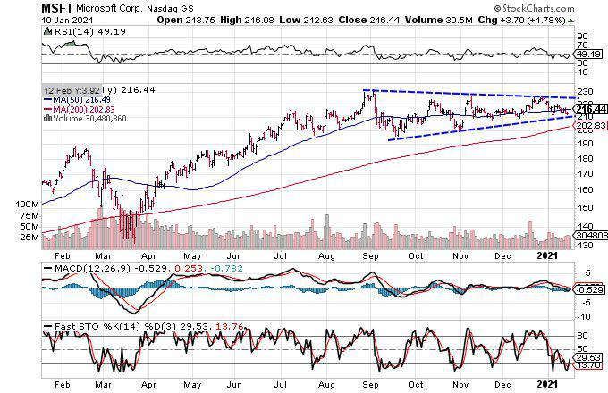

The Mega Cap Index, an investment tool often comprising the largest publicly traded companies by market capitalization, plays a pivotal role in the stock market. It represents a segment of the market that is characterized by stability, substantial financial resources, and significant influence over global economic conditions. The Russell Top 50 Index is one such Mega Cap Index, encompassing the top 50 largest U.S. stocks by market capitalization. This index is significant as it provides investors with exposure to established companies with resilient business models and consistent earnings, serving as a benchmark for mega-cap performance.

The integration of algorithmic trading in the context of index investing, especially with indices like the Russell Top 50, has garnered growing interest. Algorithmic trading, or algo trading, uses computer-based algorithms to execute trading strategies at speeds and frequencies that are beyond human capability. This automation can lead to improved market efficiency, reduced transaction costs, and the ability to manage large datasets seamlessly. Understanding this intersection is crucial for investors seeking to leverage advanced technological tools to optimize portfolio management within mega-cap stocks.

The primary aim of this article is to examine the dynamics of algorithmic trading concerning mega-cap stocks in the Russell Top 50 Index. By analyzing the elements and structures of both the index and trading technologies, we can gain insights into their combined impact on investment strategies and market outcomes. In the current financial environment, with its volatility and rapid technological advancements, indices like the Russell Top 50 remain relevant. They continue to be vital benchmarks, offering insights into the performance and sentiment of the largest and most influential companies in the stock market.

The article will cover various aspects of mega-cap index investing, including the framework of the Russell Top 50 Index, the pivotal position of mega-cap stocks in the market, the role of algorithmic trading in these indices, and investment opportunities in mega-cap ETFs. Additionally, it will consider future trends affecting mega-cap index investing, emphasizing the evolving technologies and regulations influencing market practices.

## Table of Contents

## Understanding the Russell Top 50 Mega Cap Index

The Russell Top 50 Mega Cap Index is a stock market index designed to track the performance of the 50 largest U.S. companies by market capitalization. It is part of the Russell Index series, which is managed by FTSE Russell, a division of the London Stock Exchange Group. The index aims to represent the leading companies driving economic activity and to serve as a benchmark for mega-cap stocks in the U.S. equity market.

In comparison to other indices like the Dow Jones Industrial Average (DJIA), which includes only 30 companies selected primarily based on their significant impact on the industrial sector, the Russell Top 50 takes a broader approach by focusing purely on market capitalization. The DJIA is price-weighted, meaning companies with higher stock prices have more influence on the index's movement, whereas the Russell Top 50 is market-capitalization weighted, providing a representation of the market's overall sentiment towards the largest U.S. companies by value. This distinction allows for a more comprehensive reflection of the economic power of mega-cap stocks.

Market-capitalization weightings are critical because they ensure that companies with a larger economic footprint have a proportionate influence on the index. This method provides a realistic view of market dynamics, where larger companies naturally exert more influence on economic and stock market trends. The formula for calculating the index value based on market-cap weighting is given by:

$$
\text{Index Value} = \frac{\sum_{i=1}^{N} (P_i \times Q_i)}{D}
$$

where $P_i$ is the stock price of company $i$, $Q_i$ is the number of outstanding shares of company $i$, and $D$ is the divisor used to maintain continuity of the index level over time.

The components of the Russell Top 50 include some of the most influential players in the market, often featuring large technology, healthcare, financial, and consumer discretionary companies. These companies, by virtue of their size and market influence, can drive market trends and significantly impact investor sentiment and confidence. Notably, since the index is market-capitalization weighted, changes in the stock prices of these large companies can cause substantial shifts in the index's overall performance.

An important procedure related to the index is its annual reconstitution. This process involves updating the list of constituent stocks to reflect changes in market capitalization rankings. Reconstitution ensures that the index maintains its relevance and accurately represents the largest companies. During this process, companies may be added or removed depending on their market cap rankings at the cutoff date. This activity can lead to increased trading volumes and [volatility](/wiki/volatility-trading-strategies) as market participants adjust their portfolios in anticipation of changes to the index's composition. The annual reconstitution reinforces the index's accuracy in reflecting the current state of the mega-cap market.

## The Role of Mega Caps in the Stock Market

Mega-cap stocks, often referred to as "mega caps," are defined as publicly traded companies with extremely large market capitalizations, typically exceeding $200 billion. These corporations are generally household names, recognized globally for their extensive operations and significant impact on the economy. Mega-cap stocks are integral to major stock indices and are considered robust benchmarks for economic health and market performance due to their market influence and substantial [liquidity](/wiki/liquidity-risk-premium).

These stocks possess unique characteristics that contribute to their significance in the stock market. They are typically leaders in their industry, possessing strong competitive advantages, significant cash flows, and resilient business models. As a result, mega-cap stocks often serve as a refuge during economic downturns, offering relative stability and reduced volatility compared to smaller-cap stocks. The large-scale operations and global reach of these companies provide investors with exposure to diverse markets, buffering against domestic market risks.

Mega-cap stocks exert a profound influence on the broader market due to their substantial weight in major indices. Indices like the Russell Top 50 Mega Cap Index are heavily impacted by mega-cap stock movements, given their market-capitalization weighting. Consequently, fluctuations in these stocks can disproportionately sway the index, affecting overall market performance and investor sentiment. This impact is particularly evident during earnings seasons, where the financial results of a few mega caps can set the tone for broader market trends.

The stability provided by mega-cap stocks stems from their organizational robustness and market leadership. Their financial strength and substantial market share contribute to investor confidence, often acting as a stabilizing force within the market. In times of economic uncertainty, investors turn to these stocks for their perceived safety, given their strong balance sheets and ability to generate consistent earnings. Thus, mega caps play a crucial role in maintaining market stability and boosting investor confidence.

Mega-cap stocks predominantly represent sectors such as technology, consumer discretionary, finance, and healthcare. The technology sector, in particular, holds a significant presence within the mega-cap category, driven by giants like Apple, Microsoft, and Alphabet. These companies lead in innovation and digital transformation, reflecting broad economic trends and influencing sectoral growth. Similarly, mega-cap stocks in the healthcare sector, such as Johnson & Johnson, provide essential services, further emphasizing the importance of these industries.

In analyzing the Russell Top 50 Index, one can observe that its holdings are dominated by companies from the aforementioned sectors, highlighting their critical role within the index. The top holdings typically include major technology firms, which not only dictate the index's performance but also serve as barometers for the tech sector's health globally. These companies' substantial market influence, driven by innovation and expansive product offerings, positions them as key drivers of index performance and market dynamics.

Understanding the role of mega-cap stocks involves recognizing their market influence, the stability they offer, and their sectoral representation. Their impact on indices like the Russell Top 50 underscores their importance in the financial markets, shaping both macroeconomic trends and investor strategies.

## Algorithmic Trading and Mega Cap Indices

Algorithmic trading refers to the automated execution of trades based on pre-defined criteria, leveraging computer algorithms to make rapid decisions in the financial markets. It has seen significant growth over the past decade, driven by technological advancements and the increasing complexity of global markets. This method of trading is particularly prevalent in managing large-cap portfolios, such as those composed of mega-cap stocks in indices like the Russell Top 50 Mega Cap Index.

The primary advantage of [algorithmic trading](/wiki/algorithmic-trading) for large-cap portfolios is its ability to process vast amounts of market data swiftly and execute orders with minimal human intervention. This efficiency allows for better price discovery and liquidity management while reducing transaction costs. Algorithms can monitor multiple markets simultaneously, capturing [arbitrage](/wiki/arbitrage) opportunities and optimizing trades to account for market impact and timing risk.

Strategies employed in algorithmic trading for mega-cap indices range from simple implementations, like mean reversion and [momentum](/wiki/momentum) strategies, to sophisticated methods, including [statistical arbitrage](/wiki/statistical-arbitrage) and [pair trading](/wiki/pair-trading). These strategies rely heavily on historical market data and statistical models to predict future price movements and generate trading signals. For instance, statistical arbitrage involves analyzing price discrepancies between correlated securities and trading them to profit from their convergence.

Artificial intelligence (AI) and [machine learning](/wiki/machine-learning) (ML) are increasingly integrated into algorithmic trading systems, enhancing their capabilities. AI techniques, such as [reinforcement learning](/wiki/reinforcement-learning), can optimize trading strategies through continuous learning and adaptation to new market conditions. Machine learning models can uncover complex patterns in financial data, improving the accuracy of trading signals and risk management processes.

However, algorithmic trading in mega-cap indices is not without challenges and risks. Market volatility can lead to rapid execution and potential overtrading, exacerbating price swings. Flash crashes, triggered by automated orders executing simultaneously, pose systemic risks to the financial system. Furthermore, the reliance on complex algorithms makes these systems susceptible to coding errors and model mis-specifications.

To mitigate these risks, robust risk management practices are essential. These include implementing order throttling, circuit breakers, and real-time monitoring systems to prevent excessive market impact and ensure the stability of trading operations. Additionally, regulatory oversight plays a crucial role in ensuring the transparency and fairness of algorithmic trading practices, safeguarding the integrity of financial markets.

## Investing in Mega Cap ETFs on the Russell Top 50 Index

Exchange-traded funds (ETFs) focusing on mega-cap stocks, such as those represented in the Russell Top 50 Index, have become essential instruments for investors seeking both stability and potential growth. Mega Cap ETFs comprise shares from the largest companies by market capitalization, providing exposure to these dominant market players without the need for individual stock selection. 

**Operation of Mega Cap ETFs**

Mega Cap ETFs function by holding a basket of securities that replicate the performance of their target index, like the Russell Top 50. These ETFs aim to match the index's return by proportionally mirroring its components and respective weightings. This passive form of management reduces both cost and complexity for investors while maintaining a diversified exposure to the macroeconomic trends influencing these large-cap stocks.

**Performance Analysis of Popular Mega Cap ETFs**

Key mega-cap ETFs such as the SPDR Dow Jones and the Invesco S&P 500 Top 50 [ETF](/wiki/etf-trading-strategies) have historical performance data reflecting the strength of their underlying securities. For instance, during periods of economic expansion, these ETFs generally show robust returns aligned with the growth of their constituent companies. Conversely, they offer relative stability during market volatility, driven by the mature nature and economic weight of these large-cap firms.

**Advantages of Investing in ETFs Versus Individual Stocks**

Investing in Mega Cap ETFs offers a series of advantages over purchasing individual stocks:

1. **Diversification:** ETFs inherently diversify investment risk across multiple companies, reducing the impact if a single company underperforms.
2. **Liquidity:** ETFs are traded on stock exchanges and can be bought and sold throughout the trading day, similar to stocks.
3. **Cost-Effectiveness:** Typically, ETFs have lower expense ratios than actively managed funds, offering a cost-efficient means to manage a portfolio tracking a broad index.
4. **Accessibility:** Mega Cap ETFs enable both institutional and retail investors to gain exposure to a collective of large-cap stocks without needing extensive market analysis.

**Role of ETFs in Facilitating Algorithmic Trading Strategies**

ETFs are particularly conducive to algorithmic trading strategies, thanks in part to their high liquidity and transparency. Algo trading systems can execute strategies such as statistical arbitrage or momentum trading by exploiting the price movements within ETFs over very short timeframes. The predictability and stability of Mega Cap ETFs' performance, due to their bulk in large, established companies, make them suitable candidates for automated trading algorithms that rely on historical data analysis.

**Considerations for Investors**

For investors looking to incorporate Mega Cap ETFs into a diversified portfolio, several factors should be considered:

- **Market Environment:** Assessing economic conditions and sectoral trends can help determine the potential impact on the large-cap stocks within the ETF.
- **Expense Ratio:** Although ETFs generally maintain low fees, it is prudent to compare the expense ratios among similar ETFs to ensure efficiency in cost.
- **Tax Implications:** Understanding the tax treatment on capital gains and dividends associated with ETFs can help optimize post-tax returns.
- **Investment Objectives:** Aligning the inclusion of Mega Cap ETFs with individual investment goals, such as growth, income, or preservation of capital, can enhance the strategy's effectiveness.

Mega Cap ETFs on the Russell Top 50 Index provide a blend of risk-managed growth and stability, especially in uncertain market climates. As a cornerstone of algorithmic trading and diversified portfolio management, they continue to be attractive investment vehicles for a broad range of market participants.

## Future Trends in Mega Cap Index Investing

The evolving role of mega-cap stocks, particularly within indices like the Russell Top 50 Mega Cap Index, is being reshaped by digital transformation and interconnected global markets. Mega-cap companies, often leaders in technology, consumer goods, and financial sectors, are pivotal in driving economic growth and innovation. In a digital world, these companies are not only influencers of market trends but also beneficiaries of technological advancements, which can redefine index construction and investment strategies.

Technological advancements, particularly in data analytics and [artificial intelligence](/wiki/ai-artificial-intelligence), are expected to lead to more dynamic and responsive index construction processes. Traditional indices, like the Russell Top 50, are primarily market-capitalization weighted, meaning companies are represented based on their total market value. However, evolving technologies may allow for more sophisticated weighting schemes that incorporate factors such as growth potential, [ESG](/wiki/esg-investing) (environmental, social, and governance) metrics, or real-time financial performance. This evolution in index methodologies could improve the predictive power and relevance of indices in capturing market movements.

Regulatory changes are another [factor](/wiki/factor-investing) influencing mega-cap trading strategies. As financial markets become more global, regulatory bodies may impose rules to ensure transparency and fairness in trading and index composition. These regulations can affect the liquidity and volatility of mega-cap stocks, impacting how indices are constructed and managed. For example, stricter reporting requirements on ESG metrics could lead to a reevaluation of which companies are included in major indices, thus influencing investor strategies.

The future of algorithmic trading in mega-cap indices is promising, driven by advancements in artificial intelligence and machine learning. Algorithms are increasingly sophisticated, capable of analyzing vast datasets to identify trading opportunities within milliseconds. This capability is crucial for mega-cap stocks, whose large trading volumes can present unique opportunities for algorithmic trading strategies. Machine learning models are improving in identifying patterns and predicting price movements, which could redefine how mega-cap indices are used for investment purposes.

Despite the advancement in technologies, the sustainability of mega-cap growth is not guaranteed. These companies face challenges such as market saturation, regulatory scrutiny, and economic shifts, which could influence growth trajectories. Investor sentiment towards mega-cap stocks remains generally positive, driven by their strong historical performance and innovative potential. However, shifts in global economic conditions, like supply chain disruptions or geopolitical tensions, can impact these sentiments.

In conclusion, the future of mega-cap index investing will likely be characterized by enhanced technological integration, regulatory developments, and evolving investor expectations. As the global financial landscape continues to transform, indices like the Russell Top 50 will need to adapt, ensuring they remain relevant tools for capturing market dynamics and guiding investment decisions.

## Conclusion

The Russell Top 50 Mega Cap Index serves as a vital component of the global financial landscape, reflecting the performance and stability of the largest publicly traded companies. It provides investors with a benchmark that captures the economic influence of mega-capitalization stocks. These entities often dictate broader market trends due to their substantial influence and market capitalization. This Index, by focusing on the top 50 mega-cap stocks, offers a concentrated lens through which the health and trajectory of leading businesses can be observed.

There is a notable interaction between mega-cap indices and algorithmic trading. As algorithmic trading grows, mega-cap stocks become prime candidates for such strategies due to their liquidity and mature market dynamics. Algorithms enable the efficient execution of trades at scale, leveraging the predictability and [volume](/wiki/volume-trading-strategy) of these substantial stocks. This intersection enhances market efficiency but also introduces complexity, such as the need to mitigate associated risks like flash crashes and over-reliance on automated programs.

In terms of investment strategies, mega-cap stocks and ETFs offer a stable gateway for both institutional and retail investors. ETFs, which track indices like the Russell Top 50, provide a diversified exposure to top-tier stocks while mitigating the risks associated with individual stock selection. Investors benefit from reduced costs and enhanced liquidity compared to direct stock purchases. While these advantages present a compelling case for ETFs, it remains essential for investors to maintain a strategic balance in their portfolios.

Finally, in a market landscape characterized by rapid technological and economic changes, it is crucial for investors to remain informed and adaptive. This adaptability will ensure they can capitalize on emerging opportunities and navigate potential risks associated with mega-cap stocks and algorithmic trading. Continuous education and attentiveness to market shifts will empower investors to make informed decisions that align with their financial goals, safeguarding against volatility and uncertainty in an ever-evolving financial environment.

## References & Further Reading

[1]: ["Russell Indexes Methodology"](https://www.lseg.com/content/dam/ftse-russell/en_us/documents/ground-rules/russell-us-indexes-construction-and-methodology.pdf) - FTSE Russell provides in-depth methodology documents explaining the construction and maintenance of various Russell indexes, including the Russell Top 50 Mega Cap Index.

[2]: Hendershott, T., Jones, C.M., & Menkveld, A.J. (2011). ["Does Algorithmic Trading Improve Liquidity?"](https://onlinelibrary.wiley.com/doi/full/10.1111/j.1540-6261.2010.01624.x) The Review of Financial Studies, 24(3), 789-829.

[3]: Narang, R. K. (2009). ["Inside the Black Box: A Simple Guide to Quantitative and High Frequency Trading"](https://onlinelibrary.wiley.com/doi/book/10.1002/9781118267738) by Rishi K. Narang provides an accessible overview of quantitative trading strategies, including algorithmic trading applications.

[4]: Harris, L. (2003). ["Trading and Exchanges: Market Microstructure for Practitioners"](https://www.amazon.com/Trading-Exchanges-Market-Microstructure-Practitioners/dp/0195144708) by Larry Harris. This book offers insights into the functioning of financial markets, including the impact of algorithmic trading.

[5]: Farrell, M. (2020). ["Harnessing the Power of Big Data Analytics and Artificial Intelligence in Trading"](https://www.researchgate.net/publication/373903649_Harnessing_the_Power_of_Big_Data_Challenges_and_Opportunities_in_Analytics) - This source discusses the application of big data analytics and AI in modern trading practices, relevant to understanding algo trading in mega-cap stocks.