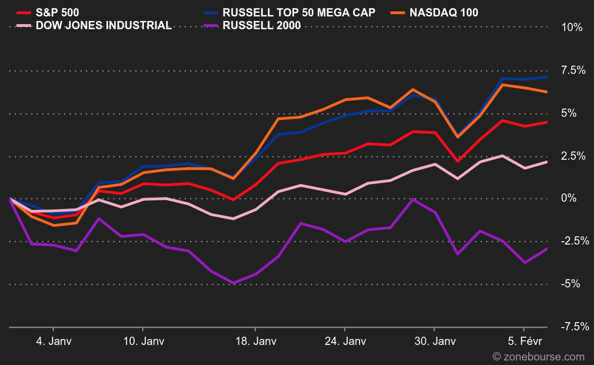

## Table of Contents

## What is the Russell Top 50 Mega Cap Index?

The Russell Top 50 Mega Cap Index is a stock market index that tracks the performance of the 50 largest companies in the United States. These companies are chosen from the Russell 3000 Index, which includes the 3000 biggest U.S. companies based on their market value. The idea behind the Russell Top 50 Mega Cap Index is to focus on the biggest and often most influential companies in the economy.

This index is important because it gives investors a way to see how these giant companies are doing. Since these companies are so large, they can have a big impact on the overall stock market and the economy. By watching this index, investors can get a sense of how the top part of the market is performing, which can help them make decisions about where to put their money.

## Who manages the Russell Top 50 Mega Cap Index?

The Russell Top 50 Mega Cap Index is managed by FTSE Russell, which is a company that specializes in creating and managing indexes. FTSE Russell is part of the London Stock Exchange Group and is known for its wide range of indexes that help investors track different parts of the market.

FTSE Russell updates the Russell Top 50 Mega Cap Index regularly to make sure it reflects the current market. They do this by reviewing the market values of companies and making changes to the index when needed. This helps keep the index accurate and useful for investors who want to know how the biggest companies in the U.S. are doing.

## How is the Russell Top 50 Mega Cap Index constructed?

The Russell Top 50 Mega Cap Index is made by picking the 50 biggest companies from the Russell 3000 Index. The Russell 3000 Index includes the 3000 largest U.S. companies based on their total market value, which is the price of all their shares put together. To find the top 50, the companies are ranked by this market value, and the biggest ones are chosen.

Once the 50 companies are picked, their performance is tracked over time. The index is updated regularly to make sure it still has the 50 largest companies. If a company grows bigger or smaller, it might be added or removed from the index. This way, the Russell Top 50 Mega Cap Index always shows how the biggest U.S. companies are doing, which can help investors understand the market better.

## What are the eligibility criteria for companies to be included in the Russell Top 50 Mega Cap Index?

To be included in the Russell Top 50 Mega Cap Index, a company must first be part of the Russell 3000 Index. The Russell 3000 Index includes the 3000 largest companies in the United States based on their total market value, which is the value of all their shares combined. From this group, the 50 companies with the highest market values are chosen for the Russell Top 50 Mega Cap Index.

The index is updated every year in June to make sure it still has the 50 biggest companies. If a company's market value changes a lot during the year, it might be added or removed from the index at that time. This helps keep the index accurate and up-to-date, showing investors how the top companies in the U.S. are doing.

## How often is the Russell Top 50 Mega Cap Index rebalanced?

The Russell Top 50 Mega Cap Index is rebalanced once a year in June. This means that every year, the companies in the index are checked to see if they are still the 50 biggest ones in the United States. If a company has grown bigger or smaller, it might be added or removed from the index to make sure it stays accurate.

Rebalancing helps keep the index up-to-date and useful for investors. By doing this every year, the index can show how the top companies are doing and reflect any big changes in the market. This way, investors can trust that the index is a good way to see how the biggest U.S. companies are performing.

## What is the historical performance of the Russell Top 50 Mega Cap Index?

The Russell Top 50 Mega Cap Index has shown good growth over the years. Since it focuses on the biggest companies in the U.S., it often does well when the economy is strong. Over the last 10 years, the index has had an average yearly return of about 10%. This means if you had invested $100 in the index 10 years ago, it would be worth around $259 now, not counting any fees or taxes.

However, like all investments, the Russell Top 50 Mega Cap Index can go up and down. There have been times when it dropped a lot, like during the financial crisis in 2008 and the early days of the COVID-19 pandemic in 2020. But it also bounced back strongly after those tough times. This shows that while the index can be risky in the short term, it has a good track record of recovering and growing over the long term.

## How does the Russell Top 50 Mega Cap Index compare to other major indices like the S&P 500?

The Russell Top 50 Mega Cap Index and the S&P 500 are both important stock market indexes, but they track different groups of companies. The Russell Top 50 Mega Cap Index focuses on the 50 biggest companies in the U.S., while the S&P 500 includes 500 of the largest companies. Because the Russell Top 50 only includes the very biggest companies, it can be more sensitive to the performance of these giants, like tech companies or big banks. On the other hand, the S&P 500 covers a wider range of large companies, which can make it a bit more stable because it's not as focused on just a few companies.

Over time, the performance of the Russell Top 50 Mega Cap Index and the S&P 500 can be quite similar because both include many of the same big companies. However, the Russell Top 50 can sometimes do better when these mega-cap companies are doing really well, and it might do worse if those companies struggle. For example, in recent years, when tech giants like Apple and Microsoft have grown a lot, the Russell Top 50 has often done better than the S&P 500. But both indexes have shown good long-term growth, with average yearly returns around 10% over the last decade, making them popular choices for investors looking to grow their money over time.

## What are the key sectors represented in the Russell Top 50 Mega Cap Index?

The Russell Top 50 Mega Cap Index includes companies from many important parts of the economy. The biggest part of the index is usually technology. Companies like Apple, Microsoft, and Amazon are often in the index because they are some of the biggest in the world. These tech companies make things like computers, software, and online services that many people use every day.

Other important parts of the index are healthcare and finance. Healthcare companies, like Johnson & Johnson, make medicines and medical equipment that help people stay healthy. Finance companies, like JPMorgan Chase and Bank of America, help people and businesses manage their money. These sectors are big because they are essential to how the economy works.

There are also companies from other sectors like energy, with companies like ExxonMobil, and consumer goods, with companies like Procter & Gamble. These companies make things like oil, gas, and everyday products that people use at home. Even though the index focuses on the biggest companies, it still shows a good mix of different parts of the economy.

## How can investors gain exposure to the Russell Top 50 Mega Cap Index?

Investors can gain exposure to the Russell Top 50 Mega Cap Index by buying exchange-traded funds (ETFs) or mutual funds that track this index. These funds are made to copy the performance of the index, so when the index goes up or down, the fund does the same. You can find these funds by looking at lists of ETFs or mutual funds and seeing which ones follow the Russell Top 50 Mega Cap Index. Once you find a fund you like, you can buy shares of it through a broker, just like you would buy shares of a company.

Another way to get exposure is by buying shares of the individual companies in the index. Since the index includes the 50 biggest companies in the U.S., you can look up these companies and buy their stocks. This way, you can pick and choose which companies you want to invest in. However, this method can be more work because you have to keep track of each company yourself. Both methods can help you invest in the biggest and often most successful companies in the country, which can be a good way to grow your money over time.

## What are the risks associated with investing in the Russell Top 50 Mega Cap Index?

Investing in the Russell Top 50 Mega Cap Index comes with risks, just like any other investment. One big risk is that the index can go down a lot if the biggest companies in it have problems. Since the index only includes 50 companies, it's more affected by how those few companies do. If one or more of these companies have a bad year, it can pull the whole index down. Also, if the economy takes a hit, like during a recession, these big companies might struggle, and the index could lose value.

Another risk is that the index might not grow as fast as smaller companies or other parts of the market. Big companies can be slow to change and might not do as well in fast-growing areas like new technology. This means you might miss out on higher returns if you only invest in the Russell Top 50 Mega Cap Index. Plus, even though these companies are big and stable, they can still be affected by things like changes in laws, global events, or competition from other companies. So, while the index can be a good way to invest in big, successful companies, it's important to know these risks and think about how they fit with your overall investment plan.

## How does the methodology of the Russell Top 50 Mega Cap Index affect its performance?

The Russell Top 50 Mega Cap Index is made up of the 50 biggest companies in the U.S., chosen from the Russell 3000 Index. This focus on the largest companies means the index can be very sensitive to how these big companies do. If these companies do well, the index can go up a lot. But if they have problems, the index can drop a lot too. This is because the index is not spread out over many companies, so it depends a lot on just a few.

Also, the index is updated every year in June to make sure it still has the 50 biggest companies. This yearly check can affect how the index performs. If a company gets bigger and is added to the index, it might help the index grow. But if a company gets smaller and is taken out, it might hurt the index's performance. This way of picking and updating the companies can make the index do better or worse depending on which companies are in it and how they are doing.

## What are some advanced strategies for using the Russell Top 50 Mega Cap Index in portfolio management?

One advanced strategy for using the Russell Top 50 Mega Cap Index in portfolio management is to use it as a core holding while adding other investments to diversify. Since the index includes the biggest companies in the U.S., it can be a stable part of your portfolio. You can then add smaller companies or different kinds of investments, like bonds or real estate, to spread out your risk. This way, if the big companies in the Russell Top 50 have a bad year, your whole portfolio won't be hurt as much because you have other investments that might do well.

Another strategy is to use the Russell Top 50 Mega Cap Index as a benchmark to see how well you're doing compared to the market's biggest companies. If your portfolio is doing better than the index, you know you're beating the market. If it's doing worse, you might want to think about changing your investments. You can also use the index to find trends in the market. For example, if tech companies in the index are doing really well, you might decide to invest more in tech. This way, you can keep up with what's happening in the market and adjust your portfolio to take advantage of those trends.

## What is the Understanding of the Russell Top 50 Mega Cap Index?

The Russell Top 50 Mega Cap Index is a stock market index designed to track the performance of the 50 largest U.S. companies by market capitalization. It is part of the Russell Index series, which is managed by FTSE Russell, a division of the London Stock Exchange Group. The index aims to represent the leading companies driving economic activity and to serve as a benchmark for mega-cap stocks in the U.S. equity market.

In comparison to other indices like the Dow Jones Industrial Average (DJIA), which includes only 30 companies selected primarily based on their significant impact on the industrial sector, the Russell Top 50 takes a broader approach by focusing purely on market capitalization. The DJIA is price-weighted, meaning companies with higher stock prices have more influence on the index's movement, whereas the Russell Top 50 is market-capitalization weighted, providing a representation of the market's overall sentiment towards the largest U.S. companies by value. This distinction allows for a more comprehensive reflection of the economic power of mega-cap stocks.

Market-capitalization weightings are critical because they ensure that companies with a larger economic footprint have a proportionate influence on the index. This method provides a realistic view of market dynamics, where larger companies naturally exert more influence on economic and stock market trends. The formula for calculating the index value based on market-cap weighting is given by:

$$
\text{Index Value} = \frac{\sum_{i=1}^{N} (P_i \times Q_i)}{D}
$$

where $P_i$ is the stock price of company $i$, $Q_i$ is the number of outstanding shares of company $i$, and $D$ is the divisor used to maintain continuity of the index level over time.

The components of the Russell Top 50 include some of the most influential players in the market, often featuring large technology, healthcare, financial, and consumer discretionary companies. These companies, by virtue of their size and market influence, can drive market trends and significantly impact investor sentiment and confidence. Notably, since the index is market-capitalization weighted, changes in the stock prices of these large companies can cause substantial shifts in the index's overall performance.

An important procedure related to the index is its annual reconstitution. This process involves updating the list of constituent stocks to reflect changes in market capitalization rankings. Reconstitution ensures that the index maintains its relevance and accurately represents the largest companies. During this process, companies may be added or removed depending on their market cap rankings at the cutoff date. This activity can lead to increased trading volumes and [volatility](/wiki/volatility-trading-strategies) as market participants adjust their portfolios in anticipation of changes to the index's composition. The annual reconstitution reinforces the index's accuracy in reflecting the current state of the mega-cap market.

## References & Further Reading

[1]: ["Russell Indexes Methodology"](https://www.lseg.com/content/dam/ftse-russell/en_us/documents/ground-rules/russell-us-indexes-construction-and-methodology.pdf) - FTSE Russell provides in-depth methodology documents explaining the construction and maintenance of various Russell indexes, including the Russell Top 50 Mega Cap Index.

[2]: Hendershott, T., Jones, C.M., & Menkveld, A.J. (2011). ["Does Algorithmic Trading Improve Liquidity?"](https://onlinelibrary.wiley.com/doi/full/10.1111/j.1540-6261.2010.01624.x) The Review of Financial Studies, 24(3), 789-829.

[3]: Narang, R. K. (2009). ["Inside the Black Box: A Simple Guide to Quantitative and High Frequency Trading"](https://onlinelibrary.wiley.com/doi/book/10.1002/9781118267738) by Rishi K. Narang provides an accessible overview of quantitative trading strategies, including algorithmic trading applications.

[4]: Harris, L. (2003). ["Trading and Exchanges: Market Microstructure for Practitioners"](https://www.amazon.com/Trading-Exchanges-Market-Microstructure-Practitioners/dp/0195144708) by Larry Harris. This book offers insights into the functioning of financial markets, including the impact of algorithmic trading.

[5]: Farrell, M. (2020). ["Harnessing the Power of Big Data Analytics and Artificial Intelligence in Trading"](https://www.researchgate.net/publication/373903649_Harnessing_the_Power_of_Big_Data_Challenges_and_Opportunities_in_Analytics) - This source discusses the application of big data analytics and AI in modern trading practices, relevant to understanding algo trading in mega-cap stocks.