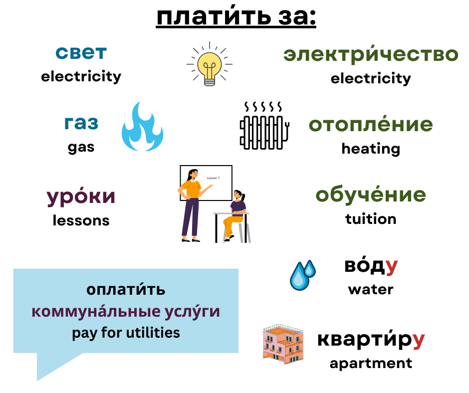

## Table of Contents

## What is a Russian option?

A Russian option is a type of financial option that can be exercised at any time before it expires, similar to an American option. However, what makes it unique is that the holder can also choose to exercise it at specific times during its life, not just at the end. This feature gives the holder more flexibility to decide when to use the option based on market conditions.

In simpler terms, imagine you have a ticket that allows you to buy something at a set price. With a Russian option, you can use this ticket anytime before it expires, and you also have certain special times when you can use it. This can be helpful if you think the price of what you want to buy might change a lot during the time you have the ticket.

## How does a Russian option differ from other types of options?

A Russian option is different from other options because it gives you more choices about when you can use it. Like an American option, you can use a Russian option anytime before it runs out. But, a Russian option also has special times when you can use it, which is not something you get with American or European options. This means if you think the price of what you want to buy will change a lot, you can wait for one of these special times to make your move.

Compared to a European option, which you can only use when it's about to expire, a Russian option is much more flexible. With a European option, you have to wait until the end, which can be risky if the price changes a lot before then. The Russian option's extra times to use it can help you make a better decision based on how the market is doing at different points, not just at the end.

## What are the key features of a Russian option?

A Russian option is special because it lets you use it anytime before it expires, just like an American option. But it also has certain times during its life when you can use it, which makes it different from both American and European options. This means if you think the price of something you want to buy might go up or down a lot, you can wait for one of these special times to make your move.

This extra flexibility can be really helpful. If you have a Russian option, you don't have to wait until the very end like with a European option, which can be risky if prices change a lot before then. Instead, you can choose to use your option at the best time for you, based on how the market is doing at different points. This can help you make smarter decisions about when to buy or sell.

## Can you explain the payoff structure of a Russian option?

The payoff structure of a Russian option is a bit like having a special key that lets you unlock a treasure chest at certain times. If you have a Russian option, you can choose to use it anytime before it expires, just like an American option. But what makes it special is that it also has certain times during its life when you can use it. This means if you think the price of the thing you want to buy will go up or down a lot, you can wait for one of these special times to make your move. If you decide to use your option at one of these times, you get to buy the thing at the price set in the option, even if the market price is higher.

If you don't use your option at one of these special times, you can still hold onto it until it expires. If the price of what you want to buy goes up a lot by the time your option is about to expire, you can use it then and still buy at the lower price set in the option. But if the price doesn't go up enough, or if it goes down, you might decide not to use your option at all. In that case, you don't have to buy anything, and you just lose the money you paid for the option. So, the key thing with a Russian option is that it gives you more chances to decide when to use it, based on how the market is doing at different times.

## What are the advantages of using a Russian option?

A big advantage of using a Russian option is that it gives you more chances to decide when to use it. Unlike a European option, which you can only use right before it expires, a Russian option lets you use it anytime before it expires, just like an American option. But it also has special times during its life when you can use it. This means if you think the price of what you want to buy might change a lot, you can wait for one of these special times to make your move. This extra flexibility can help you make a better decision based on how the market is doing at different points.

Another advantage is that it can help you manage risk better. If the price of what you want to buy goes up a lot, you can use your Russian option at one of the special times and buy it at the lower price set in the option. But if the price doesn't go up enough, or if it goes down, you can wait and see if it gets better later. This means you don't have to decide all at once like with a European option. You can take your time and use the option when it's most beneficial for you. This can make investing less stressful and more strategic.

## What are the potential risks associated with Russian options?

One risk of using a Russian option is that it can be more complicated than other options. Because you have more chances to decide when to use it, you need to keep a closer eye on the market. If you're not paying attention, you might miss a good time to use your option and lose out on making money. Also, because it's more complex, it might be harder to understand how it works, which can lead to mistakes.

Another risk is that even though you have more flexibility, you still might not make the right decision. If the price of what you want to buy doesn't go up enough, or if it goes down, you might end up not using your option at all. In that case, you lose the money you paid for the option. Plus, because Russian options are less common than American or European options, they might be harder to buy and sell, which can make it trickier to get out of your investment if you need to.

## How is the pricing of a Russian option determined?

The pricing of a Russian option is determined by looking at a few key things, just like with other options. One big thing is the current price of whatever the option lets you buy. If that price is high, the option might be worth more because you can buy it cheaper with the option. Another thing is how long the option lasts. The longer it lasts, the more chances you have to use it, which can make it more valuable. Also, the special times when you can use the Russian option are important. These times give you more chances to make a good decision, so they can affect the price too.

Another factor in pricing a Russian option is how much the price of what you want to buy might change. If it's likely to change a lot, the option might be worth more because it gives you more chances to use it at the right time. The interest rates and how much it costs to hold onto the option until you use it also play a role. All these things together help figure out how much a Russian option should cost. It's like putting together a puzzle to see how much flexibility and potential profit the option offers.

## Can you provide a simple example of how a Russian option might be used in practice?

Imagine you have a Russian option that lets you buy a share of a company for $50 anytime before it expires in a year. The special times when you can use this option are every three months. Right now, the share is worth $45, so you decide to wait and see if the price goes up. Three months later, the share price jumps to $60. You think about using your option now, but you decide to wait for the next special time because you think the price might go even higher.

At the next special time, six months into the option's life, the share price is now $70. You decide to use your option and buy the share for $50, even though it's worth $70 on the market. By doing this, you save $20 per share. If the price had dropped below $50, you could have waited until the next special time or until the option expired to see if it would go up again. This flexibility helped you make a smart decision and save money.

## What are the mathematical models used to value Russian options?

Valuing a Russian option can be tricky because it's more flexible than other options. One way to figure out its value is by using a model called the Black-Scholes model, which is often used for American options. But because Russian options have special times when you can use them, you need to change the Black-Scholes model a bit. You do this by adding in the extra times when you can use the option, which makes the math more complicated but helps you see how much the option is worth at different points.

Another model that can be used is the binomial model. This model breaks down the time until the option expires into smaller steps and looks at what might happen at each step. For a Russian option, you would add in the special times when you can use the option into these steps. This helps you see how the value of the option changes over time and at the special times. Both models need to take into account the extra flexibility of the Russian option, which makes them more complex but also more accurate for figuring out the option's value.

## How do market conditions affect the value of a Russian option?

Market conditions can change the value of a Russian option a lot. If the price of the thing you can buy with the option goes up, the option becomes more valuable because you can buy it cheaper than the market price. If the price goes down, the option might not be worth as much because you wouldn't want to buy it at the higher price set in the option. Also, if the market is very unpredictable and prices are changing a lot, the Russian option can be more valuable because it gives you more chances to use it at the right time.

Another thing that affects the value of a Russian option is how long it lasts and the special times when you can use it. If the option lasts a long time, it's worth more because you have more time to wait for a good price. The special times when you can use the option also matter. If these times come at moments when the market might change a lot, the option can be more valuable because it gives you more chances to make a smart decision. So, keeping an eye on how the market is doing can help you understand how much your Russian option is worth.

## What are some real-world applications of Russian options?

Russian options can be used in real life to help people make smart choices about buying and selling things. Imagine a farmer who grows wheat. The price of wheat can go up and down a lot, and the farmer wants to make sure they can sell their wheat at a good price. A Russian option could let the farmer choose when to sell their wheat at a set price, not just at the end of the season but also at certain times during the season. This way, if the price of wheat goes up a lot at one of these special times, the farmer can use the option and sell their wheat at a profit.

Another example is in the stock market. If you have a Russian option for a company's stock, you can decide when to buy the stock at a set price. This can be really helpful if you think the stock's price might go up a lot at certain times. For example, if a company is about to release a new product that might make its stock price go up, you can wait until one of the special times in your Russian option to buy the stock at the lower price set in the option. This way, you can make money if the stock price goes up as expected.

## How do regulatory environments impact the use of Russian options?

The rules and laws set by governments and financial groups can change how people use Russian options. In some places, there might be strict rules about who can buy and sell these options and how they can be used. This can make it harder for people to use Russian options if they don't meet the rules. For example, some countries might need people to have a lot of money or special permission to trade these options. This can limit who can use them and how often they are used.

On the other hand, in places with fewer rules, it might be easier to use Russian options. But this can also make things riskier because there might not be as much protection for people who buy and sell them. If the rules change a lot, it can also make it hard for people to plan when to use their options. So, knowing the rules in your area is important for deciding if and how to use a Russian option.

## What is Understanding Financial Derivatives?

Financial derivatives are financial instruments whose value is derived from the performance of underlying assets, indices, or interest rates. They are contracts between parties that can involve a variety of financial products. Derivatives include a wide range of instruments, such as futures, options, swaps, and forwards. Each type serves unique purposes in financial markets, offering tools for hedging, speculation, and arbitrage.

Futures are standardized contracts obligating the buyer to purchase, or the seller to sell, an asset at a predetermined future date and price. These are commonly used for commodities like oil, wheat, or gold but also extensively in financial instruments like stock indices or interest rate futures.

Options provide the holder the right, but not the obligation, to buy or sell an asset at a predetermined price within a specified timeframe. Options can be categorized as call options, which give the right to buy, and put options, which provide the right to sell. Unlike futures, options require a premium payment, representing the cost of holding this right.

Swaps are derivative contracts through which two parties exchange financial instruments. The most common types are [interest rate](/wiki/interest-rate-trading-strategies) swaps, where parties exchange cash flows based on a principal amount to manage exposure to fluctuations in interest rates.

Forwards are customized contracts between two parties to buy or sell an asset at a specified future date for a price agreed today. Unlike futures, forwards are traded over-the-counter (OTC), hence they are customizable but [carry](/wiki/carry-trading) counterparty risk as they are not standardized nor traded on exchanges.

Derivatives are crucial in global financial markets predominantly for three reasons: they help in risk management by providing means to hedge against price changes or interest rate movements, they allow for price discovery by revealing market expectations about future prices, and they enhance market efficiency by enabling [arbitrage](/wiki/arbitrage) opportunities.

The regulatory environment for derivatives has become increasingly robust due to their complexity and the role they played in financial crises, such as the 2008 financial downturn. Regulatory frameworks like the Dodd-Frank Act in the United States and the European Market Infrastructure Regulation (EMIR) in the European Union aim to increase transparency in derivatives trading. These regulations mandate reporting obligations, central clearing, and risk management standards to mitigate systemic risks.

Overall, financial derivatives play an indispensable role in today’s financial ecosystem. They allow participants to manage risk, provide opportunities for speculative gains, and enable traders to capitalize on arbitrage possibilities, albeit within a structured regulatory framework to ensure market stability.

 to Russian Options

Russian options represent a unique class of exotic financial instruments distinctively characterized by their lookback feature and non-expiration trait. Unlike standard options, which have specific expiration dates, Russian options lack a predefined maturity period, allowing holders to exercise them at infinite temporal points. This non-expiration feature grants flexibility, enabling option holders to maximize their payoff based on the highest observed price of the underlying asset. 

The lookback feature is integral to Russian options as it allows the option's payoff to depend on the maximum value reached by the underlying asset during the option's life. Mathematically, for a call option, the payoff can be expressed as:

$$
\text{Payoff} = \max(S_t) - K
$$

where $\max(S_t)$ is the maximum asset price observed since the inception of the option, and $K$ is the strike price. This contrasts sharply with American and European options, where the payoff depends on the asset's price at exercise or expiration. In European options, the holder can only exercise at the expiration date, and an American option can be exercised at any time until expiration.

The distinctive characteristics of Russian options provide a strategic advantage under certain market conditions, such as when assets are expected to experience high [volatility](/wiki/volatility-trading-strategies) and reach their peak values before declining. These features have generated significant interest within both financial markets and academia. Research on Russian options draws attention to the stochastic processes that model their pricing. Techniques from options pricing, stochastic calculus, and probability theory are frequently employed to derive analytical forms or numerical solutions for these exotic derivatives.

Despite their academic appeal, the practical usage of Russian options in financial markets remains limited, primarily due to their complexity and lack of [liquidity](/wiki/liquidity-risk-premium). The comprehensive understanding required to effectively price and manage the risks associated with Russian options poses challenges for market participants. Consequently, they are predominantly favored in niche markets where tailored risk management strategies are necessary.

In conclusion, Russian options, with their lookback features and non-expiration characteristic, stand out in the finance landscape, offering unique opportunities and theoretical intrigue, though they are met with challenges regarding their practical applicability.

## References & Further Reading

[1]: Kirilenko, A. A., Kyle, A. S., Samadi, M., & Tuzun, T. (2017). [The Flash Crash: High-Frequency Trading in an Electronic Market](https://www.jstor.org/stable/26652722). The Journal of Finance, 72(3), 967-998.

[2]: Hull, J. C. (2012). [Options, Futures, and Other Derivatives](https://www.semanticscholar.org/paper/Options%2C-Futures%2C-and-Other-Derivatives-Hull/89bdee500c8623864fc9eb7a471546aa713acc44) (9th ed.). Pearson.

[3]: Wilmott, P., Howison, S., & Dewynne, J. (1995). [The Mathematics of Financial Derivatives: A Student Introduction](https://www.cambridge.org/core/books/mathematics-of-financial-derivatives/7121345D07C5BCE4FBEC91A8A7E6F267). Oxford University Press.

[4]: Lopez de Prado, M. (2018). [Advances in Financial Machine Learning](https://www.amazon.com/Advances-Financial-Machine-Learning-Marcos/dp/1119482089). Wiley.

[5]: Chan, E. P. (2009). [Quantitative Trading: How to Build Your Own Algorithmic Trading Business](https://github.com/ftvision/quant_trading_echan_book). Wiley.

[6]: Gatheral, J. (2006). [The Volatility Surface: A Practitioner's Guide](https://onlinelibrary.wiley.com/doi/book/10.1002/9781119202073). Wiley.