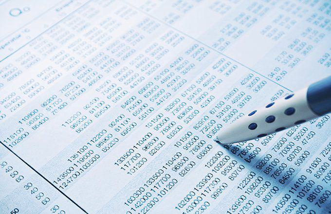

Financial derivatives and financial instruments are essential to the functionality and resilience of the global financial system. These tools allow market participants to hedge risk, speculate on price movements, and improve market liquidity. Among the wide variety of derivatives, Russian options and algorithmic trading represent areas of particular interest due to their unique characteristics and transformative potential.

Russian options represent a sub-category of exotic financial instruments. Unlike more conventional options such as American and European options, Russian options possess distinct attributes that provide additional flexibility, including a lookback feature and a typically non-expiring structure. This makes Russian options attractive for specific strategic financial applications, as they enable holders to exercise options at the most favorable prices observed over the option's duration.



Algorithmic trading, on the other hand, employs computer algorithms to execute trades at speeds and frequencies that are challenging for human traders. This method of trading has rapidly increased in prominence due to its ability to enhance market efficiency, tighten bid-ask spreads, and contribute positively to market liquidity. Algorithmic trading strategies encompass a range of approaches, from market making and statistical arbitrage to trend following and mean reversion.

This article provides an exploration of Russian options and algorithmic trading. We will assess how these instruments align with and contribute to the broader landscape of finance. Insights into their operation, the benefits they offer, and the risks they inherently carry will be shared. Understanding these elements is crucial for market participants aiming to leverage Russian options and algorithmic trading effectively in an ever-evolving financial environment. This discussion also underscores the importance of continuous learning and adaptability in navigating financial markets, stimulating further research and exploration of these and other innovative financial instruments.

## Table of Contents

## Understanding Financial Derivatives

Financial derivatives are financial instruments whose value is derived from the performance of underlying assets, indices, or interest rates. They are contracts between parties that can involve a variety of financial products. Derivatives include a wide range of instruments, such as futures, options, swaps, and forwards. Each type serves unique purposes in financial markets, offering tools for hedging, speculation, and arbitrage.

Futures are standardized contracts obligating the buyer to purchase, or the seller to sell, an asset at a predetermined future date and price. These are commonly used for commodities like oil, wheat, or gold but also extensively in financial instruments like stock indices or interest rate futures.

Options provide the holder the right, but not the obligation, to buy or sell an asset at a predetermined price within a specified timeframe. Options can be categorized as call options, which give the right to buy, and put options, which provide the right to sell. Unlike futures, options require a premium payment, representing the cost of holding this right.

Swaps are derivative contracts through which two parties exchange financial instruments. The most common types are [interest rate](/wiki/interest-rate-trading-strategies) swaps, where parties exchange cash flows based on a principal amount to manage exposure to fluctuations in interest rates.

Forwards are customized contracts between two parties to buy or sell an asset at a specified future date for a price agreed today. Unlike futures, forwards are traded over-the-counter (OTC), hence they are customizable but [carry](/wiki/carry-trading) counterparty risk as they are not standardized nor traded on exchanges.

Derivatives are crucial in global financial markets predominantly for three reasons: they help in risk management by providing means to hedge against price changes or interest rate movements, they allow for price discovery by revealing market expectations about future prices, and they enhance market efficiency by enabling [arbitrage](/wiki/arbitrage) opportunities.

The regulatory environment for derivatives has become increasingly robust due to their complexity and the role they played in financial crises, such as the 2008 financial downturn. Regulatory frameworks like the Dodd-Frank Act in the United States and the European Market Infrastructure Regulation (EMIR) in the European Union aim to increase transparency in derivatives trading. These regulations mandate reporting obligations, central clearing, and risk management standards to mitigate systemic risks.

Overall, financial derivatives play an indispensable role in today’s financial ecosystem. They allow participants to manage risk, provide opportunities for speculative gains, and enable traders to capitalize on arbitrage possibilities, albeit within a structured regulatory framework to ensure market stability.

 to Russian Options

Russian options represent a unique class of exotic financial instruments distinctively characterized by their lookback feature and non-expiration trait. Unlike standard options, which have specific expiration dates, Russian options lack a predefined maturity period, allowing holders to exercise them at infinite temporal points. This non-expiration feature grants flexibility, enabling option holders to maximize their payoff based on the highest observed price of the underlying asset. 

The lookback feature is integral to Russian options as it allows the option's payoff to depend on the maximum value reached by the underlying asset during the option's life. Mathematically, for a call option, the payoff can be expressed as:

$$
\text{Payoff} = \max(S_t) - K
$$

where $\max(S_t)$ is the maximum asset price observed since the inception of the option, and $K$ is the strike price. This contrasts sharply with American and European options, where the payoff depends on the asset's price at exercise or expiration. In European options, the holder can only exercise at the expiration date, and an American option can be exercised at any time until expiration.

The distinctive characteristics of Russian options provide a strategic advantage under certain market conditions, such as when assets are expected to experience high [volatility](/wiki/volatility-trading-strategies) and reach their peak values before declining. These features have generated significant interest within both financial markets and academia. Research on Russian options draws attention to the stochastic processes that model their pricing. Techniques from options pricing, stochastic calculus, and probability theory are frequently employed to derive analytical forms or numerical solutions for these exotic derivatives.

Despite their academic appeal, the practical usage of Russian options in financial markets remains limited, primarily due to their complexity and lack of [liquidity](/wiki/liquidity-risk-premium). The comprehensive understanding required to effectively price and manage the risks associated with Russian options poses challenges for market participants. Consequently, they are predominantly favored in niche markets where tailored risk management strategies are necessary.

In conclusion, Russian options, with their lookback features and non-expiration characteristic, stand out in the finance landscape, offering unique opportunities and theoretical intrigue, though they are met with challenges regarding their practical applicability.

## Benefits and Drawbacks of Russian Options

Russian options offer several distinctive advantages and drawbacks for option holders, mainly stemming from their unique characteristics. One notable advantage of Russian options is their potential to provide the maximum price advantage. This feature arises from the option's "lookback" attribute, where the payoff is determined by the most favorable price of the underlying asset over the life of the option. Consequently, the holder benefits from the highest asset price without the need to precisely time the market. This makes Russian options particularly appealing during periods of high volatility, offering significant upside potential with reduced risk of timing errors.

Despite these advantages, Russian options have notable drawbacks, such as the high premiums they command. The intrinsic value embedded in the lookback feature often results in substantially higher costs compared to standard options like American or European. This elevated premium can deter potential investors, limiting their accessibility to a broader market audience. Additionally, Russian options are not widely used in practice, primarily due to their complexity and the specialized nature of their payoff structure. The limited market use can result in lower liquidity, complicating the execution of trades and potentially leading to unfavorable pricing.

The theoretical appeal of Russian options is evident through their complex structure and the mathematical elegance of their pricing models. Academic discussions often highlight the sophisticated nature of these instruments, exploring pricing models based on stochastic processes and optimal stopping theory. The Black-Scholes model, extended for lookback options, is one such framework often cited in academic literature. Here is a simplified Python representation of a lookback option using the Monte Carlo simulation:

```python
import numpy as np

def monte_carlo_lookback(S0, r, sigma, T, M, I):
    dt = T / M
    paths = np.zeros((M + 1, I))
    paths[0] = S0
    for t in range(1, M + 1):
        z = np.random.standard_normal(I)
        paths[t] = paths[t - 1] * np.exp((r - 0.5 * sigma ** 2) * dt + sigma * np.sqrt(dt) * z)
    payoff = np.maximum(paths.max(axis=0) - S0, 0)
    lookback_value = np.exp(-r * T) * np.mean(payoff)
    return lookback_value

# Example parameters
S0 = 100      # Initial stock price
r = 0.05      # Risk-free rate
sigma = 0.2   # Volatility
T = 1.0       # Time to maturity
M = 100       # Number of time steps
I = 10000     # Number of simulations

price = monte_carlo_lookback(S0, r, sigma, T, M, I)
print(f"Estimated lookback option price: {price:.2f}")
```

The practical applicability of Russian options, however, is often debated. While the theoretical allure is significant, the application in real-world scenarios is limited by factors such as valuation challenges and regulatory constraints. Moreover, the specialized understanding required to effectively implement and manage these options can create barriers to entry for many investors.

In conclusion, academic research emphasizes both the potential benefits and inherent limitations of Russian options, fostering a rich dialogue on their use and valuation in financial markets. While they present compelling theoretical models, the practical hurdles highlight the need for further exploration and innovation to integrate such exotic options into broader investment strategies effectively.

## Algorithmic Trading in Financial Markets

Algorithmic trading, often referred to as algo-trading or black-box trading, employs computer algorithms to execute trading decisions in financial markets. These algorithms set predefined criteria such as timing, price, and [volume](/wiki/volume-trading-strategy), enabling rapid execution of trades without human intervention. The rise of [algorithmic trading](/wiki/algorithmic-trading) is closely linked to advances in technology and the increasing need for speed and efficiency in markets. According to a report by Markets and Markets, the algorithmic trading market is projected to reach USD 19 billion by 2024, driven by the adoption of automated trading software among financial institutions[^1^].

### Impact on Market Efficiency and Liquidity

The introduction of algorithmic trading has significantly affected market efficiency and liquidity. Algorithms can process vast amounts of market and historical data to detect patterns and make decisions, often leading to narrower bid-ask spreads and more efficient price discovery. As trades are executed quickly and at optimal prices, the overall liquidity in the market improves, benefitting both institutional and retail investors. However, the 2010 "Flash Crash" incident highlighted potential risks, where algorithmic trading contributed to a rapid and severe downturn in the U.S. stock market, underscoring the importance of regulatory oversight[^2^].

### Types of Strategies Utilized in Algorithmic Trading

Within algorithmic trading, several strategies have been developed to capitalize on different market conditions:

1. **Market Making:** Algorithms continuously offer buy and sell quotations to profit from the spread. This strategy enhances liquidity by providing constant market participation.

2. **Trend Following:** This strategy uses historical price trends and patterns to forecast future movements. Algorithms buy when prices rise and sell when they fall, without the necessity to predict specific price levels.

3. **Arbitrage:** Exploiting price discrepancies between different markets or instruments, algorithms are used to identify arbitrage opportunities and execute trades before the discrepancy corrects.

4. **Mean Reversion:** Based on the idea that prices will revert to their historical average over time, algorithms using this strategy identify entry and exit points when prices deviate significantly from the mean.

5. **Volume-Weighted Average Price (VWAP) and Time-Weighted Average Price (TWAP):** These algorithms are designed to execute trades in such a way that they align with the average price over a specific period, minimizing market impact.

### Regulatory Considerations for Algorithmic Trading

As algorithmic trading grows, regulatory bodies worldwide have implemented guidelines to mitigate associated risks. The primary focus has been on ensuring market stability and protecting investors from adverse impacts due to high-frequency trading anomalies. For instance, the European Union's Markets in Financial Instruments Directive II (MiFID II) mandates ongoing monitoring of algorithmic trading activities and requires firms to implement circuit breakers and kill switches to prevent runaway computers from disrupting markets[^3^].

Governments and regulatory bodies continue to monitor algorithmic trading's impact, updating and enforcing rules to adapt to new technologies and strategies. This oversight is necessary to maintain a level playing field and prevent the recurrence of incidents like the Flash Crash, thereby ensuring investor confidence in financial markets.

In summary, algorithmic trading plays a crucial role in modern financial markets, offering both opportunities and challenges. While it contributes to greater efficiency and liquidity, it also necessitates stringent regulatory measures to safeguard against potential market disruptions.

[^1^]: Markets and Markets. (n.d.). Algorithmic Trading Market.
[^2^]: Kirilenko, A. A., Kyle, A. S., Samadi, M., & Tuzun, T. (2017). The Flash Crash: High-Frequency Trading in an Electronic Market. *The Journal of Finance*, 72(3), 967-998.
[^3^]: European Securities and Markets Authority. (n.d.). MiFID II: A New Framework for European Financial Markets.

## Russian Options and Algorithmic Trading

Russian options, a type of exotic financial derivative, offer unique opportunities for algorithmic trading due to their distinct characteristics. The non-expiration and lookback features of Russian options make them an intriguing subject for quantitative strategies and algorithmic traders aiming to optimize portfolio returns and hedge risks.

### Potential for Algorithmic Trading with Russian Options

Algorithmic trading leverages computer algorithms to execute trades at speeds and frequencies beyond human capability, making it particularly suitable for trading complex financial instruments like Russian options. These options allow for sophisticated trading strategies that exploit the option's capability to give the holder the right to benefit from the maximum price of the underlying asset over time.

### Strategies Incorporating Russian Options

One potential algorithmic strategy with Russian options is to use adaptive models that continuously track the price path of the underlying asset. Such models can identify optimal moments to exercise the option, taking full advantage of the lookback feature. Traders can employ stochastic optimization techniques to develop algorithms that maximize the payoff by adjusting to market conditions and volatility patterns.

Python is a preferred language for implementing these algorithms due to its rich ecosystem of financial libraries such as `NumPy`, `Pandas`, and `SciPy`. For instance, the following code snippet illustrates a simplified strategy using the Monte Carlo simulation to evaluate the payoff of a Russian option:

```python
import numpy as np

# Parameters
S0 = 100  # Initial stock price
T = 1.0  # Time to maturity
r = 0.05  # Risk-free rate
sigma = 0.2  # Volatility
steps = 1000  # Number of steps in the simulation
simulations = 10000  # Number of simulation paths

def russian_option_payoff(S0, T, r, sigma, steps, simulations):
    dt = T / steps
    payoffs = []
    for _ in range(simulations):
        path = [S0]
        for _ in range(steps):
            S_t = path[-1] * np.exp((r - 0.5 * sigma**2) * dt + sigma * np.sqrt(dt) * np.random.normal())
            path.append(S_t)
        # Max price during the life of the option
        max_price = max(path)
        payoffs.append(max_price)
    # Discounting back to present value
    return np.exp(-r * T) * np.mean(payoffs)

payoff = russian_option_payoff(S0, T, r, sigma, steps, simulations)
print(f"Estimated payoff of the Russian option: {payoff:.2f}")
```

### Challenges and Opportunities for Integration

Integrating Russian options into algorithmic trading systems poses several challenges. The complexity of pricing models, computational demands, and the need for continuous recalibration of algorithms represent significant obstacles. Moreover, the limited liquidity and availability of Russian options in markets can pose additional barriers for traders seeking to implement these strategies at scale.

However, these challenges also present opportunities for innovation. Financial firms with robust computational resources and expertise in quantitative research are well-positioned to exploit these instruments, potentially leading to significant competitive advantages.

### Future Outlook for Combining These Instruments

The future of combining Russian options and algorithmic trading holds promise, particularly with advancements in computational finance and [machine learning](/wiki/machine-learning). As technology further evolves, the ability to process vast datasets and refine predictive models could enhance the strategies employed with Russian options.

In addition, regulatory developments aimed at increasing transparency and reducing risk in derivative markets may encourage broader adoption of Russian options. The potential to offer unique hedging capabilities and optimized returns can make them attractive to a wider range of market participants, provided the challenges are adequately addressed.

## Conclusion

The article traverses the intricate landscape of financial derivatives and instruments, particularly focusing on Russian options and algorithmic trading. These financial instruments are pivotal in shaping global markets, providing tools for hedging, speculation, and risk management. Russian options, with their exotic nature and unique features like the lookback and non-expiring characteristics, stand out as innovative yet complex instruments. Algorithmic trading, which leverages computational power for executing trades, has revolutionized market operations by enhancing efficiency and liquidity.

As financial instruments continue to evolve, so does the importance of continuous learning to stay abreast of new developments and integrate them effectively within trading strategies. The dynamic nature of markets necessitates ongoing research and exploration, as these instruments and techniques bring both opportunities and challenges. Scholars and practitioners alike are encouraged to engage in further study to unlock the full potential of financial innovations.

The financial ecosystem is ever-evolving, marked by technological advancements and shifting market demands. This evolution underscores the need for adaptability and foresight in employing financial derivatives like Russian options. In conclusion, embracing a mindset of lifelong learning and research is crucial to navigating the transformative landscape of financial instruments.

## References & Further Reading

[1]: Kirilenko, A. A., Kyle, A. S., Samadi, M., & Tuzun, T. (2017). [The Flash Crash: High-Frequency Trading in an Electronic Market](https://www.jstor.org/stable/26652722). The Journal of Finance, 72(3), 967-998.

[2]: Hull, J. C. (2012). [Options, Futures, and Other Derivatives](https://www.semanticscholar.org/paper/Options%2C-Futures%2C-and-Other-Derivatives-Hull/89bdee500c8623864fc9eb7a471546aa713acc44) (9th ed.). Pearson.

[3]: Wilmott, P., Howison, S., & Dewynne, J. (1995). [The Mathematics of Financial Derivatives: A Student Introduction](https://www.cambridge.org/core/books/mathematics-of-financial-derivatives/7121345D07C5BCE4FBEC91A8A7E6F267). Oxford University Press.

[4]: Lopez de Prado, M. (2018). [Advances in Financial Machine Learning](https://www.amazon.com/Advances-Financial-Machine-Learning-Marcos/dp/1119482089). Wiley.

[5]: Chan, E. P. (2009). [Quantitative Trading: How to Build Your Own Algorithmic Trading Business](https://github.com/ftvision/quant_trading_echan_book). Wiley.

[6]: Gatheral, J. (2006). [The Volatility Surface: A Practitioner's Guide](https://onlinelibrary.wiley.com/doi/book/10.1002/9781119202073). Wiley.