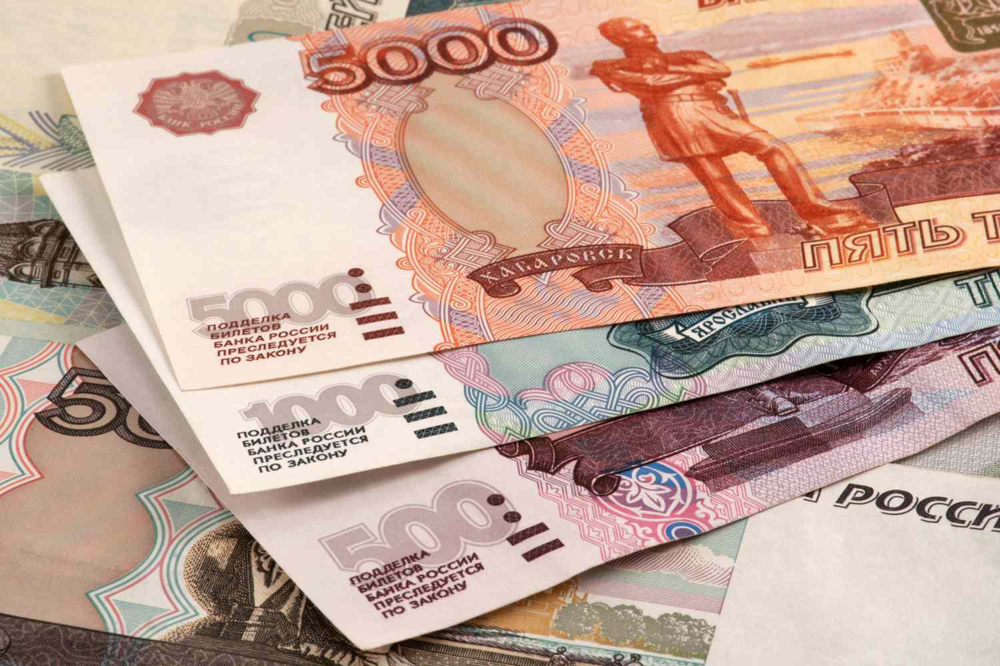

The Russian ruble (RUB) serves as the official currency of the Russian Federation and plays a vital role in the global financial system. Its significance extends beyond national borders, influencing international trade and investment flow. As one of the world's most widely-traded currencies, the RUB impacts various sectors, from energy to commodities, given Russia's prominent position in these markets. This article explores the multifaceted nature of the Russian ruble, examining its historical trajectory, value fluctuations, and the evolving landscape of currency trading, particularly through algorithmic strategies.

Historically, the ruble has experienced significant transformations, reflecting the economic and political shifts within Russia and globally. These changes have led to periods of volatility, creating both challenges and opportunities for currency traders. Understanding the historical context and the underlying factors influencing the ruble's value is crucial for those engaged in financial markets.



With advancements in technology, the landscape of currency trading is transforming significantly. Algorithmic trading, or algo trading, has emerged as a powerful tool for traders, offering speed, efficiency, and the capability to process complex data sets rapidly. This technological progression is particularly relevant to the RUB, as traders seek novel strategies to optimize market performance amid the currency's inherent volatility.

The focus of this article is to provide a comprehensive overview of the ruble's role in currency trading, with particular emphasis on the advancements and challenges associated with algo trading. By doing so, we aim to equip currency traders, financial analysts, and economics enthusiasts with a deeper understanding of the dynamics at play. In today's interconnected markets, comprehending the intricacies of the RUB is essential for informed decision-making and successful trading strategies.

## Table of Contents

## History and Current Outlook of the Russian Ruble

The Russian ruble, one of the world's oldest currencies, has been a cornerstone of Russia's monetary system since the 13th century. Throughout its history, the ruble has undergone numerous transformations, reflecting the tumultuous socio-economic and political shifts within the country.

During the Soviet era, particularly in the 20th century, the ruble experienced periods of significant instability. The centralized economic policies of the Soviet Union imposed strict controls on currency, yet these measures often led to inefficiencies and distortions in the financial system. Following the dissolution of the Soviet Union in 1991, the ruble entered a phase of profound reform as Russia transitioned from a planned economy to a market-oriented system. This period was marked by hyperinflation and a series of economic crises, necessitating a series of monetary reforms to stabilize the currency.

In contemporary times, the value of the ruble is heavily influenced by external factors, with geopolitical tensions and international sanctions playing a pivotal role. For instance, sanctions imposed by Western nations following the annexation of Crimea in 2014 had a substantial impact on the ruble's value, leading to significant depreciation. Oil prices also wield considerable influence over the ruble, given Russia's dependence on oil exports for revenue. Fluctuating oil prices can lead to [volatility](/wiki/volatility-trading-strategies) in the ruble's exchange rate, which currency traders and economists scrutinize closely.

The ruble's volatility is not just a domestic concern but also a [factor](/wiki/factor-investing) in global economic conditions. Sharp movements in the ruble can have ripple effects across financial markets, given Russia's role as a major global player in energy and resource sectors. For traders and economists, understanding the ruble necessitates a comprehensive grasp of Russia's current economic and political environment. Factors such as governmental fiscal policy, foreign relations, and domestic economic health are all crucial in forecasting future trends for the ruble.

In sum, the history of the Russian ruble is marked by its resilience and adaptability in the face of economic and political challenges. Presently, the ruble remains subject to external pressures and internal policy decisions, making it a currency that is both challenging and critical for market participants to comprehend.

## The Role of Algo Trading in Currency Markets

Algorithmic trading, commonly referred to as algo trading, utilizes advanced algorithms to automate trading strategies and enhance market execution efficiency. This approach has significantly transformed currency markets by marrying computational prowess with financial analytics. 

In the currency market, algo trading is particularly celebrated for its ability to process vast datasets swiftly and execute trades at speeds unattainable by human traders. Algorithms can monitor multiple markets simultaneously, identify profitable opportunities, and execute orders in milliseconds. This speed advantage reduces the risk of adverse price movements during the time it takes to place a trade. Moreover, algo trading minimizes human error and emotional decision-making, which can often lead to suboptimal trading outcomes.

The application of technological advancements in algorithm design, such as [machine learning](/wiki/machine-learning) and [artificial intelligence](/wiki/ai-artificial-intelligence), continues to refine algo trading's efficiency and precision. Machine learning models, for instance, can adapt to market changes and improve their decision-making over time, offering traders not only increased accuracy but also the ability to predict complex patterns in market behavior.

For traders focusing on the Russian ruble (RUB), algo trading presents distinct benefits and attractions. The ruble has experienced considerable volatility due to geopolitical influences and economic sanctions, making it a fertile ground for algo trading strategies that capitalize on short-term price movements. Algorithms can quickly react to news and market events affecting the ruble, optimizing the timing of trades to maximize returns or minimize losses.

One example of an algorithm that could be employed in ruble trading is the mean-reversion strategy. This is based on the hypothesis that the price of an asset tends to revert to its mean over time. By estimating the mean price level of the ruble using historical data, traders can set algorithms to buy when the price dips below this level and sell when it rises above. Such strategies can be implemented and backtested using Python, as illustrated below:

```python
import pandas as pd
import numpy as np
import matplotlib.pyplot as plt

# Load historical RUB data
data = pd.read_csv('ruble_data.csv', parse_dates=['Date'], index_col='Date')

# Calculate rolling mean
window = 20  # Use a 20-day rolling window
data['RollingMean'] = data['Close'].rolling(window=window).mean()

# Generate trading signals based on mean-reversion
data['Signal'] = 0
data['Signal'][window:] = np.where(data['Close'][window:] < data['RollingMean'][window:], 1, 0)

# Plot for visualization
plt.figure(figsize=(12, 6))
plt.plot(data['Close'], label='RUB Close Price')
plt.plot(data['RollingMean'], label=f'{window}-Day Rolling Mean', linestyle='--')
plt.scatter(data.index, data['Signal'] * data['Close'], label='Buy Signal', color='green', marker='^')
plt.title('Mean-Reversion Algo Trading Strategy')
plt.xlabel('Date')
plt.ylabel('Price')
plt.legend()
plt.show()
```

This algorithm demonstrates how traders can systematically approach ruble trading, employing historical data trends to inform decisions.

In conclusion, understanding and utilizing algo trading is critical for participants in modern currency markets. Its adoption transforms trading methodologies, enabling the management of complex data and optimizations that were previously unachievable. As technology progresses, [algorithmic trading](/wiki/algorithmic-trading) is poised to become even more sophisticated, providing traders with robust tools to navigate the dynamic [forex](/wiki/forex-system) environment.

## Technical Challenges and Opportunities in Trading the RUB

Algorithmic trading in the Russian ruble (RUB) market presents both challenges and opportunities that traders must navigate to execute efficient strategies. One significant challenge is market [liquidity](/wiki/liquidity-risk-premium). The Russian ruble, while a major currency, can exhibit periods of lower liquidity compared to more heavily traded currencies like the US dollar or euro. This can lead to wider bid-ask spreads and increased slippage, making it essential for algorithmic traders to design strategies that can adapt to varying liquidity levels. Traders can use liquidity-adjusted models to mitigate the impact of low liquidity. For example, they can implement algorithms that adjust order sizes based on real-time liquidity metrics or dynamically hedge against liquidity risk.

Regulatory constraints also pose a considerable challenge. Russia's financial markets are subject to specific regulations that can affect trading operations, such as currency controls and capital flow restrictions. Compliance with these regulations is crucial, and algorithmic traders need to incorporate regulatory considerations into their algorithms. This might involve implementing compliance checks within trading systems to ensure adherence to local laws.

Geopolitical risks add another layer of complexity. The value of the Russian ruble is sensitive to geopolitical events, such as economic sanctions, political instability, or changes in government policy. These factors can lead to sudden and unpredictable market movements. Algorithmic traders must develop robust risk management frameworks to cope with such volatility. This may include deploying machine learning models capable of analyzing geopolitical news sentiment and adjusting trading strategies accordingly.

On the opportunity side, advancements in artificial intelligence (AI) and machine learning (ML) provide traders with powerful tools to enhance and streamline their algorithms. AI-driven analytics can process vast amounts of data, identify patterns, and predict market movements with higher accuracy. Machine learning models, such as neural networks, can be trained on historical data to improve the precision of trading signals for the RUB.

Algorithmic traders can leverage AI by implementing models for feature selection and dimensionality reduction, which can identify the most relevant market indicators for their trading strategies. Python, with its robust libraries like TensorFlow and PyTorch, is a popular choice for developing these algorithms:

```python
import tensorflow as tf
from tensorflow.keras.models import Sequential
from tensorflow.keras.layers import Dense, Dropout
import numpy as np

# Example of a simple neural network model
model = Sequential()
model.add(Dense(64, input_dim=10, activation='relu')) # 10 features as input
model.add(Dropout(0.5))
model.add(Dense(32, activation='relu'))
model.add(Dropout(0.5))
model.add(Dense(1, activation='linear'))

# Compile the model
model.compile(optimizer='adam', loss='mean_squared_error')

# Dummy data
X_train = np.random.rand(1000, 10)  # Features
y_train = np.random.rand(1000, 1)   # Target

# Train the model
model.fit(X_train, y_train, epochs=50, batch_size=32)
```

While the technical challenges in trading the Russian ruble with algorithmic methods are significant, these challenges can be mitigated through careful strategy design, utilizing advanced technologies, and maintaining compliance with regulations. Opportunities for improving trading performance are abundant through the judicious use of AI and machine learning, enabling traders to exploit market inefficiencies more effectively.

## Case Studies and Examples of Successful RUB Algo Trading

Examining real-world examples of successful algorithmic trading strategies involving the Russian ruble (RUB) can provide critical insights into the effectiveness and innovation within this sector. These cases highlight how algorithms have been used to exploit market inefficiencies and respond to currency fluctuations, illustrating the practical benefits of algo trading in RUB.

One notable case involved the use of [volume](/wiki/volume-trading-strategy)-weighted average price (VWAP) strategies in high-frequency trading environments. Seasoned traders harnessed VWAP algorithms to segment large orders of the RUB into smaller trades, executed over time to minimize market impact and reduce transaction costs. By programming algorithms tailored to execute during optimal trading windows, these traders were able to improve their bid-offer spread returns significantly while mitigating adverse market movements.

Another successful strategy focused on exploiting [arbitrage](/wiki/arbitrage) opportunities between different trading platforms. By employing [statistical arbitrage](/wiki/statistical-arbitrage) models, traders analyzed historical price data to identify discrepancies between RUB prices on global exchanges. The algorithms were programmed to execute simultaneous buy and sell orders based on these identified disparities, profiting from the temporary mispricing until the market corrected itself. This not only maximized profit margins but also maintained portfolio risk at desired thresholds through continuous data analysis and recalibration.

A further case study involved machine learning models predicting short-term RUB price movements based on a series of market indicators. These algorithms integrated [deep learning](/wiki/deep-learning) frameworks to analyze vast datasets, learning from historical patterns to forecast future price directions. By leveraging neural networks, traders were able to enhance model accuracy and adapt swiftly to dynamic market changes, yielding substantial returns during periods of increased volatility.

Analyzing these cases, key takeaways emerge in best practices and lessons learned. Firstly, the success of algo trading with the RUB is heavily dependent on the robustness of data input and the adaptability of algorithms to accommodate rapid market shifts. This underscores the necessity of maintaining extensive, real-time datasets and updating algorithms to sustain competitive advantages. Additionally, strategies that incorporate advanced statistical methods, such as machine learning, tend to yield better performance due to their predictive and adaptable nature.

Moreover, risk management remains a critical component. Successful examples consistently implemented rigorous risk assessment protocols within their algorithmic frameworks to manage exposure efficiently across diverse market conditions.

These case studies demonstrate that with the right technical framework and strategic approach, algo trading of the RUB can be both innovative and profitable. By continuously refining strategies and integrating technological advancements, traders can effectively navigate the complex and volatile landscape of currency markets.

## Future of Algo Trading with the Russian Ruble

As technology continues to advance, the future of algorithmic trading with the Russian ruble (RUB) promises to be both exciting and unpredictable. The rapid pace of technological innovation is poised to alter the landscape of currency trading, with notable developments in the fields of quantum computing and blockchain technology standing out as transformative forces.

Quantum computing offers the potential to revolutionize currency markets, including the trading of the RUB, by vastly increasing computational power. This would enable the processing of complex data sets and the execution of sophisticated trading algorithms at unprecedented speeds. Quantum algorithms can solve problems exponentially faster than classical algorithms, providing traders with a competitive edge in high-frequency trading environments. These advancements may also improve pricing accuracy and risk management, as quantum computing can enhance the modeling of market behaviors and predictive analytics.

Blockchain technology, with its decentralized and transparent ledger system, presents another avenue for transformation in ruble trading. By facilitating secure and efficient cross-border transactions, blockchain could reduce settlement times and lower transaction costs significantly. Moreover, incorporating smart contracts into algorithmic trading strategies could automate complex trade agreements, enhancing efficiency and reducing counterparty risks. This could be particularly beneficial for trading the RUB, given the currency's susceptibility to geopolitical instabilities and sanctions, which often lead to heightened counterparty risks.

Potential developments in algorithmic strategies will likely focus on integrating these emerging technologies to enhance trading efficiency. For instance, machine learning and artificial intelligence can be utilized to refine algorithmic models, dynamically adjusting to market conditions and identifying patterns in ruble price fluctuations. Additionally, adaptive learning algorithms that incorporate real-time market data could be pivotal in optimizing trading strategies and managing risks associated with RUB fluctuations.

Global economic changes also play a crucial role in shaping the future of ruble trading. The Russian economy is heavily influenced by oil prices due to its reliance on energy exports, and fluctuations in global oil demand can directly impact the ruble's value. Traders utilizing algo trading techniques must therefore integrate macroeconomic indicators and geopolitical analyses into their strategies to effectively navigate these influences.

Preparing for the future of algorithmic trading with the RUB involves staying informed about ongoing technological advancements and market trends. Engaging with interdisciplinary research and development efforts in areas like quantum computing and blockchain will be vital for traders looking to maintain a competitive edge. Continuous learning and adaptation to new technologies and methodologies will enable traders to capitalize on emerging opportunities while effectively managing the inherent risks associated with the ever-evolving financial landscape.

## Conclusion

Understanding the Russian ruble and its role in currency markets is essential for traders and economists. The currency's significance in global finance underscores the necessity for a deep comprehension of its dynamics, especially considering its historical volatility due to geopolitical and economic influences. Algorithmic trading presents a sophisticated means to navigate the complexities and unpredictabilities associated with RUB trading. By utilizing algorithmic strategies, traders can enhance their execution efficiency, reduce human error, and capitalize on market opportunities with greater precision.

The historical analysis of the ruble, coupled with case studies of successful algorithmic implementations, provides invaluable insights into leveraging these strategies effectively. These experiences highlight how technology can optimize trading outcomes, offering traders a competitive edge in the market. However, challenges persist, particularly concerning market liquidity, regulatory considerations, and geopolitical risks unique to the ruble. Despite these issues, continued technological advancements, such as improvements in artificial intelligence and machine learning, promise to bolster the effectiveness and success rate of algorithmic trading in this currency.

The central takeaway is the importance of adaptability and continuous learning. Traders must remain abreast of technological developments and market trends to successfully engage with the Russian ruble in a dynamically shifting financial landscape. Embracing this adaptability will enable traders to refine their strategies and maintain resilience against the evolving challenges and opportunities within global currency markets.

## References & Further Reading

[1]: Bergstra, J., Bardenet, R., Bengio, Y., & Kégl, B. (2011). ["Algorithms for Hyper-Parameter Optimization."](https://papers.nips.cc/paper/4443-algorithms-for-hyper-parameter-optimization) Advances in Neural Information Processing Systems 24.

[2]: ["Advances in Financial Machine Learning"](https://www.amazon.com/Advances-Financial-Machine-Learning-Marcos/dp/1119482089) by Marcos Lopez de Prado

[3]: ["Evidence-Based Technical Analysis: Applying the Scientific Method and Statistical Inference to Trading Signals"](https://www.amazon.com/Evidence-Based-Technical-Analysis-Scientific-Statistical/dp/0470008741) by David Aronson

[4]: ["Machine Learning for Algorithmic Trading"](https://github.com/stefan-jansen/machine-learning-for-trading) by Stefan Jansen

[5]: ["Quantitative Trading: How to Build Your Own Algorithmic Trading Business"](https://www.amazon.com/Quantitative-Trading-Build-Algorithmic-Business/dp/1119800064) by Ernest P. Chan