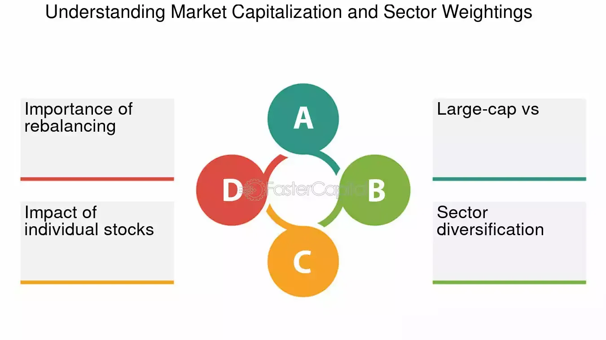

## Table of Contents

## What is the S&P/TSX Composite Index?

The S&P/TSX Composite Index is a stock market index that shows how well the biggest companies in Canada are doing. It includes about 250 companies from different industries, like banks, oil and gas, and mining. The index is important because it gives investors an idea of how the Canadian stock market is performing overall.

When people talk about the Canadian stock market, they often mention the S&P/TSX Composite Index. If the index goes up, it means that, on average, the stocks of these big Canadian companies are doing well. If it goes down, it means their stocks are not doing as well. This index is used by many people, like investors and financial analysts, to make decisions about buying and selling stocks.

## What are the eligibility criteria for companies to be included in the S&P/TSX Composite Index?

To be included in the S&P/TSX Composite Index, a company must be listed on the Toronto Stock Exchange (TSX) and meet certain criteria. One main criterion is that the company must have a large enough market capitalization, which means the total value of all its shares. The index includes the largest companies, so a company needs to be big enough to be considered.

Another important criterion is that the company must be actively traded. This means that people are buying and selling its shares regularly. If a company's shares are not traded often, it won't be included in the index. Also, the company must meet certain standards set by the TSX, like having a certain amount of shares available to the public.

The S&P/TSX Composite Index is reviewed and updated regularly. Companies can be added or removed based on their performance and whether they still meet the criteria. This helps keep the index a good reflection of the Canadian stock market.

## How is the S&P/TSX Composite Index calculated?

The S&P/TSX Composite Index is calculated using a method called market capitalization weighting. This means that the value of each company in the index is based on how much it is worth in the market. Bigger companies have a bigger impact on the index's value. To figure out the index's value, you take the total market value of all the companies in the index and divide it by a special number called the divisor. The divisor helps keep the index consistent even when companies are added or removed.

The index is updated every 15 seconds during trading hours, so it always shows the most recent value of the companies. When a company's stock price goes up or down, it changes the total market value of the index. This change is then reflected in the index's value. The S&P/TSX Composite Index gives a good picture of how the Canadian stock market is doing because it includes many of the biggest and most important companies in Canada.

## What are the major sectors represented in the S&P/TSX Composite Index?

The S&P/TSX Composite Index includes companies from many different sectors, but some are more important than others. The biggest sector is Financials, which includes banks and insurance companies. This sector is very important because it makes up a big part of the Canadian economy. Another major sector is Energy, which includes companies that deal with oil, gas, and other energy sources. These companies can have a big impact on the index because their stock prices can change a lot.

Other important sectors in the index are Materials, which includes mining and chemical companies, and Industrials, which includes companies that make things or provide services like transportation. The Technology sector is also growing and becoming more important in the index. Each of these sectors contributes to the overall performance of the S&P/TSX Composite Index, showing how different parts of the Canadian economy are doing.

## How can an investor purchase stocks that are part of the S&P/TSX Composite Index?

An investor can buy stocks that are part of the S&P/TSX Composite Index by using a brokerage account. First, the investor needs to open an account with a brokerage firm, which can be done online or in person. Once the account is set up, the investor can search for the specific stocks they want to buy. They can find these stocks by looking at the list of companies in the S&P/TSX Composite Index, which is available on financial websites. After choosing a stock, the investor can place an order to buy it through their brokerage account.

Another way to invest in the stocks of the S&P/TSX Composite Index is by buying an exchange-traded fund ([ETF](/wiki/etf-trading-strategies)) that tracks the index. An ETF is like a basket of stocks that you can buy and sell like a single stock. There are ETFs specifically designed to mimic the performance of the S&P/TSX Composite Index. To buy an ETF, an investor would follow the same steps as buying individual stocks: open a brokerage account, search for the ETF, and place an order to buy it. This way, the investor gets exposure to all the companies in the index without having to buy each stock separately.

## What are the benefits of investing in the components of the S&P/TSX Composite Index?

Investing in the components of the S&P/TSX Composite Index can be a good idea because it helps spread out risk. When you buy stocks from different companies in the index, you're not putting all your money into one company. If one company does badly, the others might do well, so your overall investment stays more stable. This is called diversification, and it's a smart way to protect your money. Also, the S&P/TSX Composite Index includes some of the biggest and most successful companies in Canada, so you're investing in strong businesses that have a good chance of growing over time.

Another benefit is that the S&P/TSX Composite Index covers many different industries, like banks, energy, and technology. This means you can invest in a variety of sectors that are important to the Canadian economy. If one sector is doing badly, another might be doing well, which can help balance out your investment. Plus, by investing in the index, you're keeping up with how the Canadian market is doing overall. This can be a good way to grow your money over the long term, especially if you believe in the future of the Canadian economy.

## How does the performance of the S&P/TSX Composite Index reflect the Canadian economy?

The S&P/TSX Composite Index is a good way to see how the Canadian economy is doing. It includes many of the biggest companies in Canada, from different industries like banks, energy, and mining. When these companies do well, it usually means the Canadian economy is strong. If the index goes up, it shows that people are feeling good about the economy and are buying more stocks. If it goes down, it can mean that people are worried and selling their stocks.

The index is also a helpful tool for investors because it gives them a quick look at the overall health of the Canadian market. Since it covers so many different sectors, changes in the index can show what's happening in important parts of the economy. For example, if energy companies in the index are doing well, it might mean that oil prices are high, which is good for Canada's economy. By watching the S&P/TSX Composite Index, people can get a sense of where the Canadian economy is headed.

## What are the risks associated with investing in the S&P/TSX Composite Index components?

Investing in the components of the S&P/TSX Composite Index comes with some risks. One big risk is that the stock market can go up and down a lot. Even if you spread your money across different companies in the index, the whole market can still drop, and you could lose money. Also, some companies in the index might not do well, even if the overall market is okay. If you pick the wrong stocks, your investment might not grow as much as you hope.

Another risk is that the Canadian economy can affect the index. If things like oil prices or interest rates change a lot, it can hurt the companies in the index. For example, if oil prices drop, energy companies in the index might lose value, and that can pull down the whole index. Also, if you invest all your money in Canadian stocks, you might miss out on opportunities in other countries. So, it's important to think about how changes in the economy can affect your investment in the S&P/TSX Composite Index.

## How often is the S&P/TSX Composite Index rebalanced, and what impact does this have on its composition?

The S&P/TSX Composite Index is rebalanced every quarter, which means it is updated four times a year. During this rebalancing, the companies in the index are checked to see if they still meet the criteria for being included. If a company has grown big enough or become more actively traded, it might be added to the index. On the other hand, if a company has become smaller or less traded, it might be removed. This helps make sure the index always shows a good picture of the Canadian stock market.

When the index is rebalanced, it can change how it performs. If a new company is added and it does really well, it can help the whole index go up. If a company is taken out because it's not doing well, it can stop dragging the index down. These changes can affect investors because they might need to buy or sell stocks to match the new index. But the main goal of rebalancing is to keep the index a fair and accurate reflection of the biggest and most important companies in Canada.

## Can you compare the S&P/TSX Composite Index with other major global indices?

The S&P/TSX Composite Index is a key measure of the Canadian stock market, focusing on the largest companies listed on the Toronto Stock Exchange. It's different from global indices like the S&P 500, which tracks the 500 largest companies in the United States, or the FTSE 100, which follows the top 100 companies on the London Stock Exchange. While the S&P/TSX Composite Index includes a wide range of sectors, it has a strong focus on financials, energy, and materials, which reflects the Canadian economy. In contrast, the S&P 500 has a big emphasis on technology and healthcare, and the FTSE 100 is known for its heavy weighting in financial services and consumer goods.

These differences in sector focus mean that the performance of the S&P/TSX Composite Index can be influenced by different economic factors compared to other global indices. For example, changes in oil prices can have a bigger impact on the S&P/TSX Composite Index because of its heavy weighting in energy companies. On the other hand, the S&P 500 might be more sensitive to tech industry news, while the FTSE 100 could be more affected by what's happening in the banking sector. Investors often use these indices to get a quick snapshot of how different parts of the world's economies are doing, and they might choose to invest in one or more of these indices based on their investment goals and the economic conditions in different countries.

## What are some advanced strategies for investing in the S&P/TSX Composite Index?

One advanced strategy for investing in the S&P/TSX Composite Index is to use sector rotation. This means you pay attention to which sectors are doing well at different times and adjust your investments accordingly. For example, if you think the energy sector is going to do better because oil prices are going up, you might buy more stocks from energy companies in the index. By moving your money between different sectors, you can try to take advantage of the ups and downs in the market. This strategy needs you to keep a close eye on economic trends and news, but it can help you make more money if you get it right.

Another strategy is to use options to hedge your investments. Options are like contracts that give you the right to buy or sell stocks at a certain price. If you own stocks in the S&P/TSX Composite Index, you can buy options to protect yourself from big drops in the market. For example, if you think the market might go down, you can buy a put option, which lets you sell your stocks at a set price even if the market falls. This can help you limit your losses. Options can be complicated, so it's important to learn about them and maybe talk to a financial advisor before you start using them.

A third strategy is to use index funds or ETFs to get broad exposure to the S&P/TSX Composite Index while also doing some active trading. You can invest most of your money in an index fund or ETF that tracks the S&P/TSX Composite Index, which gives you a safe and diversified investment. Then, you can use a smaller part of your money to buy and sell individual stocks from the index, trying to beat the market's performance. This way, you get the stability of the whole index while also trying to make extra money by [picking](/wiki/asset-class-picking) the right stocks. It's a good balance between safety and trying to grow your money faster.

## How can investors use derivatives to hedge or leverage their exposure to the S&P/TSX Composite Index?

Investors can use derivatives like options and futures to hedge or leverage their exposure to the S&P/TSX Composite Index. Hedging means protecting your investments from big drops in the market. For example, if you own stocks that are part of the S&P/TSX Composite Index and you're worried the market might go down, you can buy put options. A put option gives you the right to sell your stocks at a set price, even if the market falls. This can help limit your losses if the market does drop. On the other hand, if you think the market is going to go up, you can buy call options, which let you buy stocks at a set price. This way, you can make money if the market rises without having to buy all the stocks right away.

Leveraging means using derivatives to try to make more money from your investments. With futures contracts, you can bet on where you think the S&P/TSX Composite Index is going to go. If you think the index will go up, you can buy a futures contract that lets you buy the index at today's price but settle it later. If the index does go up, you can make money from the difference. But be careful, because using derivatives can be risky. If you guess wrong, you could lose more money than you put in. So, it's important to understand how derivatives work and maybe talk to a financial advisor before you start using them.

## What is the S&P/TSX Composite Index and how can it be understood?

The S&P/TSX Composite Index is Canada's leading benchmark for the stock market, akin to the S&P 500 in the United States. This index serves as a critical indicator of the Canadian economy by representing the performance of the country's largest public companies. Specifically, it encompasses 250 of the most prominent firms listed on the Toronto Stock Exchange (TSX), offering a comprehensive overview of the Canadian market landscape. 

The S&P/TSX Composite Index employs a capitalization-weighted methodology. In a capitalization-weighted index, each component's impact on the index's overall performance is directly proportional to its market capitalization. This means that companies with a larger market cap have more influence on the index's movement compared to smaller companies. Mathematically, the index can be expressed as:

$$
\text{Index Level} = \frac{\sum_{i=1}^{n} (P_i \times Q_i)}{D}
$$

where $P_i$ is the stock price of company $i$, $Q_i$ is the number of shares outstanding of company $i$, and $D$ is the divisor used to maintain the index level and account for stock splits, dividends, and other corporate actions.

By focusing on the largest companies in Canada, the S&P/TSX Composite Index captures a broad spectrum of economic activities, reflecting the health of various sectors, including finance, energy, and materials. As such, it functions as a barometer for investors, offering insights into market trends and economic conditions within Canada.

## References & Further Reading

[1]: ["Advances in Financial Machine Learning"](https://www.amazon.com/Advances-Financial-Machine-Learning-Marcos/dp/1119482089) by Marcos Lopez de Prado

[2]: ["Quantitative Trading: How to Build Your Own Algorithmic Trading Business"](https://www.amazon.com/Quantitative-Trading-Build-Algorithmic-Business/dp/1119800064) by Ernest P. Chan

[3]: ["Machine Learning for Algorithmic Trading"](https://github.com/stefan-jansen/machine-learning-for-trading) by Stefan Jansen

[4]: ["Evidence-Based Technical Analysis: Applying the Scientific Method and Statistical Inference to Trading Signals"](https://www.amazon.com/Evidence-Based-Technical-Analysis-Scientific-Statistical/dp/0470008741) by David Aronson

[5]: Bergstra, J., Bardenet, R., Bengio, Y., & Kégl, B. (2011). ["Algorithms for Hyper-Parameter Optimization."](https://dl.acm.org/doi/10.5555/2986459.2986743) Advances in Neural Information Processing Systems 24.