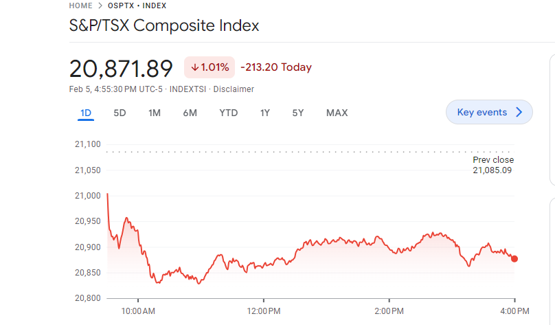

In the increasingly complex world of trading, understanding stock market indices, such as the S&P/TSX Composite Index, is crucial for investors seeking to enhance their financial strategies. This article provides a thorough examination of this prominent Canadian stock index, focusing on its various components, its significance in the financial landscape, and its integration into algorithmic trading practices. By offering insights into the workings of this index, we aim to empower both novice and experienced investors with the knowledge necessary to make informed investment decisions and maximize their returns. Utilizing technological advancements and data-driven strategies, investors can harness tools like algorithmic trading to optimize their engagement with the market. This approach highlights the importance of continuous learning and technological integration in achieving successful investment outcomes.

## Table of Contents



## Understanding the S&P/TSX Composite Index

The S&P/TSX Composite Index is Canada's leading benchmark for the stock market, akin to the S&P 500 in the United States. This index serves as a critical indicator of the Canadian economy by representing the performance of the country's largest public companies. Specifically, it encompasses 250 of the most prominent firms listed on the Toronto Stock Exchange (TSX), offering a comprehensive overview of the Canadian market landscape. 

The S&P/TSX Composite Index employs a capitalization-weighted methodology. In a capitalization-weighted index, each component's impact on the index's overall performance is directly proportional to its market capitalization. This means that companies with a larger market cap have more influence on the index's movement compared to smaller companies. Mathematically, the index can be expressed as:

$$
\text{Index Level} = \frac{\sum_{i=1}^{n} (P_i \times Q_i)}{D}
$$

where $P_i$ is the stock price of company $i$, $Q_i$ is the number of shares outstanding of company $i$, and $D$ is the divisor used to maintain the index level and account for stock splits, dividends, and other corporate actions.

By focusing on the largest companies in Canada, the S&P/TSX Composite Index captures a broad spectrum of economic activities, reflecting the health of various sectors, including finance, energy, and materials. As such, it functions as a barometer for investors, offering insights into market trends and economic conditions within Canada.

## Composition and Eligibility Criteria

To be included in the S&P/TSX Composite Index, companies must adhere to strict market capitalization and [liquidity](/wiki/liquidity-risk-premium) criteria. The index chiefly represents the Canadian economy by capturing the performance of the largest public companies listed on the Toronto Stock Exchange (TSX). Primarily, the eligibility for inclusion requires a company to maintain a minimum market capitalization that is sufficient to be among the leading entities on the exchange. This figure is periodically adjusted to reflect changes in the market landscape.

Additionally, liquidity plays a crucial role in determining eligibility. Companies must exhibit a consistent trading [volume](/wiki/volume-trading-strategy) that aligns with designated thresholds to ensure their stocks are actively traded. These quantitative benchmarks facilitate the identification and inclusion of stable and financially significant firms within the index.

The S&P/TSX Composite Index is extensive in its sector coverage, reflecting the diverse nature of the Canadian economy. It includes industries such as finance, energy, materials, and technology, thus providing a broad snapshot of the market. Major components of the index feature prominent Canadian corporations like the Royal Bank of Canada and Shopify Inc. These companies exemplify the financial robustness and market influence necessary for index inclusion. 

This diversity in sector representation and incorporation of heavyweight firms underscores the index's role as a comprehensive barometer for the Canadian financial markets. As market conditions and economic activities evolve, the S&P/TSX Composite Index adjusts its composition to maintain an accurate reflection of the current market environment.

## Investing in the S&P/TSX Composite Index

Investors can gain exposure to the S&P/TSX Composite Index through various financial instruments, most notably Exchange-Traded Funds (ETFs) and mutual funds. ETFs like the iShares S&P/TSX 60 Index [ETF](/wiki/etf-trading-strategies) offer a straightforward method for investors to follow the performance of the Index. These ETFs provide a practical and diversified approach, allowing individuals to invest in a broad spectrum of the Canadian market without the need to purchase individual stocks directly. 

The advantage of investing through ETFs lies in their ability to replicate the performance of the Index by holding a weighted portfolio of the constituent stocks. This provides investors with a balanced exposure to the market dynamics, including exposure to key sectors such as finance, energy, and technology that comprise the S&P/TSX Composite Index. Moreover, these funds often come with lower management fees compared to actively managed mutual funds, making them a cost-effective option for investors looking to minimize expenses.

When considering mutual funds, investors should be aware that these funds also aim to mirror the Index but may adopt slightly different strategies in terms of stock selection and allocation. Mutual funds are typically managed by professional fund managers who may employ specific strategies to outperform the Index, potentially incurring higher management fees compared to ETFs.

A crucial aspect for investors when choosing between these investment vehicles is an assessment of their risk tolerance and overall investment strategy. An individual's risk tolerance will dictate the proportion of their portfolio allocated to these Index-tracking funds. Investors with a higher risk tolerance may opt for a more significant allocation in these funds, capitalizing on potential market gains, whereas risk-averse investors might employ a more conservative approach, perhaps by diversifying further with bonds or other asset classes.

Investors should evaluate the historical performance, fee structures, and the underlying strategies of these funds to ensure they align with their financial objectives. Conducting thorough due diligence and consulting with financial advisors could provide additional insights, assisting investors in making informed choices tailored to their unique investment profiles.

## Algorithmic Trading and the S&P/TSX Composite Index

Algorithmic trading leverages sophisticated algorithms to automate the trading process, executing orders with precision and speed unattainable by human traders. This method of trading is particularly advantageous when applied to the S&P/TSX Composite Index, as it can optimize investment outcomes through various mechanisms.

Firstly, [algorithmic trading](/wiki/algorithmic-trading) significantly reduces transaction costs. By pre-programming algorithms to execute trades under predefined conditions, traders can minimize manual intervention and reduce the costs associated with traditional trading practices. This is especially beneficial when trading on large indices like the S&P/TSX Composite Index, where the volume and frequency of trading actions can accelerate cost savings.

Furthermore, trading algorithms offer increased accuracy. These algorithms can process vast amounts of data in real-time, identifying patterns and executing trades based on statistical analysis. This ability to process data rapidly allows algorithms to make precise decisions, reducing the likelihood of human error. Algorithms can respond to market shifts instantaneously, capitalizing on [arbitrage](/wiki/arbitrage) opportunities within milliseconds—an essential [factor](/wiki/factor-investing) when dealing with index-based trading.

However, to maintain efficacy, it is crucial that these algorithms are regularly updated and optimized. The financial markets are influenced by a multitude of factors, including economic indicators, geopolitical events, and regulatory changes. For instance, fluctuations in commodity prices or shifts in monetary policy can affect the components of the S&P/TSX Composite Index. Therefore, keeping algorithms attuned to market dynamics ensures they remain competitive and relevant.

Below is an illustrative example of a simple algorithmic trading strategy in Python using a moving average crossover technique to inform buy and sell decisions on an index:

```python
import pandas as pd
import numpy as np

# Load historical price data for the index
data = pd.read_csv('tsx_index_data.csv')

# Calculate short-term and long-term moving averages
short_window = 40
long_window = 100

data['Short_MA'] = data['Close'].rolling(window=short_window, min_periods=1).mean()
data['Long_MA'] = data['Close'].rolling(window=long_window, min_periods=1).mean()

# Create signals based on moving average crossovers
data['Signal'] = 0
data['Signal'][short_window:] = np.where(data['Short_MA'][short_window:] > data['Long_MA'][short_window:], 1, 0)

# Generate trading orders
data['Position'] = data['Signal'].diff()

# Print the data with signals
print(data[['Date', 'Close', 'Short_MA', 'Long_MA', 'Signal', 'Position']])
```

This script demonstrates how traders can automate the decision-making process by using technical indicators. The algorithm buys when the short-term moving average surpasses the long-term moving average and sells when the opposite occurs. 

In conclusion, while algorithmic trading presents substantial opportunities for enhancing performance in investments like the S&P/TSX Composite Index, traders must diligently maintain and update their systems. This ensures these systems can adapt to changing market conditions and capitalize on new opportunities efficiently.

## Advantages and Considerations in Algorithmic Trading

Algorithmic trading, a prominent method in modern financial markets, offers a range of benefits that can enhance trading efficiency and decision-making processes. One of the primary advantages of algorithmic trading is its efficiency. By utilizing automated programs, trades can be executed at exceptionally high speeds and volumes, a feat that is virtually unattainable for human traders. This rapid execution minimizes the time between market signals and the corresponding trades, allowing for the capture of fleeting opportunities.

Another significant benefit is the reduction of emotional trading. Algorithmic systems adhere strictly to predefined rules and strategies, removing emotional biases and human error. This can lead to more consistent trading outcomes and a disciplined approach to investing. Moreover, algorithmic trading systems allow for the [backtesting](/wiki/backtesting) of strategies. This process involves applying trading rules to historical market data to assess the potential effectiveness of a trading strategy. By analyzing past performance, traders can refine their strategies and enhance future outcomes.

Despite these advantages, algorithmic trading is not without its challenges. A critical consideration is the risk of technical failures. Given the reliance on technology, issues such as software glitches or connectivity problems can disrupt trading activities and lead to unexpected losses. Furthermore, there is a potential for market manipulation. Sophisticated algorithms may inadvertently contribute to unintended market behaviors, such as "flash crashes" or erroneous trades, which can distort market prices and liquidity.

Investors engaging in algorithmic trading must remain vigilant about technological advancements and evolving market conditions. Regular system updates and a thorough understanding of algorithmic strategies are essential to mitigate risks and optimize performance. By staying informed about the latest developments and trends in the financial markets, investors can better harness the benefits of algorithmic trading and improve their investment returns.

## Conclusion

The S&P/TSX Composite Index serves as a pivotal component for investors seeking to diversify and fortify their investment portfolios. By offering a comprehensive overview of Canada's top-performing publicly traded companies, it provides both seasoned and novice investors with a strategic gateway to the Canadian market. Leveraging the insights from algorithmic trading strategies, investors can potentially boost their market performance by executing trades with precision and speed that are unattainable through traditional methods. Algorithmic trading can capitalize on market trends with reduced transaction costs, improving the efficiency and accuracy of investment decisions.

To effectively harness the capabilities of algorithmic trading, it is vital for investors to engage in continuous learning and adaptation. This involves not only understanding the dynamic nature of market conditions but also staying abreast of technological advancements and policy updates. Such knowledge ensures that trading algorithms remain robust and capable of adapting to new challenges and opportunities in the market landscape.

Overall, a thoughtful combination of diversified index exposure and advanced trading techniques can empower investors to enhance their investment outcomes significantly. By prioritizing ongoing education and adaptability, investors are better positioned to maximize their returns and manage risks, thereby unlocking the full potential of their stock market investments.

## References & Further Reading

[1]: ["Advances in Financial Machine Learning"](https://www.amazon.com/Advances-Financial-Machine-Learning-Marcos/dp/1119482089) by Marcos Lopez de Prado

[2]: ["Quantitative Trading: How to Build Your Own Algorithmic Trading Business"](https://www.amazon.com/Quantitative-Trading-Build-Algorithmic-Business/dp/1119800064) by Ernest P. Chan

[3]: ["Machine Learning for Algorithmic Trading"](https://github.com/stefan-jansen/machine-learning-for-trading) by Stefan Jansen

[4]: ["Evidence-Based Technical Analysis: Applying the Scientific Method and Statistical Inference to Trading Signals"](https://www.amazon.com/Evidence-Based-Technical-Analysis-Scientific-Statistical/dp/0470008741) by David Aronson

[5]: Bergstra, J., Bardenet, R., Bengio, Y., & Kégl, B. (2011). ["Algorithms for Hyper-Parameter Optimization."](https://dl.acm.org/doi/10.5555/2986459.2986743) Advances in Neural Information Processing Systems 24.