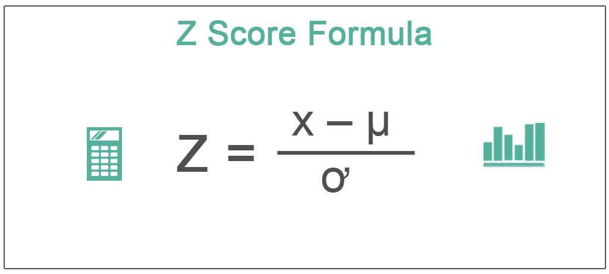

Algorithmic trading, or algo trading, has fundamentally reshaped financial markets by utilizing sophisticated technology to execute trades with unmatched precision and speed. This approach relies heavily on the capacity to analyze complex data sets effectively, enabling traders to make informed decisions in real-time. One of the pivotal tools that has emerged in this context is the S-Score, which quantifies investor sentiment using data extracted from social media platforms. By assessing public sentiment regarding companies, stocks, and other financial instruments, the S-Score offers a nuanced perspective that can significantly influence trading strategies. This article will investigate how the S-Score measurement functions, its role in algorithmic trading, and the broader impact it has on market dynamics. For traders seeking a competitive edge, grasping the intricate workings of the S-Score can lead to more data-driven and strategic decision-making processes.

## Table of Contents

## What Is an S-Score?

The S-Score is a metric that quantifies investor sentiment by analyzing data from social media platforms. It serves as a numerical representation of public opinion concerning various financial instruments, including companies, stocks, exchange-traded funds (ETFs), sectors, and indices. This score is particularly valuable in providing insights into market analysis and aiding both investors and analysts in making informed decisions.

Developed collaboratively by NYSE Technologies and Social Market Analytics (SMA), the S-Score helps capture and quantify sentiment trends from vast amounts of social media data. In a typical social media ecosystem, discussions related to financial markets often reflect collective investor sentiment, which can influence and precede actual market movements. Extracting structured sentiment data from these discussions offers analysts an edge in anticipating market trends.

The methodology behind the S-Score involves capturing data from social platforms, with a particular focus on Twitter due to its immediate nature and widespread usage in finance-related communications. By utilizing sophisticated algorithms, which may include natural language processing (NLP) and [machine learning](/wiki/machine-learning) techniques, relevant data is filtered, processed, and transformed into actionable sentiment indicators.

In practice, an S-Score ranges from negative to positive values. A high positive score indicates bullish sentiment, suggesting potential price increases, whereas a high negative score signals bearish sentiment, indicating possible price declines. Frequently, changes in the S-Score are associated with forthcoming stock price movements, making it a potent tool for traders who seek to capitalize on sentiment-driven market dynamics.

The impact of the S-Score is not just theoretical. Empirical studies have demonstrated correlations between S-Scores and stock price movements. For example, stocks that exhibit significantly high positive S-Scores often show superior performance relative to market benchmarks. These findings underscore the potential for the S-Score to serve as a critical component of algorithmic trading strategies, where real-time sentiment analysis is integrated to optimize transaction decisions. Consequently, the S-Score is pivotal in enhancing the predictive accuracy of algorithmic models in the financial market landscape.

## Understanding S-Scores

The S-Score, introduced in 2013, offers valuable insights into market sentiment by employing a distinctive set of metrics referred to as S-Factors. These S-Factors are integral in quantifying and understanding investor sentiment, as they are derived from the analysis of social media data. Specifically, the metrics assess sentiment based on three key components: [volume](/wiki/volume-trading-strategy), change, and [dispersion](/wiki/dispersion-trading) of social media comments related to specific financial assets such as companies, stocks, or indices.

1. **Volume of Comments**: This metric captures the number of social media posts mentioning a particular financial asset. A sudden increase in volume could indicate heightened investor interest or concern, which may influence future price movements. 

2. **Change in Sentiment**: This component measures the shift in sentiment over time. By analyzing how sentiment evolves, traders can identify emerging trends or reversals in market mood. For example, a transition from negative to positive sentiment might signal an impending upward trend in the asset's price.

3. **Dispersion of Sentiment**: Dispersion refers to the variability of sentiment across different posts. A high dispersion indicates a wide range of opinions, reflecting market uncertainty or controversy. Conversely, low dispersion suggests a consensus among investors, which might predict more reliable market patterns.

The proprietary system underpinning the S-Score effectively filters out irrelevant data, or "noise," ensuring that only pertinent information is considered when calculating the score. This focus on relevant data is crucial for generating insights that are meaningful and actionable for traders. By doing so, the system provides a refined view of investor sentiment, free from extraneous content that might skew analysis.

The S-Score is specifically tailored for applications in the financial sector. It is particularly beneficial for trading firms, hedge funds, and portfolio managers, who require precise and timely data to inform their strategies. By integrating the S-Score into trading models, these professionals can enhance their decision-making processes, optimize their portfolios, and potentially improve investment returns.

In summary, the S-Score leverages advanced analytics to distill complex social media data into actionable sentiment signals, offering a sophisticated tool for market analysis that supports trading activities across various financial sectors.

## S-Score Measurement

The S-Score measurement process involves a structured method of extracting, evaluating, and computing sentiment data derived primarily from social media platforms. This process begins with the collection of real-time data, facilitated by Social Market Analytics (SMA) through the use of Application Programming Interfaces (APIs). Platforms such as Twitter are pivotal in this data gathering stage, providing continuous streams of tweets that can be analyzed for sentiment.

To ensure the data's relevance to financial markets, each tweet undergoes evaluation to assess its financial significance. This involves filtering out irrelevant content and focusing on tweets that contain market-moving information. The relevance assessment might involve keyword analysis and context evaluation, ensuring that only pertinent data is considered for sentiment analysis.

The sentiment evaluation process involves analyzing the selected tweets to identify expressed sentiments. This is commonly achieved using natural language processing (NLP) techniques, which parse the text to determine the sentiment polarity—positive, neutral, or negative. Each tweet is assigned a "sentiment signature," a numerical representation indicating the strength and polarity of the sentiment.

The calculation of the S-Score aggregates these sentiment signatures across a specified timeframe or set of tweets. The resulting score is a summary measure reflecting the overall market sentiment for a particular stock, sector, or index. Scores generally fall into categories: neutral (around zero), positive (above a specified positive threshold, e.g., +2), or negative (below a specified negative threshold, e.g., -2). 

This final categorization into neutral, positive, or negative offers an actionable sentiment indicator. Traders can incorporate these insights as part of their decision-making processes, leveraging the S-Score to anticipate market movements and inform their trading strategies. The S-Score’s reliability stems from its methodological rigor in data extraction and sentiment analysis.

## S-Score Usage in Algorithmic Trading

Algorithmic traders utilize the S-Score to enhance trading strategies by predicting stock movements based on social media sentiment analysis. The S-Score, which quantifies investor sentiment, offers quantitative guidelines for assessing market positions. An S-Score above +2 is interpreted as positive sentiment, suggesting potential stock growth. Conversely, an S-Score below -2 signals negative sentiment, indicating potential decline in stock value. These thresholds help traders decide when to enter or [exit](/wiki/exit-strategy) positions.

Empirical studies have demonstrated that stocks with elevated S-Scores can outperform traditional market benchmarks such as the S&P 500 over designated periods. This outperformance is attributed to the S-Score's ability to capture market sentiment shifts swiftly, granting algorithmic traders the foresight to make informed decisions ahead of broader market reactions.

Beyond traditional equities, the S-Score extends its applicability to the [cryptocurrency](/wiki/cryptocurrency) market. The often volatile and sentiment-driven nature of cryptocurrencies makes them a suitable candidate for sentiment analysis tools like the S-Score. By evaluating investor sentiment in the context of digital assets, traders can anticipate market fluctuations and capitalize on emerging trends within the cryptocurrency space. 

The integration of the S-Score in trading algorithms exemplifies how sentiment analysis can provide actionable insights, improving the predictive capabilities of [algorithmic trading](/wiki/algorithmic-trading) strategies.

## Conclusion

The S-Score represents an innovative approach in measuring market sentiment through digital means. By harnessing the vast amounts of data produced on social media platforms, it offers a quantifiable gauge of public sentiment that is crucial for making informed trading decisions. Incorporating social media sentiment into trading strategies can significantly enhance decision-making and investment outcomes. This capability allows traders to account for the real-time emotional and psychological factors influencing market movements, thereby refining their strategies and improving performance.

As algorithmic trading continues to evolve, tools like the S-Score will play a pivotal role in shaping financial market strategies. The dynamic nature of social media sentiment feeds directly into the adaptive strategies necessary for successful algo trading, making it an indispensable tool for interpreting and reacting to market fluctuations. This integration leads to more robust strategies capable of navigating the complexities of modern financial markets.

Investors and traders are encouraged to explore the incorporation of S-Scores into their trading algorithms for improved performance. By doing so, they can leverage a deeper understanding of market sentiments that complements traditional data sources, potentially leading to enhanced profitability and reduced market risks. Incorporating such advanced sentiment analysis tools can be a decisive [factor](/wiki/factor-investing) in maintaining competitiveness and achieving superior investment outcomes in today's fast-paced trading environment.

## References & Further Reading

[1]: ["Advances in Financial Machine Learning"](https://www.amazon.com/Advances-Financial-Machine-Learning-Marcos/dp/1119482089) by Marcos Lopez de Prado

[2]: ["Sentiment Analysis in Finance"](https://numerous.ai/blog/sentiment-analysis-finance) by Daniel M. May, Christian Schitter, and Wolfgang Tschiderer, provides insights into how sentiment analysis is used in financial markets.

[3]: ["Machine Learning for Algorithmic Trading"](https://github.com/stefan-jansen/machine-learning-for-trading) by Stefan Jansen

[4]: ["Quantitative Trading: How to Build Your Own Algorithmic Trading Business"](https://www.amazon.com/Quantitative-Trading-Build-Algorithmic-Business/dp/1119800064) by Ernest P. Chan

[5]: ["Evidence-Based Technical Analysis: Applying the Scientific Method and Statistical Inference to Trading Signals"](https://www.amazon.com/Evidence-Based-Technical-Analysis-Scientific-Statistical/dp/0470008741) by David Aronson

[6]: Zheludev, I., Smith, R., & Aste, T. (2014).["When Can Social Media Lead Financial Markets?"](https://www.nature.com/articles/srep04213) The article explores the relationship between Twitter activities and stock prices, providing relevant data for understanding sentiment-based market movements.