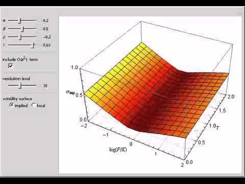

## Table of Contents

## What is the SABR volatility model?

The SABR volatility model is a financial model used to understand how the prices of options change over time. It stands for Stochastic Alpha Beta Rho. This model helps traders and investors predict how much the price of an option might go up or down. It is especially useful for options that are based on interest rates, currencies, or commodities. The SABR model takes into account that volatility, or how much prices can change, is not constant but can change over time.

The SABR model uses four main parts to work out its predictions. These are called Alpha, Beta, Rho, and the volatility of volatility. Alpha is the initial level of volatility, Beta shows how the option's price relates to the underlying asset's price, Rho measures how the volatility of the option and the underlying asset move together, and the volatility of volatility shows how much the volatility itself can change. By using these parts, the SABR model can give a more accurate picture of how an option's price might behave in the future, which helps in making better trading decisions.

## Who developed the SABR model and when was it introduced?

The SABR model was developed by a group of researchers at the investment bank Salomon Brothers. The main people behind it were Patrick Hagan, Deep Kumar, Andrew Lesniewski, and Diana Woodward. They came up with the model in the late 1990s, and it was first shared with the public in a paper published in 2002.

The model was created to help traders and investors better understand and predict the behavior of options, especially those linked to interest rates, currencies, and commodities. Before the SABR model, simpler models were used, but they did not account for the fact that volatility can change over time. The SABR model introduced a new way of looking at volatility, making it a valuable tool in the world of finance.

## What does SABR stand for and what are its key components?

SABR stands for Stochastic Alpha Beta Rho. It's a model used in finance to help predict how the prices of options might change. Options are agreements that give people the right to buy or sell something at a certain price. The SABR model is really helpful because it takes into account that the amount prices can change, which we call volatility, is not always the same but can change over time.

The SABR model has four main parts that it uses to make its predictions. The first part is called Alpha, which is the starting level of volatility. The second part is Beta, which shows how the option's price is connected to the price of the thing the option is based on. The third part is Rho, which looks at how the volatility of the option and the thing it's based on move together. The last part is the volatility of volatility, which means how much the volatility itself can change. By using these four parts, the SABR model can give a better idea of how an option's price might behave in the future, helping people make smarter choices in trading and investing.

## How does the SABR model differ from the Black-Scholes model?

The SABR model and the Black-Scholes model are both used to predict how the prices of options might change, but they do it in different ways. The Black-Scholes model is older and simpler. It assumes that the volatility, which is how much prices can change, stays the same over time. This model is good for options that are close to the current price of the thing they're based on, like stocks. But it doesn't work as well for options that are far away from the current price, or for options based on things like interest rates or currencies.

On the other hand, the SABR model is more complex and newer. It takes into account that volatility can change over time. This makes it better at predicting the prices of options that are far away from the current price or based on things like interest rates, currencies, or commodities. The SABR model uses four main parts—Alpha, Beta, Rho, and the volatility of volatility—to make its predictions. This makes it a more flexible and accurate tool for traders and investors who need to understand how options might behave in different situations.

## What types of financial instruments is the SABR model typically used for?

The SABR model is mainly used for options that are based on interest rates, currencies, and commodities. These are different from options on stocks, which are what the older Black-Scholes model is usually used for. Interest rate options are important for banks and big investors who need to manage how much they might lose or gain from changes in interest rates. Currency options are used by people and companies that do business in different countries and need to protect themselves from changes in exchange rates. Commodity options help farmers, miners, and other producers manage the risk of price changes in things like oil, gold, or wheat.

The SABR model is good at handling options that are far away from the current price of the thing they're based on. This is called being "out-of-the-money" or "deep out-of-the-money." These kinds of options can be tricky to predict with simpler models like Black-Scholes because their prices can change a lot. The SABR model's ability to account for changing volatility helps traders and investors get a better understanding of how these options might behave. This makes it a valuable tool for managing risk and making smarter trading decisions in markets where prices can be very unpredictable.

## Can you explain the mathematical formulation of the SABR model?

The SABR model uses a set of equations to predict how the prices of options might change. It's based on two main things: the price of the thing the option is based on, which we call the underlying asset, and the volatility, which is how much the price can change. The model says that the price of the underlying asset changes over time in a way that's influenced by randomness, and the volatility also changes randomly. The key equation that describes how the price of the underlying asset changes is called a stochastic differential equation. It looks like this: dF = αF^β dW1, where F is the forward price of the asset, α is the initial volatility, β is a parameter that shows how the option's price relates to the asset's price, and dW1 is a random change.

The second part of the SABR model deals with how the volatility itself changes. This is also described by a stochastic differential equation: dα = να dW2, where α is the volatility, ν is the volatility of volatility, and dW2 is another random change. The model also includes a parameter called ρ, which shows how the random changes in the price of the asset (dW1) and the volatility (dW2) are related to each other. By using these equations, the SABR model can predict how the price of an option might change over time, taking into account that both the price of the asset and its volatility can change randomly.

To make the model easier to use, there's a formula that gives an approximate price for an option. This formula is called the SABR implied volatility formula, and it looks like this: σ = (α / (F_K)^(1-β)) * [1 + ( (1-β)^2 / 24) * (ln(F/K))^2 + ( (1-β)^4 / 1920) * (ln(F/K))^4 ] * [1 + ( (1-β)^2 / 24) * α^2 / (F_K)^(2-2β) + (1/4) * ν^2 * t * (F_K)^(2β-2) + (2-3ρ^2) / 24 * ν^2 * t], where σ is the implied volatility, F is the forward price, K is the strike price, t is the time to expiration, and F_K is the average of F and K. This formula helps traders quickly estimate how much an option might be worth without having to solve the more complex stochastic differential equations directly.

## What are the parameters of the SABR model and how are they calibrated?

The SABR model uses four main parameters to predict how option prices might change: Alpha, Beta, Rho, and the volatility of volatility. Alpha is the starting level of volatility, which shows how much the price of the underlying asset can change at the beginning. Beta tells us how the option's price is connected to the price of the underlying asset. If Beta is 1, the option's price moves exactly like the asset's price. If it's less than 1, the option's price moves less than the asset's price. Rho shows how the random changes in the asset's price and its volatility are related to each other. The volatility of volatility is how much the volatility itself can change over time.

To make the SABR model work well, these parameters need to be set correctly, which is called calibration. Calibration means using real market data to find the best values for Alpha, Beta, Rho, and the volatility of volatility. Traders often start with some guesses for these values and then adjust them to make the model's predictions match the actual prices of options in the market. They might use special computer programs to do this, which try different combinations of the parameters until they find the ones that give the best fit. This process can be tricky because the market is always changing, so the parameters might need to be updated regularly to keep the model accurate.

## How does the SABR model handle volatility smiles and skews?

The SABR model is really good at dealing with something called volatility smiles and skews. Volatility smiles and skews are patterns you see when you look at the prices of options that are far away from the current price of the thing they're based on. A smile means that the further away an option's price is from the current price, the more it costs, making a smile shape on a graph. A skew means the prices go up more on one side than the other, making a slanted line. The SABR model can predict these patterns better than older models like Black-Scholes because it understands that volatility, or how much prices can change, isn't always the same and can change over time.

The SABR model uses its four main parts—Alpha, Beta, Rho, and the volatility of volatility—to handle these patterns. Alpha is the starting level of volatility, Beta shows how the option's price relates to the asset's price, Rho looks at how the volatility of the option and the asset move together, and the volatility of volatility shows how much the volatility itself can change. By adjusting these parts, the SABR model can fit the real market data better, which means it can predict the prices of options that show volatility smiles and skews more accurately. This makes it a very useful tool for traders and investors who need to understand how options might behave in different situations.

## What are the advantages of using the SABR model over other volatility models?

The SABR model has some big advantages over other volatility models. One of the main ones is that it can handle changes in volatility over time. Unlike older models like Black-Scholes, which assume that volatility stays the same, the SABR model understands that volatility can go up and down. This makes it much better at predicting the prices of options that are far away from the current price of the thing they're based on, like interest rates, currencies, or commodities. These options can be tricky because their prices can change a lot, and the SABR model's ability to account for changing volatility helps traders and investors get a better understanding of how these options might behave.

Another advantage of the SABR model is that it can fit the real market data very well, especially when it comes to patterns like volatility smiles and skews. A volatility smile is when the further away an option's price is from the current price, the more it costs, making a smile shape on a graph. A skew is when the prices go up more on one side than the other, making a slanted line. The SABR model uses its four main parts—Alpha, Beta, Rho, and the volatility of volatility—to match these patterns closely. This means it can give more accurate predictions about how options might change in price, which is really helpful for people who need to manage risk and make smart trading decisions in markets where prices can be very unpredictable.

## What are some limitations or criticisms of the SABR model?

The SABR model is really good at predicting how option prices might change, but it has some limitations. One big problem is that it can be hard to use because it needs a lot of math and computer power to make it work right. Traders have to guess the right values for the model's parts, like Alpha, Beta, Rho, and the volatility of volatility, and then keep changing these guesses to fit the real market data. This process, called calibration, can take a long time and might not always be perfect, especially if the market changes quickly.

Another criticism of the SABR model is that it might not be great at predicting how options will behave in very unusual market situations. The model works well for normal times, but if something big and unexpected happens, like a financial crisis, the SABR model might not be able to keep up. This is because it relies on past data to make predictions, and big surprises can make past data less useful. So, while the SABR model is a powerful tool, it's not perfect and traders need to be careful about when and how they use it.

## How can the SABR model be implemented in practice for pricing options?

To use the SABR model for pricing options in real life, traders start by gathering data about the current market, like the price of the thing the option is based on and how much its price can change. Then, they need to guess the right values for the SABR model's four parts: Alpha, Beta, Rho, and the volatility of volatility. These guesses are based on what they know about the market and how it has behaved in the past. After making these guesses, traders use special computer programs to adjust the values until the model's predictions match the real prices of options in the market. This process, called calibration, helps make sure the model is as accurate as possible.

Once the SABR model is set up correctly, traders can use it to figure out how much an option might be worth at different times in the future. They can do this by plugging in the calibrated values and other details about the option, like how long it lasts and what price it can be bought or sold at. The model then gives them a number that shows the option's price, which helps them decide whether to buy or sell the option. Because the SABR model can handle changes in how much prices can change over time, it's especially useful for options that are far away from the current price or based on things like interest rates, currencies, or commodities.

## What are some advanced extensions or modifications to the basic SABR model?

Some people have come up with new ideas to make the SABR model even better. One idea is called the shifted SABR model. This version adds a new part to the model that helps it work better with options that have very low or even negative prices, like some interest rate options. Another idea is the rough SABR model, which looks at how the volatility changes in a more detailed way. It says that the changes in volatility happen in a bumpy, not smooth, way, which can make the model's predictions more accurate for certain types of options.

Another extension is the multi-factor SABR model, which lets the model use more than one thing to predict how option prices might change. Instead of just looking at one kind of volatility, this version can look at different kinds, like short-term and long-term volatility. This can help the model fit the real market data even better, especially for complex options. These advanced versions of the SABR model are used by traders and investors who need very precise predictions to make smart decisions in the market.

## What is the SABR Model and how can it be understood?

The SABR model was created to provide a more accurate representation of the implied volatility smile, a phenomenon that the traditional Black-Scholes model struggles to accommodate. In the Black-Scholes framework, volatility is assumed to be constant, which often does not align with observed market data where volatility varies with strike prices and maturities. The SABR model addresses these discrepancies by incorporating stochastic elements in both the underlying asset prices and their volatility.

At the core of the SABR model are stochastic differential equations that define the evolution of asset prices and volatility. The key parameters governing this model are alpha, beta, rho, and vol of vol, each contributing uniquely to its formulation.

1. **Alpha ($\alpha$)**: This parameter represents the initial level of volatility. It serves as a baseline that influences the general structure of volatility over time. In the SABR model, alpha is part of the stochastic process, which is given by:
$$
   d\sigma_t = \nu \sigma_t^{\beta} dW_t

$$

   where $\sigma_t$ is the volatility, $\nu$ (vol of vol) is the volatility of volatility, and $dW_t$ is a Brownian motion.

2. **Beta ($\beta$)**: Beta dictates the elasticity of the asset price process, determining the degree to which the underlying asset’s volatility depends on its price level. Beta ranges between 0 and 1, with 1 indicating a log-normal model as in Black-Scholes, and 0 indicating a normal model. The model for the price process is:
$$
   dF_t = \sigma_t F_t^{\beta} dZ_t

$$

   where $F_t$ is the forward price, and $dZ_t$ is another Brownian motion correlated with $dW_t$.

3. **Rho ($\rho$)**: This parameter captures the correlation between the processes governing the asset price and its volatility. A positive rho suggests that when the asset price increases, volatility tends to increase as well, and vice versa. Rho is integral to the dynamics of the SABR model, influencing how volatility changes in response to shifts in the asset price.

4. **Vol of Vol ($\nu$)**: Also known as the volatility of volatility, this parameter signifies how much the implied volatility can fluctuate over time. It is a critical factor in determining the steepness and curvature of the volatility smile, allowing the model to replicate market-observed volatility surfaces more accurately.

Together, these parameters enable the SABR model to capture complex market behaviors and provide traders with a more responsive tool for pricing derivatives and managing risk. The inclusion of stochastic processes for both price and [volatility](/wiki/volatility-trading-strategies) marks a significant advancement over deterministic models, allowing for a nuanced representation of market phenomena.

## References & Further Reading

[1]: Hagan, P. S., Kumar, D., Lesniewski, A. S., & Woodward, D. E. (2002). ["Managing Smile Risk."](https://www.researchgate.net/publication/235622441_Managing_Smile_Risk) Wilmott, 84-108.

[2]: Andreasen, J., & Huge, B. (2011). ["ZABR – Expansions for the Masses."](https://papers.ssrn.com/sol3/papers.cfm?abstract_id=1980726) Risk, 24(2), 78-83.

[3]: Rebonato, R. (2004). ["Volatility and Correlation: The Perfect Hedger and the FOX."](https://onlinelibrary.wiley.com/doi/book/10.1002/9781118673539) Wiley.

[4]: Gatheral, J. (2006). ["The Volatility Surface: A Practitioner's Guide."](https://onlinelibrary.wiley.com/doi/book/10.1002/9781119202073) Wiley.

[5]: West, G. (2005). ["Calibration of the SABR Model in Illiquid Markets."](https://www.tandfonline.com/doi/full/10.1080/13504860500148672) Applied Mathematical Finance, 12(4), 371-385. 

[6]: ["SABR and SABR LIBOR Market Models in Practice."](https://www.amazon.com/SABR-LIBOR-Market-Models-Practice/dp/1137378638) In: Antonov, A., Konikov, M., & Spector, M. (2015). Modern SABR Analytics. Springer, London.

[7]: ["Stochastic Volatility Modeling."](https://en.wikipedia.org/wiki/Stochastic_volatility) by Lorenzo Bergomi

[8]: ["Arbitrage Theory in Continuous Time."](https://link.springer.com/content/pdf/10.1007/978-3-540-31299-4_8.pdf) by Tomas Björk

