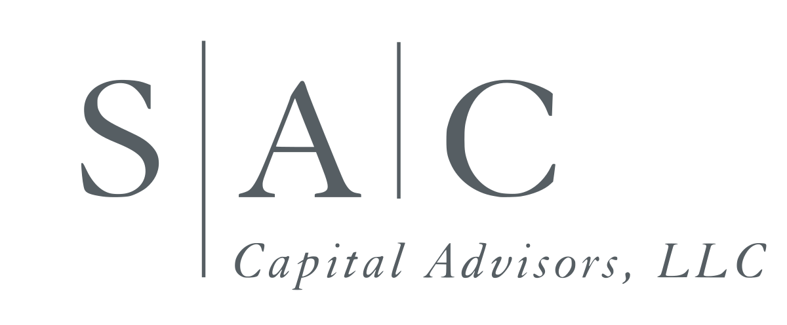

## Table of Contents

## What is SAC Capital Advisors?

SAC Capital Advisors was a big investment company started by Steven A. Cohen in 1992. It was known for making a lot of money by trading stocks and other investments. The company had many people working for it and was very successful for a long time. It was based in Stamford, Connecticut, and had offices in other places too.

In 2013, SAC Capital Advisors got into big trouble because some of its workers were found to be cheating by using secret information to make trades. This is called insider trading and it's against the law. The company had to pay a huge fine of $1.8 billion and had to stop being a hedge fund. After that, Steven Cohen started a new company called Point72 Asset Management, which focuses on managing his own money and some money from other people.

## Who founded SAC Capital Advisors and when was it established?

SAC Capital Advisors was founded by Steven A. Cohen. He started the company in 1992. Steven A. Cohen is a well-known investor who wanted to create a successful investment firm.

The company was based in Stamford, Connecticut. It grew to be a very big and successful hedge fund. Many people worked there, and it made a lot of money by trading stocks and other investments.

## What type of investment firm is SAC Capital Advisors?

SAC Capital Advisors is a type of investment firm called a hedge fund. A hedge fund is a company that manages money for rich people and big groups. They try to make more money by buying and selling different things like stocks, bonds, and other investments. SAC Capital Advisors was known for being really good at this and made a lot of money.

The company was started by Steven A. Cohen in 1992. It was based in Stamford, Connecticut. SAC Capital Advisors grew to be a very big and successful hedge fund. Many people worked there, and it was famous for how well it did with its investments. But in 2013, the company got into big trouble because some workers were caught using secret information to make trades, which is against the law.

## What is the history of SAC Capital Advisors?

SAC Capital Advisors was started by Steven A. Cohen in 1992. It was a hedge fund, which is a type of company that manages money for rich people and big groups. The company was based in Stamford, Connecticut. SAC Capital Advisors grew to be a very big and successful hedge fund. Many people worked there, and it made a lot of money by buying and selling different things like stocks and bonds. The company was known for being really good at making money from its investments.

In 2013, SAC Capital Advisors got into big trouble. Some of its workers were caught using secret information to make trades, which is called insider trading and is against the law. The company had to pay a huge fine of $1.8 billion. After that, SAC Capital Advisors had to stop being a hedge fund. Steven Cohen then started a new company called Point72 Asset Management. This new company focuses on managing his own money and some money from other people.

## What were the major investment strategies employed by SAC Capital Advisors?

SAC Capital Advisors used different ways to make money from their investments. One big way was by trading stocks. They would buy and sell stocks quickly to make money from small changes in their prices. They also used something called "long/short equity" strategy. This means they would buy stocks they thought would go up in price (long) and sell stocks they thought would go down in price (short). This helped them make money no matter which way the market was going.

Another important strategy was using a lot of research and information to make smart choices. SAC Capital Advisors had many people working to find out everything they could about companies and markets. They used this information to decide which stocks to buy or sell. Sometimes, though, some workers used secret information they weren't supposed to have, which got the company into big trouble.

Overall, SAC Capital Advisors was known for being very good at making money from their investments. They used smart strategies and a lot of research to do well. But their success came to an end when they were caught using insider trading, which is against the law.

## What were the peak assets under management for SAC Capital Advisors?

SAC Capital Advisors had a lot of money to manage at its peak. They had about $14 billion in assets under management. This means they were in charge of investing a huge amount of money for their clients.

The company was very successful and made a lot of money for a long time. They used smart strategies and a lot of research to do well. But in 2013, they got into big trouble because some workers used secret information to make trades, which is against the law.

## What led to the legal troubles faced by SAC Capital Advisors?

SAC Capital Advisors got into big trouble because some of its workers were caught using secret information to make trades. This is called insider trading, and it's against the law. The workers used information that they weren't supposed to have to buy and sell stocks. This gave them an unfair advantage and helped them make a lot of money.

In 2013, the government found out about this and took action. SAC Capital Advisors had to pay a huge fine of $1.8 billion. After that, the company had to stop being a hedge fund. This was a big change for the company, and it ended up starting over as Point72 Asset Management, which focuses on managing Steven Cohen's own money and some money from other people.

## What were the outcomes of the legal actions against SAC Capital Advisors?

SAC Capital Advisors got into big trouble because some of its workers used secret information to make trades. This is called insider trading and it's against the law. The government found out about this and made the company pay a huge fine of $1.8 billion. This was one of the biggest fines ever for a company caught doing insider trading.

After paying the fine, SAC Capital Advisors had to stop being a hedge fund. This meant they couldn't manage money for other people anymore. Steven Cohen, who started the company, then created a new company called Point72 Asset Management. This new company focuses on managing his own money and some money from other people. The legal troubles changed SAC Capital Advisors a lot, but Steven Cohen was able to keep working in the investment world with his new company.

## How did the legal issues impact SAC Capital Advisors' operations?

The legal issues had a big impact on SAC Capital Advisors. The company had to pay a huge fine of $1.8 billion because some workers were caught using secret information to make trades. This is called insider trading and it's against the law. The fine was one of the biggest ever for a company caught doing this. Because of the fine, SAC Capital Advisors had to stop being a hedge fund. This meant they couldn't manage money for other people anymore.

After the legal troubles, Steven Cohen, who started SAC Capital Advisors, created a new company called Point72 Asset Management. This new company focuses on managing his own money and some money from other people. The legal issues changed SAC Capital Advisors a lot, but Steven Cohen was able to keep working in the investment world with his new company. The end of SAC Capital Advisors as a hedge fund was a big change, but it allowed Steven Cohen to start fresh with Point72.

## What is the current status of SAC Capital Advisors?

SAC Capital Advisors is no longer operating as a hedge fund. The company got into big trouble in 2013 because some workers used secret information to make trades, which is against the law. This is called insider trading. The company had to pay a huge fine of $1.8 billion and was forced to stop managing money for other people.

After the legal issues, Steven Cohen, who started SAC Capital Advisors, created a new company called Point72 Asset Management. This new company focuses on managing his own money and some money from other people. Even though SAC Capital Advisors doesn't exist as a hedge fund anymore, Steven Cohen was able to keep working in the investment world with Point72.

## How did SAC Capital Advisors influence the hedge fund industry?

SAC Capital Advisors had a big impact on the hedge fund industry. It was started by Steven Cohen in 1992 and became very successful. The company was known for making a lot of money by trading stocks and using smart strategies. They used a lot of research and information to make good choices about which stocks to buy or sell. This made them very good at what they did and many other hedge funds looked up to them. SAC Capital Advisors showed that you could make a lot of money in the hedge fund world by being smart and quick.

However, SAC Capital Advisors also had a big impact because of its legal troubles. In 2013, the company got into trouble because some workers used secret information to make trades, which is against the law. This is called insider trading. The company had to pay a huge fine of $1.8 billion and had to stop being a hedge fund. This showed the whole industry that even very successful companies could get into big trouble if they broke the rules. It made other hedge funds more careful about how they did their work.

## What lessons can be learned from the rise and fall of SAC Capital Advisors?

The story of SAC Capital Advisors shows that being smart and quick can make you very successful in the investment world. Steven Cohen started the company in 1992, and it grew to manage $14 billion in assets. They made a lot of money by trading stocks and using a lot of research to make good choices. Many other hedge funds looked up to SAC Capital Advisors and tried to copy their strategies. This shows that hard work and smart thinking can lead to big success.

But the story also teaches us that breaking the rules can lead to big trouble. In 2013, SAC Capital Advisors got caught using secret information to make trades, which is against the law. This is called insider trading. The company had to pay a huge fine of $1.8 billion and had to stop being a hedge fund. This shows that even very successful companies can fall hard if they don't follow the rules. It's important to always do things the right way, even when you're doing well.

## References & Further Reading

[1]: Kolhatkar, S. (2017). ["Black Edge: Inside Information, Dirty Money, and the Quest to Bring Down the Most Wanted Man on Wall Street."](https://www.amazon.com/Black-Edge-Inside-Information-Wanted/dp/0812995805) Random House.

[2]: Mallaby, S. (2010). ["More Money Than God: Hedge Funds and the Making of a New Elite."](https://www.amazon.com/More-Money-Than-God-Relations/dp/0143119419) Penguin Press.

[3]: Lewis, M. (2014). ["Flash Boys: A Wall Street Revolt."](https://en.wikipedia.org/wiki/Flash_Boys) W. W. Norton & Company.

[4]: Patterson, S. (2012). ["Dark Pools: The Rise of the Machine Traders and the Rigging of the U.S. Stock Market."](https://www.amazon.com/Dark-Pools-Machine-Traders-Rigging/dp/0307887189) Crown Business.

[5]: The United States Department of Justice. ["United States v. SAC Capital Advisors, L.P."](https://www.justice.gov/) Press Release, November 4, 2013.