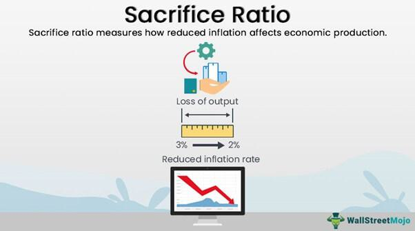

In today's fast-paced economic environment, understanding the interplay between economic policies and market dynamics is crucial. The sacrifice ratio is a key concept that serves this purpose by quantifying the economic cost of reducing inflation. It measures how much output is lost or unemployment rises for every percentage point decrease in inflation. This concept is vital for those involved in the formulation of economic policies, as it highlights the trade-offs between achieving price stability and maintaining economic growth.

The implications of the sacrifice ratio for economic policy are significant. Policymakers must carefully evaluate their strategies, weighing the immediate economic disruptions against the potential for long-term stability. By understanding this ratio, policymakers and economists can better assess the potential impacts of their decisions and craft policies that achieve a balance between controlling inflation and fostering economic growth.



Algorithmic trading, another pivotal element of modern financial markets, further influences economic outcomes. This technology-driven approach uses complex algorithms to make rapid trading decisions. It affects market dynamics by increasing the speed and volume of trades, potentially impacting market volatility and liquidity. Its rise necessitates a re-evaluation of traditional economic indicators like the sacrifice ratio, as these trading algorithms can create feedback loops that alter market behavior significantly.

This discussion on the sacrifice ratio and algorithmic trading is particularly relevant for policymakers, economists, and traders. By understanding the nuances of these concepts, stakeholders can better navigate the complex landscape of economic stability and growth. As both the sacrifice ratio and algorithmic trading continue to evolve, their increasing relevance in economic discourse ensures they remain crucial considerations in future economic strategies.

## Table of Contents

## Understanding the Sacrifice Ratio

The sacrifice ratio is an essential concept in macroeconomics, used to gauge the cost involved in reducing inflation. It quantifies the relationship between the reduction in inflation and the resultant loss in a country's output or increase in unemployment. In essence, it is a measure of the trade-offs that policymakers face when attempting to ensure long-term price stability.

Mathematically, the sacrifice ratio can be expressed as follows:

$$
\text{Sacrifice Ratio} = \frac{\text{Cumulative loss in GDP (\%)}}{\text{Reduction in inflation (\%)}}
$$

This ratio provides policymakers with a tangible metric to estimate the short-term economic losses—be it a drop in gross domestic product (GDP) or a rise in unemployment—that might be incurred while pursuing the goal of lower inflation. Understanding and calculating the sacrifice ratio is crucial for shaping effective monetary policy, as it allows for the anticipation of economic disruptions resulting from efforts to reduce inflation.

The origins of the sacrifice ratio concept are rooted in the Phillips Curve, a theoretical economic model that illustrates the inverse relationship between the rate of inflation and the rate of unemployment within an economy. The traditional view suggested that reducing inflation would typically lead to higher unemployment and lower output due to reduced economic activity. This relation implies that any policy aimed at controlling inflation could impose significant costs on the economy.

In practical terms, the sacrifice ratio influences central bank policies, particularly those involving interest rates and open market operations. For instance, a high sacrifice ratio suggests that reducing inflation might lead to significant output or employment costs, making policymakers more cautious in their anti-inflation measures. Conversely, a lower sacrifice ratio indicates that inflation can be curbed with minimal economic disruption, permitting more aggressive inflation-targeting policies.

While the sacrifice ratio offers a framework to predict the economic consequences of disinflation, it is not without its limitations. Several factors, such as the adaptability of markets, the expectations of economic [agents](/wiki/agents), and the credibility of monetary authorities, can alter the relationship between inflation reduction and economic output. As a result, the sacrifice ratio may vary considerably between different countries and economic contexts, warranting a careful analysis tailored to specific economic conditions.

In configuring monetary policy, central banks consider the sacrifice ratio as one of several tools to balance their economic goals. Despite its utility, reliance solely on the sacrifice ratio can lead to suboptimal decisions if not contextualized within a broader economic assessment that includes other relevant indicators and variables.

## The Role of Economic Policy

Economic policies are pivotal in managing inflation and unemployment, directly impacting the sacrifice ratio. Developed as a tool to gauge the economic cost of reducing inflation, the sacrifice ratio considers the trade-offs between controlling inflation and maintaining economic growth. By examining fiscal and monetary approaches, we can better understand their influence on balancing inflation control and economic growth.

### Fiscal and Monetary Approaches

**Monetary Policy**: Central banks primarily use monetary policy to influence economic activity and inflation. The manipulation of interest rates and open market operations are the main tools. For instance, when a central bank raises interest rates to curtail inflation, borrowing costs increase, leading to reduced consumer spending and business investment. This typically results in slower economic growth or a rise in unemployment, factors directly tied to the sacrifice ratio. Conversely, lowering interest rates can stimulate the economy but may risk heightening inflation.

**Fiscal Policy**: Government fiscal policy, involving taxation and public spending, also significantly affects the sacrifice ratio, albeit in a slower and less direct manner than monetary policy. Expansionary fiscal policy—characterized by increased public spending or tax cuts—aims to boost economic growth but can exacerbate inflation if overused. Conversely, contractionary fiscal policies can cool inflation but might increase unemployment, heightening the sacrifice ratio's tangible costs.

### Influences on Inflation and Growth

The effectiveness of these policies in managing the sacrifice ratio depends on a nation’s specific economic conditions. For example, economies with high inflation and low growth may require stricter monetary tightening, while those facing the opposite scenario might benefit from expansionary fiscal policies. The interaction between these approaches decides the scale and impact of inflation control on economic growth.

### Case Studies

Analyses of historical policy implementations reveal varied results in managing the sacrifice ratio. A notable example is the Volcker disinflation in the United States during the early 1980s. Faced with persistently high inflation, Federal Reserve Chairman Paul Volcker increased interest rates sharply, prioritizing rapid inflation reduction. This policy successfully lowered inflation but at the cost of a deep recession, illustrating a high sacrifice ratio. However, the policy did pave the way for long-term economic stability.

In contrast, Japan’s experience in the 1990s with deflationary pressures and stagnation presents a different scenario. Despite aggressive monetary policies, including near-zero interest rates, inflation targets were challenging to meet, and economic growth remained sluggish. This case underscores the complexities in applying monetary policies to manage the sacrifice ratio effectively.

Through understanding these approaches and historical experiences, policymakers can better anticipate the potential outcomes and trade-offs of economic policies, aiming for an optimal balance between inflation control and economic growth.

## Algo Trading and Financial Markets

Algorithmic trading has revolutionized financial markets by using sophisticated algorithms to automate trading decisions, optimizing speed and efficiency. These algorithms analyze vast datasets at speeds unachievable by human traders, enabling them to execute trades based on predefined criteria such as timing, price, or complex mathematical models. The widespread adoption of [algorithmic trading](/wiki/algorithmic-trading) has significantly impacted the market's [volatility](/wiki/volatility-trading-strategies), efficiency, and overall economic environment.

Market volatility is often cited when discussing the effects of algorithmic trading. On one hand, algorithmic trading can increase volatility due to the accelerated speed at which trades are executed and the potential for large volumes of trades to occur simultaneously. This phenomenon is exemplified by events such as the "flash crash" of May 6, 2010, when the Dow Jones Industrial Average dropped nearly 1,000 points within minutes, only to recover a large portion of the loss shortly afterward. The rapid, algorithm-driven trades during such events can lead to swift price fluctuations, creating challenges for market stability.

On the flip side, algorithmic trading enhances market efficiency by facilitating [liquidity](/wiki/liquidity-risk-premium) and tightening bid-ask spreads. This occurs as algorithms continuously assess market conditions and adjust quotes in real time, allowing for a more accurate reflection of an asset's true market value. The increased liquidity provided by high-frequency traders (HFTs) often reduces transaction costs for all market participants, promoting smoother and more effective trading environments.

Algorithmic trading also interacts with economic policies, subtly influencing metrics like the sacrifice ratio. By affecting market efficiency and liquidity, algorithmic trading can indirectly impact unemployment and output levels, two key components of the sacrifice ratio. For instance, if algorithmic trading contributes to a more stable financial market, it might facilitate conditions conducive to economic growth with minimal inflationary pressures. Conversely, heightened volatility could lead to market instability, which might require central banks to adjust interest rates more aggressively, influencing the sacrifice ratio during inflation control efforts.

The interaction between algorithmic trading and economic policies continues to evolve. As central banks and regulatory bodies strive to maintain economic stability, they must consider the implications of algorithmic trading on policy outcomes. Balancing technological advancements with prudent economic governance remains a critical undertaking to harness the benefits of algorithmic trading while mitigating its potential risks.

## Exploring Case Studies

The sacrifice ratio serves as an essential tool in evaluating the trade-offs that policymakers make when addressing inflation through economic policy. Historical case studies provide a wealth of information about its practical application and effectiveness. A seminal episode in the consideration of the sacrifice ratio is the Volcker disinflation in the United States during the late 1970s and early 1980s.

Paul Volcker, the Chairman of the Federal Reserve from 1979 to 1987, implemented a policy aimed at curbing the persistently high inflation that characterized the U.S. economy in the 1970s. Inflation rates were soaring due to various factors, including oil price shocks and loose monetary policies in preceding years. Volcker adopted an aggressive monetary policy tightening to bring inflation under control, dramatically raising interest rates. This policy shift led to a severe recession, with the unemployment rate peaking at 10.8% in 1982, illustrating a high sacrifice ratio for reducing inflation, where significant output loss and job cuts were unavoidable to restore price stability.

The Volcker era policies showcased the application of the sacrifice ratio, which was visibly steep but deemed necessary. The outcome was a dramatic decline in the rate of inflation, which set the stage for subsequent economic recovery and long-term growth. This case serves as a benchmark for the capability and cost of monetary policy interventions in achieving price stability.

More recent examples can be found in the policies implemented by other central banks, such as the European Central Bank (ECB) during the Eurozone crisis. In the face of sovereign debt issues, deflationary pressures emerged, compelling the ECB to adopt unconventional monetary policy measures, such as quantitative easing. While aimed at stimulating growth and averting deflation, these measures illustrated a reverse sacrifice ratio scenario—a willingness to tolerate higher inflation to boost economic activity.

The challenges faced in Japan provide another scenario. The country has battled deflationary pressures for decades despite adopting aggressive monetary policies, including near-zero interest rates and substantial quantitative easing under the Abenomics framework. Here, the sacrifice ratio takes a different dimension where the struggle involves raising inflation rather than reducing it, emphasizing the complexity and variability.

These case studies emphasize the intricate nature of applying economic theories like the sacrifice ratio to real-world scenarios. Each example reflects distinct economic environments and policy landscapes, underscoring that while theoretical models are valuable, the practical application demands nuanced understanding and adaptability to unique conditions. They offer critical insights into the balance between controlling inflation and managing economic output and employment, highlighting the broader implications of monetary policy beyond textbook equations.

## Challenges and Criticisms

The sacrifice ratio, while a valuable tool in understanding the trade-off between inflation control and economic output, presents several challenges and criticisms that limit its applicability. One major challenge is economic variability, where fluctuations in economic conditions can lead to significant deviations in the sacrifice ratio's predictions. For instance, rapid changes in consumer preferences, technological advancements, or geopolitical events can alter the inflation-output dynamic, reducing the reliability of the sacrifice ratio as a guiding metric. These fluctuations can render the sacrifice ratio less effective in accurately forecasting the economic cost associated with reducing inflation.

Furthermore, external shocks—such as natural disasters, pandemics, or financial crises—can heavily influence the sacrifice ratio by introducing unforeseen variables into the economic landscape. When these events occur, the relationship between inflation and output can be disrupted, leading to discrepancies between predicted and actual outcomes. Policymakers relying solely on the sacrifice ratio may, therefore, find themselves unprepared for sudden economic shifts, highlighting the need for more adaptable and comprehensive economic models.

Critics of the traditional approach to the sacrifice ratio advocate for a more holistic framework that incorporates additional economic indicators alongside the sacrifice ratio. This could involve integrating alternative measures such as employment rates, consumer confidence indices, and wage growth [statistics](/wiki/bayesian-statistics), which may provide a more nuanced understanding of the economic environment. By considering a broader array of metrics, policymakers can gain better insights into the multifaceted nature of economic health and develop strategies that are more resilient to economic variability and external shocks.

Algorithmic trading, a prominent feature of modern financial markets, also faces limitations, particularly in volatile market conditions. While algorithmic trading can enhance market efficiency and liquidity, it can also exacerbate market volatility during turbulent periods. Algorithms, which are typically designed to operate based on historical data and predefined rules, may struggle to adapt in rapidly changing market environments. This can lead to feedback loops, where the algorithms amplify price movements, resulting in increased volatility.

In scenarios of extreme market stress, such as the "Flash Crash" of 2010, algorithmic trading contributed to abrupt and significant price declines, highlighting the potential risks associated with these systems. As a result, the interplay between algorithmic trading and economic policies, including those concerning the sacrifice ratio, necessitates careful oversight and potential regulatory adjustments.

The combination of economic variability, the potential for external shocks, and the unpredictable behavior of algorithmic trading in volatile markets calls for a more integrative and flexible approach to economic policy and trading strategies. Such an approach would enable a more robust response to fluctuations and uncertainties in both the economic environment and financial markets, ultimately contributing to more stable economic outcomes.

## The Future of Economic Policy and Trading

As technology progresses and economic dynamics shift, the application of the sacrifice ratio and the role of algorithmic trading are poised for significant evolution. Policymakers must adapt by incorporating new insights and methodologies into their frameworks to maintain effective regulation and economic stability.

The growing interdependence between data analytics, [machine learning](/wiki/machine-learning), and economic modeling represents a pivotal shift in how future economic policy and trading strategies are developed. These technologies enable the analysis of vast datasets with unprecedented speed and accuracy, providing deeper insights into market trends and economic indicators. For instance, machine learning algorithms can identify complex patterns within economic data that traditional analytical methods might miss, leading to more informed policy decisions.

Moreover, advanced modeling techniques allow for more accurate simulations of potential economic scenarios, which can be instrumental in policy formulation. These models can incorporate a range of variables, including unexpected economic shocks, to predict their impact on inflation and unemployment, thereby refining the sacrifice ratio's application.

In algorithmic trading, these technological advancements enhance the ability to optimize trades based on real-time data analysis. Algorithms can leverage machine learning models to predict short-term price movements more precisely, potentially leading to more stable markets. However, this also underscores the need for robust regulatory frameworks to mitigate risks associated with high-frequency trading, such as market manipulation or systemic failures.

Here's a simple example using Python to illustrate a basic implementation of a machine learning model that could be used for economic forecasting:

```python
import pandas as pd
from sklearn.model_selection import train_test_split
from sklearn.linear_model import LinearRegression
from sklearn.metrics import mean_squared_error

# Sample economic data
data = pd.read_csv('economic_data.csv')  # Hypothetical dataset
X = data[['unemployment_rate', 'inflation_rate']]  # Independent variables
y = data['gdp_growth']  # Dependent variable

# Splitting the data into training and testing sets
X_train, X_test, y_train, y_test = train_test_split(X, y, test_size=0.2, random_state=42)

# Create and train the model
model = LinearRegression()
model.fit(X_train, y_train)

# Predict and evaluate the model
predictions = model.predict(X_test)
mse = mean_squared_error(y_test, predictions)
print(f'Mean Squared Error: {mse}')
```

This code snippet demonstrates a basic linear regression model that forecasts GDP growth based on unemployment and inflation rates. While simplistic, it highlights the potential of machine learning in enhancing economic analysis.

In conclusion, the future of economic policy and trading will be shaped by the integration of these advanced technologies. Policymakers need to embrace these developments, ensuring that they are equipped to handle the challenges and opportunities this new era presents. This synergistic approach will be crucial in balancing economic growth with market stability, making effective use of the sacrifice ratio and other economic metrics.

## Conclusion

Understanding the sacrifice ratio and its implications on economic policy remains a priority for maintaining economic stability. The sacrifice ratio highlights the trade-offs involved in reducing inflation, typically measured by the amount of output lost or the increase in unemployment resulting from efforts to lower inflation. This understanding is crucial for policymakers as they aim to design strategies that minimize economic disruptions while achieving long-term price stability.

As algorithmic trading becomes more prevalent, its effects on markets and economic indicators like the sacrifice ratio are significant. Algorithmic trading, by automating and speeding up transactions, can lead to increased market volatility and alter the traditional supply-demand dynamics, which, in turn, could influence the sacrifice ratio. For instance, rapid changes in asset prices caused by algorithmic activities can impact inflation expectations and the effectiveness of monetary policy tools aimed at controlling inflation. This introduces new challenges in predicting the economic cost associated with reducing inflation and demands a reevaluation of traditional economic models.

Future research and policy must carefully consider these elements to balance economic growth with market stability. The integration of advanced data analytics and machine learning into economic policy and trading strategies offers a promising avenue for addressing these challenges. By adopting sophisticated modeling techniques, policymakers can better anticipate the impact of both traditional policy measures and modern trading technologies on economic indicators like the sacrifice ratio. Such a holistic approach ensures that the dual goals of economic growth and market stability are pursued effectively in an increasingly complex financial landscape.

## References & Further Reading

[1]: Ball, L., & Mankiw, N. G. (2002). ["The NAIRU in THEORY AND PRACTICE."](https://scholar.harvard.edu/files/mankiw/files/jep.ballmankiw.pdf) National Bureau of Economic Research.

[2]: Goodhart, C. (1999). ["Monetary Policy and Sacrifice Ratios."](https://www.researchgate.net/publication/253797490_Goodhart's_Law_Its_Origins_Meaning_and_Implications_for_Monetary_Policy) Journal of Money, Credit and Banking, 31(4), 643-664.

[3]: Volcker, P. A. (2018). ["Keeping At It: The Quest for Sound Money and Good Government."](https://www.amazon.com/Keeping-At-Quest-Sound-Government/dp/1541788311) PublicAffairs.

[4]: Aldridge, I. (2013). ["High-Frequency Trading: A Practical Guide to Algorithmic Strategies and Trading Systems."](https://www.amazon.com/High-Frequency-Trading-Practical-Algorithmic-Strategies/dp/1118343506) Wiley.

[5]: Bernanke, B. S., & Mishkin, F. S. (1997). ["Inflation Targeting: A New Framework for Monetary Policy?"](https://www.aeaweb.org/articles?id=10.1257/jep.11.2.97) The Journal of Economic Perspectives, 11(2), 97-116.