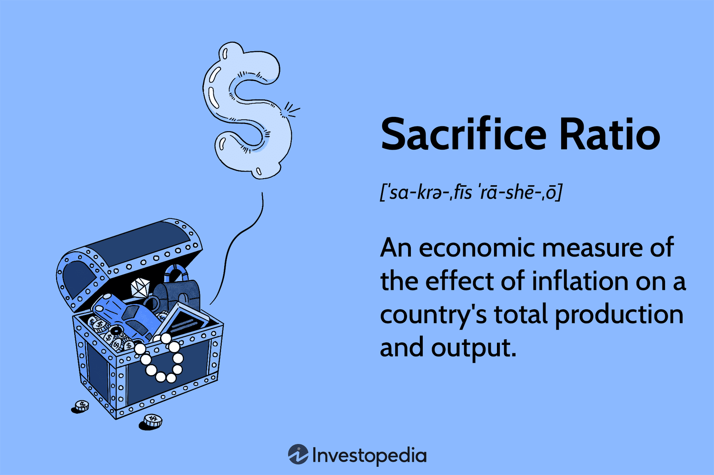

## Table of Contents

## What is the sacrifice ratio in economics?

The sacrifice ratio is a term used in economics to describe how much a country's economy needs to slow down to reduce inflation. It is the cost, measured in lost output or increased unemployment, that a country must bear to lower its inflation rate by a certain percentage. Imagine a country wants to bring down its high inflation rate. To do this, it might need to increase interest rates, which can slow down spending and investment. This slowdown can lead to less economic growth or more people out of work. The sacrifice ratio helps economists understand how much of this slowdown, or "sacrifice," is needed to achieve a desired drop in inflation.

For example, if a country has a sacrifice ratio of 5, it means that to reduce inflation by 1%, the country's GDP would need to be 5% lower than it would have been without the efforts to reduce inflation. This ratio can vary from one country to another and can change over time. Economists study past data to estimate the sacrifice ratio and use it to make informed decisions about monetary policy. Understanding the sacrifice ratio is important because it helps policymakers weigh the benefits of lower inflation against the costs of slower economic growth or higher unemployment.

## How is the sacrifice ratio calculated?

The sacrifice ratio is calculated by looking at how much a country's economy slows down to lower its inflation rate. Economists use data from the past to figure this out. They look at times when the country tried to reduce inflation and see how much the economy grew less than it would have without trying to lower inflation. They also check how much inflation went down during those times. By comparing these two things, they can estimate the sacrifice ratio.

For example, if a country's inflation went down by 1% and during that time, the economy grew 5% less than expected, the sacrifice ratio would be 5. This means that for every 1% drop in inflation, the country's GDP was 5% lower than it could have been. Economists might use different methods and data to calculate the sacrifice ratio, but the basic idea is to see how much economic growth is "sacrificed" to get inflation down.

## Why is the sacrifice ratio important for policymakers?

The sacrifice ratio is important for policymakers because it helps them understand the trade-offs they face when trying to control inflation. If they want to lower inflation, they need to know how much it will cost in terms of slower economic growth or higher unemployment. This ratio gives them an idea of how much the economy will have to slow down to achieve a certain drop in inflation. By knowing this, policymakers can make better decisions about whether the benefits of lower inflation are worth the costs to the economy.

For example, if the sacrifice ratio is high, it means that lowering inflation even a little bit will cause a big slowdown in the economy. Policymakers might then decide that it's not worth trying to lower inflation too much if it will hurt the economy a lot. On the other hand, if the sacrifice ratio is low, they might feel more comfortable taking actions to reduce inflation because the cost to the economy won't be as big. Understanding the sacrifice ratio helps policymakers balance the goals of low inflation and strong economic growth.

## Can you explain the relationship between the sacrifice ratio and inflation?

The sacrifice ratio tells us how much a country's economy needs to slow down to lower its inflation. If a country wants to reduce inflation, it might raise interest rates, which can make people spend less and businesses invest less. This slowdown in spending and investment can lead to less economic growth or more people out of work. The sacrifice ratio measures how much of this slowdown, or "sacrifice," is needed to get inflation down by a certain amount. For example, if the sacrifice ratio is 5, it means the country's GDP needs to be 5% lower than it would have been to lower inflation by 1%.

Understanding the sacrifice ratio helps policymakers decide if it's worth trying to lower inflation. If the sacrifice ratio is high, it means that even a small drop in inflation will cause a big slowdown in the economy. Policymakers might then choose not to try to lower inflation too much if it will hurt the economy a lot. But if the sacrifice ratio is low, they might feel okay about taking steps to reduce inflation because the cost to the economy won't be as big. This way, the sacrifice ratio helps them balance the goals of low inflation and strong economic growth.

## What factors influence the sacrifice ratio?

The sacrifice ratio can be affected by many things. One big [factor](/wiki/factor-investing) is how people expect inflation to change. If people think inflation will stay the same, they might not change their spending habits much, even if the government tries to lower inflation. But if they think inflation will go down, they might spend less right away, making it easier for the government to lower inflation without slowing the economy too much. Another factor is how flexible the economy is. If businesses can easily change prices and wages, it might be easier to lower inflation without hurting the economy a lot. But if prices and wages are hard to change, it can make the sacrifice ratio higher because the economy has to slow down more to get inflation down.

Another thing that can influence the sacrifice ratio is how the government manages its money supply and interest rates. If the government can control these things well, it might be able to lower inflation without causing too much economic slowdown. But if it's hard for the government to control these things, the sacrifice ratio might be higher. Also, the overall health of the economy matters. If the economy is strong and growing, it might be able to handle efforts to lower inflation better than if it's weak and struggling. All these factors together help determine how much the economy has to slow down to lower inflation, which is what the sacrifice ratio measures.

## How does the sacrifice ratio vary across different countries?

The sacrifice ratio can be different in different countries because each country's economy works in its own way. Some countries might have people who expect inflation to stay the same, so it's harder to lower inflation without slowing the economy a lot. Other countries might have businesses and workers who can easily change prices and wages, which can make it easier to lower inflation without hurting the economy too much. Also, how well a country's government can control its money supply and interest rates can affect the sacrifice ratio. If a government can do this well, it might lower inflation without causing too much economic slowdown.

Another reason the sacrifice ratio varies is because of the overall health and structure of a country's economy. A strong economy might handle efforts to lower inflation better than a weak one. For example, if a country has a lot of industries that can quickly adjust to changes, the sacrifice ratio might be lower. But if a country's economy is not doing well or if it depends a lot on things that are hard to change, the sacrifice ratio might be higher. So, the sacrifice ratio is not the same everywhere, and it depends on many things about a country's economy.

## What are the historical trends in the sacrifice ratio?

The sacrifice ratio has changed over time and has shown different trends in different places. In the past, especially in the 1970s and 1980s, many countries had high sacrifice ratios. This meant that to lower inflation even a little bit, their economies had to slow down a lot. For example, in the United States during the early 1980s, the Federal Reserve raised interest rates a lot to fight high inflation, which led to a big slowdown in the economy. This time showed that the cost of lowering inflation could be very high.

More recently, the sacrifice ratio has seemed to get lower in many countries. This might be because people and businesses have gotten better at expecting and dealing with changes in inflation. Also, central banks, like the Federal Reserve, have gotten better at controlling inflation without causing too much harm to the economy. For example, in the 1990s and 2000s, many countries managed to lower inflation without the big economic slowdowns seen in earlier decades. But the sacrifice ratio can still change, and it depends a lot on what is happening in each country's economy at the time.

## How do different economic models estimate the sacrifice ratio?

Different economic models use different ways to estimate the sacrifice ratio. One common way is to look at past data to see how much the economy slowed down when a country tried to lower inflation. Economists might use something called the "Phillips Curve" to help with this. The Phillips Curve shows a link between unemployment and inflation. By studying this curve, economists can figure out how much unemployment might go up when inflation goes down. This helps them estimate the sacrifice ratio. Another way is to use big math models that try to copy how the whole economy works. These models can show what might happen if the government raises interest rates to lower inflation.

These methods can give different answers because they look at the economy in different ways. For example, the Phillips Curve method might say the sacrifice ratio is high if it shows that unemployment goes up a lot when inflation goes down. But a big math model might say the sacrifice ratio is lower if it thinks the economy can handle higher interest rates without slowing down too much. Both ways of estimating the sacrifice ratio have good points and bad points. It's important for economists to use more than one method to get a good idea of what the sacrifice ratio might be.

## What are the criticisms of the concept of the sacrifice ratio?

Some people think the idea of the sacrifice ratio is not perfect. One big problem is that it's hard to guess the right number for the sacrifice ratio. This is because it can change a lot depending on what's happening in the economy at the time. If the economy is doing well, the sacrifice ratio might be lower. But if the economy is not doing well, the sacrifice ratio might be higher. Also, different ways of figuring out the sacrifice ratio can give different answers. This makes it hard for people to use the sacrifice ratio to make good choices about how to control inflation.

Another problem is that the sacrifice ratio doesn't always think about everything that can happen when a country tries to lower inflation. For example, it might not look at how people's trust in the economy can change. If people think the government is doing a good job, they might not worry too much about a slowdown. But if they don't trust the government, they might worry a lot, which can make the economy slow down even more. Also, the sacrifice ratio can be different in different countries, so what works in one place might not work in another. This makes it hard to use the sacrifice ratio to make decisions that work everywhere.

## How does the sacrifice ratio impact monetary policy decisions?

The sacrifice ratio is important for people who make decisions about a country's money, like the central bank. They use the sacrifice ratio to figure out how much the economy might slow down if they try to lower inflation. If the sacrifice ratio is high, it means the economy will slow down a lot to lower inflation just a little bit. This can make the people in charge think twice about trying to lower inflation because it might hurt the economy too much. They have to think about if the benefits of lower inflation are worth the cost of a slower economy.

On the other hand, if the sacrifice ratio is low, the people in charge might feel more okay about trying to lower inflation. This is because the economy won't slow down as much to get inflation down. They can use this information to decide how much to change interest rates or other money policies. By understanding the sacrifice ratio, they can try to find a good balance between keeping inflation low and keeping the economy growing strong.

## Can the sacrifice ratio be used to predict economic outcomes?

The sacrifice ratio can help people guess what might happen to the economy if they try to lower inflation. It tells them how much the economy might slow down to get inflation down by a certain amount. If the sacrifice ratio is high, it means the economy will slow down a lot, which might lead to less growth or more people out of work. But if the sacrifice ratio is low, the economy won't slow down as much, so there might be less impact on growth and jobs.

However, using the sacrifice ratio to predict the future is not always easy. It can change depending on what's happening in the economy at the time, like how well businesses and people can handle changes in inflation. Also, different ways of figuring out the sacrifice ratio can give different answers. This makes it hard to be sure about what will happen to the economy when trying to lower inflation. So, while the sacrifice ratio can give some ideas about what might happen, it's not perfect for making exact predictions.

## What are the latest research findings on the dynamics of the sacrifice ratio?

Recent research on the sacrifice ratio shows that it can change a lot depending on what's happening in the economy. Some studies have found that the sacrifice ratio might be lower now than it used to be. This could be because central banks have gotten better at controlling inflation without hurting the economy too much. Also, people and businesses might be better at expecting and dealing with changes in inflation. This means that when the government tries to lower inflation, the economy might not slow down as much as it did in the past.

Another finding is that the sacrifice ratio can be different in different countries and can change over time. For example, a strong economy might have a lower sacrifice ratio because it can handle efforts to lower inflation better. But a weak economy might have a higher sacrifice ratio because any slowdown can hurt it a lot. Researchers are also looking at how things like how people expect inflation to change and how flexible prices and wages are can affect the sacrifice ratio. This helps them understand better how to balance the goals of low inflation and strong economic growth.

## What is the Sacrifice Ratio and how can it be understood?

The sacrifice ratio is an essential concept in macroeconomics, used to gauge the cost involved in reducing inflation. It quantifies the relationship between the reduction in inflation and the resultant loss in a country's output or increase in unemployment. In essence, it is a measure of the trade-offs that policymakers face when attempting to ensure long-term price stability.

Mathematically, the sacrifice ratio can be expressed as follows:

$$
\text{Sacrifice Ratio} = \frac{\text{Cumulative loss in GDP (\%)}}{\text{Reduction in inflation (\%)}}
$$

This ratio provides policymakers with a tangible metric to estimate the short-term economic losses—be it a drop in gross domestic product (GDP) or a rise in unemployment—that might be incurred while pursuing the goal of lower inflation. Understanding and calculating the sacrifice ratio is crucial for shaping effective monetary policy, as it allows for the anticipation of economic disruptions resulting from efforts to reduce inflation.

The origins of the sacrifice ratio concept are rooted in the Phillips Curve, a theoretical economic model that illustrates the inverse relationship between the rate of inflation and the rate of unemployment within an economy. The traditional view suggested that reducing inflation would typically lead to higher unemployment and lower output due to reduced economic activity. This relation implies that any policy aimed at controlling inflation could impose significant costs on the economy.

In practical terms, the sacrifice ratio influences central bank policies, particularly those involving interest rates and open market operations. For instance, a high sacrifice ratio suggests that reducing inflation might lead to significant output or employment costs, making policymakers more cautious in their anti-inflation measures. Conversely, a lower sacrifice ratio indicates that inflation can be curbed with minimal economic disruption, permitting more aggressive inflation-targeting policies.

While the sacrifice ratio offers a framework to predict the economic consequences of disinflation, it is not without its limitations. Several factors, such as the adaptability of markets, the expectations of economic [agents](/wiki/agents), and the credibility of monetary authorities, can alter the relationship between inflation reduction and economic output. As a result, the sacrifice ratio may vary considerably between different countries and economic contexts, warranting a careful analysis tailored to specific economic conditions.

In configuring monetary policy, central banks consider the sacrifice ratio as one of several tools to balance their economic goals. Despite its utility, reliance solely on the sacrifice ratio can lead to suboptimal decisions if not contextualized within a broader economic assessment that includes other relevant indicators and variables.

## References & Further Reading

[1]: Ball, L., & Mankiw, N. G. (2002). ["The NAIRU in THEORY AND PRACTICE."](https://scholar.harvard.edu/files/mankiw/files/jep.ballmankiw.pdf) National Bureau of Economic Research.

[2]: Goodhart, C. (1999). ["Monetary Policy and Sacrifice Ratios."](https://www.researchgate.net/publication/253797490_Goodhart's_Law_Its_Origins_Meaning_and_Implications_for_Monetary_Policy) Journal of Money, Credit and Banking, 31(4), 643-664.

[3]: Volcker, P. A. (2018). ["Keeping At It: The Quest for Sound Money and Good Government."](https://www.amazon.com/Keeping-At-Quest-Sound-Government/dp/1541788311) PublicAffairs.

[4]: Aldridge, I. (2013). ["High-Frequency Trading: A Practical Guide to Algorithmic Strategies and Trading Systems."](https://www.amazon.com/High-Frequency-Trading-Practical-Algorithmic-Strategies/dp/1118343506) Wiley.

[5]: Bernanke, B. S., & Mishkin, F. S. (1997). ["Inflation Targeting: A New Framework for Monetary Policy?"](https://www.aeaweb.org/articles?id=10.1257/jep.11.2.97) The Journal of Economic Perspectives, 11(2), 97-116.