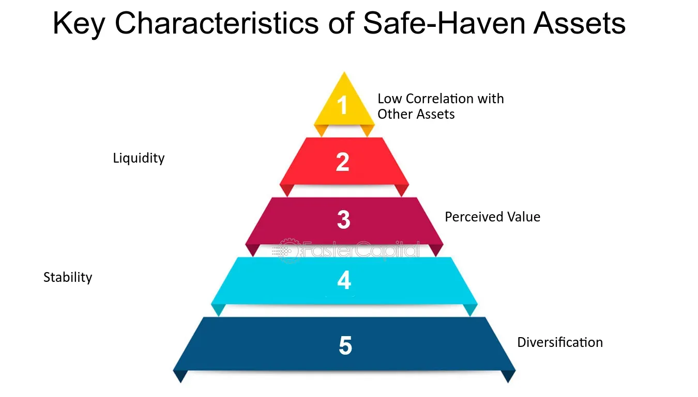

## Table of Contents

## What are safe assets?

Safe assets are investments that are considered low risk and have a high likelihood of preserving your money. These assets are often used by people who want to protect their money rather than grow it quickly. Examples of safe assets include savings accounts, government bonds, and certificates of deposit (CDs). These investments are usually backed by stable institutions like banks or governments, which makes them less likely to lose value.

Even though safe assets are less risky, they usually offer lower returns compared to riskier investments like stocks. This means that while your money is safer, it might not grow as much over time. Safe assets are good for people who need to access their money soon or those who can't afford to lose any of it. They are also a good way to balance out riskier investments in a diversified portfolio.

## Why are safe assets important for investors?

Safe assets are important for investors because they help protect their money. When you invest in safe assets like savings accounts or government bonds, you're less likely to lose your money. This is good for people who need their money to be safe, maybe because they'll need it soon or they can't afford to lose any of it. Safe assets give investors peace of mind because they know their money is in a secure place.

Another reason safe assets are important is that they can balance out riskier investments. If an investor has some money in stocks, which can go up and down a lot, they can also put some money in safe assets. This way, if the stocks lose value, the safe assets will still be there, helping to keep the overall value of the investor's money more stable. So, safe assets are a key part of a smart investment plan, helping to keep things steady and secure.

## What are some common examples of safe assets?

Safe assets are things you can invest in that don't have a lot of risk. Some common examples are savings accounts, which you can find at a bank. When you put your money in a savings account, it's safe because banks protect your money. Another example is government bonds. These are like loans you give to the government, and they promise to pay you back with a little extra. They're safe because the government is usually good at paying back what they owe.

Certificates of deposit, or CDs, are also safe assets. When you buy a CD, you agree to leave your money in the bank for a certain time, and in return, the bank gives you a bit more money when the time is up. CDs are safe because, like savings accounts, they're protected by the bank. All these safe assets are good for keeping your money secure, even if they don't grow as fast as riskier investments like stocks.

## How do safe assets differ from risky assets?

Safe assets and risky assets are different in how likely they are to lose value and how much money they can make. Safe assets, like savings accounts, government bonds, and certificates of deposit (CDs), have a low chance of losing money. They are backed by strong institutions like banks or governments, so they are very secure. But, because they are safe, they usually don't grow your money as fast. They are good for people who need to keep their money safe and can't take big risks.

On the other hand, risky assets, like stocks or cryptocurrencies, can go up and down a lot in value. They have a higher chance of losing money, but they also have the potential to make a lot more money if things go well. People who invest in risky assets are usually looking to grow their money faster and are okay with taking bigger risks. Risky assets are not as predictable as safe assets, so they need more watching and understanding.

In a smart investment plan, people often mix safe and risky assets. Safe assets help to keep the overall value of the investment more stable, while risky assets give the chance for bigger gains. This balance helps investors feel more secure while still having the opportunity to grow their money over time.

## What role do safe assets play in a diversified investment portfolio?

Safe assets are really important in a diversified investment portfolio because they help keep things steady. When you have a mix of different investments, some might be risky, like stocks, which can go up and down a lot. Safe assets, like savings accounts or government bonds, don't change much in value. They act like a safety net, making sure that even if the risky parts of your portfolio lose money, you still have some money that's safe and secure. This helps to balance out the ups and downs, making your overall investment more stable.

Having safe assets in your portfolio also gives you peace of mind. Knowing that part of your money is in safe places means you can take more risks with other parts of your investments. For example, you might feel more comfortable putting some money into stocks if you know you have other money in a savings account or government bonds. This way, you can try to grow your money with the riskier investments while still keeping some of it safe. Safe assets are like the calm part of your investment plan, helping you feel more secure as you try to make your money grow.

## How can safe assets help in managing financial risk?

Safe assets help manage financial risk by providing a secure place for your money. When you put your money in safe assets like savings accounts or government bonds, you know it's less likely to lose value. This is important because it means you won't lose all your money if something goes wrong with other investments. Safe assets act like a safety net, making sure you have some money that's protected no matter what happens.

Having safe assets in your investment plan also helps you feel more comfortable taking risks with other parts of your money. If you know some of your money is safe, you might be more willing to try investing in things like stocks, which can go up and down a lot. This way, you can try to grow your money with riskier investments while still keeping some of it safe. Safe assets help balance out the risk, making your overall financial plan more stable and secure.

## What are the characteristics that define a safe asset?

Safe assets are investments that have a low chance of losing money. They are usually backed by strong and stable institutions like banks or governments. This means that even if other parts of the economy are doing badly, safe assets are likely to keep their value. Examples of safe assets include savings accounts, government bonds, and certificates of deposit (CDs). These investments are good for people who need to keep their money safe and can't take big risks.

Safe assets also offer lower returns compared to riskier investments like stocks. This means that while your money is safer, it might not grow as much over time. But, safe assets are important because they help balance out the risk in an investment plan. If you have some money in safe assets, you can feel more comfortable trying to grow other parts of your money with riskier investments. Safe assets help keep your overall financial plan more stable and secure.

## How do government bonds function as safe assets?

Government bonds are loans you give to the government. When you buy a government bond, you're lending money to the government, and they promise to pay you back with a little extra. This extra is called interest. Because the government is usually good at paying back what they owe, government bonds are seen as safe assets. They have a low chance of losing money, which makes them a good choice for people who need to keep their money safe.

Government bonds help in managing financial risk because they are very stable. Even if the economy is doing badly, the government is likely to pay you back. This means that if you have some money in government bonds, you can feel more comfortable trying to grow other parts of your money with riskier investments like stocks. Government bonds act like a safety net, keeping some of your money safe while you try to make more money with other investments.

## What impact do economic conditions have on the safety of assets?

Economic conditions can change how safe assets are. When the economy is doing well, people feel more confident, and even safe assets like savings accounts or government bonds can seem safer. But when the economy is struggling, like during a recession, even safe assets can be affected. For example, if a government is having money problems, it might be harder for them to pay back the money they owe on government bonds. This means that what is usually a safe asset can become a bit riskier.

Even though economic conditions can affect the safety of assets, safe assets are still usually more secure than risky ones. Safe assets like savings accounts are often protected by banks, and government bonds are backed by the government. So, even in tough economic times, these assets are less likely to lose all their value compared to riskier investments like stocks. Safe assets help keep your money safe and give you peace of mind, no matter what's happening in the economy.

## How do safe assets perform during different market cycles?

Safe assets like savings accounts, government bonds, and certificates of deposit (CDs) usually do well during different market cycles. When the market is going up, safe assets might not grow as fast as riskier investments like stocks, but they still keep your money safe. This means you won't lose money even if the market goes down a little. Safe assets are good for people who need to keep their money secure and can't take big risks.

During tough times, like a recession, safe assets can be even more important. When the economy is struggling, riskier investments can lose a lot of value, but safe assets are usually more stable. For example, government bonds are backed by the government, so even if the economy is bad, the government is likely to pay you back. This makes safe assets a good choice for keeping your money safe during all kinds of market cycles.

## What are the limitations or potential downsides of investing in safe assets?

Safe assets, like savings accounts and government bonds, are good for keeping your money safe, but they have some downsides. One big limitation is that they usually don't grow your money as fast as riskier investments like stocks. This means if you only put your money in safe assets, it might not grow enough to keep up with inflation, which is when the cost of things goes up over time. So, even though your money is safe, it might be worth less in the future.

Another downside is that safe assets can be affected by economic conditions. For example, if a government is having money problems, the safety of government bonds could go down. Also, the interest rates on safe assets like savings accounts can change, and if they go down, you might earn less money on your savings. So, while safe assets are good for keeping your money secure, they might not be the best choice if you want your money to grow a lot or if you're okay with taking more risks.

## How can advanced investors use safe assets to optimize their investment strategies?

Advanced investors can use safe assets to make their investment plans better by balancing out risk. If an investor has a lot of money in risky investments like stocks, they can put some money in safe assets like government bonds or savings accounts. This way, if the stocks go down in value, the safe assets will help keep the overall value of their money more stable. Safe assets act like a safety net, making sure that even if some parts of the investment plan lose money, there's still some money that's safe and secure. This balance helps investors feel more comfortable taking bigger risks with other parts of their money, knowing that some of it is protected.

Another way advanced investors can use safe assets is to take advantage of different market cycles. During good economic times, safe assets might not grow as fast as riskier investments, but they still provide a steady return. When the economy is struggling, like during a recession, safe assets can be even more important. They help protect the investor's money when other investments might be losing value. By having a mix of safe and risky assets, advanced investors can adjust their strategies based on what's happening in the economy, using safe assets to keep their money safe during tough times and to balance out their riskier investments during good times.

## References & Further Reading

[1]: Bergstra, J., Bardenet, R., Bengio, Y., & Kégl, B. (2011). ["Algorithms for Hyper-Parameter Optimization."](https://dl.acm.org/doi/10.5555/2986459.2986743) Advances in Neural Information Processing Systems 24.

[2]: ["Advances in Financial Machine Learning"](https://www.amazon.com/Advances-Financial-Machine-Learning-Marcos/dp/1119482089) by Marcos Lopez de Prado

[3]: ["Evidence-Based Technical Analysis: Applying the Scientific Method and Statistical Inference to Trading Signals"](https://www.amazon.com/Evidence-Based-Technical-Analysis-Scientific-Statistical/dp/0470008741) by David Aronson

[4]: ["Machine Learning for Algorithmic Trading"](https://github.com/stefan-jansen/machine-learning-for-trading) by Stefan Jansen

[5]: ["Quantitative Trading: How to Build Your Own Algorithmic Trading Business"](https://www.amazon.com/Quantitative-Trading-Build-Algorithmic-Business/dp/1119800064) by Ernest P. Chan