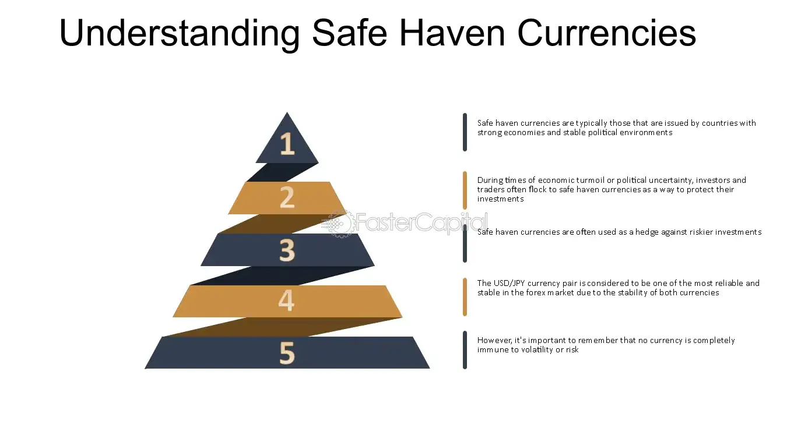

## Table of Contents

## What is a safe haven currency?

A safe haven currency is a type of money that people turn to when they think the world's economy is getting risky. It's like a safe place where people put their money because they believe it will keep its value even when things are uncertain. Countries like the United States, Switzerland, and Japan have currencies that are often seen as safe havens. The US dollar, the Swiss franc, and the Japanese yen are examples of these currencies.

People choose these currencies because they come from countries with strong economies and stable governments. When there's trouble in the world, like a financial crisis or political unrest, investors move their money to these safe havens to protect it. This makes the value of safe haven currencies go up because more people want to buy them. It's a bit like how people might buy umbrellas when it starts to rain – they want something reliable to keep them safe.

## Why do investors turn to safe haven currencies during economic uncertainty?

Investors turn to safe haven currencies during times of economic uncertainty because they want to protect their money. When the world's economy seems shaky, people get worried about losing their investments. Safe haven currencies, like the US dollar or the Swiss franc, are seen as more stable and less likely to lose value quickly. This is because they come from countries with strong economies and governments that are less likely to face sudden problems.

During uncertain times, investors might move their money out of riskier investments, like stocks or currencies from countries with weaker economies. By putting their money into safe haven currencies, they hope to keep its value safe until the economic storm passes. It's a bit like finding a safe place to wait out a storm, where the money is less likely to be affected by the economic turbulence happening around the world.

## Which currencies are typically considered safe havens?

Safe haven currencies are those that people trust to keep their value even when the world's economy is shaky. The most common safe haven currencies are the US dollar, the Swiss franc, and the Japanese yen. People turn to these currencies because they come from countries with strong economies and stable governments.

The US dollar is often seen as a safe haven because the United States has the world's largest economy and a strong financial system. The Swiss franc is trusted because Switzerland is known for its political stability and strong banking system. The Japanese yen is also considered a safe haven due to Japan's stable economy and its status as a major global player. When things get uncertain, investors move their money to these currencies to protect it.

## How does a currency become recognized as a safe haven?

A currency becomes recognized as a safe haven when people believe it will stay strong even when the world's economy is shaky. This belief comes from the country having a strong economy and a stable government. When people trust that a country can handle tough times well, they start seeing its currency as a safe place to keep their money. For example, the US dollar is considered a safe haven because the United States has a big and strong economy, and its government is seen as stable.

Over time, if a currency keeps its value during economic crises, more and more people start to trust it. This trust grows because people see that the currency doesn't lose value quickly when other parts of the world are struggling. Countries like Switzerland and Japan have currencies that are seen as safe havens because they have proven to be reliable during past economic troubles. As more investors move their money to these currencies during uncertain times, the reputation of these currencies as safe havens gets stronger.

## What are the key characteristics of a safe haven currency?

A safe haven currency is one that people trust to keep its value even when the world's economy is unsure. This trust comes from the country having a strong economy and a stable government. When people believe that a country can handle tough times well, they see its currency as a safe place to keep their money. For example, the US dollar is considered a safe haven because the United States has a big and strong economy, and its government is seen as stable.

Over time, if a currency keeps its value during economic crises, more and more people start to trust it. This trust grows because people see that the currency doesn't lose value quickly when other parts of the world are struggling. Countries like Switzerland and Japan have currencies that are seen as safe havens because they have proven to be reliable during past economic troubles. As more investors move their money to these currencies during uncertain times, the reputation of these currencies as safe havens gets stronger.

## How do safe haven currencies affect global trade and investment?

Safe haven currencies can change how people trade and invest around the world. When people think the economy is risky, they move their money into safe haven currencies like the US dollar, Swiss franc, or Japanese yen. This makes these currencies more valuable because more people want them. When a currency gets more valuable, it can make things more expensive for other countries that use different money. For example, if the US dollar gets stronger, American products might cost more for people in other countries, which could make them buy less.

This shift also affects investments. When investors move money into safe haven currencies, they might pull it out of other investments like stocks or bonds in other countries. This can make those other investments lose value. On the flip side, countries with safe haven currencies might see more money coming in, which can help their economies grow. But it's not always good because if too much money comes in too fast, it can cause problems like higher prices or making their own products too expensive for people at home.

## What are the mechanisms behind the valuation of safe haven currencies?

The value of safe haven currencies goes up and down based on what people think about the world's economy. When people feel scared about the economy, they move their money into safe haven currencies like the US dollar, Swiss franc, or Japanese yen. This makes more people want these currencies, which pushes their value up. It's like when a lot of people want to buy a popular toy, the price goes up because there are more buyers than sellers.

The strength of the country's economy and government also plays a big role. Countries with strong economies and stable governments are trusted more, so their currencies are seen as safer. When bad things happen in the world, like a financial crisis or a war, people look for a safe place for their money. They choose safe haven currencies because they believe these currencies will keep their value even when other currencies might lose value. This trust and belief in the stability of the country help keep the value of safe haven currencies strong.

## How can traders identify the right time to invest in safe haven currencies?

Traders can identify the right time to invest in safe haven currencies by watching for signs of economic trouble around the world. When there's news about a financial crisis, political unrest, or other big problems, it's a good time to think about safe haven currencies. People start getting worried and move their money to places they think are safe, like the US dollar, Swiss franc, or Japanese yen. So, if you see these signs, it might be a good time to invest in these currencies.

Another way to know when to invest is by looking at how other investments are doing. If stock markets are going down fast or if other currencies are losing value, it's a hint that people are looking for safety. When this happens, safe haven currencies usually go up in value because more people want them. So, keeping an eye on these trends can help traders decide when to buy safe haven currencies to protect their money.

## What are the risks associated with investing in safe haven currencies?

Even though safe haven currencies are seen as a safe place to put money during tough economic times, there are still risks. One risk is that the value of the currency can change a lot. Just because a currency is a safe haven doesn't mean it won't go up and down. If too many people try to sell the currency at once, its value can drop quickly. This means that if you buy a safe haven currency and then need to sell it when everyone else is selling, you might lose money.

Another risk is that the country with the safe haven currency can have its own problems. Even strong economies can face issues like inflation, which means prices go up and the money loses value over time. If the country's economy starts to struggle, the currency might not be as safe as people thought. So, it's important to keep an eye on what's happening in the country and not just assume the currency will always be safe.

## How do geopolitical events influence the demand for safe haven currencies?

Geopolitical events can make people feel worried about the world's economy. When there's news about wars, political problems, or big disagreements between countries, people start to look for safe places to keep their money. Safe haven currencies like the US dollar, Swiss franc, and Japanese yen become more popular because people believe these currencies will stay strong even when things are uncertain. When people are scared, they move their money to these safe havens to protect it, which makes the demand for these currencies go up.

This increased demand can make safe haven currencies more valuable. For example, if there's a war in a part of the world, people might move their money out of that area and into a safe haven currency. This shift can cause the safe haven currency to go up in value because more people want to buy it. But, it's important to remember that even though these currencies are seen as safe, their value can still change. If the geopolitical event gets worse or if the country with the safe haven currency has its own problems, the currency might not stay as safe as people hoped.

## What advanced trading strategies can be used with safe haven currencies?

Traders can use a strategy called "carry trade" with safe haven currencies. This means borrowing money in a country where interest rates are low and then using that money to buy a safe haven currency that has higher interest rates. The goal is to make money from the difference in interest rates. But, this strategy has risks. If the value of the safe haven currency goes down, the trader could lose money. So, it's important to watch the market carefully and be ready to change plans if things start to go wrong.

Another strategy is "hedging." This means using safe haven currencies to protect other investments. For example, if a trader has a lot of money in stocks, they might buy some safe haven currency to balance out the risk. If the stock market goes down, the value of the safe haven currency might go up, which can help protect the trader's money. Hedging can be tricky because it involves guessing what might happen in the future. But, if done right, it can help traders feel safer when the world's economy is unsure.

Lastly, traders can use "technical analysis" to make decisions about when to buy or sell safe haven currencies. This means looking at charts and patterns to guess where the currency's value might go next. Traders might use tools like moving averages or support and resistance levels to find the best times to trade. While technical analysis can help, it's not perfect. The world's economy can change quickly because of things like geopolitical events or big news, so traders need to stay alert and be ready to change their plans.

## How do central bank policies impact the performance of safe haven currencies?

Central bank policies can have a big effect on safe haven currencies. When a central bank changes its interest rates, it can make its currency more or less attractive to investors. For example, if the US Federal Reserve raises interest rates, the US dollar might become more valuable because people want to earn more interest on their money. This can make the US dollar a stronger safe haven. On the other hand, if a central bank lowers interest rates, it might make its currency less appealing, and people might look for other safe havens.

Central banks also use other tools like buying or selling their own currency to control its value. If a central bank wants to make its currency stronger, it might buy it back from the market, which can increase demand and push the value up. This can be important for safe haven currencies because a stronger currency can attract more investors during uncertain times. But, if a central bank sells its currency to make it weaker, it might not be seen as a safe haven anymore. So, watching what central banks do can help people understand how safe haven currencies might perform.

## What are the strategies for trading safe haven currencies?

Traders use various strategies when dealing with safe haven currencies to maximize their returns while managing risks. One common approach is pairing, which involves pairing safe haven currencies with riskier currencies to benefit from varying market conditions. For example, during periods of uncertainty, traders might pair the U.S. dollar (a safe haven) with currencies from emerging markets. This allows them to exploit the relative strength of the dollar while benefiting from potential growth in emerging markets when stability returns.

Another popular strategy is the [carry](/wiki/carry-trading) trade, which thrives on [interest rate](/wiki/interest-rate-trading-strategies) differentials between countries. Traders borrow in low-yielding currencies, such as the Japanese yen, and invest in higher-yielding currencies. This approach capitalizes on the interest rate spread, offering potential profits as long as exchange rates remain favorable. The formula for the expected return on a carry trade can be expressed as:

$$
\text{Expected Return} = (\text{Interest Rate of Target Currency} - \text{Interest Rate of Funding Currency}) + \text{Currency Appreciation/Depreciation}
$$

Hedging is also a crucial strategy, allowing traders to offset risks by using safe haven currencies to balance their investment portfolios. This involves taking positions in safe assets to counteract potential losses in riskier investments. For example, if an investor has significant exposure to equities, they might invest in the Swiss franc to mitigate potential downside risk, given its historical reputation as a stable currency during market turmoil.

These strategies, while effective, require careful analysis of market conditions, interest rates, and geopolitical events to optimize returns and manage risks effectively. Traders must remain vigilant and agile, continuously adjusting their strategies in response to fluctuating economic indicators and market sentiment.

## References & Further Reading

[1]: Bergstra, J., Bardenet, R., Bengio, Y., & Kégl, B. (2011). ["Algorithms for Hyper-Parameter Optimization."](https://dl.acm.org/doi/10.5555/2986459.2986743) Advances in Neural Information Processing Systems 24.

[2]: ["Advances in Financial Machine Learning"](https://www.amazon.com/Advances-Financial-Machine-Learning-Marcos/dp/1119482089) by Marcos Lopez de Prado

[3]: ["Evidence-Based Technical Analysis: Applying the Scientific Method and Statistical Inference to Trading Signals"](https://www.amazon.com/Evidence-Based-Technical-Analysis-Scientific-Statistical/dp/0470008741) by David Aronson

[4]: ["Machine Learning for Algorithmic Trading"](https://github.com/stefan-jansen/machine-learning-for-trading) by Stefan Jansen

[5]: ["Quantitative Trading: How to Build Your Own Algorithmic Trading Business"](https://www.amazon.com/Quantitative-Trading-Build-Algorithmic-Business/dp/1119800064) by Ernest P. Chan