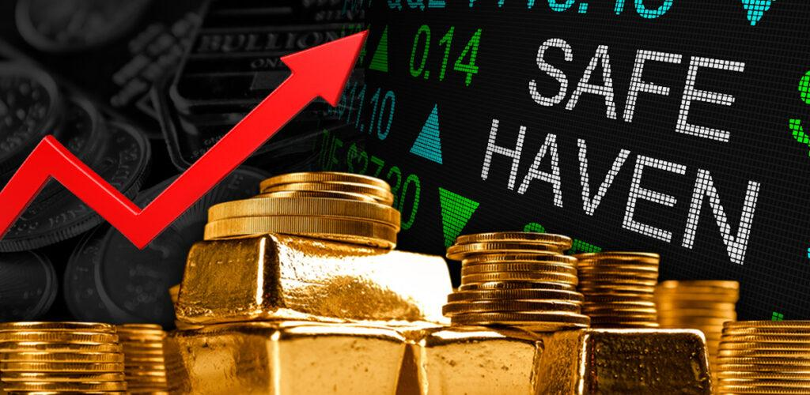

## Table of Contents

## What is a safe haven in investing?

A safe haven in investing is a type of investment that people turn to when they think the economy or stock market might be in trouble. These investments are seen as safer because they are less likely to lose value during tough times. Examples of safe havens include gold, government bonds, and sometimes even certain currencies like the U.S. dollar or Swiss franc. People invest in these assets because they believe they will hold their value or even increase in value when other investments are going down.

Safe havens are not perfect, though. They might not always protect your money completely, and they can still lose value. Also, because many people rush to buy them during uncertain times, the price of safe havens can go up a lot, making them more expensive to buy. It's important for investors to understand that while safe havens can be a good part of a balanced investment plan, they should not be the only thing you invest in. Diversifying your investments, or spreading your money across different types of assets, is usually a smarter strategy.

## Why do investors seek safe havens?

Investors seek safe havens because they want to protect their money when they think the economy or stock market might be in trouble. When things look risky, people get worried about losing their money in stocks or other investments that can go up and down a lot. Safe havens, like gold or government bonds, are seen as safer because they usually don't lose as much value during tough times. This makes them a good place to put money when everything else seems uncertain.

Another reason investors turn to safe havens is to keep their money safe while they wait for better times to invest again. If the market is going down, they might move their money into safe havens until things get better. This way, they can avoid big losses and be ready to invest again when the market starts to recover. Safe havens give investors a sense of security and help them feel more confident about their financial future during uncertain times.

## What are common examples of safe haven assets?

Common examples of safe haven assets are gold, government bonds, and certain currencies like the U.S. dollar and the Swiss franc. Gold is popular because it has been valued for thousands of years and tends to hold its value even when the economy is bad. Government bonds, especially those from stable countries like the U.S. or Germany, are also safe havens because they are backed by the government, which makes them less risky.

Currencies like the U.S. dollar and the Swiss franc are seen as safe havens because they are used a lot in international trade and are considered stable. When people are worried about their own country's economy, they might buy these currencies to keep their money safe. These assets are not perfect and can still lose value, but they are generally seen as safer places to put money during tough times.

## How do safe havens perform during economic downturns?

During economic downturns, safe havens usually do better than other investments. People get worried about losing money in stocks or other risky investments, so they move their money into safe havens like gold or government bonds. These assets are seen as safer because they don't lose as much value when the economy is bad. For example, gold often goes up in price during tough times because more people want to buy it.

Even though safe havens can help protect your money, they are not perfect. Sometimes, they can still lose value, but usually not as much as stocks or other risky investments. Also, because many people rush to buy safe havens during economic downturns, their prices can go up a lot, making them more expensive. This means that while safe havens can be a good place to keep your money safe during bad times, they might not always make you a lot of money.

## What are the risks associated with safe haven investments?

Safe haven investments, like gold or government bonds, are not completely risk-free. One risk is that they can still lose value, even if it's less than other investments during bad times. For example, if everyone starts selling their safe havens at the same time, the price can go down. Also, because many people want to buy safe havens when the economy is bad, the price can go up a lot, making them expensive to buy. If you buy them when they are already expensive, you might not make as much money when things get better.

Another risk is that safe havens might not make you as much money as other investments when the economy is good. If you keep all your money in safe havens, you might miss out on bigger gains from stocks or other investments. Also, some safe havens, like government bonds, might not keep up with inflation, which means the money you get back might be worth less than when you started. It's important to understand these risks and think about how safe havens fit into your overall investment plan.

## How can beginners identify safe haven assets?

Beginners can identify safe haven assets by looking at things that people usually turn to when they are worried about the economy. The most common safe havens are gold, government bonds, and certain currencies like the U.S. dollar or the Swiss franc. Gold is a good example because it has been valued for a long time and people often buy it when they think the economy might be in trouble. Government bonds, especially from stable countries like the U.S. or Germany, are also safe because they are backed by the government and are seen as less risky.

To find out if an asset is a safe haven, beginners should pay attention to what happens to its value during economic downturns. If an asset tends to hold its value or even go up when the economy is bad, it might be a safe haven. It's also helpful to read news and financial reports to see what experts are saying about different investments. Remember, even though safe havens can be a good way to protect your money, they are not perfect and can still lose value. It's always a good idea to spread your money across different types of investments to lower your risk.

## What role do safe havens play in a diversified investment portfolio?

Safe havens play an important role in a diversified investment portfolio because they help protect your money when the economy or stock market is in trouble. When things look risky, people often move their money into safe havens like gold or government bonds. These investments are seen as safer because they usually don't lose as much value during tough times. By including safe havens in your portfolio, you can feel more secure knowing that part of your money is in a safer place.

Even though safe havens can help keep your money safe, they should not be the only thing in your portfolio. It's important to spread your money across different types of investments, like stocks, bonds, and maybe even real estate. This way, if one type of investment goes down, the others might help balance things out. Safe havens are just one part of a smart investment plan, helping to lower your risk while you also try to grow your money over time.

## How have safe haven assets historically performed compared to other investments?

Safe haven assets like gold and government bonds have often done better than other investments during tough economic times. When the stock market goes down or there is a lot of uncertainty, people move their money into these safer investments. Gold, for example, is known for holding its value or even going up when things are bad. Government bonds, especially from stable countries, are also seen as safe because they are backed by the government and tend to lose less value than stocks. This makes them a good choice for people who want to protect their money during economic downturns.

However, safe haven assets don't always do better than other investments. When the economy is doing well, stocks and other riskier investments can grow much faster than safe havens. Gold might not go up as much as stocks during good times, and government bonds might not keep up with inflation, which means the money you get back could be worth less than when you started. So, while safe havens can help protect your money during bad times, they might not make you as much money as other investments when things are good. It's important to have a mix of different investments to balance out the risks and rewards.

## What are the tax implications of investing in safe havens?

The tax implications of investing in safe havens can vary depending on the type of asset and where you live. For example, if you invest in gold, you might have to pay capital gains tax when you sell it for a profit. The tax rate can be different depending on how long you held the gold before selling it. Short-term capital gains, which are profits from assets held for less than a year, are usually taxed at a higher rate than long-term gains, which are profits from assets held for more than a year.

Government bonds also have tax implications. In some countries, the interest you earn from government bonds is taxed as regular income. This means you might have to pay taxes on that interest every year, even if you don't sell the bonds. Some types of bonds, like U.S. Treasury bonds, might be exempt from state and local taxes, but you still have to pay federal taxes on the interest. It's important to understand the tax rules in your country and maybe talk to a tax advisor to make sure you know how your safe haven investments will be taxed.

## How do geopolitical events influence the value of safe haven investments?

Geopolitical events, like wars or political disagreements between countries, can make people worried about the economy. When this happens, they often move their money into safe haven investments like gold or government bonds. These investments are seen as safer because they usually don't lose as much value when things are uncertain. For example, if there is a big conflict in the world, the price of gold might go up because more people want to buy it to keep their money safe.

Different safe havens can react differently to geopolitical events. Gold often goes up in price because it is seen as a good way to protect money during tough times. Government bonds from stable countries, like the U.S. or Germany, might also become more popular because people think these bonds are less risky. On the other hand, currencies like the U.S. dollar or the Swiss franc might be seen as safe havens too, and their value can go up when people are worried about their own country's money. So, geopolitical events can make safe haven investments more valuable as people look for ways to keep their money safe.

## What advanced strategies can experts use to optimize returns from safe haven assets?

Experts can use a few smart strategies to get the most out of safe haven assets. One way is to use something called "hedging." This means they might buy safe havens like gold or government bonds to protect their money when they think the economy might be in trouble. At the same time, they keep some money in riskier investments like stocks. If the economy does go down, the safe havens can help balance out any losses from the stocks. This way, they can still make money from the stocks when things are good, but also keep their money safe when things are bad.

Another strategy is to pay close attention to what's happening in the world and the economy. Experts might buy safe havens when they see signs that things might get tough, like a big political problem or a drop in the stock market. They might also sell these safe havens when things start to get better, to buy other investments that could grow faster. By watching the news and understanding how different events can affect the value of safe havens, experts can buy and sell at the right times to make more money.

## How can investors balance the need for safety with the potential for growth in their investment strategy?

Investors can balance safety and growth by spreading their money across different types of investments. This is called diversification. They might put some money into safe havens like gold or government bonds to protect it when the economy is bad. At the same time, they can invest in stocks or other riskier assets that might grow faster when the economy is doing well. By having a mix of safe and risky investments, they can protect their money during tough times while still having a chance to make more money when things are good.

It's also important for investors to think about their own goals and how much risk they are comfortable with. If they need their money to grow a lot over time, they might put more into stocks and less into safe havens. But if they are more worried about keeping their money safe, they might do the opposite. By understanding their own needs and adjusting their investments accordingly, investors can find a good balance between safety and growth. This way, they can feel confident about their financial future no matter what happens in the economy.

## References & Further Reading

[1]: Bergstra, J., Bardenet, R., Bengio, Y., & Kégl, B. (2011). ["Algorithms for Hyper-Parameter Optimization."](https://papers.nips.cc/paper/4443-algorithms-for-hyper-parameter-optimization) Advances in Neural Information Processing Systems 24.

[2]: ["Advances in Financial Machine Learning"](https://www.amazon.com/Advances-Financial-Machine-Learning-Marcos/dp/1119482089) by Marcos Lopez de Prado

[3]: ["Evidence-Based Technical Analysis: Applying the Scientific Method and Statistical Inference to Trading Signals"](https://www.amazon.com/Evidence-Based-Technical-Analysis-Scientific-Statistical/dp/0470008741) by David Aronson

[4]: ["Machine Learning for Algorithmic Trading"](https://github.com/stefan-jansen/machine-learning-for-trading) by Stefan Jansen

[5]: ["Quantitative Trading: How to Build Your Own Algorithmic Trading Business"](https://www.amazon.com/Quantitative-Trading-Build-Algorithmic-Business/dp/1119800064) by Ernest P. Chan