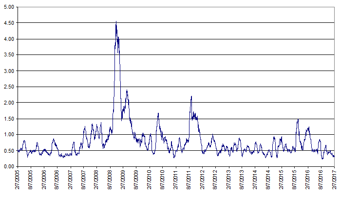

Algorithmic trading has significantly impacted investment practices in financial markets by leveraging complex mathematical models and automated systems to enhance trading decisions. These strategies, which employ vast amounts of data and compute power, allow trades to be executed at optimal times and conditions, minimizing human interference. Algorithims offer precision and speed, addressing both high-frequency trading and long-term investment goals.

Safe havens are crucial components within the financial landscape, serving as anchors of stability during periods of market turbulence. They are investment assets expected to either hold steady or appreciate in value when broader markets experience instability. Safe havens like gold, treasury bills, and specific currencies provide investors a reliable refuge, preserving portfolio stability and ensuring consistent returns even under adverse economic conditions.



This article aims to provide a comprehensive look at safe haven investment examples, clarify the concept, and highlight the importance of algorithmic trading strategies. By integrating insights from both these areas, investors can fortify their portfolios against market volatilities, improving resilience and optimizing returns through strategic deployment of algorithmically driven approaches.

## Table of Contents

## Understanding Safe Havens

Safe havens are a critical component in the strategy of investment management, designed to protect capital during periods of significant market stress. These investment vehicles are expected to either retain their value or appreciate when markets are unstable, offering investors a form of insurance against losses arising from economic or geopolitical instability.

Among the most notable examples of safe havens are gold, treasury bills, defensive stocks, and certain currencies such as the Swiss franc. Gold has long been considered a store of value, prized for its historic stability and intrinsic physical worth. In times of economic uncertainty, investors often flock to gold as it tends to hold its value despite market volatility.

Treasury bills, particularly those issued by the U.S. government, are considered virtually risk-free. This is primarily because they are backed by the full faith and credit of the U.S. government, providing a safe and reliable return during economic downturns when other riskier investments may falter.

Defensive stocks are another avenue for safe haven investment. Typically, these include companies in sectors such as utilities and healthcare, where demand for services remains consistent regardless of the broader economic climate. This stability in demand ensures that these companies' stocks are less likely to experience dramatic swings, making them a preferable choice for risk-averse investors.

Currency also plays a role in risk mitigation strategies. The Swiss franc, for instance, is often sought after during tumultuous periods due to Switzerland's stable political environment and solid economic policies. As such, it acts as a hedge against currency depreciation in more volatile regions.

The inclusion of safe havens within a diversified investment portfolio helps mitigate risks by spreading exposure across assets that are less likely to be affected by downturns. The standard approach to diversification can be quantitatively represented through Markowitz's mean-variance optimization framework, where one seeks to maximize a portfolio's expected return for a given level of risk. Safe havens can often lower the portfolio variance, $\sigma^2$, thus providing a buffer in adverse market conditions.

In conclusion, incorporating safe havens into investment strategies is fundamental for managing risk and preserving capital. They serve as a stabilizing force by counterbalancing the potential losses that could arise from other more volatile assets within an investor's portfolio.

## Examples of Safe Haven Investments

Safe haven investments serve as critical components in financial portfolios, offering a refuge during economic uncertainty and market [volatility](/wiki/volatility-trading-strategies). The stability and predictability of these investments can protect against losses and provide peace of mind to investors seeking to safeguard their assets.

**Gold**

Gold has long been revered as a store of value and is often perceived as a hedge against inflation and currency fluctuations. Its intrinsic value and relative scarcity make it a popular safe haven. Historically, gold prices tend to rise during times of economic turmoil, reflecting its role as a reliable asset when confidence in fiat currencies diminishes. For example, during financial crises, investors flock to gold, driving up its price. The unique properties of gold, combined with the absence of credit risk, cement its status as a cornerstone of safe haven investments.

**Treasury Bills**

Treasury bills (T-bills) are short-term government securities backed by the full faith and credit of the United States government. These instruments are considered virtually risk-free, as they are supported by the country's ability to generate revenue through taxation. Investors typically turn to T-bills during economic downturns, as their returns are guaranteed. The short maturity period, usually ranging from a few days to a year, further enhances their appeal by providing [liquidity](/wiki/liquidity-risk-premium) and low-[interest rate](/wiki/interest-rate-trading-strategies) risk. As a result, T-bills are a go-to option for risk-averse investors seeking stability and predictable returns.

**Defensive Stocks**

Defensive stocks, often associated with companies in the utilities, healthcare, and consumer staples sectors, are characterized by their ability to maintain stable earnings regardless of macroeconomic conditions. These companies provide essential services or products that experience consistent demand regardless of economic cycles. For instance, utilities companies that supply electricity and water continue to generate revenue even during economic recessions, as these services remain indispensable. Consequently, stocks in these sectors typically exhibit lower volatility and are included in portfolios to reduce overall risk.

In summary, gold, treasury bills, and defensive stocks embody the qualities investors seek in safe havens—stability, reliability, and protection against economic downturns. Integrating these assets into a diversified portfolio can help cushion against market turbulence, ensuring resilience in an ever-changing financial landscape.

## Diving into Algorithmic Trading

Algorithmic trading represents a sophisticated approach to executing trades, relying upon pre-programmed instructions to make trading decisions at the most advantageous times and under optimal conditions. This method significantly reduces the need for human intervention and leverages modern technology to enhance trading efficiency and precision.

Common [algorithmic trading](/wiki/algorithmic-trading) strategies can be categorized into trend-following, [arbitrage](/wiki/arbitrage), and [market making](/wiki/market-making), each serving distinct purposes in different market environments:

1. **Trend-Following**: This strategy involves identifying and leveraging market momentum. Algorithms are designed to recognize patterns indicating an asset's upward or downward price movements. By buying assets during upward trends and selling them as trends reverse or decline, traders aim to capitalize on sustained price movements. For instance, the moving average crossover technique—where a short-term moving average crosses above a long-term moving average—can trigger a buy signal.

2. **Arbitrage**: This strategy exploits pricing inefficiencies across different markets or financial instruments. Arbitrage algorithms are configured to simultaneously buy and sell equivalent financial instruments to capitalize on the price discrepancies. This strategy often achieves risk-free profits as it quickly corrects market mispricings.

3. **Market-Making**: Aimed at providing liquidity, this strategy involves continuously quoting buy and sell prices on a given asset to profit from the bid-ask spread. Market-making algorithms adjust bids and offers to capture small price variations, aiding in maintaining market stability and ensuring orderly trading.

Algorithmic trading thrives on efficient data processing and high execution speed. These elements are crucial in providing traders with a significant competitive edge. The use of sophisticated algorithms allows for the rapid analysis of massive datasets, enabling real-time decision-making. As a result, algorithms are capable of executing trades within milliseconds, far exceeding the capacity of manual trading.

Execution speed is paramount in algorithmic trading; the time difference between identifying a trading opportunity and placing an order can dictate profitability. High-frequency trading ([HFT](/wiki/high-frequency-trading-strategies)), a subset of algorithmic trading, underscores this emphasis by executing a large number of orders at extremely high speeds, often within microseconds.

To illustrate, consider a trend-following algorithm in Python:

```python
import numpy as np
import pandas as pd

def moving_average_strategy(prices, short_window=40, long_window=100):
    signals = pd.DataFrame(index=prices.index)
    signals['price'] = prices
    signals['short_mavg'] = prices.rolling(window=short_window, min_periods=1, center=False).mean()
    signals['long_mavg'] = prices.rolling(window=long_window, min_periods=1, center=False).mean()
    signals['signal'] = 0.0
    signals['signal'][short_window:] = np.where(signals['short_mavg'][short_window:] > signals['long_mavg'][short_window:], 1.0, 0.0)
    signals['positions'] = signals['signal'].diff()
    return signals

# Example usage:
# prices = pd.Series([...])  # Assume this is your series of asset prices.
# signals = moving_average_strategy(prices)
```

The above code demonstrates a simple moving average crossover algorithm that can be adapted for algorithmic trading applications. By continuously analyzing price data and updating signals, such algorithms allow traders to capitalize on market trends with minimal manual oversight.

## Algorithmic Trading Strategies

Algorithmic trading strategies leverage sophisticated computer algorithms to make trading decisions, executing transactions at high speeds and often on a large scale. These strategies are designed to identify and exploit market opportunities with precision and efficiency. The following are some of the most prominent algorithmic trading strategies employed in the financial markets:

**Trend-Following:**

Trend-following strategies capitalize on the [momentum](/wiki/momentum) of the market by positioning trades in alignment with current price trends. These strategies operate on the principle that assets experiencing upward momentum will continue to rise, and those in decline will continue to fall. This approach often involves analyzing moving averages and other technical indicators to identify emerging trends. A simplistic example of a trend-following rule might be based on moving averages, where a long position is taken when a short-term moving average crosses above a long-term moving average, known as a moving average crossover strategy:

```python
# Example of a simple moving average crossover strategy using Python
import pandas as pd

# Assume df is a pandas DataFrame containing 'Close' prices of a stock
df['short_mavg'] = df['Close'].rolling(window=40, min_periods=1).mean()
df['long_mavg'] = df['Close'].rolling(window=100, min_periods=1).mean()

# Generate trading signals: Buy when short_mavg > long_mavg
df['signal'] = 0
df.loc[df['short_mavg'] > df['long_mavg'], 'signal'] = 1
df['positions'] = df['signal'].diff()
```

**Market-Making:**

Market-making strategies involve quoting both buy and sell prices for securities, thereby providing liquidity to the market. Market makers aim to profit from the difference between the bid price and the ask price, known as the bid-ask spread. By continuously buying and selling, they help to stabilize prices and facilitate smoother trading operations. The strategy is contingent on maintaining a large [volume](/wiki/volume-trading-strategy) of trades to ensure profitability from small spreads. Market-making often requires sophisticated inventory and risk management algorithms to minimize losses from holding volatile assets.

**Arbitrage:**

Arbitrage strategies exploit price discrepancies between different markets or instruments to secure risk-free profits. These opportunities arise due to inefficiencies in the markets, where the same asset might be priced differently across exchanges. Types of arbitrage include spatial arbitrage, which involves buying an asset on one exchange while simultaneously selling it on another where it is priced higher, and [statistical arbitrage](/wiki/statistical-arbitrage), which uses mathematical models to predict the convergence of mispriced stocks. A classic example of a simple arbitrage algorithm involves currency arbitrage, where traders exploit differences in the exchange rates in different currency pairs:

```python
# Pseudo code example for triangular arbitrage in Forex markets
# Assume prices are available for three currency pairs: EUR/USD, USD/JPY, EUR/JPY

eur_usd_rate = get_exchange_rate('EUR', 'USD')
usd_jpy_rate = get_exchange_rate('USD', 'JPY')
eur_jpy_rate = get_exchange_rate('EUR', 'JPY')

# Calculate the implied EUR/JPY rate
implied_eur_jpy_rate = eur_usd_rate * usd_jpy_rate

# If the implied rate Arbirageeate, execute trades
if implied_eur_jpy_rate > eur_jpy_rate:
    # Arbitrage action: buy EUR/JPY, sell EUR/USD and USD/JPY
    execute_trade('BUY', 'EUR/JPY')
    execute_trade('SELL', 'EUR/USD')
    execute_trade('SELL', 'USD/JPY')
```

Each of these strategies has distinct requirements and risks that must be meticulously managed. Successful implementation demands robust technological infrastructure, comprehensive market data analysis, and a rigorous understanding of the underlying financial models. Algorithmic trading, through its speed and precision, serves as a cornerstone of modern trading practice, allowing for enhanced market efficiency and liquidity.

## Algorithmic Trading in Safe Haven Investments

Integrating algorithmic trading strategies with safe haven investments can significantly enhance portfolio performance by optimizing returns and minimizing risk. Safe haven assets, such as gold, treasury bills, and defensive stocks, act as stabilizing factors in turbulent markets, providing consistency and security to an otherwise volatile investment environment. Incorporating algorithmic trading into this equation provides a dynamic mechanism to respond to rapid market changes, thereby further securing an investor's portfolio.

Algorithms are designed to systematically analyze vast amounts of data in real-time, enabling swift adaptation to market conditions. For instance, during periods of increased market volatility, an algorithm can be programmed to automatically reallocate investments into safe havens, thus preserving capital. This adaptability is crucial in protecting investments from sudden downturns.

The precision and speed of algorithmic trading systems offer significant advantages over manual trading, particularly in the execution of trades. Algorithms can quickly identify and capitalize on market inefficiencies, ensuring that trades are conducted at optimal prices. This automated execution reduces the risk of human error and emotional decision-making, which are common pitfalls in manual trading.

For example, an algorithm can be developed to monitor market sentiment and volatility indices. Consider a simple Python function to rebalance a portfolio towards safe havens when volatility exceeds a certain threshold:

```python
def rebalance_portfolio(portfolio, safe_havens, market_volatility, volatility_threshold):
    if market_volatility > volatility_threshold:
        # Calculate the percentage of the portfolio to reallocate to safe havens
        allocation_percentage = (market_volatility - volatility_threshold) / 100
        for asset in safe_havens:
            portfolio[asset] += allocation_percentage * portfolio['total_value'] / len(safe_havens)
        # Reduce allocation from other assets
        for asset in portfolio:
            if asset not in safe_havens and asset != 'total_value':
                portfolio[asset] *= (1 - allocation_percentage)
    return portfolio
```

In this function, once the market volatility surpasses a predefined threshold, the algorithm reallocates a proportionate share of the portfolio’s total value into designated safe haven assets, thus maintaining a balanced and risk-averse investment strategy.

Furthermore, algorithmic trading systems can maintain a balanced portfolio by continuously monitoring asset correlations and potential risks, automatically adjusting asset weights to adhere to a predefined risk profile. Maintaining this portfolio balance is vital in not only protecting capital but also in stabilizing returns over the long term.

In conclusion, the integration of algorithmic trading with safe haven investments enhances the agility and effectiveness of risk management strategies. By swiftly reallocating resources and executing trades with precision, these algorithms bolster the stability and resilience of an investment portfolio against market volatility.

## Conclusion

By blending traditional investment approaches with modern algorithmic techniques, investors can enhance portfolio resilience. Traditional investments, such as safe havens, provide a foundation of stability, allowing portfolios to remain steadfast amidst economic turbulence. These assets, including gold, treasury bills, and defensive stocks, have historically offered security by retaining or appreciating in value when markets face volatility. They act as financial anchors, especially during downturns, ensuring that the portfolio does not experience extreme fluctuations.

Algorithmic trading, on the other hand, introduces agility and precision essential for navigating today's fast-paced markets. Algorithms, with their ability to process vast amounts of data and make swift, data-driven decisions, can adapt to market conditions faster than human traders. This speed and efficiency mean algorithms can identify optimal trading opportunities and execute trades at the most advantageous times, enhancing potential returns while mitigating risks.

By integrating these dynamic trading strategies with the stability provided by safe havens, investors can effectively manage both risk and return. This synergy allows for a more balanced approach, where the stability of safe havens supports the aggressive precision of algorithms, leading to a more resilient investment portfolio.

Investors are encouraged to explore and adopt these strategies, taking into consideration evolving market dynamics and their personal risk tolerance. As markets continue to become more interconnected and volatile, the combination of traditional stability and modern precision becomes increasingly vital. Understanding and applying these concepts can significantly contribute to a robust and adaptive investment strategy.

## References & Further Reading

[1]: Bergstra, J., Bardenet, R., Bengio, Y., & Kégl, B. (2011). ["Algorithms for Hyper-Parameter Optimization."](https://papers.nips.cc/paper/4443-algorithms-for-hyper-parameter-optimization) Advances in Neural Information Processing Systems 24.

[2]: ["Advances in Financial Machine Learning"](https://www.amazon.com/Advances-Financial-Machine-Learning-Marcos/dp/1119482089) by Marcos Lopez de Prado

[3]: ["Evidence-Based Technical Analysis: Applying the Scientific Method and Statistical Inference to Trading Signals"](https://www.amazon.com/Evidence-Based-Technical-Analysis-Scientific-Statistical/dp/0470008741) by David Aronson

[4]: ["Machine Learning for Algorithmic Trading"](https://github.com/stefan-jansen/machine-learning-for-trading) by Stefan Jansen

[5]: ["Quantitative Trading: How to Build Your Own Algorithmic Trading Business"](https://www.amazon.com/Quantitative-Trading-Build-Algorithmic-Business/dp/1119800064) by Ernest P. Chan