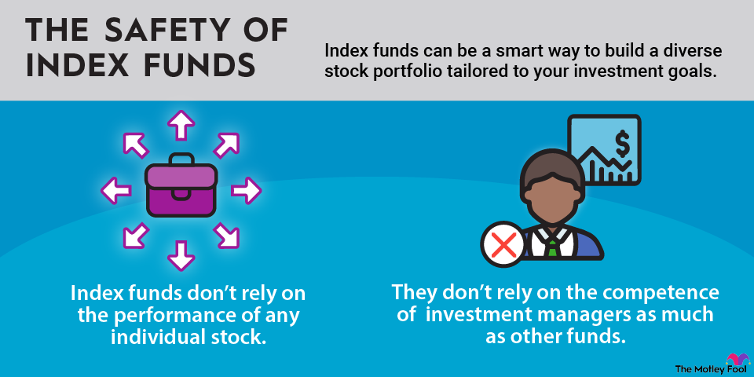

## Table of Contents

## What are ETFs and how do they work?

ETFs, or Exchange-Traded Funds, are a type of investment that works a lot like a mutual fund but trades on a stock exchange like a stock. They are designed to track the performance of a specific index, like the S&P 500, a commodity, bonds, or a basket of assets. This means when you buy shares of an ETF, you're essentially buying a small piece of all the investments that make up that index or basket.

When you want to invest in an ETF, you buy and sell shares through a brokerage account, just like you would with individual stocks. The price of an ETF share changes throughout the day as it is bought and sold on the stock exchange. This is different from mutual funds, which are only priced at the end of the trading day. ETFs can be a good way to diversify your investments because they let you spread your money across many different assets at once, which can help lower your risk.

## Why are ETFs considered a safe investment option for beginners?

ETFs are considered a safe investment option for beginners because they offer a way to spread out risk. Instead of putting all your money into one company's stock, an ETF lets you invest in a whole bunch of different companies or assets at once. This means if one company doesn't do well, it won't hurt your whole investment as much. It's like not putting all your eggs in one basket.

Another reason ETFs are good for beginners is that they are easy to buy and sell. You can trade them just like stocks, so you don't need to worry about complicated processes. Plus, because they track indexes or baskets of assets, you don't have to spend a lot of time researching which stocks to pick. This makes investing less stressful and more straightforward for someone just starting out.

## What are the different types of ETFs available for investment?

There are different kinds of ETFs you can invest in. One common type is the stock ETF, which follows the performance of a group of stocks. For example, an ETF might track the S&P 500, which means it tries to match how well the 500 big companies in that index are doing. Another type is the bond ETF, which focuses on bonds instead of stocks. These ETFs invest in government or corporate bonds, and they can be a good choice if you want a more stable investment.

There are also sector ETFs, which let you invest in specific parts of the economy, like technology, healthcare, or energy. If you think a certain industry will do well, you can use these ETFs to focus your investments there. Commodity ETFs are another option, and they track the price of things like gold, oil, or agricultural products. These can be a bit riskier but might be good if you want to diversify your portfolio beyond just stocks and bonds.

Finally, there are international ETFs, which give you a way to invest in companies or markets outside of your home country. These can help you spread your risk even more by investing in different parts of the world. And there are also inverse ETFs, which aim to do the opposite of what a specific index or sector does. These are more complex and usually used by experienced investors who want to bet against the market.

## How can diversification through ETFs reduce investment risk?

Diversification through ETFs can reduce investment risk by spreading your money across many different investments. Instead of putting all your money into one stock or one type of asset, an ETF lets you own a little bit of many different things. If one company or asset doesn't do well, it won't hurt your whole investment too much because the other parts of the ETF might still be doing okay. This is like not putting all your eggs in one basket; if one egg breaks, you still have plenty of others.

ETFs can include stocks from different industries, countries, or even different types of investments like bonds or commodities. This mix helps to balance out the ups and downs of the market. When one part of the market goes down, another part might go up, which can help keep your overall investment more stable. By using ETFs to diversify, you're giving yourself a better chance to weather the ups and downs of the market without losing too much money.

## What are some common strategies for investing in ETFs for long-term growth?

One common strategy for long-term growth with ETFs is to invest in broad market ETFs. These ETFs follow big indexes like the S&P 500 or the total stock market. By doing this, you're betting on the overall growth of the economy over time. It's a simple way to grow your money because you don't need to pick individual stocks. You just need to believe that the market as a whole will go up over the long run, which it usually does. This strategy is called passive investing because you're not trying to beat the market, just ride along with it.

Another strategy is to use a mix of different types of ETFs to balance risk and growth. You might put some money into stock ETFs for growth, some into bond ETFs for stability, and maybe even some into international ETFs to spread your risk across different countries. This approach is called asset allocation. It's like making a recipe where you mix different ingredients to get the flavor you want. By adjusting how much you put into each type of ETF, you can aim for a balance that fits your comfort with risk and your long-term goals.

A third strategy is called dollar-cost averaging. This means you invest a fixed amount of money into ETFs at regular intervals, like every month. By doing this, you buy more shares when prices are low and fewer when prices are high, which can help you pay a lower average price over time. This strategy can be especially good for long-term growth because it helps smooth out the ups and downs of the market. It's a disciplined way to invest without trying to guess when the market will go up or down.

## How do fees and expenses impact the returns of ETF investments?

Fees and expenses can make a big difference in how much money you make from your ETF investments over time. Every ETF has an expense ratio, which is a yearly fee that comes out of your investment. This fee pays for things like managing the ETF and keeping it running smoothly. Even if the expense ratio seems small, like 0.1% or 0.5%, it can add up over many years. The more you pay in fees, the less money you have left to grow and earn more money for you.

It's important to look at the expense ratio when you're choosing ETFs. Lower fees can mean more money in your pocket in the long run. For example, if you invest $10,000 in an ETF with a 0.1% expense ratio, you'll pay $10 a year in fees. But if you choose an ETF with a 1% expense ratio, you'll pay $100 a year. Over 20 or 30 years, that difference can really add up and affect how much your investment grows. So, picking ETFs with lower fees can help you keep more of your money working for you.

## What are the tax implications of investing in ETFs?

When you invest in ETFs, you need to think about taxes. ETFs can be more tax-friendly than other types of investments like mutual funds. This is because of how they are structured. ETFs usually have fewer taxable events, which means you might not have to pay as much in taxes while you're holding them. When you sell your ETF shares, you'll owe capital gains tax on any profit you make. If you hold the ETF for more than a year, you'll pay a lower long-term capital gains tax rate. But if you sell it within a year, you'll pay a higher short-term capital gains tax rate, which is the same as your regular income tax rate.

Another thing to know is that some ETFs might give you dividends. These are payments from the companies in the ETF, and they are usually taxed as regular income. However, if the ETF holds stocks that pay qualified dividends, those dividends might be taxed at a lower rate, similar to long-term capital gains. It's also worth noting that ETFs that focus on bonds or commodities can have different tax treatments. For example, bond ETFs might give you interest income, which is taxed as regular income. So, it's a good idea to understand the specific tax rules for the types of ETFs you're investing in to make the best choices for your situation.

## How can investors use ETFs to hedge against market volatility?

Investors can use ETFs to hedge against market volatility by choosing ETFs that are designed to move in the opposite direction of the market. These are called inverse ETFs. If the market goes down, an inverse ETF will go up, which can help protect your investment from big losses. For example, if you own a lot of stocks and you're worried about the market dropping, you can buy an inverse ETF to balance out those potential losses. It's like having an insurance policy for your investments.

Another way to use ETFs to hedge against volatility is by investing in ETFs that focus on assets that are less affected by stock market swings, like bonds or commodities. Bond ETFs, for instance, can provide a steady income and are generally more stable than stock ETFs. Commodity ETFs, like those that track gold, can also be a good hedge because commodities often move differently than stocks. By including these types of ETFs in your portfolio, you can reduce the impact of market ups and downs and make your overall investment more stable.

## What are the key factors to consider when selecting ETFs for a portfolio?

When picking ETFs for your portfolio, it's important to think about what you want to achieve with your investments. Start by looking at the ETF's investment goal. Does it match what you're trying to do? For example, if you want to grow your money over the long term, you might choose a stock ETF that follows a broad market index like the S&P 500. If you want something more stable, a bond ETF might be better. Also, think about how much risk you're okay with. ETFs that focus on specific sectors or countries can be riskier but might offer bigger rewards. It's all about finding the right balance for your goals and comfort level.

Another big thing to consider is the cost of the ETF. Every ETF has an expense ratio, which is a fee you pay every year for owning it. Lower fees mean more of your money stays in your pocket and can grow over time. So, it's a good idea to compare the expense ratios of different ETFs. Also, look at how well the ETF has done in the past. While past performance doesn't guarantee future results, it can give you an idea of how the ETF might behave. Finally, think about how easy it is to buy and sell the ETF. Some ETFs are more liquid, meaning they're easier to trade without affecting the price too much. All these factors together will help you pick the best ETFs for your portfolio.

## How can advanced investors use sector-specific and thematic ETFs to enhance their investment strategy?

Advanced investors can use sector-specific and thematic ETFs to focus their investments on parts of the economy or trends they think will do well. Sector-specific ETFs let you invest in industries like technology, healthcare, or energy. If you believe a certain sector will grow faster than the overall market, you can put more money into that sector's ETF. Thematic ETFs are a bit different because they focus on big trends or themes, like clean energy, artificial intelligence, or even trends like aging populations. By investing in these ETFs, you're betting on the growth of these themes over time. This can help you take advantage of new opportunities and potentially earn higher returns if your predictions are right.

Using these types of ETFs can also help advanced investors manage risk. By spreading their money across different sectors or themes, they can balance out their portfolio. For example, if you think technology will do well but you're worried about other parts of the market, you can put more money into a tech sector ETF while still keeping some money in other areas. This way, if one sector doesn't do as well as expected, the others might make up for it. It's like having different tools in your investment toolbox, each one helping you in different ways to reach your financial goals.

## What role do ETFs play in asset allocation and portfolio rebalancing?

ETFs are super helpful when you're figuring out how to spread your money across different types of investments, which is called asset allocation. Imagine you want to have some money in stocks, some in bonds, and maybe even some in commodities. Instead of buying each of these things one by one, you can use ETFs to easily get a mix of all these assets. For example, you might choose a stock ETF for growth, a bond ETF for stability, and a commodity ETF like gold to protect against inflation. This way, you can set up your portfolio to match your goals and how much risk you're okay with, all while keeping things simple.

ETFs also make it easier to keep your portfolio balanced, which is known as rebalancing. Over time, some parts of your investments might grow faster than others, throwing off your original plan. To fix this, you need to sell some of what's grown too much and buy more of what hasn't grown as much. ETFs make this process smoother because they're easy to buy and sell. You can quickly adjust how much you have in stocks, bonds, or other assets without having to deal with a bunch of different individual investments. This helps you stick to your strategy and keep your portfolio in line with what you want it to be.

## How can investors evaluate the performance of their ETF investments and make adjustments?

To evaluate how well your ETFs are doing, start by looking at their returns over time. You can compare the ETF's performance to the index it's supposed to follow, like the S&P 500 if it's a stock ETF. If the ETF is doing better than the index, that's great. But if it's doing worse, you might want to think about why. Also, check how the ETF has done compared to other ETFs in the same category. This can give you a sense of how it's doing against its peers. And don't forget to look at the expense ratio because fees can eat into your returns over time.

Once you've looked at the performance, you might need to make some changes to your portfolio. If an ETF isn't doing as well as you hoped, you could sell it and put your money into a different ETF that might do better. Or, if the ETF is doing great but now makes up too big a part of your portfolio, you might want to sell some of it to buy other ETFs and keep your investments balanced. This is called rebalancing. It's important to do this regularly to make sure your investments still match your goals and how much risk you're okay with.

## References & Further Reading

[1]: Bergstra, J., Bardenet, R., Bengio, Y., & Kégl, B. (2011). ["Algorithms for Hyper-Parameter Optimization."](https://papers.nips.cc/paper/4443-algorithms-for-hyper-parameter-optimization) Advances in Neural Information Processing Systems 24.

[2]: ["Advances in Financial Machine Learning"](https://www.amazon.com/Advances-Financial-Machine-Learning-Marcos/dp/1119482089) by Marcos Lopez de Prado

[3]: ["Evidence-Based Technical Analysis: Applying the Scientific Method and Statistical Inference to Trading Signals"](https://www.amazon.com/Evidence-Based-Technical-Analysis-Scientific-Statistical/dp/0470008741) by David Aronson

[4]: ["Machine Learning for Algorithmic Trading"](https://github.com/stefan-jansen/machine-learning-for-trading) by Stefan Jansen

[5]: ["Quantitative Trading: How to Build Your Own Algorithmic Trading Business"](https://www.amazon.com/Quantitative-Trading-Build-Algorithmic-Business/dp/1119800064) by Ernest P. Chan