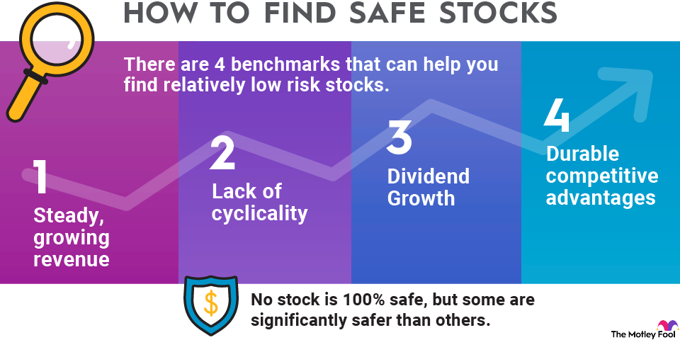

## Table of Contents

## What are investment industries?

Investment industries are the different areas where people can put their money to hopefully make more money in the future. These industries include things like stocks, where you buy a small part of a company; bonds, which are like loans you give to a company or government; and real estate, where you buy property to rent out or sell later for a profit. There are also other types like commodities, which are things like gold or oil, and mutual funds, which are a mix of different investments managed by professionals.

Each of these industries has its own risks and rewards. For example, stocks can go up a lot in value, but they can also go down quickly. Bonds are usually safer but don't grow as fast. Real estate can be a good long-term investment, but it requires a lot of money to start and can be hard to sell quickly. Understanding these differences helps people choose where to invest their money based on how much risk they are willing to take and how long they plan to keep their money invested.

## Why is safety important in investments?

Safety is important in investments because it helps protect your money. When you invest, you want to make sure you don't lose all of your money. Some investments are safer than others, and choosing safer options can help you keep your money secure. For example, if you put all your money in one company's stock and that company does poorly, you could lose a lot. But if you choose safer investments like government bonds, your money is more likely to be safe.

Another reason safety is important is because it can help you sleep better at night. Investing can be stressful, especially if you're worried about losing money. By choosing safer investments, you can feel more relaxed knowing that your money is less likely to disappear suddenly. This peace of mind is important because it lets you focus on other things in life without constantly worrying about your investments.

## What are the criteria for determining the safety of an investment industry?

The safety of an investment industry can be determined by looking at how stable it is. Stability means that the value of the investment doesn't change too much over time. For example, government bonds are usually very stable because they are backed by the government, which is less likely to go bankrupt. Another way to check safety is by looking at the history of the industry. If an industry has been around for a long time and has done well, it might be safer than a new industry that hasn't proven itself yet.

Another important factor is how diversified the investment is. Diversification means spreading your money across different types of investments. If you put all your money in one place, like one company's stock, it's riskier. But if you spread your money around, like buying stocks from different companies or also investing in bonds, it's safer. Also, consider the economic conditions. Some industries do better in good economic times, while others are more stable during bad times. Understanding these conditions can help you pick safer investments.

Lastly, the safety of an investment can also depend on the regulations and oversight of the industry. Industries that are well-regulated by government agencies are often safer because there are rules in place to protect investors. For example, banks are heavily regulated, which makes them generally safer places to invest your money. By considering these factors—stability, history, diversification, economic conditions, and regulation—you can better judge the safety of an investment industry.

## Which industries are considered safe for beginners?

For beginners, some of the safest industries to invest in are savings accounts and government bonds. Savings accounts are very safe because they are usually backed by the government, which means your money is protected even if the bank has problems. Government bonds are also safe because they are loans you give to the government, and the government is very unlikely to go bankrupt. These investments might not make you rich quickly, but they are good for keeping your money safe while it grows a little over time.

Another safe industry for beginners is mutual funds, especially those that focus on bonds or a mix of stocks and bonds. Mutual funds are managed by professionals who spread your money across many different investments, which makes them less risky. This way, if one investment does badly, the others might still do well, protecting your money. While mutual funds can have some risk, they are generally safer than picking individual stocks, which can be more unpredictable for someone just starting out.

## How do government regulations impact the safety of investment industries?

Government regulations help make investment industries safer by setting rules that companies and financial institutions must follow. These rules are there to protect investors from fraud and to make sure that companies are honest about their financial health. For example, the government might require banks to keep a certain amount of money in reserve, which helps prevent them from going bankrupt and losing people's money. By having these regulations, the government makes sure that the investment industry is more stable and less risky for people who are putting their money into it.

Regulations also help by making sure that investors get clear and accurate information about their investments. This means that companies have to tell the truth about how they are doing and what risks are involved. When investors have good information, they can make better choices about where to put their money. This transparency reduces the chance of big surprises that could hurt investors. Overall, government regulations play a big role in keeping investment industries safe and trustworthy for everyone.

## What role does market stability play in the safety of an industry?

Market stability is really important for the safety of an industry. When an industry is stable, it means that the prices of things in that industry don't go up and down a lot. This makes it safer for people to invest because they can predict better what will happen to their money. For example, if you invest in a stable industry like utilities, which includes things like electricity and water, you know that people will always need these services, so the industry is less likely to have big ups and downs.

On the other hand, if an industry is not stable, it can be riskier to invest in it. Industries like technology can change a lot because new inventions can make old ones less useful very quickly. This can cause the value of your investment to go up and down a lot, which is not good if you want to keep your money safe. So, when thinking about where to invest, it's a good idea to look at how stable the industry is, because a more stable industry usually means a safer investment.

## Can you explain the concept of risk versus reward in safe investment industries?

When you invest, you have to think about risk and reward. Risk is the chance that you could lose your money. Reward is the money you could make from your investment. In safe investment industries, like savings accounts and government bonds, the risk is low. This means you are not likely to lose your money. But because the risk is low, the reward is also low. You won't make a lot of money quickly, but your money will grow slowly and safely.

Even in safe industries, there is still some risk and reward to think about. For example, if you put your money in a savings account, the reward is the interest you earn. But if the bank has problems, there's a tiny risk you could lose some money. Government bonds are even safer because the government is unlikely to go bankrupt. The reward here is the interest the government pays you. So, in safe industries, you trade a higher reward for lower risk, which means your money is more secure but grows more slowly.

## How do economic cycles affect the safety of different industries?

Economic cycles are the ups and downs in the economy that happen over time. These cycles can make some industries safer or riskier. When the economy is doing well, industries like technology and real estate might be safer because more people have money to spend on new gadgets and houses. But when the economy is not doing well, these industries can become riskier because people have less money to spend, and the value of their investments might go down.

On the other hand, some industries are safer during bad economic times. For example, utilities like electricity and water are always needed, so they are more stable even when the economy is down. Also, government bonds are usually safer because the government is less likely to go bankrupt, even during tough economic times. So, understanding economic cycles can help you pick industries that are safer at different times.

## What are some historical examples of safe investment industries?

Throughout history, some industries have been known for being safe places to put money. One example is savings accounts. For a long time, people have used savings accounts to keep their money safe because they are backed by the government. This means that even if a bank has problems, the government will help make sure you don't lose your money. Savings accounts don't make you rich quickly, but they are a safe way to grow your money a little over time.

Another historical example of a safe investment industry is government bonds. Governments have been issuing bonds for centuries, and they are considered very safe because the government is unlikely to go bankrupt. When you buy a government bond, you are lending money to the government, and they pay you back with interest. This has been a reliable way for people to keep their money safe and earn a steady, if small, return on their investment.

## How can diversification within safe industries enhance investment safety?

Diversification means spreading your money across different types of investments. Even within safe industries, like savings accounts and government bonds, you can make your money even safer by not putting all of it in one place. For example, instead of putting all your money in one bank's savings account, you could spread it across different banks. This way, if something goes wrong with one bank, you won't lose all your money. The same goes for government bonds; you could buy bonds from different governments or different types of bonds, which makes your investment safer.

By diversifying within safe industries, you lower the risk even more. If one type of investment does badly, the others might still do well, which helps protect your money. For example, if you have money in both savings accounts and government bonds, and the interest rates on savings accounts go down, the interest from your bonds might still be good. This balance helps keep your money safe and growing, even if one part of your investment doesn't do as well as you hoped.

## What advanced metrics should experts use to assess the safety of an industry?

Experts use advanced metrics to get a deeper look at how safe an industry is. One important metric is the volatility of the industry, which shows how much the prices of investments in that industry go up and down. If an industry has low volatility, it means it's more stable and safer. Another metric is the beta of an investment, which compares how much it moves with the overall market. A lower beta means the investment is less risky because it doesn't swing as much with the market. Experts also look at the credit ratings of companies or governments in the industry. High credit ratings mean they are less likely to have financial problems, which makes the industry safer.

Another set of metrics experts use is related to financial ratios, like the debt-to-equity ratio and the interest coverage ratio. The debt-to-equity ratio shows how much a company is borrowing compared to what it owns. A lower ratio means the company is less risky because it's not relying too much on borrowed money. The interest coverage ratio shows if a company can pay its interest on debts. A higher ratio means the company is safer because it can easily cover its interest payments. By looking at these advanced metrics, experts can better understand the safety of an industry and make smarter investment choices.

## How do global economic trends influence the safety of investment industries?

Global economic trends can really change how safe an investment industry is. When the world economy is doing well, more people have money to spend, which can make industries like technology and real estate safer because there's more demand for their products. But if the world economy starts to struggle, these same industries can become riskier because people cut back on spending, and the value of investments can drop. So, paying attention to what's happening around the world can help you pick safer industries to invest in.

Some industries are more affected by global trends than others. For example, industries that depend a lot on trade, like manufacturing or commodities, can be riskier during times of global economic uncertainty because trade can slow down. On the other hand, industries like utilities and healthcare are usually safer because people always need electricity, water, and medical care, no matter what's happening in the world economy. Understanding these trends can help you make better choices about where to put your money to keep it safe.

## References & Further Reading

[1]: Lopez de Prado, M. (2018). ["Advances in Financial Machine Learning."](https://www.amazon.com/Advances-Financial-Machine-Learning-Marcos/dp/1119482089) Wiley.

[2]: Chan, E. P. (2009). ["Quantitative Trading: How to Build Your Own Algorithmic Trading Business."](https://github.com/ftvision/quant_trading_echan_book) Wiley.

[3]: Aronson, D. (2006). ["Evidence-Based Technical Analysis: Applying the Scientific Method and Statistical Inference to Trading Signals."](https://www.wiley.com/en-us/Evidence+Based+Technical+Analysis%3A+Applying+the+Scientific+Method+and+Statistical+Inference+to+Trading+Signals-p-9780470008744) Wiley.

[4]: Jansen, S. (2018). ["Machine Learning for Algorithmic Trading."](https://github.com/stefan-jansen/machine-learning-for-trading) Packt Publishing.

[5]: Bergstra, J., Bardenet, R., Bengio, Y., & Kégl, B. (2011). ["Algorithms for Hyper-Parameter Optimization."](https://proceedings.neurips.cc/paper/2011/file/86e8f7ab32cfd12577bc2619bc635690-Paper.pdf) Advances in Neural Information Processing Systems 24.