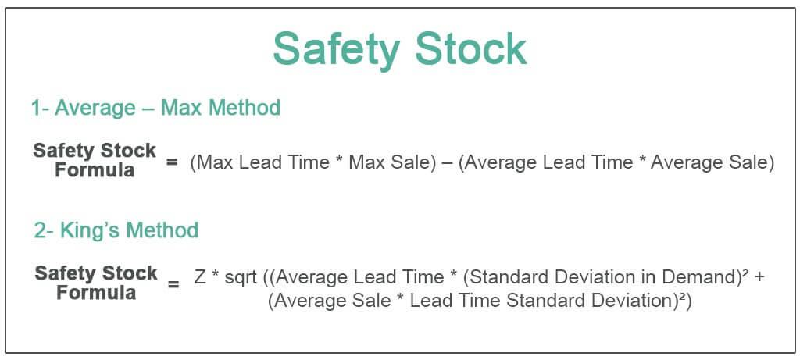

In recent years, algorithmic trading and automated investment platforms have gained significant traction, promising enhanced investment safety and efficiency. These systems utilize complex mathematical models and algorithms to automate trading processes, minimizing human intervention and potentially reducing errors. Betterment, a leading robo-advisor, is at the forefront of this technological evolution, providing sophisticated algorithmic trading solutions to its clients. With a focus on data-driven decision-making and automation, Betterment has enabled investors to optimize their portfolios efficiently.

As we approach 2024, investors are increasingly interested in understanding how Betterment's investment safety measures align with its advanced algorithmic trading techniques. While algorithmic trading offers numerous benefits, such as speed and precision, it also necessitates rigorous safety protocols to mitigate associated risks, including cybersecurity threats and market volatility. This article explores the intricacies of Betterment's investment safety protocols and its algo trading tools, highlighting the importance of robust systems in sustaining investor confidence and trust.

By understanding these elements, investors can make informed decisions about their portfolio management strategies in 2024. Betterment's commitment to innovation and security provides assurance for both seasoned and novice investors seeking to navigate the complexities of modern financial markets. As technology continues to reshape the investment landscape, platforms like Betterment are pivotal in offering reliable and effective solutions for enhanced portfolio management.

## Table of Contents

## Understanding Betterment's Investment Safety

Betterment employs a comprehensive suite of security measures to protect its clients' investments, with a strong emphasis on both technological and regulatory safeguards. A fundamental aspect of Betterment’s security strategy is the use of two-factor authentication (2FA), which adds an extra layer of security by requiring users to verify their identity through an additional device or application. This measure significantly reduces the risk of unauthorized access to investment accounts.

In addition to technological safeguards, Betterment ensures investment safety through financial protections such as Securities Investor Protection Corporation (SIPC) insurance. This insurance protects clients' securities up to $500,000, providing an essential safety net against broker-dealer failure. Furthermore, Betterment adheres to a non-commingling of funds policy, which distinctly separates client assets from the company’s own operational funds. This separation ensures that clients’ investments remain secure and unaffected by the financial status of Betterment itself.

Uninvested cash in Betterment accounts is protected by Federal Deposit Insurance Corporation (FDIC) coverage, offering further peace of mind. The FDIC coverage applies to cash reserves, thereby safeguarding clients’ uninvested funds up to the standard insured amount of $250,000 per depositor, per insured bank, for each account ownership category.

To ensure ongoing compliance with industry standards, Betterment undertakes regular external audits, which evaluate both financial practices and technological security measures. The platform’s registration with the Financial Industry Regulatory Authority (FINRA) is a testament to its commitment to adhering to stringent regulatory requirements. By complying with these regulations, Betterment aligns itself with best practices in the financial services industry, enhancing investor trust.

Collectively, Betterment’s dedication to transparency and security fosters confidence among investors, assuring them of the safety of their digital investments. These measures not only protect client assets but also reinforce Betterment’s reputation as a trustworthy and reliable robo-advisor in the fintech landscape.

## Algotrading Capabilities of Betterment

Algorithmic trading stands as a fundamental aspect of Betterment's approach to optimizing investment portfolios. The use of data-driven algorithms is pivotal in executing investment strategies designed for enhanced efficiency and maximized returns. Integral to this process is automatic portfolio rebalancing, which ensures that an investor's portfolio aligns with their desired asset allocation continually. Rebalancing is automated based on the initial allocation chosen, and it occurs periodically or when significant deviations arise from market activity.

Betterment implements tax-loss harvesting, a method to minimize tax liabilities by selling securities at a loss to offset capital gains taxes. This process is automated and seamlessly integrated, allowing clients to benefit from tax efficiencies which can potentially improve net investment results. The algorithms used in Betterment's platform are rooted in modern portfolio theory (MPT), which facilitates the formulation of portfolios that are tailored to an investor's unique risk preference and financial objectives. MPT aids in achieving an optimal asset mix, aimed at maximizing expected return for a given level of risk.

One of the advantages of Betterment's automated system is the consistent application of investment strategies without the bias or errors that can accompany human decision-making. Through automated reallocation, the system rapidly adjusts to market dynamics, ensuring that investment decisions adhere rigorously to pre-set strategies and risk parameters. This mitigation of human error is crucial for maintaining disciplined investment approaches, especially during periods of market [volatility](/wiki/volatility-trading-strategies).

Overall, Betterment's [algorithmic trading](/wiki/algorithmic-trading) capabilities equip investors with precision-built portfolios that operate efficiently and transparently. By eliminating emotional decision-making, these automated solutions aim to deliver a steady and systematic approach to wealth management, prioritizing both the security and growth potential of the client's assets.

## Why Investment Safety Matters in Algo Trading

Investment safety plays a pivotal role in algorithmic trading, primarily because these systems operate with minimal human intervention. Algorithmic trading platforms such as Betterment utilize sophisticated software to make trading decisions autonomously, aiming for efficiency and maximized returns. However, this autonomy necessitates robust security measures to mitigate various risks, particularly cybersecurity threats.

The integrity and reliability of the algo trading process hinge on safeguarding data privacy and maintaining transaction consistency. With large volumes of data processed and analyzed by algorithms, protecting sensitive financial information becomes crucial. Effective encryption methods and secure data storage solutions are essential in preventing unauthorized access and breaches. This ensures that client data, including trading strategies and account details, remain confidential and protected from cyber threats.

Betterment's attention to security underpins the execution of investment strategies as intended, without the risk of unauthorized alterations. Given that algorithms follow predefined sets of rules, any security lapse could lead to deviations from the intended trading patterns, potentially resulting in financial losses. Therefore, the platform implements stringent security protocols, including two-[factor](/wiki/factor-investing) authentication and regular security audits, to maintain the integrity of its operations.

Furthermore, investment safety in algorithmic trading also serves to protect against market manipulations and fraudulent activities. Automated systems are susceptible to exploitation if not adequately secured, as malicious actors might attempt to manipulate market conditions to their advantage. Betterment's robust security infrastructure ensures that its trading algorithms are insulated from such market irregularities, preserving the fairness and transparency of its investment processes.

In summary, investment safety is indispensable in algorithmic trading platforms, where technology governs key investment decisions. By addressing cybersecurity risks, maintaining data privacy, and preventing unauthorized strategy alterations, platforms like Betterment can safeguard investor interests while optimizing trading performance. These measures not only enhance trust but also provide a resilient framework for automated trading in a rapidly evolving financial landscape.

## The Future of Betterment in 2024

As we move into 2024, the fintech landscape continues to evolve, with Betterment poised to innovate further in automated investing solutions. Betterment's integration of [artificial intelligence](/wiki/ai-artificial-intelligence) (AI) and [machine learning](/wiki/machine-learning) techniques is anticipated to significantly enhance its algorithmic trading efficiency. By leveraging vast datasets and sophisticated algorithms, Betterment aims to optimize trading decisions and portfolio management with minimal human intervention, thereby increasing execution speed and market responsiveness.

Investors can expect more personalized investment strategies, as AI systems are increasingly capable of predicting and adapting to individual financial behaviors. Betterment's use of AI-driven analytics allows for a deeper understanding of client preferences and risk profiles, enabling the construction of customized portfolios that align more closely with each investor's objectives. This personalization could improve investment outcomes by aligning strategies with personal financial goals and market conditions.

Moreover, Betterment's commitment to sustainable investing is likely to expand, supporting the growing demand for Environmental, Social, and Governance ([ESG](/wiki/esg-investing)) portfolios. These portfolios are tailored to investors' ethical values, promoting sustainable business practices. By integrating ESG criteria into portfolio construction, Betterment not only seeks to meet investor demand but also aims to influence positive corporate behavior, setting the stage for long-term sustainable returns.

The platform's ongoing enhancements ensure it remains a competitive choice for both novice and seasoned investors. By maintaining a focus on innovation, Betterment continues to provide a robust and secure investment management experience. This commitment to both technological advancement and client security positions Betterment as a leader in the rapidly evolving world of automated investing. As such, investors seeking safety and growth can view Betterment as a reliable partner in navigating the complexities of modern financial markets.

## Conclusion

Betterment's combination of investment safety and algorithmic trading offers a compelling solution for investors in 2024. With its stringent security protocols and advanced technology, Betterment ensures that investments are both effective and secure. The comprehensive safety measures, such as two-factor authentication and insurance protections like FDIC coverage for cash reserves, foster an environment of trust and reliability. This allows investors to enjoy peace of mind, focusing on long-term wealth building strategies without the necessity for constant oversight of market fluctuations.

The platform's commitment to innovation has positioned it as a leader in the robo-advisory sector. Betterment's diverse suite of algorithmic tools facilitates optimal portfolio management by automatically adjusting investments in response to market changes. Features like automatic rebalancing and tax-loss harvesting add layers of efficiency and potential return optimization, ensuring investments are consistently aligned with clients' financial goals. This innovation not only sets an industry standard but also showcases the transformative potential of fintech solutions within portfolio management.

As the financial landscape continues to shift, Betterment remains a reliable partner for automated and secure investment management. By marrying safety measures with cutting-edge algorithmic capabilities, the platform supports investors in navigating the complexities of modern financial markets. As investors weigh their options in 2024, Betterment's alignment of technology and security helps it stand out as a forward-thinking choice in the pursuit of financial growth and protection.

## References & Further Reading

[1]: Bergstra, J., Bardenet, R., Bengio, Y., & Kégl, B. (2011). ["Algorithms for Hyper-Parameter Optimization."](https://papers.nips.cc/paper/4443-algorithms-for-hyper-parameter-optimization) Advances in Neural Information Processing Systems 24.

[2]: ["Advances in Financial Machine Learning"](https://www.amazon.com/Advances-Financial-Machine-Learning-Marcos/dp/1119482089) by Marcos Lopez de Prado

[3]: ["Evidence-Based Technical Analysis: Applying the Scientific Method and Statistical Inference to Trading Signals"](https://www.amazon.com/Evidence-Based-Technical-Analysis-Scientific-Statistical/dp/0470008741) by David Aronson

[4]: ["Machine Learning for Algorithmic Trading"](https://github.com/stefan-jansen/machine-learning-for-trading) by Stefan Jansen

[5]: ["Quantitative Trading: How to Build Your Own Algorithmic Trading Business"](https://www.amazon.com/Quantitative-Trading-Build-Algorithmic-Business/dp/1119800064) by Ernest P. Chan