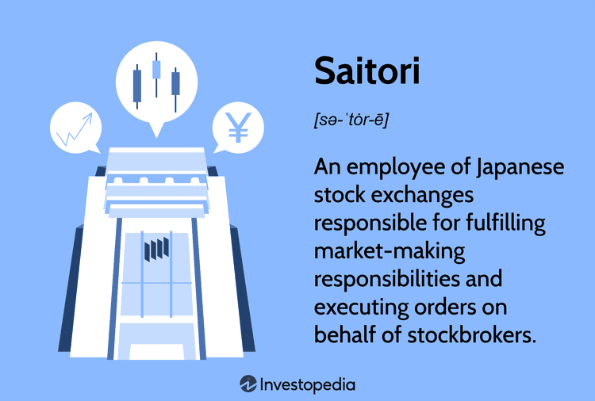

Algorithmic trading plays a pivotal role in today's global financial markets by enhancing efficiency, speed, and accuracy in executing trades. This method relies on complex algorithms and mathematical models to carry out trading strategies, significantly reducing the reliance on human intervention and manual processes. As technology continues to advance, algorithmic trading has come to dominate a large portion of the trading volume across major stock exchanges, such as the New York Stock Exchange (NYSE) and the Tokyo Stock Exchange (TSE).

A key component within this sophisticated trading environment is the role of a "saitori." Saitoris are Japanese market specialists who traditionally acted as intermediaries on the Tokyo Stock Exchange, facilitating trades and managing orders to maintain market orderliness. In their modern incarnation, saitoris are adapting to the technological shift brought about by algorithmic trading while retaining their essential function in ensuring trade execution quality and market liquidity.

The integration of saitoris with algorithmic systems marks a significant transformation in stock market dynamics, facilitating a more seamless trading process that benefits from both human oversight and automated precision. Saitoris, with their deep understanding of market mechanics and order flow, complement algorithm-driven strategies by mitigating unforeseen risks and contributing to market stability. As algorithmic trading continues to evolve, the interaction between human market experts and algorithmic trading systems will likely become more synergistic, blending the best of human expertise and machine efficiency. This evolution mandates continuous adaptation and innovation, emphasizing the enduring value of saitoris in contemporary trading environments.

## Table of Contents

## What is a Saitori?

A "saitori" is a term originating from the Japanese stock market, referring to a broker-dealer responsible for facilitating trades on the exchange floor. The primary duty of a saitori involves acting as an intermediary between buyers and sellers, ensuring that transactions are executed efficiently and transparently. This role is somewhat parallel to that of specialists on the New York Stock Exchange (NYSE), who perform similar functions by maintaining liquidity, managing order flows, and providing price stability within the market.

In a comparison between saitoris and NYSE specialists, both play crucial roles in maintaining market integrity. However, the NYSE specialists often have more pronounced responsibilities related to price discovery and balancing supply and demand for securities. On the other hand, the role of saitoris is more focused on the orderly execution and settlement of trades, given the unique structure and practices within Japanese exchanges.

Over the years, the role of a saitori has undergone significant evolution due to technological advancements. Historically, saitoris operated manually on the trading floors, using physical notes and verbal communication to match buy and sell orders. However, with the advent of electronic trading platforms and algorithmic trading systems, much of the manual intervention has been reduced. Today's saitoris often leverage sophisticated technology to enhance their ability to manage trades effectively. Electronic order [books](/wiki/algo-trading-books), high-speed communication networks, and algorithmic tools have streamlined the process, allowing for faster transaction times and improved market efficiency.

Despite these technological shifts, the foundational responsibilities of saitoris remain. They continue to play a key role in ensuring fair and orderly markets, adapting their traditional skills to integrate with modern trading technologies. This adaptation underscores the enduring importance of human oversight in increasingly automated trading environments. As the landscape of financial markets continues to evolve, the role of saitoris may transform further, but their expertise will remain invaluable in bridging the gap between technology and prudent market practices.

## Role of Saitori in Algorithmic Trading

Saitoris, traditionally known as intermediaries in the Japanese stock market, play a crucial role in maintaining market equilibrium by facilitating [liquidity](/wiki/liquidity-risk-premium) and reducing market [volatility](/wiki/volatility-trading-strategies). Historically, their primary responsibility has been to match buy and sell orders, ensuring smooth operations and stabilizing prices during periods of intense trading activity or market stress. This function directly contributes to maintaining an orderly market, which is essential for investor confidence and the efficient functioning of financial systems.

With the rise of [algorithmic trading](/wiki/algorithmic-trading), the traditional role of saitoris has been influenced significantly. Algorithmic trading, characterized by the use of computer programs to execute trades based on pre-defined criteria, has revolutionized trading by enhancing efficiency, speed, and precision. The prevalence of high-frequency trading ([HFT](/wiki/high-frequency-trading-strategies)) strategies, which execute numerous transactions at incredibly high speeds, challenges the traditional manual functions performed by saitoris. As algorithms now handle the bulk of transactional activities, the role of saitoris has evolved from merely matching orders to providing oversight and ensuring algorithm-driven trades do not lead to discrepancies or market disturbances.

Integrating saitoris with algorithmic systems presents several advantages for seamless trading. One considerable benefit is improved liquidity. By coordinating with advanced trading algorithms, saitoris can oversee and adjust liquidity provisions dynamically, allowing for more responsive and efficient management of order flows. For instance, when market demand shifts abruptly, saitoris, empowered with algorithmic insights, can intervene to manage order imbalances and prevent excessive volatility, thus contributing to overall market stability.

Moreover, the collaboration of saitoris with algorithmic systems reduces potential instances of market anomalies, such as flash crashes, which are rapid, deep, and volatile drops in security prices. By ensuring that algorithmic trading systems adhere to regulatory frameworks and market norms, saitoris act as a vital check against unrestrained algorithmic behavior that could otherwise disrupt market function.

To facilitate their enhanced roles, saitoris now utilize sophisticated technology platforms that integrate trading analytics, market surveillance, and risk management tools. By leveraging data-driven insights, they can anticipate and mitigate potential risks, thus making informed decisions that support market integrity. This transformation not only exemplifies the benefits of technological integration but also highlights the continuing relevance of human oversight amidst increasingly automated trading environments.

In essence, the modern saitori must balance the efficiencies brought by algorithmic trading with the indispensable need for oversight, ensuring that technology serves the objective of market equilibrium rather than overwhelming it.

## Algorithmic Trading: An Overview

Algorithmic trading refers to the use of computer algorithms to automate trading decisions on financial markets. This form of trading utilizes pre-programmed instructions accounting for various variables such as time, price, and [volume](/wiki/volume-trading-strategy), to execute trades at speeds and frequencies that are impossible for a human trader.

Algorithmic trading functions by leveraging complex mathematical models and system architectures to make profitable trading decisions. The algorithms monitor market conditions in real-time and execute trading strategies based on predefined criteria. They analyze large datasets to identify trading opportunities and execute orders with minimal human intervention. The reliance on data analysis and real-time processing allows these algorithms to quickly adapt to changing market conditions, thereby optimizing the timing and execution of trades.

One of the primary benefits of algorithmic trading is its speed. Algorithms can process and analyze vast amounts of market data in milliseconds, considerably faster than any human trader. This speed advantage allows traders to capitalize on short-lived market inefficiencies that arise briefly due to latency in information [dispersion](/wiki/dispersion-trading) across the market. Transparency and reduced transaction costs are other significant advantages. By automating the process, human error is minimized, and precise, emotionless decision-making is facilitated, which often leads to better outcomes compared to manual trading.

Efficiency is another key benefit where algorithms can streamline numerous trades with minimal human intervention, reducing the transaction times and enhancing overall market efficiency. Automation reduces the likelihood of human errors, such as typographical mistakes in trades, ensuring a higher level of accuracy.

Algorithmic trading incorporates various strategies, each designed to leverage specific market conditions. One of the most common strategies is trend-following, which relies on indicators to identify the direction of market [momentum](/wiki/momentum) and execute trades accordingly. This strategy operates on the assumption that prices that have moved in a certain direction will continue to do so.

Another prevalent strategy in algorithmic trading is [arbitrage](/wiki/arbitrage). This involves the exploitation of price discrepancies between different markets or instruments. For instance, when the price difference of the same asset or related assets in different markets exceeds transaction costs, an algorithm can simultaneously conduct a buy and sell operation to capitalize on the discrepancy. This quick action narrows price gaps, contributing to overall market efficiency.

In essence, algorithmic trading's integration in modern markets signifies a paradigm shift towards fully automated and high-speed trading environments, where sophisticated algorithms optimize performance through the strategic execution of pre-designed instructions, improving liquidity and market quality.

## Real-World Examples of Saitori and Algorithmic Trading

In recent years, the integration of saitoris with algorithmic trading systems has been exemplified by several successful case studies in Japan. This fusion has helped achieve key objectives such as managing high-frequency trading and mitigating market volatility, demonstrating a crucial synergy between traditional expertise and advanced technological innovations. 

One notable case illustrating the successful integration of saitoris with algorithms is the Tokyo Stock Exchange (TSE). The TSE utilizes a hybrid system where saitoris, or market makers, work alongside sophisticated algorithms that execute high-frequency trades. This system leverages the strengths of both human intuition and real-time data processing. In periods of extreme volatility, saitoris intervene to provide market orders, ensuring liquidity and a semblance of order during turbulent times[1]. For instance, the role of saitoris in intervening during the 2010 Flash Crash helped stabilize the Japanese market compared to others[2].

Moreover, in managing high-frequency trading, saitoris have been instrumental in calibrating algorithmic parameters to maintain trading fluidity and market stability. High-frequency trading relies on algorithms that make decisions in microseconds. Saitoris, equipped with an understanding of market nuances that algorithms might overlook, adjust these systems, ensuring they do not contribute to excessive volatility. By setting limits on parameters like maximum order size and enforcing breaks in trade continuity, saitoris help algorithms operate within safe thresholds, minimizing the risk of disruptive trading patterns[3].

The impact of saitoris on trading efficiency and market stability in Japan is further highlighted in situations where algorithms alone might falter. In a scenario where multiple algorithmic systems could simultaneously opt to sell a declining asset, potentially leading to a 'flash crash,' saitoris step in to either slow down orders or inject market orders to counteract this cascade, thus stabilizing the price. This hybrid approach not only enhances efficiency by enabling fast executions but also reassures investors of the market's robustness, leading to increased investor confidence and participation.

Moreover, Japanese regulatory frameworks have evolved to support this synergistic approach. By mandating the presence of saitori oversight in high-frequency trading environments, regulations ensure a balance between technological prowess and human market sense. This regulation helps in maintaining an orderly and fair trading environment, benefiting both retail and institutional investors[4].

In conclusion, these examples demonstrate the positive impact of integrating saitoris with algorithmic trading systems. By blending human expertise with computational precision, Japan has established a model where traditional market mechanisms enhance the robustness and efficacy of high-frequency trading platforms, thus ensuring greater market stability and efficiency.

---

[1] Tokyo Stock Exchange, Overview of Market Structures.
[2] Financial Services Agency, Report on the 2010 Flash Crash.
[3] Japan Exchange Group, Algorithms in the Modern Marketplace.
[4] Ministry of Economy, Trade and Industry, The Role of Human Oversight in High-Frequency Trading.

## Challenges and Considerations

The rise of full automation in financial markets presents significant challenges for saitoris, who traditionally play a crucial role in facilitating trades and maintaining market order. As algorithmic trading becomes more prevalent, the need for human intervention in trading processes diminishes, potentially rendering the role of saitoris obsolete. One major challenge is maintaining the unique human touch and decision-making that saitoris provide. Unlike algorithms, saitoris can adapt dynamically to unforeseen events and possess an intrinsic understanding of market sentiment, which can be critical during erratic market conditions.

Ethical and regulatory considerations are pivotal in the landscape of algorithmic trading. Algorithms can execute large volumes of transactions at high speeds, often surpassing human capabilities. This raises concerns about fairness and transparency in the market. Regulators are tasked with ensuring that algorithmic trading does not lead to market manipulation or unfair advantages for certain market participants. The "flash crash" of 2010, where stock indices in the United States quickly plummeted and rebounded within minutes, illustrates the potential dangers of algorithmic trading without adequate safeguards. Regulatory bodies, such as the Securities and Exchange Commission (SEC) and the Financial Conduct Authority (FCA), enforce guidelines to monitor algorithmic activities and mandate disclosures to protect market integrity.

The future outlook for saitoris amidst the evolution of algorithmic trading is uncertain. While automation increases efficiency, the distinctive human abilities of saitoris to interpret complex, unstructured data and manage nuanced market dynamics remain valuable. The potential solution lies in a hybrid model, where saitoris collaborate with algorithmic systems to leverage technology while maintaining human oversight. This combination could enhance trading efficiency and market resilience, balancing the strengths of both human judgment and computational precision.

As technology continues to advance, saitoris must adapt with ongoing education and training to integrate algorithmic insights into their roles effectively. The financial sector could also explore augmenting algorithms with [artificial intelligence](/wiki/ai-artificial-intelligence) and [machine learning](/wiki/machine-learning) to capture behavioral and psychological aspects of trading traditionally managed by saitoris. This would not only extend the relevance of saitoris but also promote a more robust and adaptable market environment. In conclusion, as algorithmic trading evolves, the role of saitoris must transform in tandem, ensuring that trading systems remain fair, ethical, and efficient.

## Conclusion

The integration of saitoris in the context of algorithmic trading underscores their enduring significance in modern financial markets. While algorithmic trading facilitates unprecedented speeds and efficiencies, the role of saitoris remains vital for maintaining market liquidity and stability. Their traditional responsibilities have evolved, adapting to technological advancements while preserving their central function as intermediaries ensuring the seamless execution of trades.

The landscape of trading continues to transform with technological innovations. The shift towards automation presents both opportunities and challenges for saitoris, as they must complement algorithmic systems to enhance market operations. Their nuanced understanding of local markets, combined with automated systems, provides a balanced approach in managing market volatility, particularly in scenarios where high-frequency trading could exacerbate fluctuations.

Continual adaptation is crucial for success in these dynamic markets. Saitoris and trading systems must evolve together, integrating human expertise with algorithmic precision. This synergy allows for robust market environments, where technology aids in efficient trading while human oversight ensures ethical and regulatory compliance. As markets advance, the future of trading will likely hinge on this harmonious blending of traditional roles and modern techniques, underscoring the enduring necessity for adaptability and innovation.

## References & Further Reading

[1]: Lee, R. A. (2010). ["The Role of Market Makers in High Frequency Trading."](https://www.sciencedirect.com/science/article/pii/S0927538X2300255X) SSRN Electronic Journal.

[2]: Hasbrouck, J., & Saar, G. (2013). ["Low-latency trading."](https://papers.ssrn.com/sol3/papers.cfm?abstract_id=1695460) Journal of Financial Markets, 16(4), 646-679.

[3]: Jain, P. (2022). ["Algorithmic Trading and Market Microstructure."](https://scholar.google.com/citations?user=0_5gwv0AAAAJ&hl=en) Springer.

[4]: Harris, L. (2003). ["Trading and Exchanges: Market Microstructure for Practitioners"](https://academic.oup.com/book/52292) by Lawrence Harris. 

[5]: Hirsa, A. (2016). ["Introduction to Algorithmic Trading Strategies."](https://www.amazon.com/Introduction-Algorithmic-Trading-Advanced-Strategies/dp/0470689544) Chapman and Hall/CRC.