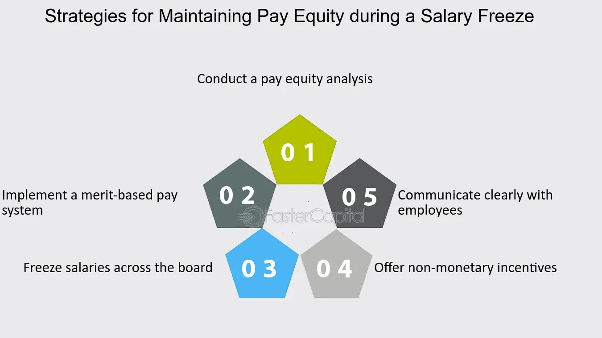

## Table of Contents

## What is a salary freeze?

A salary freeze is when a company decides not to increase the salaries of its employees for a certain period of time. This can happen even if employees usually get raises every year. Companies might do this because they are trying to save money or because they are going through tough financial times.

During a salary freeze, employees keep getting paid the same amount they were getting before the freeze started. This can be frustrating for employees because their pay does not go up, even if they are working hard or if the cost of living is going up. It's important for companies to explain why they are doing a salary freeze and to be clear about how long it will last.

## Why do companies implement salary freezes?

Companies implement salary freezes mainly to save money. When a business is not doing well financially, it might need to cut costs to stay afloat. Instead of laying off workers, a company might choose to freeze salaries. This means they don't have to spend more money on payroll, which can help them get through tough times without losing staff.

Sometimes, salary freezes are used even when a company is doing okay but wants to be careful with money. For example, if the economy is uncertain, a company might freeze salaries to make sure they have enough money saved up for unexpected problems. This way, they can keep their business stable and avoid bigger issues down the road.

## How does a salary freeze affect employees?

A salary freeze can make employees feel unhappy and worried. When people don't get a raise, they might feel like their hard work isn't being rewarded. This can lead to lower morale and less motivation at work. Employees might start looking for other jobs where they can earn more money, which can cause the company to lose good workers.

Also, a salary freeze can make it hard for employees to keep up with the cost of living. Prices for things like food, rent, and gas can go up over time, but if salaries stay the same, it can be tough for employees to make ends meet. This financial stress can affect their well-being and performance at work, making it harder for them to focus on their job.

## What are the common reasons behind a salary freeze?

Companies often freeze salaries to save money when they are going through tough financial times. If a business is not making enough profit, it might need to cut costs to avoid bigger problems. Freezing salaries is one way to do this without laying off workers. By keeping salaries the same, the company can reduce its spending on payroll and hopefully get through the rough patch.

Sometimes, a salary freeze happens even when a company is doing okay, but the economy is uncertain. In these cases, the company might want to be careful and save money for unexpected issues. Freezing salaries helps the company keep more money in the bank, making it more stable and ready for any future problems. This way, the company can avoid having to make bigger cuts later on.

## How can employees cope with a salary freeze?

When employees face a salary freeze, they can start by looking at their budget and finding ways to save money. This might mean cutting back on things they don't really need, like eating out or buying new clothes. It's also a good idea to look for cheaper options for things they do need, like switching to a cheaper phone plan or shopping at discount stores. By being careful with money, employees can make their salary go further, even if it doesn't go up.

Another way to cope with a salary freeze is to find other ways to make money. Employees might think about getting a part-time job or doing freelance work on the side. They could also sell things they don't need anymore or start a small business. Having extra money coming in can help them feel more secure and less worried about their finances.

It's also important for employees to talk to their bosses about the salary freeze. They should ask how long it will last and if there are any other ways the company can help them, like offering training or other benefits. By staying open and talking about their concerns, employees can feel more supported and might find other ways to grow in their careers, even if their salary stays the same.

## What are the legal implications of a salary freeze?

A salary freeze is usually legal as long as a company follows the rules in their employment contracts and local labor laws. If an employee's contract says they will get a raise every year, the company might need to talk to the employee or change the contract before freezing their salary. Also, some places have laws that say companies can't lower someone's pay without a good reason, but a salary freeze keeps pay the same, so it's usually okay.

However, if a salary freeze is not handled well, it could lead to problems. For example, if employees think the freeze is unfair or if it's not explained clearly, they might feel like they are being treated badly. This could lead to complaints or even lawsuits if employees think their rights are being ignored. It's important for companies to be open about why they are freezing salaries and to make sure they are following all the rules to avoid legal issues.

## How should companies communicate a salary freeze to their employees?

When a company decides to freeze salaries, it's important to tell employees clearly and honestly. The company should explain why the freeze is happening, maybe because of money problems or because the economy is uncertain. They should also say how long the freeze will last, even if it's just a guess. This way, employees know what to expect and can plan their money better.

It's also a good idea for the company to listen to employees and answer their questions. They should let employees know that they understand this can be hard and that they are trying to do what's best for everyone. By being open and caring, the company can help keep trust with their workers, even during tough times.

## What strategies can companies use to manage a salary freeze effectively?

When a company decides to freeze salaries, it should talk to employees openly and honestly. They need to explain why the freeze is happening, like if they are having money problems or if the economy is uncertain. It's also important to tell employees how long the freeze will last, even if it's just a guess. By being clear and open, the company can help employees understand the situation and plan their money better. Listening to employees and answering their questions also helps keep trust and makes employees feel valued, even during tough times.

Besides talking openly, companies can offer other benefits to help employees during a salary freeze. For example, they could provide more training or career development opportunities. This can help employees grow in their jobs and feel more secure about their future, even if their pay stays the same. Companies might also look at other ways to save money, like cutting back on other costs, so they don't have to keep salaries frozen for too long. By showing they care about their employees and are trying to find solutions, companies can manage a salary freeze more effectively and keep their team happy and motivated.

## Can a salary freeze impact employee morale and productivity? If so, how?

A salary freeze can really bring down employee morale. When people don't get a raise, they might feel like their hard work isn't being noticed or rewarded. This can make them feel unhappy and less excited about their job. They might start thinking about looking for a new job where they can earn more money. When morale is low, people might not work as hard or be as friendly with their coworkers, which can make the whole work environment less fun and supportive.

This drop in morale can also hurt productivity. If employees are upset about not getting a raise, they might not focus as well on their work. They could feel stressed about money, especially if the cost of living is going up but their salary stays the same. When people are stressed, they might not do their best work. This can slow down projects and make it harder for the company to reach its goals. So, a salary freeze can have a big effect on how well employees work and how much they get done.

## What are the long-term effects of a salary freeze on a company's financial health?

A salary freeze can help a company save money in the short term, but it might cause problems in the long run. If employees feel unhappy because they're not getting raises, they might leave to find better-paying jobs. When good workers leave, the company has to spend time and money to hire and train new people. This can hurt the company's ability to do well and make money over time. Also, if employees are less motivated because of the salary freeze, they might not work as hard or come up with new ideas, which can slow down the company's growth.

On the other hand, if a company handles a salary freeze well, it could help them stay financially stable. By saving money on salaries during tough times, the company can keep more cash in the bank and avoid bigger problems like going out of business. If the company is open with employees about why they're freezing salaries and offers other benefits like training, they might keep their team happy and loyal. This way, the company can get through the hard times and come out stronger, ready to give raises again when things get better.

## How can companies transition out of a salary freeze?

When a company is ready to end a salary freeze, they should start by talking to their employees. They need to explain that the freeze is over and why it's time to start giving raises again. Maybe the company is doing better financially or the economy has gotten better. It's important to be clear about when the raises will start and how they will be decided. This way, employees know what to expect and can feel more hopeful about their future with the company.

Once the company has talked to employees, they should start giving raises as soon as they can. They might need to look at how well each employee has been doing their job and decide who should get a bigger raise. It's also a good idea to think about giving back some of the benefits that were cut during the freeze, like bonuses or extra vacation time. By showing employees that they are valued and that the company is doing better, the company can help everyone feel more motivated and happy at work again.

## Can you provide a case study of a company that successfully managed a salary freeze?

A good example of a company that managed a salary freeze well is XYZ Corp. They had to freeze salaries because of a big drop in sales during an economic downturn. Instead of just telling employees about the freeze, XYZ Corp's leaders talked to everyone openly. They explained why the freeze was needed and promised it would only last until the company was doing better. They also set up meetings where employees could ask questions and share their worries. By being honest and caring, XYZ Corp kept their employees' trust, even though no one was happy about the freeze.

During the salary freeze, XYZ Corp didn't just stop there. They offered extra training and chances for employees to learn new skills. This helped people feel like they were still growing in their jobs, even if their pay wasn't going up. The company also looked for other ways to save money, like cutting back on office costs, so the salary freeze didn't last as long as it might have. When the economy got better, XYZ Corp ended the freeze quickly and gave raises based on how well each employee did their job. By handling the freeze this way, XYZ Corp kept their team motivated and ready to help the company grow again.

## What is the understanding of Employee Compensation and Salary Management?

Employee compensation is fundamental to business operations, comprising various elements such as salary, wages, bonuses, and benefits. It plays a pivotal role in attracting, motivating, and retaining employees, thereby directly impacting organizational performance and productivity.

Salary management involves structuring and regulating employee compensation to ensure alignment with industry standards, organizational budgets, and employee expectations. This alignment ensures fair and competitive pay practices, which are essential for sustaining workforce morale and minimizing turnover rates. Effective salary management also requires a keen understanding of market trends, compensation surveys, and benchmarking to maintain competiveness in the labor market. 

Balancing these elements—ensuring that salaries are competitive while remaining within budgetary constraints—requires strategic planning and precise execution. Failure to adequately manage salaries can result in a range of issues, from financial strain on the organization to the loss of skilled employees. To achieve this balance, organizations often employ compensation models that integrate base salary, performance-linked incentives, and various forms of non-monetary benefits.

For instance, organizations may use a competitive ratio or pay index formula to compare employee salaries against industry standards:

$$
\text{Pay Index} = \frac{\text{Employee Salary}}{\text{Median Industry Salary}}
$$

A pay index close to 1 indicates alignment with industry median salaries, whereas values significantly higher or lower suggest overpayment or underpayment, respectively. 

Python code can be used to model salary distributions and compare them with industry standards:

```python
import numpy as np

# Sample organization and industry salaries
org_salaries = np.array([50000, 60000, 55000, 59000, 62000])
industry_median = 57500

# Calculate Pay Index for each employee
pay_indices = org_salaries / industry_median

print("Pay Indices:", pay_indices)
```

This code snippet calculates the pay index for a sample set of organization salaries against the industry median, providing insights into the organization's compensation positioning.

The intricate balance of salary management is reflective of a broader compensation strategy that includes understanding employee needs and expectations. Non-monetary benefits, such as health insurance, retirement plans, paid time off, and professional development opportunities, are integral components of comprehensive compensation packages. These benefits not only supplement the direct financial compensation but also enhance overall job satisfaction and employee loyalty.

In conclusion, effective employee compensation and salary management are critical for fostering a productive and engaged workforce. Organizations must continually assess and adjust their compensation strategies to meet the dynamic demands of the business environment and workforce expectations, ensuring long-term organizational success and employee satisfaction.

## References & Further Reading

[1]: Bergstra, J., Bardenet, R., Bengio, Y., & Kégl, B. (2011). ["Algorithms for Hyper-Parameter Optimization."](https://dl.acm.org/doi/10.5555/2986459.2986743) Advances in Neural Information Processing Systems 24.

[2]: ["Advances in Financial Machine Learning"](https://www.amazon.com/Advances-Financial-Machine-Learning-Marcos/dp/1119482089) by Marcos Lopez de Prado

[3]: ["Evidence-Based Technical Analysis: Applying the Scientific Method and Statistical Inference to Trading Signals"](https://www.amazon.com/Evidence-Based-Technical-Analysis-Scientific-Statistical/dp/0470008741) by David Aronson

[4]: ["Machine Learning for Algorithmic Trading"](https://github.com/stefan-jansen/machine-learning-for-trading) by Stefan Jansen

[5]: ["Quantitative Trading: How to Build Your Own Algorithmic Trading Business"](https://www.amazon.com/Quantitative-Trading-Build-Algorithmic-Business/dp/1119800064) by Ernest P. Chan