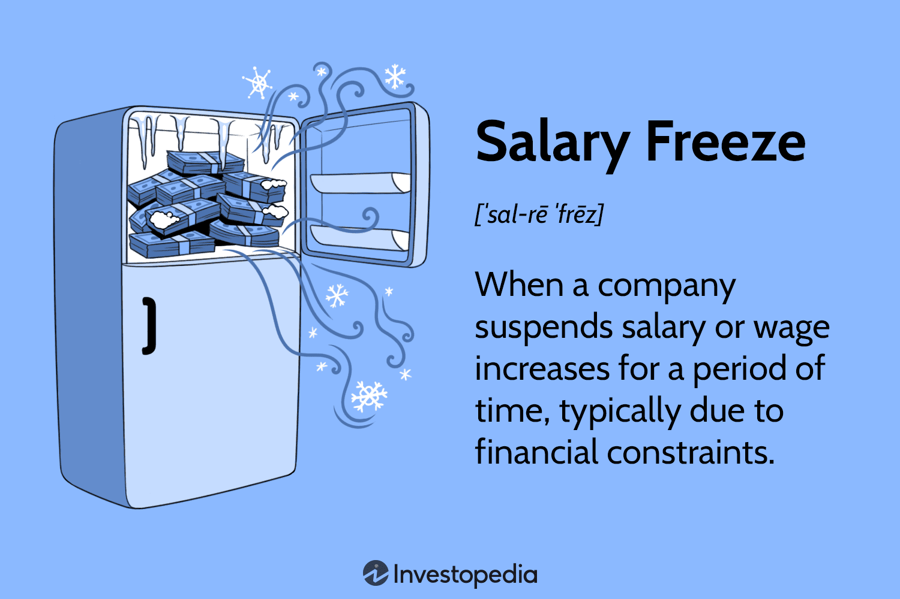

In today's volatile economic environment, businesses are confronted with a myriad of challenges that call for innovative strategies to maintain financial stability. As markets fluctuate and global economic pressures intensify, organizations must navigate these uncertainties with precision and foresight. One such strategy employed by businesses to manage costs and sustain operations is the implementation of a salary freeze. This approach involves temporarily halting salary increases, which directly impacts employee compensation and overall pay management.

Salary management is a critical aspect of business operations, tying closely to issues of productivity, talent retention, and organizational success. When salary freezes are introduced, they represent a strategic decision aimed at averting more drastic measures, such as layoffs, while controlling expenditures. However, this tactic must be balanced with the potential downsides, including decreased employee morale and increased turnover. Effective management demands clear communication and a comprehensive understanding of compensation dynamics.



In exploring the intricacies of salary management and the concept of salary freezes, this article will also examine the potential role of algorithmic trading as an innovative method to navigate challenging financial times. Algorithmic trading employs computer algorithms to automate and optimize trading decisions, offering businesses a technologically advanced approach to finance management. Leveraging data-driven insights through algorithmic trading may present organizations, particularly those operating in capital markets, with supplementary strategies to achieve financial resilience.

By examining these components, businesses can develop a multifaceted approach, integrating traditional and contemporary methods to uphold financial stability and navigate the complexities of the modern economic landscape.

## Table of Contents

## Understanding Employee Compensation and Salary Management

Employee compensation is fundamental to business operations, comprising various elements such as salary, wages, bonuses, and benefits. It plays a pivotal role in attracting, motivating, and retaining employees, thereby directly impacting organizational performance and productivity.

Salary management involves structuring and regulating employee compensation to ensure alignment with industry standards, organizational budgets, and employee expectations. This alignment ensures fair and competitive pay practices, which are essential for sustaining workforce morale and minimizing turnover rates. Effective salary management also requires a keen understanding of market trends, compensation surveys, and benchmarking to maintain competiveness in the labor market. 

Balancing these elements—ensuring that salaries are competitive while remaining within budgetary constraints—requires strategic planning and precise execution. Failure to adequately manage salaries can result in a range of issues, from financial strain on the organization to the loss of skilled employees. To achieve this balance, organizations often employ compensation models that integrate base salary, performance-linked incentives, and various forms of non-monetary benefits.

For instance, organizations may use a competitive ratio or pay index formula to compare employee salaries against industry standards:

$$
\text{Pay Index} = \frac{\text{Employee Salary}}{\text{Median Industry Salary}}
$$

A pay index close to 1 indicates alignment with industry median salaries, whereas values significantly higher or lower suggest overpayment or underpayment, respectively. 

Python code can be used to model salary distributions and compare them with industry standards:

```python
import numpy as np

# Sample organization and industry salaries
org_salaries = np.array([50000, 60000, 55000, 59000, 62000])
industry_median = 57500

# Calculate Pay Index for each employee
pay_indices = org_salaries / industry_median

print("Pay Indices:", pay_indices)
```

This code snippet calculates the pay index for a sample set of organization salaries against the industry median, providing insights into the organization's compensation positioning.

The intricate balance of salary management is reflective of a broader compensation strategy that includes understanding employee needs and expectations. Non-monetary benefits, such as health insurance, retirement plans, paid time off, and professional development opportunities, are integral components of comprehensive compensation packages. These benefits not only supplement the direct financial compensation but also enhance overall job satisfaction and employee loyalty.

In conclusion, effective employee compensation and salary management are critical for fostering a productive and engaged workforce. Organizations must continually assess and adjust their compensation strategies to meet the dynamic demands of the business environment and workforce expectations, ensuring long-term organizational success and employee satisfaction.

## What is a Salary Freeze?

A salary freeze is a strategic decision undertaken by organizations to temporarily suspend any increases in employee salaries. This [course](/wiki/best-algorithmic-trading-courses) of action is often necessitated by economic pressures that restrict financial growth or when a company undergoes strategic realignment aimed at sustaining its financial health. By choosing a salary freeze, organizations can effectively control expenses without resorting to more drastic measures such as workforce reductions or layoffs.

However, the implementation of a salary freeze is not devoid of consequences. It has the potential to affect employee morale adversely and may lead to retention challenges. When employees perceive their contributions and progression as stagnated due to halted salary increments, it might result in dissatisfaction and increased turnover. To effectively manage such scenarios, clear and empathetic communication plays a vital role. Employees must be informed about the reasons behind the salary freeze, along with its expected duration and any plans for future adjustments. This transparency helps in maintaining trust and supports a cooperative work environment, mitigating the potential negative impacts on employee morale and engagement.

## Reasons for Implementing a Salary Freeze

A salary freeze is often a strategic response to economic challenges and is implemented to safeguard an organization's financial health. One key reason for imposing a salary freeze is the economic downturn, which can substantially decrease an organization's revenue. During such periods, businesses may face reduced demand for products or services, leading to lower cash inflows. A salary freeze becomes necessary to conserve financial resources, allowing the organization to navigate through periods of reduced economic activity without resorting to layoffs, which could further disrupt operational effectiveness.

Another reason for implementing a salary freeze is to align compensation with prevailing market conditions. Economic conditions can fluctuate, affecting industry standards and compensation benchmarks. An organization may choose to pause salary increments to ensure its compensation package remains competitive without exceeding what is typical within the industry. This alignment helps maintain financial sustainability, especially if market evaluations suggest that current salary offerings surpass competitive standards.

Moreover, a salary freeze might be utilized to address internal salary structures. Over time, disparities and inefficiencies can emerge in how compensation is distributed among employees. By freezing salaries, organizations can take the time needed to reassess and restructure these internal compensation frameworks to promote fairness, equity, and cohesion among the workforce. 

The decision to impose a salary freeze is often part of a broader strategic plan focused on ensuring long-term financial health. By consciously choosing to limit salary expenses, organizations can allocate their financial resources more efficiently towards initiatives crucial for survival and growth, such as research and development or market expansion. These measures are designed not only to stabilize the immediate financial situation but also to enhance the organization's capacity to leverage opportunities as economic conditions improve.

## Impact of a Salary Freeze on Employee Compensation

Salary freezes can significantly affect employee compensation, leading to a range of challenges for both employees and organizations. When a company halts salary increases, it can demotivate employees, prompting them to seek more lucrative opportunities elsewhere. This increased turnover can be costly for businesses, as they may need to invest in recruiting and training new employees to fill vacated positions.

Moreover, salary freezes can place financial strain on employees, especially those who rely heavily on incremental salary increases to manage living expenses and inflation. Without wage growth, employees may experience heightened dissatisfaction, which can negatively impact their productivity and engagement levels. This dissatisfaction may manifest in reduced performance, decreased motivation, and lower overall morale within the team.

To mitigate the adverse effects of salary freezes, businesses should consider alternative compensation strategies. These could include offering non-monetary benefits such as flexible working arrangements, professional development opportunities, and enhanced career progression pathways. Recognition programs and performance-based incentives can also serve as substitutes for salary increases, helping to maintain motivation and engagement among employees.

The implementation of these alternative strategies requires thoughtful planning and clear communication. By ensuring employees understand the reasoning behind a salary freeze and the benefits still available to them, companies can foster a positive work environment even during financially challenging periods. Effective management of these situations can help retain talent and sustain productivity despite the limitations imposed by economic constraints.

## Alternative Compensation Strategies During a Salary Freeze

In times when businesses impose a salary freeze, it becomes imperative to explore alternative compensation strategies to maintain employee satisfaction and morale. One effective approach involves offering non-monetary benefits that can help bridge the gap left by stagnant salaries. Flexible work arrangements are a prominent example, offering employees the freedom to choose their working hours or location. This flexibility can significantly enhance work-life balance, promoting job satisfaction and loyalty.

Additionally, investing in employee development through training programs can prove invaluable. By equipping employees with additional skills or credentials, organizations not only improve their workforce's capabilities but also demonstrate a commitment to employees' professional growth. Such initiatives can lead to increased motivation levels as employees feel valued and see opportunities for future advancement within the organization.

Career growth opportunities are another key aspect of non-monetary compensation. Providing clear pathways for internal promotions or the chance to take on new responsibilities can satisfy employees' aspirations and reduce turnover. Creating structured mentorship programs or encouraging job rotation within the company can also foster professional development, keeping employees engaged even if their pay remains unchanged.

Recognition programs can play a crucial role in maintaining morale during a salary freeze. Formal acknowledgments like Employee of the Month awards, public commendations during meetings, or personalized thank-you notes can validate employee contributions and increase long-term engagement. Performance-based incentives, even if non-monetary, such as extra vacation days or gift vouchers, can motivate employees to continue performing at high levels.

In summary, by employing such alternative compensation strategies, businesses can effectively navigate the challenges presented by a salary freeze. These initiatives not only support employee morale and engagement but also reinforce loyalty, ultimately contributing to the organization's stability and success during financially constrained periods.

## The Role of Algorithmic Trading in Managing Business Finances

Algorithmic trading is a sophisticated method of managing financial trading activities through computer-driven algorithms. This practice leverages the power of technology to execute trading decisions with high speed and precision, offering businesses a valuable tool for optimizing their financial operations. By utilizing advanced mathematical models and algorithms, companies can analyze vast datasets quickly, identify trading opportunities, and execute trades at optimal prices, benefiting from minimal human intervention. 

The core advantage of [algorithmic trading](/wiki/algorithmic-trading) lies in its ability to process large volumes of data at high speeds. This capability enables businesses to respond swiftly to market fluctuations and implement strategies that capitalize on real-time developments. For instance, algorithms can be designed to track market indicators, detect price patterns, and execute trades when certain conditions are met, all while minimizing the latency and potential for human error associated with manual trading.

One commonly used type of algorithmic trading is high-frequency trading ([HFT](/wiki/high-frequency-trading-strategies)), which involves executing a large number of orders at extremely rapid speeds. This approach can capitalize on small price discrepancies or market inefficiencies that occur over milliseconds. Although HFT is a subset of algorithmic trading, it exemplifies the powerful potential of automated trade execution in competitive markets.

Businesses engaged in capital markets can explore algorithmic trading as a supplementary financial strategy to enhance their trading performance. By integrating algorithmic trading systems, organizations can optimize their portfolio management efforts and improve [liquidity](/wiki/liquidity-risk-premium) management. Additionally, the use of [machine learning](/wiki/machine-learning) techniques within algorithmic trading systems allows for adaptive models that can evolve with changing market conditions, thereby continuously refining trading strategies.

Python, a versatile programming language widely used in the finance industry, offers several libraries and tools that facilitate the implementation of algorithmic trading systems. Libraries such as NumPy and pandas provide robust data analysis capabilities, while packages like TA-Lib and PyAlgoTrade offer technical analysis functions and trading infrastructure. Through these tools, financial firms can develop, test, and deploy algorithmic trading strategies effectively.

In conclusion, algorithmic trading presents a dynamic avenue for financial management, especially for companies immersed in capital markets. By harnessing data and technological advancements, businesses can formulate strategic responses to market uncertainties, potentially achieving greater financial stability and performance.

## Communicating a Salary Freeze to Employees

Effective communication plays a crucial role in managing the implementation and impact of a salary freeze within an organization. Clear, transparent communication can help mitigate potential negative effects on employee morale and maintain a cooperative work environment during challenging financial periods.

Organizations should begin by providing a comprehensive explanation of the rationale behind the salary freeze. Employees must understand the financial challenges or strategic objectives necessitating such a measure. This transparency builds trust and makes employees more likely to accept the situation and cooperate. Companies should outline the expected duration of the salary freeze and set realistic future expectations. Providing a timeline or criteria for reevaluation can give employees a sense of direction and hope for eventual salary adjustments.

Support from management is equally important. Leaders should be visible and accessible, offering reassurance and demonstrating empathy towards employees' concerns. Open-door policies and regular update meetings can facilitate this process. Implementing feedback channels, such as surveys or town hall meetings, allows employees to express their views and feel heard, further reducing potential anxiety and resistance.

In addition to verbal communication, written documentation, such as memos or emails, should reinforce the message. This ensures that everyone receives the same information, reducing the risk of misinformation or misunderstandings. The tone of all communications should be respectful and sensitive, acknowledging the impact on employees while emphasizing the collective effort required to overcome financial difficulties.

Establishing a cooperative atmosphere during a salary freeze is vital. Encouraging team-building activities and fostering an inclusive workplace culture can sustain employee engagement and camaraderie despite the financial constraints. By prioritizing transparent communication and management support, organizations can navigate a salary freeze with minimal disruption to employee morale and productivity.

## Conclusion and Future Outlook

While salary freezes present significant challenges to organizations, they can be an essential instrument for maintaining financial stability during economically turbulent times. By temporarily halting salary increments, businesses can better manage expenses without resorting to more drastic measures such as layoffs. However, the success of implementing a salary freeze largely depends on the adoption of diverse strategies that accommodate the needs of both the organization and its employees.

Integrating alternative compensation methods alongside salary freezes can offer a balance that minimizes potential negative impacts on employee morale and retention. Exploring non-monetary rewards, such as flexible working arrangements and career development opportunities, helps maintain motivation and engagement within the workforce. Additionally, implementing recognition programs and performance-based incentives can serve as substitutes for financial rewards, ensuring that employees continue to feel valued and productive.

The inclusion of algorithmic trading is another innovative strategy that can assist businesses in navigating financial uncertainties. By utilizing advanced computer algorithms, companies can optimize their financial strategies, allowing for more efficient management of resources, hedging against market [volatility](/wiki/volatility-trading-strategies), and potentially enhancing revenue streams. This approach is particularly beneficial for businesses involved in the capital markets, providing them with a forward-thinking financial strategy that can supplement traditional methods.

Looking ahead, the future outlook for businesses will be shaped by their ability to remain agile and responsive to economic shifts. This involves not only leveraging innovative financial strategies but also fostering transparent and supportive communication with employees. Successfully conveying the rationale, duration, and future plans regarding salary freezes can help maintain trust and facilitate a cooperative work environment. Ultimately, sustained business success will rely on the strategic blend of financial acumen and effective employee engagement.

## References & Further Reading

[1]: Bergstra, J., Bardenet, R., Bengio, Y., & Kégl, B. (2011). ["Algorithms for Hyper-Parameter Optimization."](https://dl.acm.org/doi/10.5555/2986459.2986743) Advances in Neural Information Processing Systems 24.

[2]: ["Advances in Financial Machine Learning"](https://www.amazon.com/Advances-Financial-Machine-Learning-Marcos/dp/1119482089) by Marcos Lopez de Prado

[3]: ["Evidence-Based Technical Analysis: Applying the Scientific Method and Statistical Inference to Trading Signals"](https://www.amazon.com/Evidence-Based-Technical-Analysis-Scientific-Statistical/dp/0470008741) by David Aronson

[4]: ["Machine Learning for Algorithmic Trading"](https://github.com/stefan-jansen/machine-learning-for-trading) by Stefan Jansen

[5]: ["Quantitative Trading: How to Build Your Own Algorithmic Trading Business"](https://www.amazon.com/Quantitative-Trading-Build-Algorithmic-Business/dp/1119800064) by Ernest P. Chan