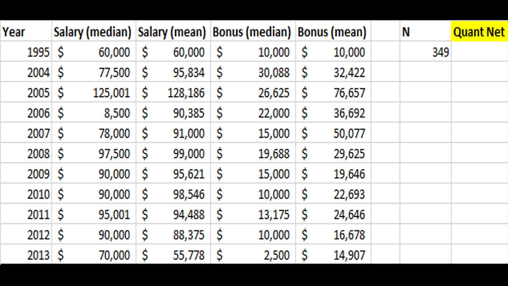

## Table of Contents

## What is a quant and what do they do?

A quant, short for quantitative analyst, is a person who uses math and computer skills to solve financial problems. They work in banks, investment firms, and other financial places. Quants create models and use numbers to predict how markets will move and to find good investments. They use a lot of data and special computer programs to do their work.

Quants help make decisions about buying and selling stocks, bonds, and other financial things. They also help manage risk by figuring out how likely it is that an investment will lose money. Their work is important because it helps companies make smart choices with their money. Even though their job involves complex math, quants need to explain their findings in a way that others can understand.

## What is the typical salary range for entry-level quants?

Entry-level quants usually start with salaries that can range from about $70,000 to $100,000 a year. This can change based on where they work, like in a big city or a smaller town, and what kind of company they work for, like a big bank or a smaller investment firm. The exact number also depends on how much experience someone has before starting the job and how good they are at their work.

In places like New York or London, where the cost of living is high, entry-level quants might earn on the higher end of that range. Companies in these cities often need to offer more money to attract good workers. But even in other places, the pay can still be pretty good because the job requires a lot of skill and knowledge.

## How does a quant's salary vary by location?

A quant's salary can change a lot depending on where they work. In big cities like New York or London, quants usually earn more money. This is because living in these cities costs a lot, so companies need to pay more to get good workers. For example, an entry-level quant might start with a salary around $90,000 to $100,000 in these places. The high demand for skilled quants in financial hubs also pushes salaries up.

In smaller cities or towns, the salaries for quants are usually lower. This is because the cost of living is not as high, and there might be fewer big financial companies. An entry-level quant in a smaller city might start with a salary around $70,000 to $80,000. Even though the pay is less, it can still be a good job because the money goes further in these places.

Overall, location plays a big role in how much a quant earns. Big cities offer higher salaries but also come with a higher cost of living. Smaller places might pay less but can be more affordable. Quants need to think about both their salary and the cost of living when deciding where to work.

## What factors influence a quant's earning potential?

A quant's earning potential depends on several things. One big factor is their experience. Quants who have been working for a long time and have a lot of knowledge usually earn more money than those who are just starting out. Another important thing is their education. Quants with advanced degrees, like a PhD, often get paid more because they have more skills and can do more complex work. The type of company they work for also matters. Big banks and investment firms usually pay more than smaller companies because they have more money and need top talent.

Location is another key factor that affects a quant's salary. In big cities like New York or London, quants can earn a lot more because the cost of living is high and there's a big demand for their skills. But in smaller cities or towns, the pay might be lower because it's cheaper to live there and there might be fewer big financial companies. Quants need to think about both their salary and the cost of living when deciding where to work.

Lastly, a quant's performance and the specific role they have can influence their earnings. Quants who do a great job and help their company make a lot of money might get bonuses or raises. Some quants work in areas like trading or risk management, which can pay more than other areas. Being good at what they do and working in a high-demand area can really boost a quant's earning potential.

## What are the educational requirements to become a quant?

To become a quant, you usually need a strong education in math, statistics, or a related field. Most quants have at least a bachelor's degree, but many have a master's degree or even a PhD. These higher degrees help quants learn more about complex math and computer skills that they need for their job. Classes in finance, economics, and computer science are also important because they teach quants how to use their math skills in the real world of money and investing.

While in school, it's a good idea for future quants to get some experience working with data and using computer programs. Internships at banks or investment firms can be very helpful. They let students see what being a quant is like and learn from people who are already working in the field. Some quants also get special certifications, like the CFA (Chartered Financial Analyst), which can show that they know a lot about finance and investing. Overall, a mix of strong education and practical experience is key to becoming a successful quant.

## How do bonuses and other compensations affect a quant's total earnings?

Bonuses and other compensations can make a big difference in how much money a quant earns each year. Many quants get bonuses at the end of the year, which can be a lot of money. These bonuses depend on how well the quant did their job and how well the company did. If a quant helped the company make a lot of money, they might get a bigger bonus. Some quants also get other kinds of compensation, like stock options or extra pay for working long hours. All these things add up and can make a quant's total earnings much higher than their regular salary.

For example, a quant might have a base salary of $100,000, but with a big bonus, their total earnings could go up to $150,000 or even more. The exact amount of the bonus can change a lot from year to year, so a quant's total earnings can be different each year. This makes the job exciting but also a bit unpredictable. Quants need to think about both their regular salary and the possible bonuses when they decide if a job is a good choice for them.

## What is the salary progression for quants as they gain experience?

As quants gain more experience, their salaries usually go up. When they start out, entry-level quants might earn between $70,000 and $100,000 a year. But as they work for a few years and get better at their job, their pay can increase a lot. After about 5 to 10 years, a quant with good experience might earn between $120,000 and $180,000 a year. The exact amount depends on how well they do their job, the company they work for, and where they live.

As quants keep working and learning, their salaries can keep going up. After 10 to 15 years, experienced quants might earn between $150,000 and $250,000 a year. Some very skilled quants who work at big banks or investment firms can even earn more than that. Besides their regular pay, experienced quants often get big bonuses at the end of the year, which can make their total earnings even higher. So, the more experience a quant has, the more money they can make.

## How do salaries for quants in different industries (e.g., finance, technology) compare?

Quants in the finance industry usually earn more money than quants in other industries. In finance, like at banks or investment firms, quants can start with salaries from $70,000 to $100,000 a year. As they get more experience, their pay can go up to $150,000 to $250,000 or even more. The finance industry pays well because it needs a lot of smart people to help make money and manage risk. Quants in finance also often get big bonuses, which can make their total earnings a lot higher.

In the technology industry, quants might work on things like data analysis or machine learning. Their starting salaries can be a bit lower than in finance, often around $60,000 to $90,000 a year. But as they gain experience, their salaries can go up to $100,000 to $150,000. Tech companies might not pay as much as finance companies, but they still need quants to help them use data and make smart decisions. The bonuses in tech might not be as big as in finance, but they can still add a good amount to a quant's total earnings.

So, if you're thinking about becoming a quant, the industry you choose can make a big difference in how much money you earn. Finance usually pays more, but tech can still be a good choice, especially if you're interested in working with data and technology. Both industries offer good opportunities for quants to grow their careers and earn more as they gain experience.

## What are the top-paying cities or regions for quants?

The top-paying cities for quants are usually big financial centers like New York City and London. In New York, quants can start with salaries around $90,000 to $100,000 a year. As they get more experience, their pay can go up a lot, sometimes to $200,000 or more. The high cost of living in New York means companies need to pay more to attract good workers. London is similar, with entry-level quants earning around £50,000 to £60,000, and experienced quants making much more. These cities are home to big banks and investment firms that need top talent, so they offer high salaries.

Another top-paying region for quants is the San Francisco Bay Area, especially around Silicon Valley. Here, quants might work in tech companies or hedge funds. Starting salaries can be around $80,000 to $100,000, and with experience, they can go up to $150,000 or more. The tech industry in this area needs quants to help with data analysis and machine learning, so they're willing to pay well. Even though the salaries might not be as high as in finance, the cost of living is also very high, so the pay needs to be good to keep up.

## How do advanced degrees or certifications impact a quant's salary?

Having an advanced degree or a special certification can really help a quant earn more money. A lot of quants have a master's degree or a PhD, which shows they know a lot about math, statistics, and finance. These degrees help them do more complex work and solve harder problems. Companies like to hire people with these degrees because they can do more and help the company make more money. So, quants with a master's or PhD often start with higher salaries than those with just a bachelor's degree. For example, a quant with a PhD might start at $100,000 a year, while someone with a bachelor's might start at $70,000.

Certifications like the CFA (Chartered Financial Analyst) can also make a big difference. The CFA shows that a quant knows a lot about finance and investing, which is very important in their job. Quants with a CFA certification can earn more money because they have proven they have the skills and knowledge to do well. These certifications can help quants get better jobs and bigger bonuses. So, if a quant wants to earn more, getting an advanced degree or a certification is a good way to do it.

## What are the potential earnings for quants in hedge funds versus investment banks?

Quants working at hedge funds usually earn more money than those at investment banks. At hedge funds, entry-level quants might start with salaries around $100,000 to $120,000 a year. As they get more experience, their pay can go up a lot, sometimes to $250,000 or more. Hedge funds often give big bonuses too, which can make a quant's total earnings even higher. These bonuses can be a big part of their pay, sometimes even more than their regular salary. Hedge funds need quants to help them make smart investments and manage risk, so they pay well to get the best people.

At investment banks, entry-level quants might start with salaries around $80,000 to $100,000 a year. As they gain experience, their pay can go up to $150,000 to $200,000. Investment banks also give bonuses, but they might not be as big as the ones at hedge funds. Quants at investment banks help with things like trading and risk management, but the pay is usually not as high as at hedge funds. Even though investment banks pay well, the potential earnings for quants at hedge funds are often higher because of the bigger bonuses and the focus on making money from investments.

## How do quants' salaries compare to other high-demand tech roles like data scientists or software engineers?

Quants usually earn more money than data scientists and software engineers, especially if they work in finance or hedge funds. A starting quant might make between $70,000 and $100,000 a year, and with experience, their pay can go up to $250,000 or more. Data scientists and software engineers might start with salaries around $70,000 to $90,000, and with experience, they can earn up to $150,000. The big difference comes from the bonuses that quants get, which can be a lot more than what data scientists or software engineers usually get. Quants in finance need to use complex math and computer skills to help companies make money, so they get paid well for their work.

Even though quants might earn more, data scientists and software engineers have good jobs too. Data scientists work with big sets of information to help companies make decisions, and software engineers build and fix computer programs. Both of these jobs are important and in high demand, especially in tech companies. While their starting salaries might be a bit lower than quants, data scientists and software engineers can still make a lot of money as they get more experience. The choice between being a quant, a data scientist, or a software engineer depends on what someone likes to do and where they want to work.

## References & Further Reading

[1]: Bergstra, J., Bardenet, R., Bengio, Y., & Kégl, B. (2011). ["Algorithms for Hyper-Parameter Optimization."](https://dl.acm.org/doi/10.5555/2986459.2986743) Advances in Neural Information Processing Systems 24.

[2]: ["Advances in Financial Machine Learning"](https://www.amazon.com/Advances-Financial-Machine-Learning-Marcos/dp/1119482089) by Marcos Lopez de Prado

[3]: ["Evidence-Based Technical Analysis: Applying the Scientific Method and Statistical Inference to Trading Signals"](https://www.amazon.com/Evidence-Based-Technical-Analysis-Scientific-Statistical/dp/0470008741) by David Aronson

[4]: ["Machine Learning for Algorithmic Trading"](https://github.com/PacktPublishing/Machine-Learning-for-Algorithmic-Trading-Second-Edition) by Stefan Jansen

[5]: ["Quantitative Trading: How to Build Your Own Algorithmic Trading Business"](https://books.google.com/books/about/Quantitative_Trading.html?id=j70yEAAAQBAJ) by Ernest P. Chan